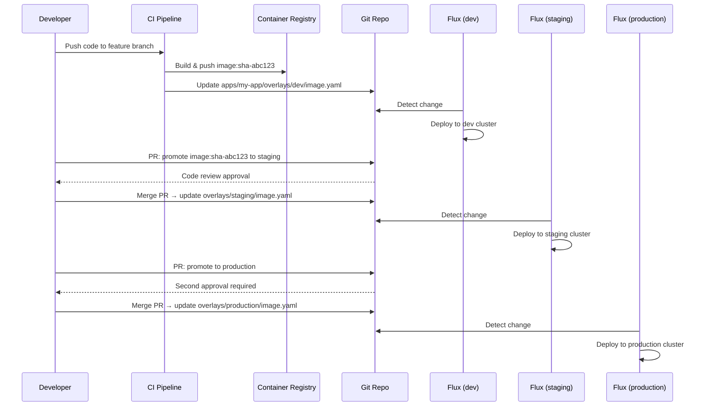
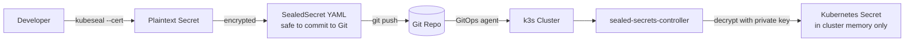

# Managing Apps with GitOps
> Module 11 · Lesson 04 | [↑ Course Index](../README.md)

## Table of Contents
- [Overview](#overview)
- [Structuring Your Git Repository](#structuring-your-git-repository)
- [App-of-Apps Pattern](#app-of-apps-pattern)
- [Multi-Cluster Patterns](#multi-cluster-patterns)
- [Managing Helm Releases with Flux HelmRelease](#managing-helm-releases-with-flux-helmrelease)
- [Promoting Across Environments](#promoting-across-environments)
- [Secrets in GitOps with Sealed Secrets](#secrets-in-gitops-with-sealed-secrets)
- [Drift Detection and Remediation](#drift-detection-and-remediation)
- [When GitOps Might Not Be the Right Fit](#when-gitops-might-not-be-the-right-fit)

---

## Overview

With the fundamentals covered in Lessons 02 and 03, this lesson focuses on the operational patterns that make GitOps work at scale: repository structure, environment promotion, secret management, and knowing when GitOps adds friction rather than value.

[↑ Back to TOC](#table-of-contents) · [↑ Course Index](../README.md)

---

## Structuring Your Git Repository

A well-structured repository is the foundation of maintainable GitOps. Two common approaches:

### Monorepo (one repo for all clusters and apps)

```
infra/
├── clusters/
│   ├── production/
│   │   ├── flux-system/         ← Flux bootstrap manifests (auto-generated)
│   │   ├── infrastructure/      ← cert-manager, monitoring, ingress
│   │   └── apps/                ← application Kustomizations
│   ├── staging/
│   │   ├── flux-system/
│   │   ├── infrastructure/
│   │   └── apps/
│   └── dev/
│       ├── flux-system/
│       └── apps/
├── infrastructure/
│   ├── base/                    ← common base configs
│   └── overlays/
│       ├── production/
│       └── staging/
└── apps/
    ├── nginx/
    │   ├── base/
    │   └── overlays/
    │       ├── production/
    │       └── staging/
    └── my-app/
        ├── base/
        └── overlays/
```

### Poly-repo (separate repos)

```
fleet-infra/          ← platform team manages: Flux bootstrap, infrastructure
app-manifests/        ← app team manages: application Kustomizations/HelmReleases
my-app/               ← dev team manages: app source code + Dockerfile
```

### Which to choose?

| Aspect | Monorepo | Poly-repo |
|---|---|---|
| **Visibility** | Full cluster state in one place | Must search across repos |
| **Access control** | Harder — one repo, many teams | Natural boundaries per repo |
| **Blast radius** | Single PR can affect all envs | Isolated per repo |
| **Cross-app coordination** | Easy | Requires coordination |
| **Recommended for** | Small teams, ≤3 clusters | Large teams, many clusters |

[↑ Back to TOC](#table-of-contents) · [↑ Course Index](../README.md)

---

## App-of-Apps Pattern

### In ArgoCD

The **App-of-Apps** pattern uses one root Application to deploy many child Applications. This enables you to bootstrap an entire cluster with a single `kubectl apply`.

```yaml
# Root application — applies everything in clusters/production/apps/
apiVersion: argoproj.io/v1alpha1
kind: Application
metadata:
  name: root-app
  namespace: argocd
spec:
  project: default
  source:
    repoURL: https://github.com/my-org/infra
    targetRevision: main
    path: clusters/production/apps     # this directory contains more Application YAMLs
  destination:
    server: https://kubernetes.default.svc
    namespace: argocd
  syncPolicy:
    automated:
      prune: true
      selfHeal: true
```

```
clusters/production/apps/
├── nginx.yaml           ← Application for nginx
├── monitoring.yaml      ← Application for kube-prometheus-stack
├── cert-manager.yaml    ← Application for cert-manager
└── my-app.yaml          ← Application for your microservice
```

### In Flux

In Flux, the equivalent pattern uses nested Kustomizations:

```yaml
# clusters/production/flux-system/kustomization.yaml points to:
# clusters/production/infrastructure.yaml + clusters/production/apps.yaml

---
# infrastructure.yaml — deploys cert-manager, monitoring, etc.
apiVersion: kustomize.toolkit.fluxcd.io/v1
kind: Kustomization
metadata:
  name: infrastructure
  namespace: flux-system
spec:
  interval: 10m
  path: ./infrastructure/overlays/production
  prune: true
  sourceRef:
    kind: GitRepository
    name: fleet-infra
  healthChecks:
    - apiVersion: apps/v1
      kind: Deployment
      name: cert-manager
      namespace: cert-manager
  timeout: 5m

---
# apps.yaml — deploys application workloads
# Depends on infrastructure being healthy first
apiVersion: kustomize.toolkit.fluxcd.io/v1
kind: Kustomization
metadata:
  name: apps
  namespace: flux-system
spec:
  interval: 5m
  path: ./apps/overlays/production
  prune: true
  sourceRef:
    kind: GitRepository
    name: fleet-infra
  dependsOn:
    - name: infrastructure   # wait for infrastructure to be healthy
  timeout: 5m
```

[↑ Back to TOC](#table-of-contents) · [↑ Course Index](../README.md)

---

## Multi-Cluster Patterns

### Flux — per-cluster paths in one repo

```
clusters/
├── production/     ← Flux bootstrapped against this path
│   └── flux-system/
├── staging/        ← separate bootstrap
│   └── flux-system/
└── dev/
    └── flux-system/
```

Each cluster's Flux instance only watches its own `clusters/<cluster-name>/` path.

### ArgoCD — ApplicationSets for multi-cluster

`ApplicationSet` is an ArgoCD controller that generates multiple Applications from a template + generator:

```yaml
apiVersion: argoproj.io/v1alpha1
kind: ApplicationSet
metadata:
  name: nginx-all-clusters
  namespace: argocd
spec:
  generators:
    - list:
        elements:
          - cluster: production
            url: https://production-k3s.example.com:6443
            env: prod
          - cluster: staging
            url: https://staging-k3s.example.com:6443
            env: staging
          - cluster: dev
            url: https://kubernetes.default.svc
            env: dev
  template:
    metadata:
      name: nginx-{{ cluster }}
    spec:
      project: default
      source:
        repoURL: https://github.com/my-org/infra
        targetRevision: main
        path: apps/nginx/overlays/{{ env }}
      destination:
        server: "{{ url }}"
        namespace: nginx
      syncPolicy:
        automated:
          prune: true
          selfHeal: true
```

[↑ Back to TOC](#table-of-contents) · [↑ Course Index](../README.md)

---

## Managing Helm Releases with Flux HelmRelease

Flux's `HelmRelease` CRD provides full lifecycle management for Helm charts with GitOps semantics.

### Full HelmRelease example

```yaml
apiVersion: helm.toolkit.fluxcd.io/v2beta2
kind: HelmRelease
metadata:
  name: kube-prometheus-stack
  namespace: monitoring
spec:
  interval: 30m

  chart:
    spec:
      chart: kube-prometheus-stack
      version: ">=58.0.0 <60.0.0"   # semantic version constraint
      sourceRef:
        kind: HelmRepository
        name: prometheus-community
        namespace: flux-system
      interval: 12h                  # check for new chart versions every 12h

  # Values can come from:
  # 1. Inline values (highest precedence)
  values:
    grafana:
      adminPassword: "${GRAFANA_PASSWORD}"   # from valuesFrom Secret

  # 2. ValuesFrom — reference a Secret or ConfigMap
  valuesFrom:
    - kind: Secret
      name: prometheus-helm-values-secret
      valuesKey: values.yaml
      optional: false
    - kind: ConfigMap
      name: prometheus-helm-values-config
      valuesKey: values.yaml
      optional: true

  # ---- Install behaviour ----
  install:
    remediation:
      retries: 3                # retry failed installs 3 times
  upgrade:
    cleanupOnFail: true
    remediation:
      retries: 3
      remediateLastFailure: true
  rollback:
    timeout: 10m
    cleanupOnFail: true

  # ---- Dependency: wait for cert-manager before installing ----
  dependsOn:
    - name: cert-manager
      namespace: cert-manager
```

### HelmRepository source

```yaml
apiVersion: source.toolkit.fluxcd.io/v1beta2
kind: HelmRepository
metadata:
  name: prometheus-community
  namespace: flux-system
spec:
  interval: 1h
  url: https://prometheus-community.github.io/helm-charts
```

### Checking HelmRelease status

```bash
flux get helmreleases --all-namespaces
flux describe helmrelease kube-prometheus-stack -n monitoring
```

[↑ Back to TOC](#table-of-contents) · [↑ Course Index](../README.md)

---

## Promoting Across Environments

Promotion means taking a change from dev → staging → production.

### Image tag promotion workflow



### Kustomize overlays for environment promotion

```
apps/my-app/
├── base/
│   ├── deployment.yaml       ← image: my-app:latest (placeholder)
│   ├── service.yaml
│   └── kustomization.yaml
└── overlays/
    ├── dev/
    │   ├── kustomization.yaml
    │   └── image.yaml        ← image: my-app:sha-abc123
    ├── staging/
    │   ├── kustomization.yaml
    │   └── image.yaml        ← image: my-app:sha-abc123 (promoted from dev)
    └── production/
        ├── kustomization.yaml
        └── image.yaml        ← image: my-app:sha-abc123 (promoted from staging)
```

```yaml
# overlays/dev/kustomization.yaml
apiVersion: kustomize.config.k8s.io/v1beta1
kind: Kustomization
resources:
  - ../../base
images:
  - name: my-app
    newTag: sha-abc123       # CI updates this field
patches:
  - path: replica-patch.yaml # dev uses 1 replica
```

[↑ Back to TOC](#table-of-contents) · [↑ Course Index](../README.md)

---

## Secrets in GitOps with Sealed Secrets

Storing plaintext secrets in Git is a critical security risk. **Sealed Secrets** (by Bitnami/Broadcom) encrypts secrets with a cluster-bound key so they are safe to commit.

### How Sealed Secrets works



### Install Sealed Secrets controller

```bash
helm repo add sealed-secrets https://bitnami-labs.github.io/sealed-secrets
helm install sealed-secrets sealed-secrets/sealed-secrets \
  --namespace kube-system \
  --set fullnameOverride=sealed-secrets-controller
```

### Install kubeseal CLI

```bash
# Linux
curl -sSL https://github.com/bitnami-labs/sealed-secrets/releases/latest/download/kubeseal-linux-amd64 \
  -o kubeseal
chmod +x kubeseal
sudo mv kubeseal /usr/local/bin/
```

### Create a Sealed Secret

```bash
# Step 1: Create a regular Kubernetes secret (don't apply it — pipe it to kubeseal)
kubectl create secret generic my-db-credentials \
  --from-literal=username=dbuser \
  --from-literal=password=supersecret \
  --dry-run=client \
  -o yaml \
  | kubeseal \
    --controller-name=sealed-secrets-controller \
    --controller-namespace=kube-system \
    --format=yaml \
  > my-db-credentials-sealed.yaml

# Step 2: Commit the sealed secret to Git (safe — encrypted)
git add my-db-credentials-sealed.yaml
git commit -m "Add DB credentials for production"
git push

# Step 3: Apply via GitOps (the controller decrypts automatically)
# OR apply directly:
kubectl apply -f my-db-credentials-sealed.yaml
```

### Using Sealed Secrets in a HelmRelease

```yaml
# sealed-grafana-password.yaml (committed to Git)
apiVersion: bitnami.com/v1alpha1
kind: SealedSecret
metadata:
  name: grafana-admin-credentials
  namespace: monitoring
spec:
  encryptedData:
    admin-password: AgBy8hCE... (encrypted blob)
  template:
    metadata:
      name: grafana-admin-credentials
      namespace: monitoring
    type: Opaque
```

```yaml
# HelmRelease references the decrypted Secret
spec:
  valuesFrom:
    - kind: Secret
      name: grafana-admin-credentials
      valuesKey: admin-password
      targetPath: grafana.adminPassword
```

[↑ Back to TOC](#table-of-contents) · [↑ Course Index](../README.md)

---

## Drift Detection and Remediation

### What is drift?

**Drift** occurs when the actual cluster state differs from the desired state in Git. Common causes:
- Manual `kubectl edit` or `kubectl delete` by an operator.
- A controller modifying a resource (e.g., HPA changing `spec.replicas`).
- A failed partial deployment leaving resources in an inconsistent state.

### Flux drift detection

Flux detects drift automatically on every reconciliation (every `interval` seconds). With `prune: true` it will:
- Recreate deleted resources.
- Update modified resources to match Git.

```bash
# Check if any Kustomization is drifted
flux get kustomizations --all-namespaces

# Force a reconciliation to detect and fix drift now
flux reconcile kustomization apps --with-source
```

### ArgoCD drift detection

ArgoCD shows `OutOfSync` status when drift is detected. With `selfHeal: true` it automatically re-syncs.

```bash
# Check for OutOfSync apps
argocd app list | grep OutOfSync

# Manually sync (apply Git state to cluster)
argocd app sync my-app

# Show the diff
argocd app diff my-app
```

### Ignoring expected drift

Some resources legitimately change outside of Git (e.g., HPA scaling replicas). Tell ArgoCD to ignore specific fields:

```yaml
# In ArgoCD Application spec
ignoreDifferences:
  - group: apps
    kind: Deployment
    jsonPointers:
      - /spec/replicas        # HPA manages this
  - group: ""
    kind: ConfigMap
    name: kube-dns-config     # managed by k3s internally
    jsonPointers:
      - /data
```

In Flux, use `kustomize`'s `strategic merge patch` to exclude specific fields, or adjust the reconciler configuration.

[↑ Back to TOC](#table-of-contents) · [↑ Course Index](../README.md)

---

## When GitOps Might Not Be the Right Fit

GitOps is powerful, but it is not the right tool for every situation. Apply critical judgement.

### Scenarios where GitOps adds friction

| Scenario | Why GitOps is awkward | Better approach |
|---|---|---|
| **Rapid iteration in dev** | Every change needs a commit + push + reconcile cycle | Use `kubectl apply` locally with Skaffold or Tilt |
| **Database schema migrations** | Migration order and idempotency can't be expressed in YAML alone | Use dedicated tools: Flyway, Liquibase, a Job with init ordering |
| **One-off operational tasks** | `kubectl exec`, `kubectl debug`, port-forward — these are imperative | Run directly; GitOps manages the *desired state*, not operational tasks |
| **Secrets with frequent rotation** | Rotating secrets means many commits, or the commits don't capture the real value | Use an external secrets operator (ESO) pulling from Vault/AWS SSM |
| **Tiny team (1–2 people)** | Full GitOps pipeline overhead may exceed the benefit | Simple `helm upgrade` in a CI pipeline may be sufficient |
| **Stateful data** | Git stores config, not data. PV contents are not in Git | Backup solutions (Velero) handle data; GitOps handles deployment config |

### Signs GitOps is working well

- Rebuilding a cluster from scratch takes minutes, not days.
- Every cluster change has a Git commit, author, and PR review link.
- Rollbacks are a `git revert` away.
- Developers can request production changes via pull request without direct cluster access.
- A new engineer can understand the entire cluster state by reading the repository.

[↑ Back to TOC](#table-of-contents) · [↑ Course Index](../README.md)

---

*Licensed under [CC BY-NC-SA 4.0](../LICENSE.md) · © 2026 UncleJS*
