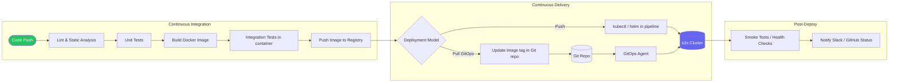

# CI/CD Patterns for k3s
> Module 12 · Lesson 01 | [↑ Course Index](../README.md)


[](../README.md)
[](../LICENSE.md)

## Table of Contents
- [Overview](#overview)
- [CI/CD Pipeline Phases](#cicd-pipeline-phases)
- [Push vs Pull Deployment Models](#push-vs-pull-deployment-models)
- [Common Deployment Patterns](#common-deployment-patterns)
- [Container Registry Options](#container-registry-options)
- [kubeconfig in CI](#kubeconfig-in-ci)
- [RBAC for CI Service Accounts](#rbac-for-ci-service-accounts)
- [Security Considerations](#security-considerations)

---

## Overview

CI/CD (Continuous Integration / Continuous Delivery) is the practice of automatically building, testing, and deploying code changes. For k3s clusters, CI/CD connects your source code repository to your running workloads with minimal manual intervention.

This lesson covers the patterns and building blocks. Lessons 02 and 03 implement them concretely with GitHub Actions and Gitea.

[↑ Back to TOC](#table-of-contents) · [↑ Course Index](../README.md)

---

## CI/CD Pipeline Phases



### Phase breakdown

| Phase | Tools | Output |
|---|---|---|
| **Code push** | Git (GitHub, GitLab, Gitea) | Trigger event |
| **Lint / static analysis** | golangci-lint, eslint, hadolint | Feedback to developer |
| **Unit tests** | pytest, go test, jest | Test pass/fail |
| **Build image** | `docker build`, `buildah`, Kaniko | Container image |
| **Integration tests** | docker-compose, k3d, kind | End-to-end coverage |
| **Push image** | `docker push`, `crane` | Image in registry |
| **Deploy** | kubectl, helm, GitOps commit | Updated cluster |
| **Verify** | `kubectl rollout status`, curl | Health confirmation |
| **Notify** | Slack webhook, GitHub API | Visibility |

[↑ Back to TOC](#table-of-contents) · [↑ Course Index](../README.md)

---

## Push vs Pull Deployment Models

See Module 11 (GitOps Concepts) for a detailed comparison. In summary:

| | Push (CI deploys directly) | Pull (GitOps) |
|---|---|---|
| **Complexity** | Lower — one pipeline, one kubeconfig | Higher — requires GitOps tooling |
| **Security** | Pipeline must have cluster access | Cluster only needs Git access |
| **Drift detection** | None | Built-in (reconciler detects drift) |
| **Rollback** | Re-run pipeline with old image tag | `git revert` |
| **Best for** | Small teams, fast iteration | Production, multi-cluster, compliance |

**Recommendation:** Start with push-based CI/CD for simplicity. Migrate to GitOps as the team and compliance requirements grow.

[↑ Back to TOC](#table-of-contents) · [↑ Course Index](../README.md)

---

## Common Deployment Patterns

### Pattern 1: Direct kubectl deploy

Simplest approach. The CI pipeline applies YAML manifests directly.

```bash
# In your CI pipeline
kubectl apply -f deploy/deployment.yaml
kubectl rollout status deployment/my-app --timeout=3m
```

**Pros:** Simple, no Helm required.
**Cons:** No templating, no release tracking, no rollback history.

### Pattern 2: Helm upgrade --install

Deploy or upgrade a Helm release from CI.

```bash
# Build and push image
docker build -t ghcr.io/my-org/my-app:$GIT_SHA .
docker push ghcr.io/my-org/my-app:$GIT_SHA

# Deploy with Helm
helm upgrade --install my-app ./charts/my-app \
  --namespace production \
  --set image.tag=$GIT_SHA \
  --set image.repository=ghcr.io/my-org/my-app \
  # rollback automatically if deploy fails
  --atomic \
  --timeout 3m \
  --wait
```

**Pros:** Templating, `--atomic` rollback, release history.
**Cons:** Pipeline still needs kubeconfig, no drift detection.

### Pattern 3: GitOps commit (push model → GitOps handoff)

The CI pipeline updates an image tag in the Git repository. The GitOps agent (Flux/ArgoCD) does the actual deployment.

```bash
# After pushing the image
NEW_TAG="ghcr.io/my-org/my-app:$GIT_SHA"

# Update the image tag in the kustomize overlay
# (uses kustomize CLI or sed/yq to update the file)
cd infra-repo
kustomize edit set image my-app=$NEW_TAG
# OR: yq -i ".images[0].newTag = \"$GIT_SHA\"" overlays/production/kustomization.yaml

git add .
git commit -m "chore: update my-app to $GIT_SHA"
git push

# The GitOps agent detects the commit and deploys automatically
```

**Pros:** Full GitOps benefits, pipeline has no cluster access.
**Cons:** Requires a Git repository for manifests, slightly higher complexity.

[↑ Back to TOC](#table-of-contents) · [↑ Course Index](../README.md)

---

## Container Registry Options

| Registry | Access | Best for |
|---|---|---|
| **Docker Hub** | Public free, private paid | Open-source projects |
| **GHCR (GitHub Container Registry)** | Free with GitHub account | GitHub-hosted projects |
| **GitLab Container Registry** | Included with GitLab | GitLab-hosted projects |
| **AWS ECR** | AWS-native, IAM auth | AWS deployments |
| **Google Artifact Registry** | GCP-native | GCP deployments |
| **Azure Container Registry** | Azure-native | Azure deployments |
| **Local registry** | Self-hosted, no auth by default | Air-gapped, on-prem |

### GHCR (recommended for GitHub-hosted projects)

```bash
# Login (in CI, use ${{ secrets.GITHUB_TOKEN }})
echo $GITHUB_TOKEN | docker login ghcr.io -u $GITHUB_ACTOR --password-stdin

# Build and tag
docker build -t ghcr.io/$GITHUB_REPOSITORY_OWNER/my-app:$GITHUB_SHA .

# Push
docker push ghcr.io/$GITHUB_REPOSITORY_OWNER/my-app:$GITHUB_SHA

# Tag as latest (for the default branch)
docker tag ghcr.io/$GITHUB_REPOSITORY_OWNER/my-app:$GITHUB_SHA \
           ghcr.io/$GITHUB_REPOSITORY_OWNER/my-app:latest
docker push ghcr.io/$GITHUB_REPOSITORY_OWNER/my-app:latest
```

### Local registry (air-gapped / on-prem)

Run a local registry alongside k3s:

```bash
# Run a local registry
docker run -d \
  --restart=always \
  --name registry \
  -p 5000:5000 \
  registry:2

# Push to local registry
docker tag my-app:latest localhost:5000/my-app:latest
docker push localhost:5000/my-app:latest
```

Configure k3s to trust the local registry by creating `/etc/rancher/k3s/registries.yaml`:

```yaml
mirrors:
  "registry.example.com:5000":
    endpoint:
      - "http://registry.example.com:5000"
configs:
  "registry.example.com:5000":
    tls:
      insecure_skip_verify: true   # only for HTTP registries
```

Restart k3s after changing registries.yaml:

```bash
sudo systemctl restart k3s
```

[↑ Back to TOC](#table-of-contents) · [↑ Course Index](../README.md)

---

## kubeconfig in CI

CI pipelines need a kubeconfig to authenticate with the k3s API server.

### Getting the kubeconfig

```bash
# On the k3s server node
sudo cat /etc/rancher/k3s/k3s.yaml
```

> **Important:** The default k3s.yaml contains `server: https://127.0.0.1:6443`. Replace `127.0.0.1` with the actual public IP or hostname of your k3s server before storing as a CI secret.

```bash
# Replace the server address
sudo cat /etc/rancher/k3s/k3s.yaml \
  | sed 's/127.0.0.1/YOUR_K3S_SERVER_IP/g' \
  | base64 -w 0
# Copy the base64 output into your CI secret
```

### Storing in GitHub Actions

1. Go to your repository → Settings → Secrets and variables → Actions.
2. Click **New repository secret**.
3. Name: `KUBECONFIG_BASE64`
4. Value: the base64-encoded kubeconfig.

### Using in a workflow step

```yaml
- name: Set up kubeconfig
  run: |
    mkdir -p $HOME/.kube
    echo "${{ secrets.KUBECONFIG_BASE64 }}" | base64 -d > $HOME/.kube/config
    chmod 600 $HOME/.kube/config
    kubectl cluster-info
```

### Security: use a dedicated CI kubeconfig

Never use the `admin` kubeconfig in CI. Create a dedicated ServiceAccount with a scoped Role (see next section).

[↑ Back to TOC](#table-of-contents) · [↑ Course Index](../README.md)

---

## RBAC for CI Service Accounts

Create a least-privilege ServiceAccount for CI deployments:

```yaml
---
# Namespace for the application
apiVersion: v1
kind: Namespace
metadata:
  name: production

---
# ServiceAccount for the CI pipeline
apiVersion: v1
kind: ServiceAccount
metadata:
  name: ci-deployer
  namespace: production

---
# Role: minimal permissions for deploying
apiVersion: rbac.authorization.k8s.io/v1
kind: Role
metadata:
  name: ci-deployer
  namespace: production
rules:
  # Allow managing Deployments, StatefulSets, DaemonSets
  - apiGroups: ["apps"]
    resources: ["deployments", "statefulsets", "daemonsets", "replicasets"]
    verbs: ["get", "list", "watch", "create", "update", "patch"]
  # Allow managing Services and ConfigMaps
  - apiGroups: [""]
    resources: ["services", "configmaps", "serviceaccounts"]
    verbs: ["get", "list", "watch", "create", "update", "patch"]
  # Allow reading pods and logs (for health checks)
  - apiGroups: [""]
    resources: ["pods", "pods/log"]
    verbs: ["get", "list", "watch"]
  # Allow managing Ingress
  - apiGroups: ["networking.k8s.io"]
    resources: ["ingresses"]
    verbs: ["get", "list", "watch", "create", "update", "patch"]
  # Allow Helm to manage secrets (stores release state)
  - apiGroups: [""]
    resources: ["secrets"]
    verbs: ["get", "list", "watch", "create", "update", "patch", "delete"]

---
# Bind the Role to the ServiceAccount
apiVersion: rbac.authorization.k8s.io/v1
kind: RoleBinding
metadata:
  name: ci-deployer
  namespace: production
subjects:
  - kind: ServiceAccount
    name: ci-deployer
    namespace: production
roleRef:
  kind: Role
  name: ci-deployer
  apiGroup: rbac.authorization.k8s.io
```

### Generate a long-lived token (Kubernetes 1.24+)

```yaml
# ServiceAccount token secret (explicit for CI use)
apiVersion: v1
kind: Secret
metadata:
  name: ci-deployer-token
  namespace: production
  annotations:
    kubernetes.io/service-account.name: ci-deployer
type: kubernetes.io/service-account-token
```

```bash
# Get the token
kubectl get secret ci-deployer-token -n production \
  -o jsonpath='{.data.token}' | base64 -d
```

Build a kubeconfig using this token:

```bash
# Get cluster info
K3S_SERVER=$(kubectl config view --minify -o jsonpath='{.clusters[0].cluster.server}')
K3S_CA=$(kubectl config view --minify --raw -o jsonpath='{.clusters[0].cluster.certificate-authority-data}')
CI_TOKEN=$(kubectl get secret ci-deployer-token -n production -o jsonpath='{.data.token}' | base64 -d)

# Build kubeconfig
cat <<EOF | base64 -w 0
apiVersion: v1
kind: Config
clusters:
  - cluster:
      certificate-authority-data: ${K3S_CA}
      server: ${K3S_SERVER}
    name: k3s-production
contexts:
  - context:
      cluster: k3s-production
      user: ci-deployer
      namespace: production
    name: ci-context
current-context: ci-context
users:
  - name: ci-deployer
    user:
      token: ${CI_TOKEN}
EOF
```

Store the base64 output as your `KUBECONFIG_BASE64` CI secret.

[↑ Back to TOC](#table-of-contents) · [↑ Course Index](../README.md)

---

## Security Considerations

### Never commit secrets to source code

- Store sensitive values (registry credentials, kubeconfig, API keys) in your CI provider's secret store.
- Use `.gitignore` aggressively and add `git-secrets` or `trufflehog` pre-commit hooks.

### Rotate credentials regularly

- Registry tokens: rotate every 90 days.
- kubeconfig / service account tokens: rotate on team member departure.
- Enable audit logging on the k3s API server to detect unauthorized access.

### Pin image versions in CI

```yaml
# Bad — uses a mutable tag
image: ubuntu:latest

# Good — pinned to a specific digest
image: ubuntu:22.04@sha256:abc123...
```

### Verify image signatures (advanced)

Use `cosign` to sign images in CI and verify before deployment:

```bash
# Sign in CI (after push)
cosign sign --key cosign.key ghcr.io/my-org/my-app:$GIT_SHA

# Verify in deployment step (or admission controller)
cosign verify --key cosign.pub ghcr.io/my-org/my-app:$GIT_SHA
```

### Use concurrency controls

Prevent parallel deploys to the same environment:

```yaml
# GitHub Actions
concurrency:
  group: deploy-production
  cancel-in-progress: false  # don't cancel in-progress deploys; queue instead
```

### Separate CI and CD credentials

- CI (build + push): needs only registry write access.
- CD (deploy): needs only k3s namespace RBAC.
- Never give a CI token cluster-admin permissions.

[↑ Back to TOC](#table-of-contents) · [↑ Course Index](../README.md)

---

*Licensed under [CC BY-NC-SA 4.0](../LICENSE.md) · © 2026 UncleJS*
