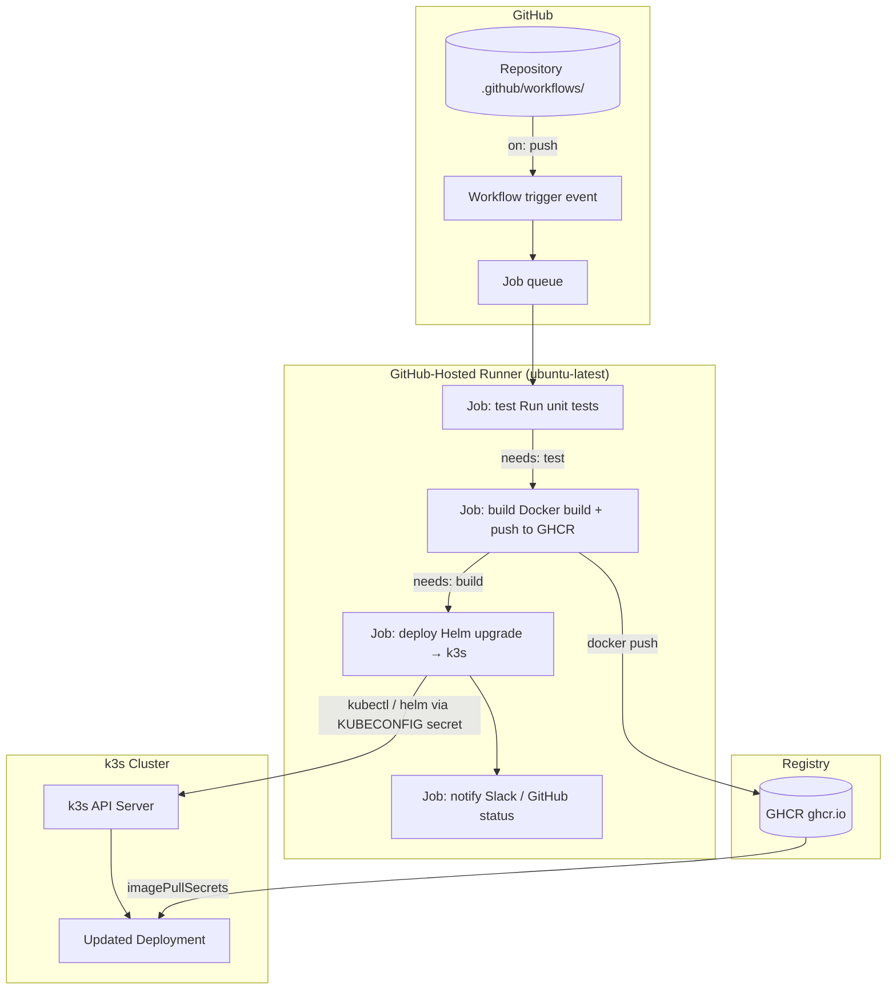

# GitHub Actions Deploy
> Module 12 · Lesson 02 | [↑ Course Index](../README.md)

## Table of Contents
- [Overview](#overview)
- [GitHub Actions Architecture](#github-actions-architecture)
- [Setting Up the KUBECONFIG Secret](#setting-up-the-kubeconfig-secret)
- [Building and Pushing to GHCR](#building-and-pushing-to-ghcr)
- [Deploying to k3s with kubectl and Helm](#deploying-to-k3s-with-kubectl-and-helm)
- [Caching Docker Layers](#caching-docker-layers)
- [Running Tests](#running-tests)
- [Environment Approvals](#environment-approvals)
- [Complete End-to-End Workflow](#complete-end-to-end-workflow)
- [Lab](#lab)

---

## Overview

GitHub Actions is a CI/CD platform built into GitHub. Workflows are YAML files stored in `.github/workflows/` and trigger on repository events (push, PR, release, schedule). Each workflow runs on GitHub-hosted or self-hosted runners.

[↑ Back to TOC](#table-of-contents) · [↑ Course Index](../README.md)

---

## GitHub Actions Architecture



### Key concepts

| Concept | Description |
|---|---|
| **Workflow** | A YAML file defining the full CI/CD process |
| **Event** | What triggers the workflow (`push`, `pull_request`, `schedule`) |
| **Job** | A group of steps running on a single runner |
| **Step** | A single command or action within a job |
| **Action** | A reusable unit (from marketplace or local `./`) |
| **Runner** | The machine that executes jobs |
| **Secret** | Encrypted key/value stored at repo or org level |
| **Environment** | A deployment target with optional protection rules |

[↑ Back to TOC](#table-of-contents) · [↑ Course Index](../README.md)

---

## Setting Up the KUBECONFIG Secret

### Step 1: Create a dedicated CI ServiceAccount on the k3s cluster

See Module 12 Lesson 01 for RBAC details. Quick summary:

```bash
# Apply the CI RBAC resources
kubectl apply -f - <<'EOF'
apiVersion: v1
kind: ServiceAccount
metadata:
  name: ci-deployer
  namespace: production
---
apiVersion: v1
kind: Secret
metadata:
  name: ci-deployer-token
  namespace: production
  annotations:
    kubernetes.io/service-account.name: ci-deployer
type: kubernetes.io/service-account-token
EOF

# Wait for the token to be populated
kubectl wait secret ci-deployer-token -n production \
  --for=jsonpath='{.data.token}' --timeout=30s
```

### Step 2: Build and base64-encode the kubeconfig

```bash
K3S_SERVER="https://your-k3s-ip-or-hostname:6443"
K3S_CA=$(kubectl get secret ci-deployer-token -n production \
  -o jsonpath='{.data.ca\.crt}')
CI_TOKEN=$(kubectl get secret ci-deployer-token -n production \
  -o jsonpath='{.data.token}' | base64 -d)

cat <<EOF | base64 -w 0
apiVersion: v1
kind: Config
clusters:
  - cluster:
      certificate-authority-data: ${K3S_CA}
      server: ${K3S_SERVER}
    name: k3s-production
contexts:
  - context:
      cluster: k3s-production
      user: ci-deployer
      namespace: production
    name: ci-context
current-context: ci-context
users:
  - name: ci-deployer
    user:
      token: ${CI_TOKEN}
EOF
```

### Step 3: Add to GitHub repository secrets

1. Repository → Settings → Secrets and variables → Actions → New repository secret.
2. Name: `KUBECONFIG_BASE64`
3. Value: the output from Step 2.

Other secrets to add:

| Secret | Value |
|---|---|
| `SLACK_WEBHOOK_URL` | Slack Incoming Webhook URL |
| `REGISTRY_TOKEN` | (Optional) if using a private registry other than GHCR |

[↑ Back to TOC](#table-of-contents) · [↑ Course Index](../README.md)

---

## Building and Pushing to GHCR

GitHub Container Registry (GHCR) is built into GitHub and is free for public repositories.

```yaml
- name: Log in to GHCR
  uses: docker/login-action@v3
  with:
    registry: ghcr.io
    username: ${{ github.actor }}
    password: ${{ secrets.GITHUB_TOKEN }}   # automatically available in all workflows

- name: Extract metadata for Docker
  id: meta
  uses: docker/metadata-action@v5
  with:
    images: ghcr.io/${{ github.repository }}
    tags: |
      type=sha,prefix=,suffix=,format=short   # ghcr.io/org/repo:abc1234
      type=ref,event=branch                    # ghcr.io/org/repo:main
      type=semver,pattern={{version}}          # ghcr.io/org/repo:1.2.3 (on tags)
      type=raw,value=latest,enable={{is_default_branch}}

- name: Build and push Docker image
  uses: docker/build-push-action@v5
  with:
    context: .
    push: true
    tags: ${{ steps.meta.outputs.tags }}
    labels: ${{ steps.meta.outputs.labels }}
    cache-from: type=gha            # GitHub Actions cache
    cache-to: type=gha,mode=max
```

[↑ Back to TOC](#table-of-contents) · [↑ Course Index](../README.md)

---

## Deploying to k3s with kubectl and Helm

### kubectl deploy

```yaml
- name: Set up kubeconfig
  run: |
    mkdir -p $HOME/.kube
    echo "${{ secrets.KUBECONFIG_BASE64 }}" | base64 -d > $HOME/.kube/config
    chmod 600 $HOME/.kube/config

- name: Deploy with kubectl
  run: |
    # Set the new image tag
    kubectl set image deployment/my-app \
      my-app=ghcr.io/${{ github.repository }}:${{ github.sha }} \
      -n production

    # Wait for rollout to complete
    kubectl rollout status deployment/my-app -n production --timeout=5m
```

### Helm deploy

```yaml
- name: Install Helm
  uses: azure/setup-helm@v3
  with:
    version: v3.14.0

- name: Deploy with Helm
  run: |
    helm upgrade --install my-app ./charts/my-app \
      --namespace production \
      --create-namespace \
      --set image.repository=ghcr.io/${{ github.repository }} \
      --set image.tag=${{ github.sha }} \
      --set replicaCount=2 \
      --atomic \
      --timeout 5m \
      --wait
```

[↑ Back to TOC](#table-of-contents) · [↑ Course Index](../README.md)

---

## Caching Docker Layers

Caching dramatically speeds up image builds (from minutes to seconds for small changes).

### GitHub Actions Cache (recommended)

```yaml
- name: Set up Docker Buildx
  uses: docker/setup-buildx-action@v3

- name: Build and push
  uses: docker/build-push-action@v5
  with:
    context: .
    push: true
    tags: ghcr.io/${{ github.repository }}:${{ github.sha }}
    cache-from: type=gha
    cache-to: type=gha,mode=max   # mode=max caches all layers, not just final
```

### Registry cache (useful for self-hosted runners)

```yaml
- name: Build and push with registry cache
  uses: docker/build-push-action@v5
  with:
    context: .
    push: true
    tags: ghcr.io/${{ github.repository }}:${{ github.sha }}
    cache-from: type=registry,ref=ghcr.io/${{ github.repository }}:buildcache
    cache-to: type=registry,ref=ghcr.io/${{ github.repository }}:buildcache,mode=max
```

[↑ Back to TOC](#table-of-contents) · [↑ Course Index](../README.md)

---

## Running Tests

### Unit tests

```yaml
- name: Run unit tests
  run: |
    # Python example
    pip install -r requirements-test.txt
    pytest tests/unit/ --junit-xml=test-results/unit.xml

    # Go example
    # go test ./... -v -coverprofile=coverage.out

    # Node example
    # npm ci && npm test

- name: Upload test results
  uses: actions/upload-artifact@v4
  if: always()   # upload even if tests fail
  with:
    name: unit-test-results
    path: test-results/
```

### Container-level integration tests

```yaml
- name: Run integration tests against built image
  run: |
    # Start the container
    docker run -d --name app-test \
      -p 8080:8080 \
      -e DATABASE_URL=sqlite:///:memory: \
      ghcr.io/${{ github.repository }}:${{ github.sha }}

    # Wait for it to be ready
    timeout 30 bash -c 'until curl -sf http://localhost:8080/healthz; do sleep 1; done'

    # Run tests
    curl -sf http://localhost:8080/healthz | grep '"status":"ok"'
    curl -sf http://localhost:8080/api/v1/status

    # Cleanup
    docker rm -f app-test
```

[↑ Back to TOC](#table-of-contents) · [↑ Course Index](../README.md)

---

## Environment Approvals

GitHub Environments let you require human approval before deploying to sensitive targets.

### Create a protected environment

1. Repository → Settings → Environments → New environment.
2. Name: `production`.
3. Enable **Required reviewers** — add your ops team.
4. Optionally set **Deployment branches** to `main` only.
5. Add environment-specific secrets (e.g., production KUBECONFIG).

### Use the environment in a workflow job

```yaml
jobs:
  deploy-production:
    runs-on: ubuntu-latest
    environment:
      name: production               # must match the environment name in Settings
      url: https://app.example.com   # shown as a link in the GitHub UI
    steps:
      - name: Deploy to production
        run: helm upgrade --install ...
```

When this job runs, GitHub pauses and sends a notification to the required reviewers. The deployment only proceeds after approval.

[↑ Back to TOC](#table-of-contents) · [↑ Course Index](../README.md)

---

## Complete End-to-End Workflow

The complete workflow is at `labs/github-actions-deploy.yml`. Here is a structural overview:

```yaml
name: Build, Test, and Deploy

on:
  push:
    branches: [main]
  workflow_dispatch:   # allow manual trigger

# Prevent concurrent deploys to the same environment
concurrency:
  group: deploy-${{ github.ref }}
  cancel-in-progress: false

jobs:
  test:      # Run tests first
  build:     # Build and push image (needs: test)
  deploy:    # Helm deploy to k3s (needs: build, environment: production)
  notify:    # Slack notification (if: always(), needs: deploy)
```

Key points:
- `needs:` creates a dependency chain.
- `environment: production` triggers the approval gate.
- `if: always()` in the notify job ensures Slack gets both success and failure messages.
- `concurrency` prevents two deployments running simultaneously.

[↑ Back to TOC](#table-of-contents) · [↑ Course Index](../README.md)

---

## Lab

```bash
# Prerequisites:
# - A GitHub repository with your application code
# - k3s running and accessible from the internet (or use ngrok for testing)
# - Helm chart in ./charts/my-app

# 1. Create the CI ServiceAccount and token
kubectl apply -f - <<'EOF'
apiVersion: v1
kind: Namespace
metadata:
  name: production
---
apiVersion: v1
kind: ServiceAccount
metadata:
  name: ci-deployer
  namespace: production
---
apiVersion: v1
kind: Secret
metadata:
  name: ci-deployer-token
  namespace: production
  annotations:
    kubernetes.io/service-account.name: ci-deployer
type: kubernetes.io/service-account-token
EOF

# 2. Apply RBAC (see labs/github-actions-deploy.yml for full example)
# ... (apply Role and RoleBinding as shown in Lesson 01)

# 3. Build and store kubeconfig
# (see "Setting Up the KUBECONFIG Secret" section above)

# 4. Copy labs/github-actions-deploy.yml to your repo
mkdir -p .github/workflows
cp labs/github-actions-deploy.yml .github/workflows/deploy.yml

# 5. Commit and push to trigger the workflow
git add .github/workflows/deploy.yml
git commit -m "ci: add GitHub Actions deploy workflow"
git push origin main

# 6. Watch the workflow run at:
# https://github.com/YOUR_ORG/YOUR_REPO/actions
```

[↑ Back to TOC](#table-of-contents) · [↑ Course Index](../README.md)

---

*Licensed under [CC BY-NC-SA 4.0](../LICENSE.md) · © 2026 UncleJS*
