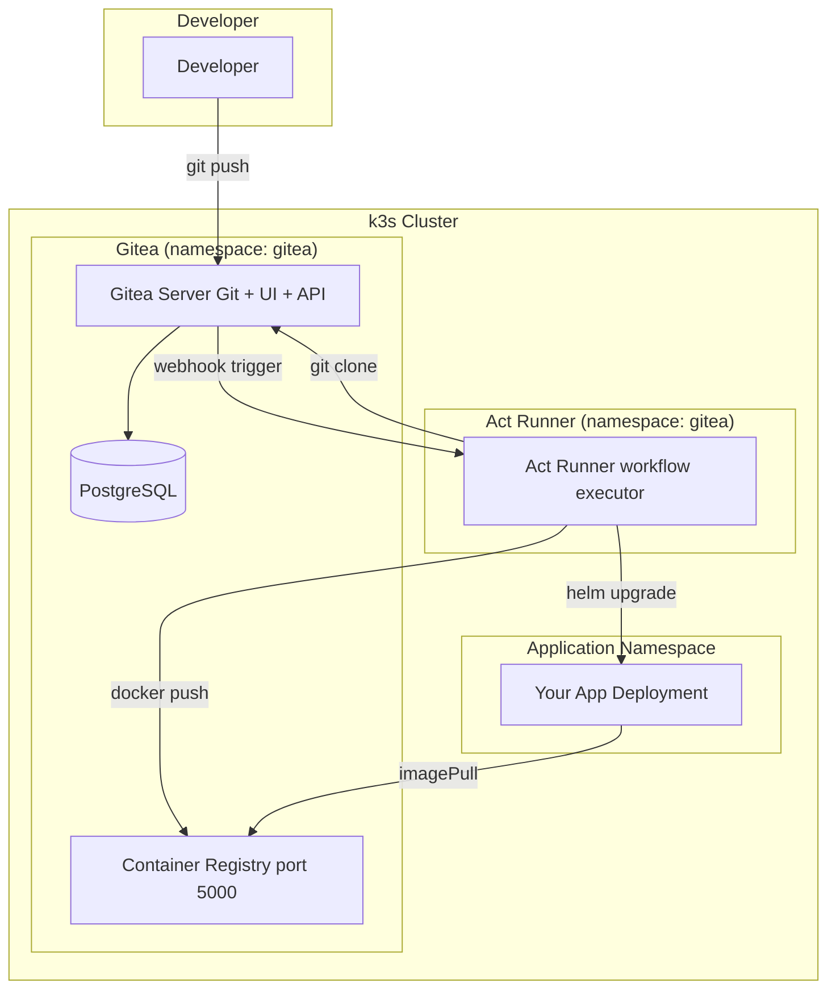

# Gitea + Act Runner (On-Premises)
> Module 12 · Lesson 03 | [↑ Course Index](../README.md)


[](../README.md)
[](../LICENSE.md)

## Table of Contents
- [Overview](#overview)
- [Gitea Overview](#gitea-overview)
- [Installing Gitea with Helm on k3s](#installing-gitea-with-helm-on-k3s)
- [Act Runner Overview](#act-runner-overview)
- [Installing Act Runner](#installing-act-runner)
- [Writing a Gitea Actions Workflow](#writing-a-gitea-actions-workflow)
- [Air-Gapped Environments](#air-gapped-environments)
- [Lab](#lab)

---

## Overview

For teams that cannot use GitHub (for security, compliance, or network reasons), Gitea provides a self-hosted, lightweight Git service. Its **Act Runner** is compatible with GitHub Actions workflow syntax, enabling you to reuse the same CI/CD patterns from Lesson 02 on your own infrastructure.

[↑ Back to TOC](#table-of-contents) · [↑ Course Index](../README.md)

---

## Gitea Overview

Gitea is an open-source, self-hosted Git service written in Go. It provides:

- Git repository hosting (push, pull, fork, PR workflow)
- Issue tracking, project boards, wikis
- Container registry (built-in, compatible with Docker push/pull)
- **Actions** — GitHub Actions-compatible CI/CD (introduced in Gitea 1.19+)
- Package registry (npm, PyPI, Helm, Maven, etc.)

### Gitea vs GitHub vs GitLab

| Feature | Gitea | GitHub | GitLab |
|---|---|---|---|
| Self-hosted | Yes (primary use case) | No | Yes |
| Resource usage | ~50 MB RAM | N/A | ~4 GB RAM (full install) |
| Actions compatibility | GitHub Actions syntax | Native | GitLab CI syntax |
| Container registry | Built-in | GHCR | Built-in |
| Air-gap friendly | Excellent | No | Yes (complex) |
| License | MIT | Proprietary | MIT CE / Proprietary EE |



[↑ Back to TOC](#table-of-contents) · [↑ Course Index](../README.md)

---

## Installing Gitea with Helm on k3s

### Add the Helm repository

```bash
helm repo add gitea-charts https://dl.gitea.com/charts/
helm repo update
```

### Create namespace

```bash
kubectl create namespace gitea
```

### Create values file

```yaml
# gitea-values.yaml
gitea:
  admin:
    username: gitea-admin
    password: "admin123"        # change in production
    email: "admin@example.com"
  config:
    server:
      DOMAIN: gitea.example.com
      ROOT_URL: "http://gitea.example.com"
      SSH_DOMAIN: gitea.example.com
    database:
      DB_TYPE: postgres
    repository:
      DEFAULT_BRANCH: main
    # Enable Actions (Gitea CI/CD)
    actions:
      ENABLED: true

service:
  http:
    type: NodePort
    nodePort: 30380
  ssh:
    type: NodePort
    nodePort: 30022

# PostgreSQL dependency
postgresql-ha:
  enabled: true
  postgresql:
    resources:
      requests:
        cpu: 50m
        memory: 128Mi
      limits:
        cpu: 200m
        memory: 256Mi

# Persistence
persistence:
  enabled: true
  storageClass: local-path
  size: 10Gi

resources:
  requests:
    cpu: 100m
    memory: 256Mi
  limits:
    cpu: 500m
    memory: 512Mi
```

### Install

```bash
helm install gitea gitea-charts/gitea \
  --namespace gitea \
  --values gitea-values.yaml \
  --version 10.x.x
```

### Verify

```bash
kubectl get pods -n gitea
# gitea-0                    1/1     Running   0
# gitea-postgresql-ha-0      1/1     Running   0

# Access via NodePort
# http://<node-ip>:30380
```

### Expose via Traefik IngressRoute (optional)

```yaml
apiVersion: traefik.io/v1alpha1
kind: IngressRoute
metadata:
  name: gitea
  namespace: gitea
spec:
  entryPoints:
    - web
  routes:
    - match: Host(`gitea.example.com`)
      kind: Rule
      services:
        - name: gitea-http
          port: 3000
```

[↑ Back to TOC](#table-of-contents) · [↑ Course Index](../README.md)

---

## Act Runner Overview

Act Runner is Gitea's native CI runner. It:

- Polls Gitea for pending workflow jobs.
- Executes jobs in Docker containers (or on the host for rootless setups).
- Is compatible with most GitHub Actions syntax and many marketplace actions.
- Can run entirely air-gapped using local Docker images.

### Compatibility

| GitHub Actions feature | Act Runner support |
|---|---|
| `on: push`, `on: pull_request` | Full |
| `runs-on: ubuntu-latest` | Maps to a local Docker image |
| `uses: actions/checkout@v4` | Supported (uses local copy or fetches from GitHub) |
| `uses: docker/build-push-action@v5` | Supported |
| `jobs.<job>.needs` | Full |
| `jobs.<job>.environment` | Partial (no approval gates) |
| `concurrency` | Supported |
| GitHub Actions Cache | Supported (with Gitea cache provider) |

[↑ Back to TOC](#table-of-contents) · [↑ Course Index](../README.md)

---

## Installing Act Runner

### Step 1: Register a runner token in Gitea

1. Log in to Gitea as admin.
2. Go to **Site Administration → Actions → Runners → Create new runner**.
3. Copy the registration token.

Or via API:

```bash
# Create a runner registration token via API
curl -X POST \
  -H "Content-Type: application/json" \
  -u gitea-admin:admin123 \
  http://gitea.example.com/api/v1/admin/runners/registration-token
# Response: {"token":"<runner-registration-token>"}
```

### Step 2: Create a ConfigMap and Secret for the runner

```yaml
---
apiVersion: v1
kind: ConfigMap
metadata:
  name: act-runner-config
  namespace: gitea
data:
  config.yaml: |
    log:
      level: info
    runner:
      file: .runner
      capacity: 2             # number of concurrent jobs
      timeout: 3h
      insecure: false
    cache:
      enabled: true
      dir: /cache
    container:
      network: bridge
      privileged: false
      options: ""
      workdir_parent: /workspace
      # Use local Docker images for common actions
      # (pre-pull these in air-gapped environments)
      valid_volumes:
        - /workspace
        - /cache
    host:
      workdir_parent: /workspace
---
apiVersion: v1
kind: Secret
metadata:
  name: act-runner-secret
  namespace: gitea
type: Opaque
stringData:
  GITEA_RUNNER_REGISTRATION_TOKEN: "REPLACE_WITH_ACTUAL_TOKEN"
```

### Step 3: Deploy Act Runner as a Deployment

```yaml
---
apiVersion: apps/v1
kind: Deployment
metadata:
  name: act-runner
  namespace: gitea
spec:
  replicas: 1
  selector:
    matchLabels:
      app: act-runner
  template:
    metadata:
      labels:
        app: act-runner
    spec:
      # Runner needs Docker socket access to run container jobs
      # In production, consider using Rootless Podman or Kaniko
      volumes:
        - name: docker-sock
          hostPath:
            path: /var/run/docker.sock
        - name: runner-config
          configMap:
            name: act-runner-config
        - name: runner-data
          emptyDir: {}
        - name: cache
          emptyDir: {}
      containers:
        - name: act-runner
          image: gitea/act_runner:latest
          command:
            - sh
            - -c
            - |
              act_runner register \
                --no-interactive \
                --instance http://gitea-http.gitea.svc.cluster.local:3000 \
                --token ${GITEA_RUNNER_REGISTRATION_TOKEN} \
                --name k3s-runner \
                --labels ubuntu-latest:docker://node:20-bullseye,ubuntu-22.04:docker://node:20-bullseye \
              && act_runner daemon --config /config/config.yaml
          env:
            - name: GITEA_RUNNER_REGISTRATION_TOKEN
              valueFrom:
                secretKeyRef:
                  name: act-runner-secret
                  key: GITEA_RUNNER_REGISTRATION_TOKEN
            - name: GITEA_INSTANCE_URL
              value: "http://gitea-http.gitea.svc.cluster.local:3000"
          volumeMounts:
            - name: docker-sock
              mountPath: /var/run/docker.sock
            - name: runner-config
              mountPath: /config
            - name: runner-data
              mountPath: /data
            - name: cache
              mountPath: /cache
          resources:
            requests:
              cpu: 100m
              memory: 128Mi
            limits:
              cpu: 1000m
              memory: 1Gi
```

### Step 4: Verify registration

```bash
kubectl logs -n gitea deployment/act-runner -f
# Look for: "Runner registered successfully"

# Also check in Gitea UI:
# Site Administration → Actions → Runners
```

[↑ Back to TOC](#table-of-contents) · [↑ Course Index](../README.md)

---

## Writing a Gitea Actions Workflow

Gitea Actions workflows live in `.gitea/workflows/` (not `.github/workflows/`).

### Basic workflow structure

```yaml
# .gitea/workflows/deploy.yml
name: Build and Deploy

on:
  push:
    branches: [main]

jobs:
  build:
    runs-on: ubuntu-latest   # maps to the label you set in the runner

    steps:
      - uses: actions/checkout@v4

      - name: Build image
        run: docker build -t registry.example.com/my-app:${{ gitea.sha }} .

      - name: Push image
        run: docker push registry.example.com/my-app:${{ gitea.sha }}
```

> **Note:** In Gitea Actions, use `${{ gitea.sha }}` instead of `${{ github.sha }}`. Most other context variables follow the same pattern with `gitea.` prefix.

### Context variable mapping

| GitHub Actions | Gitea Actions |
|---|---|
| `github.sha` | `gitea.sha` |
| `github.ref` | `gitea.ref` |
| `github.actor` | `gitea.actor` |
| `github.repository` | `gitea.repository` |
| `github.server_url` | `gitea.server_url` |

[↑ Back to TOC](#table-of-contents) · [↑ Course Index](../README.md)

---

## Air-Gapped Environments

One of Gitea's strongest advantages is operating in fully air-gapped networks.

### Pre-pulling action images

In an air-gapped environment, `uses: actions/checkout@v4` would fail because it tries to pull from GitHub. Solutions:

#### Option 1: Mirror actions to Gitea

Clone popular actions to your Gitea instance:

```bash
# On a machine with internet access
git clone https://github.com/actions/checkout.git
git clone https://github.com/docker/build-push-action.git
git clone https://github.com/docker/login-action.git
git clone https://github.com/docker/metadata-action.git

# Push to your Gitea instance
cd checkout
git remote add gitea http://gitea.example.com/actions/checkout.git
git push gitea --all
```

Then reference local actions:

```yaml
steps:
  - uses: actions/checkout@v4    # Gitea resolves this against its local mirror
```

Configure Gitea to use the local mirror:

```ini
# app.ini → [actions] section
[actions]
DEFAULT_ACTIONS_URL = http://gitea.example.com   # use local Gitea for action lookups
```

#### Option 2: Use shell steps instead of Actions

For maximum air-gap compatibility, avoid `uses:` entirely:

```yaml
steps:
  - name: Checkout
    run: |
      git clone http://gitea.example.com/my-org/my-app.git .
      git checkout ${{ gitea.sha }}

  - name: Build
    run: docker build -t registry.example.com/my-app:${{ gitea.sha }} .
```

### Using a local container registry

In air-gapped environments, all images come from your local registry:

```yaml
# .gitea/workflows/deploy.yml
env:
  REGISTRY: registry.example.com   # local registry, no internet needed
  IMAGE_NAME: my-app

steps:
  - name: Login to local registry
    run: |
      echo "${{ secrets.REGISTRY_PASSWORD }}" | \
        docker login ${{ env.REGISTRY }} \
        -u ${{ secrets.REGISTRY_USER }} \
        --password-stdin

  - name: Build and push
    run: |
      docker build -t ${{ env.REGISTRY }}/${{ env.IMAGE_NAME }}:${{ gitea.sha }} .
      docker push ${{ env.REGISTRY }}/${{ env.IMAGE_NAME }}:${{ gitea.sha }}
```

### Pre-caching runner base images

Pull required Docker images while you have internet access:

```bash
# On runner nodes
docker pull node:20-bullseye     # for ubuntu-latest label
docker pull golang:1.22-alpine   # for Go builds
docker pull python:3.12-slim     # for Python builds
docker pull docker:24-dind       # for Docker-in-Docker if needed

# Save to tar for truly offline transfer
docker save node:20-bullseye | gzip > node-20-bullseye.tar.gz
# Transfer to air-gapped system
# docker load < node-20-bullseye.tar.gz
```

[↑ Back to TOC](#table-of-contents) · [↑ Course Index](../README.md)

---

## Lab

```bash
# 1. Install Gitea
helm repo add gitea-charts https://dl.gitea.com/charts/
helm repo update
kubectl create namespace gitea
helm install gitea gitea-charts/gitea \
  --namespace gitea \
  --set gitea.admin.username=gitea-admin \
  --set gitea.admin.password=admin123 \
  --set service.http.type=NodePort \
  --set service.http.nodePort=30380 \
  --set 'gitea.config.actions.ENABLED=true' \
  --set persistence.storageClass=local-path

# 2. Wait for Gitea to start
kubectl rollout status statefulset/gitea -n gitea

# 3. Access Gitea at http://<node-ip>:30380
#    Login with admin / admin123

# 4. Create a test repository in the Gitea UI
#    New Repository → name: "my-app"

# 5. Get a runner registration token
curl -X POST \
  -H "Content-Type: application/json" \
  -u gitea-admin:admin123 \
  http://$(kubectl get nodes -o jsonpath='{.items[0].status.addresses[0].address}'):30380/api/v1/admin/runners/registration-token

# 6. Update the token in the Secret and deploy the Act Runner
#    Edit labs/gitea-workflow.yml and set REGISTRY to your local registry
kubectl apply -f - <<'EOF'
apiVersion: v1
kind: Secret
metadata:
  name: act-runner-secret
  namespace: gitea
type: Opaque
stringData:
  GITEA_RUNNER_REGISTRATION_TOKEN: "TOKEN_FROM_STEP_5"
EOF

# 7. Copy the workflow file to your repo
mkdir -p .gitea/workflows
cp labs/gitea-workflow.yml .gitea/workflows/deploy.yml

# 8. Push code and watch the workflow execute
git remote add gitea http://<node-ip>:30380/gitea-admin/my-app.git
git push gitea main
```

[↑ Back to TOC](#table-of-contents) · [↑ Course Index](../README.md)

---

*Licensed under [CC BY-NC-SA 4.0](../LICENSE.md) · © 2026 UncleJS*
