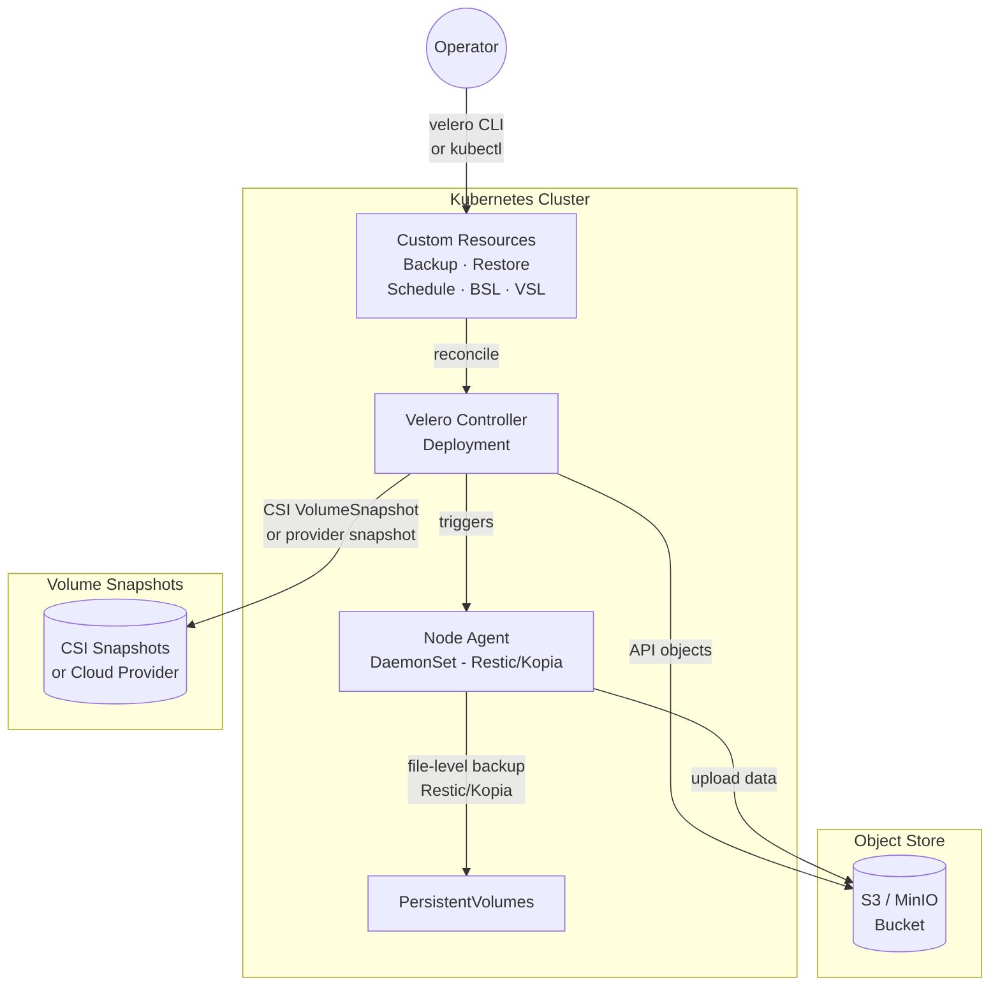
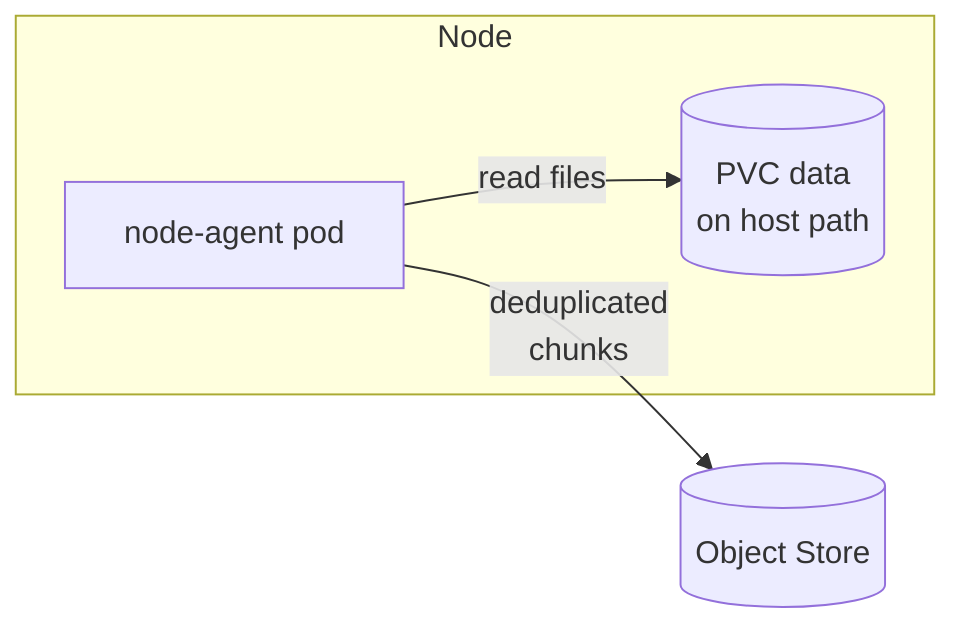

# Velero Backup
> Module 13 · Lesson 02 | [↑ Course Index](../README.md)

## Table of Contents
1. [Velero Overview](#velero-overview)
2. [Velero Architecture](#velero-architecture)
3. [Installing Velero](#installing-velero)
4. [Configuring Object Storage](#configuring-object-storage)
5. [BackupStorageLocation and VolumeSnapshotLocation](#backupstoragelocation-and-volumesnapshotlocation)
6. [Creating Backup Resources](#creating-backup-resources)
7. [Scheduling Backups](#scheduling-backups)
8. [Restoring from a Backup](#restoring-from-a-backup)
9. [Restic / Kopia Integration for PVC Data](#restic--kopia-integration-for-pvc-data)

---

## Velero Overview

Velero (formerly Ark, by VMware/Broadcom) is the de-facto open-source tool for Kubernetes backup and
migration. Unlike etcd snapshots — which capture raw cluster state at the datastore level — Velero
operates at the Kubernetes API level and can optionally back up PVC data.

### What Velero backs up

| Category | Backed up by Velero | Notes |
|---|---|---|
| Kubernetes API objects | Yes | All namespaced and cluster-scoped resources |
| PVC metadata (PersistentVolumeClaim) | Yes | The claim object, not the data |
| PVC data (volume contents) | Optional | Requires Restic or Kopia file-system backup |
| Container images | No | Images come from registries |
| Node-level configuration | No | Use etcd snapshot or Ansible/Terraform |

### When to use Velero vs etcd snapshots

| Use case | Preferred tool |
|---|---|
| Full cluster disaster recovery | etcd snapshot |
| Single namespace or application restore | Velero |
| Cross-cluster migration | Velero |
| PVC data backup | Velero + Restic/Kopia |
| Pre-upgrade safety net | etcd snapshot (faster) |
| Scheduled long-term retention | Velero (richer lifecycle) |

[↑ Back to TOC](#table-of-contents) · [↑ Course Index](../README.md)

---

## Velero Architecture



### Key Components

| Component | Type | Description |
|---|---|---|
| `velero` server | Deployment | Main controller — watches CRs, drives backups/restores |
| `node-agent` | DaemonSet | Runs on each node to access PVC data via Restic or Kopia |
| BackupStorageLocation (BSL) | CRD | Points to an S3-compatible bucket |
| VolumeSnapshotLocation (VSL) | CRD | Points to a CSI or cloud-provider snapshot target |
| Backup | CRD | Defines what to back up and when |
| Restore | CRD | Defines a restore operation from a named backup |
| Schedule | CRD | Cron-driven Backup template |

### Velero Plugins

Velero uses a plugin architecture. Key plugin types:

- **Object store plugin** — handles upload/download to S3, GCS, Azure Blob
- **Volume snapshot plugin** — integrates with CSI, AWS EBS, GCE PD, etc.
- **Backup item action** — transforms resources at backup time (e.g., strip node-specific fields)
- **Restore item action** — transforms resources at restore time

[↑ Back to TOC](#table-of-contents) · [↑ Course Index](../README.md)

---

## Installing Velero

### Prerequisites

- `velero` CLI installed on your workstation
- An object storage bucket (S3 / MinIO) accessible from the cluster
- `kubectl` configured to talk to the target cluster

### Install the Velero CLI

```bash
# Linux (amd64)
VELERO_VERSION=v1.13.2
curl -fsSL \
  "https://github.com/vmware-tanzu/velero/releases/download/${VELERO_VERSION}/velero-${VELERO_VERSION}-linux-amd64.tar.gz" \
  | tar xz --strip-components=1 -C /usr/local/bin velero-${VELERO_VERSION}-linux-amd64/velero

velero version --client-only
```

### Install via Velero CLI (Recommended for k3s)

```bash
# Create credentials file for MinIO / S3
cat > /tmp/velero-credentials <<EOF
[default]
aws_access_key_id=minioadmin
aws_secret_access_key=minioadmin
EOF

velero install \
  --provider aws \
  --plugins velero/velero-plugin-for-aws:v1.9.0 \
  --bucket velero-backups \
  --secret-file /tmp/velero-credentials \
  --backup-location-config \
    region=minio,s3ForcePathStyle=true,s3Url=http://minio.minio-system:9000 \
  --use-node-agent \
  --default-volumes-to-fs-backup

# Clean up credentials file
rm /tmp/velero-credentials
```

### Install via Helm

```bash
helm repo add vmware-tanzu https://vmware-tanzu.github.io/helm-charts
helm repo update

# Create namespace and credentials secret first
kubectl create namespace velero
kubectl create secret generic velero-s3-credentials \
  -n velero \
  --from-literal=cloud="[default]
aws_access_key_id=minioadmin
aws_secret_access_key=minioadmin"

helm install velero vmware-tanzu/velero \
  --namespace velero \
  --values - <<'EOF'
configuration:
  backupStorageLocation:
    - name: default
      provider: aws
      bucket: velero-backups
      config:
        region: minio
        s3ForcePathStyle: "true"
        s3Url: http://minio.minio-system:9000
  volumeSnapshotLocation:
    - name: default
      provider: aws
      config:
        region: minio

credentials:
  useSecret: true
  existingSecret: velero-s3-credentials

deployNodeAgent: true

initContainers:
  - name: velero-plugin-for-aws
    image: velero/velero-plugin-for-aws:v1.9.0
    volumeMounts:
      - mountPath: /target
        name: plugins
EOF
```

### Verify Installation

```bash
kubectl get pods -n velero
# velero-xxxx-yyyy        1/1  Running
# node-agent-aaaaa        1/1  Running  (one per node)

velero backup-location get
# NAME      PROVIDER  BUCKET/PREFIX    PHASE
# default   aws       velero-backups   Available
```

[↑ Back to TOC](#table-of-contents) · [↑ Course Index](../README.md)

---

## Configuring Object Storage

### MinIO — Local S3-Compatible Storage

MinIO is the recommended object store for on-premises k3s clusters.

```bash
# Deploy MinIO into the cluster
kubectl create namespace minio-system

helm repo add minio https://charts.min.io/
helm install minio minio/minio \
  --namespace minio-system \
  --set rootUser=minioadmin \
  --set rootPassword=minioadmin \
  --set mode=standalone \
  --set persistence.size=20Gi

# Create the velero bucket
kubectl run minio-client --rm -it --restart=Never \
  --image=minio/mc --command -- \
  mc alias set local http://minio.minio-system:9000 minioadmin minioadmin \
  && mc mb local/velero-backups
```

### AWS S3 Bucket (Production)

```bash
# Create bucket (IAM permissions required separately)
aws s3 mb s3://my-cluster-velero-backups --region us-east-1

# Recommended IAM policy (attach to an IAM user or role):
cat <<'EOF'
{
  "Version": "2012-10-17",
  "Statement": [
    {
      "Effect": "Allow",
      "Action": [
        "s3:GetObject", "s3:PutObject", "s3:DeleteObject",
        "s3:ListBucket", "s3:GetBucketLocation"
      ],
      "Resource": [
        "arn:aws:s3:::my-cluster-velero-backups",
        "arn:aws:s3:::my-cluster-velero-backups/*"
      ]
    },
    {
      "Effect": "Allow",
      "Action": ["ec2:CreateSnapshot","ec2:DeleteSnapshot",
                 "ec2:DescribeSnapshots","ec2:CreateTags"],
      "Resource": "*"
    }
  ]
}
EOF
```

[↑ Back to TOC](#table-of-contents) · [↑ Course Index](../README.md)

---

## BackupStorageLocation and VolumeSnapshotLocation

### BackupStorageLocation (BSL)

A BSL tells Velero where to store backup files (Kubernetes manifests and metadata).

```yaml
# backupstoragelocation-minio.yaml
apiVersion: velero.io/v1
kind: BackupStorageLocation
metadata:
  name: default
  namespace: velero
spec:
  provider: aws
  objectStorage:
    bucket: velero-backups
    prefix: prod-cluster/
  config:
    region: minio
    s3ForcePathStyle: "true"
    s3Url: http://minio.minio-system:9000
  # Velero checks this location's availability periodically
  accessMode: ReadWrite
```

```bash
# Apply and verify
kubectl apply -f backupstoragelocation-minio.yaml
velero backup-location get
```

You can define multiple BSLs (e.g., a primary and a secondary in a different region) and specify
which one to use per backup.

### VolumeSnapshotLocation (VSL)

A VSL is used when taking CSI or cloud-provider volume snapshots (not needed for Restic/Kopia
file-level backups).

```yaml
apiVersion: velero.io/v1
kind: VolumeSnapshotLocation
metadata:
  name: default
  namespace: velero
spec:
  provider: aws
  config:
    region: us-east-1
```

[↑ Back to TOC](#table-of-contents) · [↑ Course Index](../README.md)

---

## Creating Backup Resources

### Ad-Hoc Backup via CLI

```bash
# Backup a single namespace
velero backup create my-app-backup --include-namespaces my-app

# Backup all namespaces except system ones
velero backup create full-cluster \
  --exclude-namespaces kube-system,kube-public,velero

# Backup with label selector
velero backup create tagged-backup \
  --selector app=my-api

# Include PVC data (Restic/Kopia file backup)
velero backup create my-app-with-data \
  --include-namespaces my-app \
  --default-volumes-to-fs-backup

# Backup to a specific storage location
velero backup create my-app-offsite \
  --include-namespaces my-app \
  --storage-location secondary
```

### Backup Resource via YAML

```yaml
apiVersion: velero.io/v1
kind: Backup
metadata:
  name: my-app-backup
  namespace: velero
spec:
  # Scope
  includedNamespaces:
    - my-app
    - my-app-config
  excludedResources:
    - events
    - events.events.k8s.io
  # Label selector (optional — backs up matching resources only)
  labelSelector:
    matchLabels:
      backup: "true"
  # Storage
  storageLocation: default
  # Retention
  ttl: 720h   # 30 days
  # Volume backup method
  defaultVolumesToFsBackup: true
  # Hooks (optional — run commands in pods before/after backup)
  hooks:
    resources:
      - name: database-quiesce
        includedNamespaces:
          - my-app
        labelSelector:
          matchLabels:
            app: postgres
        pre:
          - exec:
              container: postgres
              command:
                - /bin/bash
                - -c
                - psql -U postgres -c "CHECKPOINT;"
              onError: Fail
              timeout: 30s
```

```bash
kubectl apply -f my-app-backup.yaml
velero backup get
velero backup describe my-app-backup --details
velero backup logs my-app-backup
```

[↑ Back to TOC](#table-of-contents) · [↑ Course Index](../README.md)

---

## Scheduling Backups

```yaml
apiVersion: velero.io/v1
kind: Schedule
metadata:
  name: daily-full-backup
  namespace: velero
spec:
  schedule: "0 2 * * *"   # 02:00 UTC daily
  template:
    includedNamespaces:
      - "*"
    excludedNamespaces:
      - kube-system
      - kube-public
      - velero
    excludedResources:
      - events
      - events.events.k8s.io
    storageLocation: default
    ttl: 168h   # 7 days retention
    defaultVolumesToFsBackup: true
```

```bash
kubectl apply -f daily-schedule.yaml

# Monitor scheduled backups
velero schedule get
velero backup get | grep daily-full-backup

# Trigger a scheduled backup manually
velero backup create --from-schedule daily-full-backup
```

[↑ Back to TOC](#table-of-contents) · [↑ Course Index](../README.md)

---

## Restoring from a Backup

```bash
# List available backups
velero backup get

# Restore an entire backup
velero restore create --from-backup my-app-backup

# Restore only specific namespaces from a backup
velero restore create partial-restore \
  --from-backup full-cluster \
  --include-namespaces my-app

# Restore into a different namespace (namespace mapping)
velero restore create ns-migration \
  --from-backup my-app-backup \
  --namespace-mappings my-app:my-app-restored

# Restore a single resource type
velero restore create secrets-only \
  --from-backup my-app-backup \
  --include-resources secrets

# Monitor restore progress
velero restore describe partial-restore --details
velero restore logs partial-restore
```

### Restore Resource via YAML

```yaml
apiVersion: velero.io/v1
kind: Restore
metadata:
  name: my-app-restore
  namespace: velero
spec:
  backupName: my-app-backup
  includedNamespaces:
    - my-app
  excludedResources:
    - nodes
    - events
    - persistentvolumes   # Re-provision volumes dynamically
  restorePVs: true
  # Namespace mapping (optional)
  namespaceMapping:
    my-app: my-app-restored
```

[↑ Back to TOC](#table-of-contents) · [↑ Course Index](../README.md)

---

## Restic / Kopia Integration for PVC Data

By default, Velero does not back up the actual data inside PersistentVolumes. To back up PVC
contents, Velero integrates with **Restic** (legacy, deprecated in favor of Kopia) or **Kopia**
(current default from Velero 1.12+).

### How It Works

The `node-agent` DaemonSet runs on each worker node. When a backup is triggered with
`defaultVolumesToFsBackup: true`, the node agent:
1. Identifies pods using PVCs in the target namespaces
2. Mounts the volume and performs a file-system-level copy
3. Deduplicates and uploads chunks to the object store bucket



### Enabling Kopia for Specific Volumes

```yaml
# Annotate a PVC to opt-in to file backup
apiVersion: v1
kind: PersistentVolumeClaim
metadata:
  name: my-data
  namespace: my-app
  annotations:
    backup.velero.io/backup-volumes: "my-data"
spec:
  accessModes: [ReadWriteOnce]
  resources:
    requests:
      storage: 10Gi
```

Or annotate the pod:

```yaml
apiVersion: v1
kind: Pod
metadata:
  name: my-app-pod
  namespace: my-app
  annotations:
    backup.velero.io/backup-volumes: my-data,config-vol
spec:
  containers:
    - name: app
      volumeMounts:
        - name: my-data
          mountPath: /data
        - name: config-vol
          mountPath: /config
  volumes:
    - name: my-data
      persistentVolumeClaim:
        claimName: my-data
    - name: config-vol
      configMap:
        name: my-config
```

### Verify Volume Backup

```bash
velero backup describe my-app-backup --details | grep -A5 "Volume Backups"
# PodVolumeBackups:
#   my-app/my-app-pod/my-data:
#     Phase:           Completed
#     Storage Location: default
#     ...
```

[↑ Back to TOC](#table-of-contents) · [↑ Course Index](../README.md)

---

*Licensed under [CC BY-NC-SA 4.0](../LICENSE.md) · © 2026 UncleJS*
