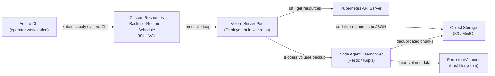
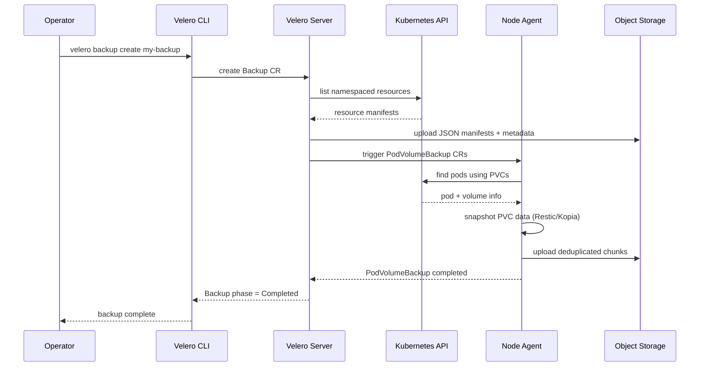
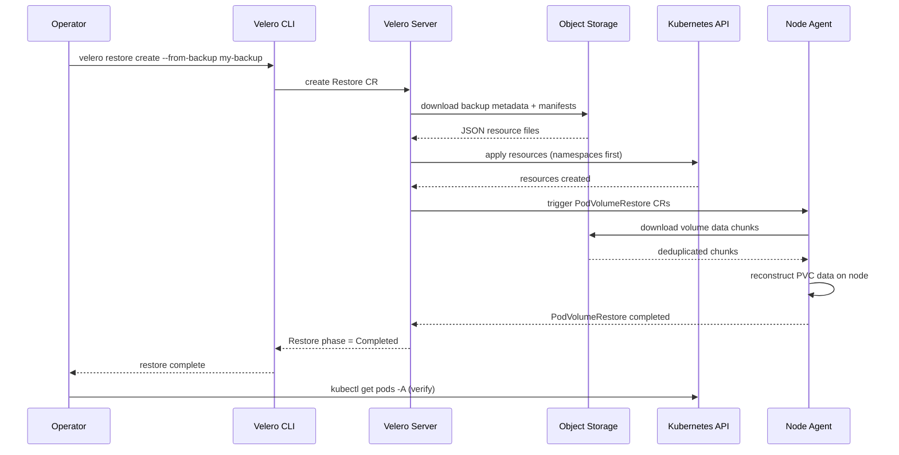
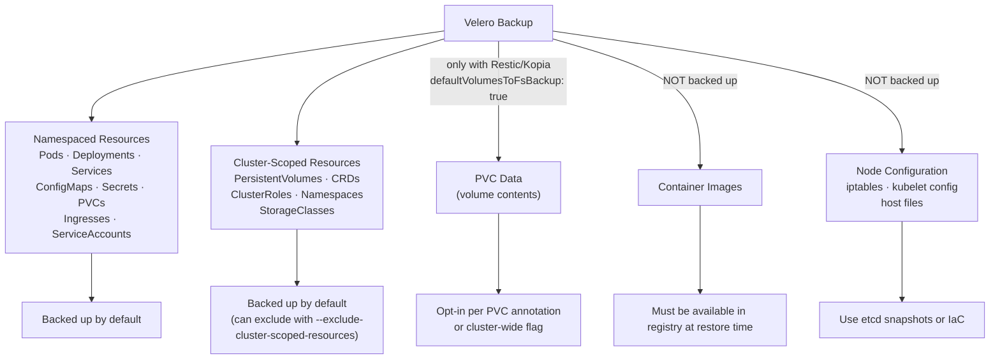
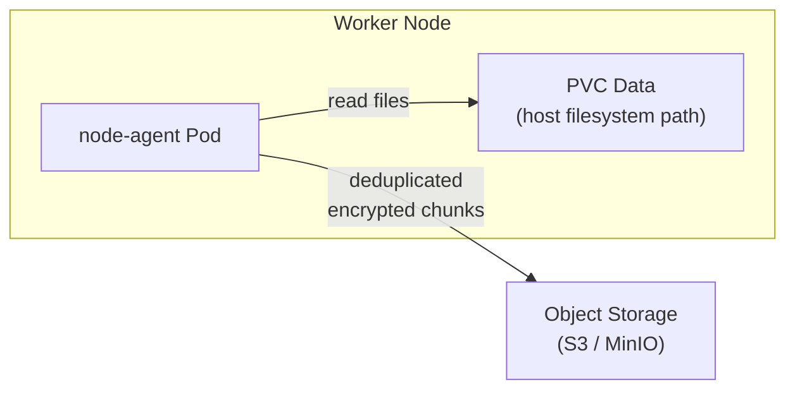
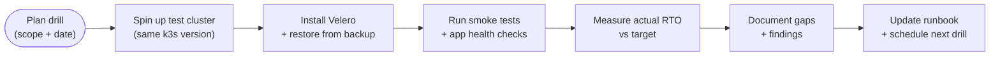

# Velero Backup
> Module 13 · Lesson 02 | [↑ Course Index](../README.md)

[](../README.md)
[](../LICENSE.md)

## Table of Contents
1. [Velero Overview](#velero-overview)
2. [Velero vs etcd Snapshots — When to Use Which](#velero-vs-etcd-snapshots--when-to-use-which)
3. [Velero Architecture](#velero-architecture)
4. [What Does Velero Back Up?](#what-does-velero-back-up)
5. [Installing Velero on k3s](#installing-velero-on-k3s)
6. [Configuring Object Storage — MinIO](#configuring-object-storage--minio)
7. [Configuring a BackupStorageLocation](#configuring-a-backupstoragelocation)
8. [Configuring a VolumeSnapshotLocation](#configuring-a-volumesnapshotlocation)
9. [Restic vs Kopia for PVC Backup](#restic-vs-kopia-for-pvc-backup)
10. [Creating Backups](#creating-backups)
11. [Scheduling Backups](#scheduling-backups)
12. [Backup Verification](#backup-verification)
13. [Restoring from a Velero Backup](#restoring-from-a-velero-backup)
14. [Disaster Recovery Drill Procedure](#disaster-recovery-drill-procedure)
15. [Retention and Storage Costs](#retention-and-storage-costs)

---

## Velero Overview

Velero (formerly Ark, by VMware/Broadcom) is the de-facto open-source tool for Kubernetes backup and
migration. Unlike etcd snapshots — which capture raw cluster state at the datastore level — Velero
operates at the Kubernetes API level and can optionally back up PVC data.

Velero is declarative: backup and restore operations are expressed as Kubernetes Custom Resources
(`Backup`, `Restore`, `Schedule`). This means they are auditable, GitOps-friendly, and can be
automated with standard Kubernetes tooling.

### What Velero Backs Up

| Category | Backed up by Velero | Notes |
|---|---|---|
| Kubernetes API objects | Yes | All namespaced and cluster-scoped resources |
| PVC metadata (PersistentVolumeClaim) | Yes | The claim object, not the data |
| PVC data (volume contents) | Optional | Requires Restic or Kopia file-system backup |
| Container images | No | Images come from registries |
| Node-level configuration | No | Use etcd snapshot or Ansible/Terraform |
| etcd itself | No | Use `k3s etcd-snapshot` for that |

[↑ Back to TOC](#table-of-contents) · [↑ Course Index](../README.md)

---

## Velero vs etcd Snapshots — When to Use Which

This is one of the most common points of confusion for operators new to Kubernetes disaster recovery.
The short answer: **you need both**. They solve different problems.

### The Core Difference

An **etcd snapshot** is a binary dump of the entire Kubernetes datastore. Restoring it replaces
cluster state wholesale — it is like restoring a database backup. It is fast and complete, but it
is all-or-nothing. You cannot use it to restore a single namespace or a deleted ConfigMap without
losing all changes made after the snapshot was taken.

**Velero** works at the Kubernetes API layer. It serialises every resource to JSON, stores it in
object storage, and can restore individual namespaces, resource types, or even single objects. It
can also back up the actual data inside PersistentVolumes using Restic or Kopia.

### Comparison Table

| Use case | Preferred tool | Why |
|---|---|---|
| Full cluster disaster recovery | etcd snapshot | Fastest, most complete cluster-state restore |
| Single namespace or application restore | Velero | Surgical — no cluster downtime required |
| Cross-cluster migration | Velero | etcd snapshots are not portable across clusters |
| PVC data backup | Velero + Restic/Kopia | etcd only stores PVC metadata, not data |
| Pre-upgrade safety net | etcd snapshot (faster) | Milliseconds to snapshot; Velero takes longer |
| Scheduled long-term retention | Velero | Rich TTL, labelling, and multi-destination support |
| Accidental resource deletion | Velero | Restore individual objects without full rollback |
| Botched Helm release | etcd snapshot or Velero | Depends on whether you want a full or partial rollback |

### The Golden Rule

> Run **both**. etcd snapshots protect the cluster control plane. Velero protects application state
> and data. A mature DR strategy uses etcd snapshots hourly and Velero backups daily (or more
> frequently for stateful workloads).

[↑ Back to TOC](#table-of-contents) · [↑ Course Index](../README.md)

---

## Velero Architecture

The following diagram shows how Velero's components interact during both backup and restore
operations.



### Key Components

| Component | Type | Description |
|---|---|---|
| `velero` server | Deployment | Main controller — watches CRs, drives backups/restores |
| `node-agent` | DaemonSet | Runs on each node to access PVC data via Restic or Kopia |
| BackupStorageLocation (BSL) | CRD | Points to an S3-compatible bucket |
| VolumeSnapshotLocation (VSL) | CRD | Points to a CSI or cloud-provider snapshot target |
| Backup | CRD | Defines what to back up and when |
| Restore | CRD | Defines a restore operation from a named backup |
| Schedule | CRD | Cron-driven Backup template |

### Backup Operation Sequence



### Restore Operation Sequence



### Velero Plugins

Velero uses a plugin architecture. Key plugin types:

- **Object store plugin** — handles upload/download to S3, GCS, Azure Blob
- **Volume snapshot plugin** — integrates with CSI, AWS EBS, GCE PD, etc.
- **Backup item action** — transforms resources at backup time (e.g., strip node-specific fields)
- **Restore item action** — transforms resources at restore time

[↑ Back to TOC](#table-of-contents) · [↑ Course Index](../README.md)

---

## What Does Velero Back Up?

Understanding exactly what enters a Velero backup prevents surprises during restore.



### Resource Inclusion and Exclusion Rules

Velero evaluates resources in this priority order:

1. `--include-namespaces` / `--exclude-namespaces` — namespace-level filter
2. `--include-resources` / `--exclude-resources` — resource type filter
3. `--label-selector` — label-based filter
4. Individual resource annotation `backup.velero.io/exclude-from-backup: "true"` — opt-out

A common mistake is forgetting to exclude `events` and `events.events.k8s.io`. These clutter
backups with noise and do not need to be restored.

```yaml
excludedResources:
  - events
  - events.events.k8s.io
```

[↑ Back to TOC](#table-of-contents) · [↑ Course Index](../README.md)

---

## Installing Velero on k3s

### Prerequisites

- `velero` CLI installed on your workstation
- An object storage bucket (S3 / MinIO) accessible from the cluster
- `kubectl` configured to talk to the target cluster
- Helm 3 (for Helm-based install)

### Install the Velero CLI

```bash
# Linux (amd64)
VELERO_VERSION=v1.13.2
curl -fsSL \
  "https://github.com/vmware-tanzu/velero/releases/download/${VELERO_VERSION}/velero-${VELERO_VERSION}-linux-amd64.tar.gz" \
  | tar xz --strip-components=1 -C /usr/local/bin velero-${VELERO_VERSION}-linux-amd64/velero

velero version --client-only
```

### Deploy MinIO First (On-Premises Object Storage)

For on-premises k3s clusters without cloud storage, MinIO is the recommended S3-compatible backend.

```bash
kubectl create namespace minio-system

helm repo add minio https://charts.min.io/
helm repo update

helm install minio minio/minio \
  --namespace minio-system \
  --set rootUser=minioadmin \
  --set rootPassword=minioadmin \
  --set mode=standalone \
  --set persistence.size=50Gi

# Wait for MinIO to be ready
kubectl rollout status deployment/minio -n minio-system

# Create the velero bucket using a one-off job
kubectl run minio-setup --rm -it --restart=Never \
  --image=minio/mc:latest \
  --command -- sh -c \
  "mc alias set local http://minio.minio-system:9000 minioadmin minioadmin && mc mb local/velero-backups"
```

### Install Velero via CLI (Recommended for k3s)

```bash
# Write credentials to a temp file (delete immediately after install)
cat > /tmp/velero-credentials <<'EOF'
[default]
aws_access_key_id=minioadmin
aws_secret_access_key=minioadmin
EOF

velero install \
  --provider aws \
  --plugins velero/velero-plugin-for-aws:v1.9.0 \
  --bucket velero-backups \
  --secret-file /tmp/velero-credentials \
  --backup-location-config \
    region=minio,s3ForcePathStyle=true,s3Url=http://minio.minio-system:9000 \
  --use-node-agent \
  --default-volumes-to-fs-backup

# Remove the credentials file immediately
rm /tmp/velero-credentials
```

The `--use-node-agent` flag deploys the Restic/Kopia DaemonSet. The
`--default-volumes-to-fs-backup` flag enables PVC data backup for all volumes by default.

### Install via Helm (Infrastructure-as-Code)

```bash
helm repo add vmware-tanzu https://vmware-tanzu.github.io/helm-charts
helm repo update

# Create namespace and credentials secret first
kubectl create namespace velero
kubectl create secret generic velero-s3-credentials \
  -n velero \
  --from-literal=cloud="[default]
aws_access_key_id=minioadmin
aws_secret_access_key=minioadmin"

helm install velero vmware-tanzu/velero \
  --namespace velero \
  --values - <<'EOF'
configuration:
  backupStorageLocation:
    - name: default
      provider: aws
      bucket: velero-backups
      config:
        region: minio
        s3ForcePathStyle: "true"
        s3Url: http://minio.minio-system:9000
  volumeSnapshotLocation:
    - name: default
      provider: aws
      config:
        region: minio

credentials:
  useSecret: true
  existingSecret: velero-s3-credentials

deployNodeAgent: true

initContainers:
  - name: velero-plugin-for-aws
    image: velero/velero-plugin-for-aws:v1.9.0
    volumeMounts:
      - mountPath: /target
        name: plugins
EOF
```

### Verify Installation

```bash
kubectl get pods -n velero
# Expected output:
# NAME                      READY   STATUS    RESTARTS   AGE
# velero-xxxx-yyyy          1/1     Running   0          2m
# node-agent-aaaaa          1/1     Running   0          2m  (one per node)

velero backup-location get
# NAME      PROVIDER  BUCKET/PREFIX    PHASE
# default   aws       velero-backups   Available

# If phase shows "Unavailable", check MinIO connectivity:
kubectl logs deploy/velero -n velero | grep -i "backup storage"
```

[↑ Back to TOC](#table-of-contents) · [↑ Course Index](../README.md)

---

## Configuring Object Storage — MinIO

### MinIO — Local S3-Compatible Storage

MinIO provides a production-grade S3-compatible API for on-premises deployments. For multi-node
production clusters, use MinIO in distributed mode or an external MinIO cluster.

```bash
# Standalone MinIO (single node — suitable for dev/small clusters)
helm install minio minio/minio \
  --namespace minio-system \
  --set rootUser=minioadmin \
  --set rootPassword=minioadmin \
  --set mode=standalone \
  --set persistence.size=20Gi

# Distributed MinIO (4 nodes — production grade)
helm install minio minio/minio \
  --namespace minio-system \
  --set mode=distributed \
  --set replicas=4 \
  --set persistence.size=50Gi
```

### AWS S3 Bucket (Production / Cloud)

```bash
# Create bucket (IAM permissions required separately)
aws s3 mb s3://my-cluster-velero-backups --region us-east-1

# Recommended IAM policy (attach to an IAM user or role):
cat <<'EOF'
{
  "Version": "2012-10-17",
  "Statement": [
    {
      "Effect": "Allow",
      "Action": [
        "s3:GetObject", "s3:PutObject", "s3:DeleteObject",
        "s3:ListBucket", "s3:GetBucketLocation"
      ],
      "Resource": [
        "arn:aws:s3:::my-cluster-velero-backups",
        "arn:aws:s3:::my-cluster-velero-backups/*"
      ]
    },
    {
      "Effect": "Allow",
      "Action": ["ec2:CreateSnapshot","ec2:DeleteSnapshot",
                 "ec2:DescribeSnapshots","ec2:CreateTags"],
      "Resource": "*"
    }
  ]
}
EOF
```

[↑ Back to TOC](#table-of-contents) · [↑ Course Index](../README.md)

---

## Configuring a BackupStorageLocation

A `BackupStorageLocation` (BSL) tells Velero where to store backup files — the serialised Kubernetes
manifests and metadata. You can define multiple BSLs for redundancy (primary + offsite).

```yaml
# backupstoragelocation-minio.yaml
apiVersion: velero.io/v1
kind: BackupStorageLocation
metadata:
  name: default          # "default" BSL is used when no --storage-location is specified
  namespace: velero
spec:
  provider: aws           # Plugin name — "aws" covers S3 and all S3-compatible APIs
  objectStorage:
    bucket: velero-backups      # Bucket name (must already exist)
    prefix: prod-cluster/       # Optional path prefix — useful when sharing a bucket
  config:
    region: minio               # Set to "minio" for MinIO; use actual region for AWS S3
    s3ForcePathStyle: "true"    # Required for MinIO (path-style URLs like http://host/bucket)
    s3Url: http://minio.minio-system:9000   # Override S3 endpoint (MinIO only; omit for AWS)
  accessMode: ReadWrite         # ReadWrite = backup+restore; ReadOnly = restore-only
  # credential:                 # Optional: reference a specific Secret for credentials
  #   name: my-backup-credentials
  #   key: cloud
```

```bash
# Apply and verify
kubectl apply -f backupstoragelocation-minio.yaml

velero backup-location get
# NAME      PROVIDER  BUCKET/PREFIX                PHASE
# default   aws       velero-backups/prod-cluster  Available

# If phase is Unavailable, describe the BSL for error details:
kubectl describe backupstoragelocation default -n velero
```

### Multi-Location Setup (Primary + Offsite)

```yaml
# Secondary BSL pointing to a different region or provider
apiVersion: velero.io/v1
kind: BackupStorageLocation
metadata:
  name: offsite
  namespace: velero
spec:
  provider: aws
  objectStorage:
    bucket: my-cluster-velero-dr
    prefix: prod-cluster/
  config:
    region: eu-west-1
  accessMode: ReadWrite
```

```bash
# Use the offsite location for critical backups
velero backup create critical-app-offsite \
  --include-namespaces critical-app \
  --storage-location offsite
```

[↑ Back to TOC](#table-of-contents) · [↑ Course Index](../README.md)

---

## Configuring a VolumeSnapshotLocation

A `VolumeSnapshotLocation` (VSL) is used when taking CSI or cloud-provider volume snapshots. This is
**separate** from Restic/Kopia file-level backups: VSL is for snapshot-based volume backups, which
are faster and crash-consistent but require CSI snapshot support.

```yaml
# volumesnapshotlocation-aws.yaml
apiVersion: velero.io/v1
kind: VolumeSnapshotLocation
metadata:
  name: default
  namespace: velero
spec:
  provider: aws
  config:
    region: us-east-1
```

For on-premises k3s with local-path-provisioner, CSI snapshots are typically not available. Use
Restic/Kopia (file-level) backups instead. If you are using Longhorn or another CSI-capable storage
driver, follow the CSI snapshot documentation for your storage provider.

```bash
# Check if CSI snapshot CRDs are installed
kubectl get crd | grep volumesnapshot
# volumesnapshotclasses.snapshot.storage.k8s.io
# volumesnapshotcontents.snapshot.storage.k8s.io
# volumesnapshots.snapshot.storage.k8s.io
```

[↑ Back to TOC](#table-of-contents) · [↑ Course Index](../README.md)

---

## Restic vs Kopia for PVC Backup

By default, Velero does not back up the actual data inside PersistentVolumes. To back up PVC
contents, Velero integrates with **Restic** (legacy) or **Kopia** (current default from Velero
1.12+). Both are open-source, deduplicating file-system backup tools.

### How File-Level Backup Works

The `node-agent` DaemonSet runs on each worker node. When a backup includes
`defaultVolumesToFsBackup: true`, the node agent:

1. Identifies pods using PVCs in the target namespaces
2. Mounts the volume and performs a file-system-level read
3. Deduplicates blocks and uploads chunks to the object store bucket



### Restic vs Kopia Comparison

| Feature | Restic (legacy) | Kopia (current) |
|---|---|---|
| Status in Velero 1.12+ | Deprecated (still works) | Default |
| Performance | Slower (single-threaded) | Faster (parallel uploads) |
| Deduplication | Block-level | Block-level |
| Encryption | Yes (AES-256) | Yes (AES-256) |
| Repository format | Restic repo in bucket | Kopia repo in bucket |
| Memory usage | Lower | Slightly higher |
| Recommendation | Migrate to Kopia | Use this |

### Enabling Kopia (Default in Velero 1.12+)

Kopia is enabled automatically when you install Velero with `--use-node-agent`. To verify:

```bash
# Check the node-agent uploader type
kubectl get daemonset node-agent -n velero -o jsonpath='{.spec.template.spec.containers[0].args}' \
  | tr ',' '\n' | grep uploader
# Should show: --uploader-type=kopia
```

To explicitly switch from Restic to Kopia on an existing install:

```bash
kubectl set env daemonset/node-agent \
  -n velero \
  UPLOADER_TYPE=kopia
```

### Opting In Per Volume

```yaml
# Annotate a pod to back up specific volumes
apiVersion: v1
kind: Pod
metadata:
  name: my-app-pod
  namespace: my-app
  annotations:
    backup.velero.io/backup-volumes: my-data,config-vol
spec:
  containers:
    - name: app
      volumeMounts:
        - name: my-data
          mountPath: /data
        - name: config-vol
          mountPath: /config
  volumes:
    - name: my-data
      persistentVolumeClaim:
        claimName: my-data
    - name: config-vol
      configMap:
        name: my-config
```

Or opt out specific volumes from a cluster-wide backup:

```yaml
metadata:
  annotations:
    backup.velero.io/backup-volumes-excludes: cache-vol,tmp-vol
```

[↑ Back to TOC](#table-of-contents) · [↑ Course Index](../README.md)

---

## Creating Backups

### Ad-Hoc Backup via CLI

```bash
# Backup a single namespace
velero backup create my-app-backup --include-namespaces my-app

# Backup all namespaces except system ones
velero backup create full-cluster \
  --exclude-namespaces kube-system,kube-public,velero

# Backup with label selector
velero backup create tagged-backup \
  --selector app=my-api

# Include PVC data (Restic/Kopia file backup)
velero backup create my-app-with-data \
  --include-namespaces my-app \
  --default-volumes-to-fs-backup

# Backup to a specific storage location
velero backup create my-app-offsite \
  --include-namespaces my-app \
  --storage-location secondary
```

### Backup Resource via YAML

Declarative backups are preferred for production — they are auditable and can be stored in Git.

```yaml
# my-app-backup.yaml
apiVersion: velero.io/v1
kind: Backup
metadata:
  name: my-app-backup
  namespace: velero
spec:
  # Scope
  includedNamespaces:
    - my-app
    - my-app-config
  excludedResources:
    - events
    - events.events.k8s.io
  # Label selector (optional — backs up matching resources only)
  labelSelector:
    matchLabels:
      backup: "true"
  # Storage
  storageLocation: default
  # Retention
  ttl: 720h   # 30 days
  # Volume backup method
  defaultVolumesToFsBackup: true
  # Hooks — run commands in pods before/after backup
  hooks:
    resources:
      - name: database-quiesce
        includedNamespaces:
          - my-app
        labelSelector:
          matchLabels:
            app: postgres
        pre:
          - exec:
              container: postgres
              command:
                - /bin/bash
                - -c
                - psql -U postgres -c "CHECKPOINT;"
              onError: Fail
              timeout: 30s
        post:
          - exec:
              container: postgres
              command:
                - /bin/bash
                - -c
                - echo "backup hook complete"
              onError: Continue
              timeout: 10s
```

```bash
kubectl apply -f my-app-backup.yaml
velero backup get
velero backup describe my-app-backup --details
velero backup logs my-app-backup
```

### Backup Hooks

Backup hooks let you quiesce databases or flush caches before the backup runs. This is critical for
data consistency. The `pre` hook runs before the volume snapshot; `post` runs after.

Common use cases:
- **PostgreSQL**: run `CHECKPOINT` or `pg_start_backup()`
- **MySQL/MariaDB**: run `FLUSH TABLES WITH READ LOCK`
- **Redis**: trigger `BGSAVE`

```yaml
# Hook to flush Redis before backup
hooks:
  resources:
    - name: redis-flush
      includedNamespaces:
        - my-app
      labelSelector:
        matchLabels:
          app: redis
      pre:
        - exec:
            container: redis
            command: ["/bin/sh", "-c", "redis-cli BGSAVE"]
            onError: Fail
            timeout: 30s
```

[↑ Back to TOC](#table-of-contents) · [↑ Course Index](../README.md)

---

## Scheduling Backups

Use `Schedule` resources to run backups automatically on a cron schedule.

```yaml
# daily-full-backup.yaml
apiVersion: velero.io/v1
kind: Schedule
metadata:
  name: daily-full-backup
  namespace: velero
spec:
  schedule: "0 2 * * *"   # 02:00 UTC daily
  paused: false            # Set to true to temporarily disable
  useOwnerReferencesInBackup: false
  template:
    includedNamespaces:
      - "*"
    excludedNamespaces:
      - kube-system
      - kube-public
      - velero
    excludedResources:
      - events
      - events.events.k8s.io
    storageLocation: default
    ttl: 168h              # 7-day retention
    defaultVolumesToFsBackup: true
    # Optional: also send to offsite
    # storageLocation: offsite
```

```bash
kubectl apply -f daily-schedule.yaml

# Monitor scheduled backups
velero schedule get

# See backups created by a schedule (name prefix matches schedule name)
velero backup get | grep daily-full-backup

# Manually trigger a schedule immediately
velero backup create --from-schedule daily-full-backup

# Pause a schedule without deleting it
kubectl patch schedule daily-full-backup -n velero \
  --type=merge --patch '{"spec":{"paused":true}}'
```

### Recommended Schedule Strategy

| Schedule | Scope | Retention | Notes |
|---|---|---|---|
| Hourly | Stateful namespaces only | 24 hours | Minimize RPO for databases |
| Daily | All application namespaces | 7 days | Standard full backup |
| Weekly | All namespaces (including cluster-scoped) | 90 days | Long-term retention |

[↑ Back to TOC](#table-of-contents) · [↑ Course Index](../README.md)

---

## Backup Verification

A backup that has never been verified is a backup of unknown quality. Always verify backups after
creation, and run periodic restore drills.

### Checking Backup Status

```bash
# List all backups with their phase
velero backup get
# NAME              STATUS      ERRORS   WARNINGS   CREATED                         EXPIRES   ...
# my-app-backup     Completed   0        0          2026-03-25 02:00:03 +0000 UTC   29d       ...

# Detailed view of a specific backup
velero backup describe my-app-backup --details

# Sample output to check:
# Phase:         Completed
# Errors:        0
# Warnings:      0
# Namespaces:
#   Included:    my-app
# ...
# Volume Backups:
#   my-app/my-app-pod/my-data:
#     Phase:            Completed
#     Storage Location: default
```

### Reading Backup Logs

```bash
# Full backup log (useful for diagnosing partial failures)
velero backup logs my-app-backup

# Filter for errors and warnings only
velero backup logs my-app-backup | grep -E "level=error|level=warning"

# Watch a backup in progress
velero backup describe my-app-backup --details --watch
```

### Verifying Backup Contents in Object Storage

```bash
# List what Velero wrote to the bucket (using MinIO client)
kubectl run mc --rm -it --restart=Never --image=minio/mc:latest -- \
  sh -c "mc alias set local http://minio.minio-system:9000 minioadmin minioadmin && \
         mc ls local/velero-backups/prod-cluster/backups/my-app-backup/"

# Expected files:
# my-app-backup-csi-volumesnapshots.json.gz
# my-app-backup-logs.gz
# my-app-backup-podvolumebackups.json.gz
# my-app-backup-resource-list.json.gz
# my-app-backup-volumeinfo.json.gz
# my-app-backup.tar.gz       <- serialised Kubernetes manifests
```

### Automated Backup Health Check

```bash
#!/bin/bash
# check-velero-backups.sh — run in CI or as a CronJob

BACKUP=$(velero backup get --output json | \
  jq -r '.items | sort_by(.metadata.creationTimestamp) | last | .metadata.name')

PHASE=$(velero backup describe "$BACKUP" --output json | jq -r '.status.phase')
ERRORS=$(velero backup describe "$BACKUP" --output json | jq -r '.status.errors')

if [ "$PHASE" != "Completed" ] || [ "$ERRORS" != "0" ]; then
  echo "ALERT: Latest backup $BACKUP is in phase $PHASE with $ERRORS errors"
  exit 1
fi

echo "OK: Latest backup $BACKUP completed successfully"
```

[↑ Back to TOC](#table-of-contents) · [↑ Course Index](../README.md)

---

## Restoring from a Velero Backup

### Full Restore via CLI

```bash
# List available backups
velero backup get

# Restore an entire backup (all included namespaces)
velero restore create --from-backup my-app-backup

# Give the restore a specific name
velero restore create my-app-restore-20260325 \
  --from-backup my-app-backup

# Monitor restore progress
velero restore describe my-app-restore-20260325 --details

# Check final status (should be "Completed")
velero restore get

# View restore logs
velero restore logs my-app-restore-20260325
```

### Selective Restore

```bash
# Restore only specific namespaces from a backup
velero restore create partial-restore \
  --from-backup full-cluster \
  --include-namespaces my-app

# Restore a single resource type across all namespaces
velero restore create secrets-only \
  --from-backup my-app-backup \
  --include-resources secrets

# Restore a single ConfigMap by label
velero restore create single-cm \
  --from-backup full-cluster \
  --include-resources configmaps \
  --include-namespaces my-app \
  --selector "app=my-api"
```

### Namespace Mapping (Restore to a Different Namespace)

Namespace mapping is invaluable for migrations, testing restores, or recovering from accidental
deletion without overwriting a running namespace.

```bash
# Restore my-app into my-app-restored (new namespace)
velero restore create ns-migration \
  --from-backup my-app-backup \
  --namespace-mappings my-app:my-app-restored

# The new namespace is created automatically
kubectl get all -n my-app-restored
```

### Restore Resource via YAML

```yaml
# my-app-restore.yaml
apiVersion: velero.io/v1
kind: Restore
metadata:
  name: my-app-restore
  namespace: velero
spec:
  backupName: my-app-backup
  includedNamespaces:
    - my-app
  excludedResources:
    - nodes
    - events
    - persistentvolumes     # Re-provision volumes dynamically
  restorePVs: true
  # Namespace mapping (optional)
  namespaceMapping:
    my-app: my-app-restored
  # Existing resource policy: none (skip), update (overwrite)
  existingResourcePolicy: none
```

### Restore to a Fresh Cluster (Total Loss Scenario)

```bash
# 1. Install Velero on the new cluster, pointing to the same object store
velero install \
  --provider aws \
  --plugins velero/velero-plugin-for-aws:v1.9.0 \
  --bucket velero-backups \
  --secret-file /tmp/velero-credentials \
  --backup-location-config region=minio,s3ForcePathStyle=true,s3Url=http://minio.new-cluster:9000 \
  --use-node-agent

# 2. Wait for Velero to sync the backup inventory from the bucket
# Velero discovers existing backups automatically from the BSL
sleep 60
velero backup get

# 3. Restore the most recent backup
velero restore create from-old-cluster \
  --from-backup full-cluster-backup-20260301
```

[↑ Back to TOC](#table-of-contents) · [↑ Course Index](../README.md)

---

## Disaster Recovery Drill Procedure

> **A backup that has never been tested is a backup of unknown quality.**
>
> Run DR drills at least quarterly to validate your restore procedures and measure actual RTO.

### Drill Process



### Step-by-Step DR Drill

```bash
# Step 1: Provision an isolated test cluster
# Use the same k3s version as production to ensure compatibility
K3S_VERSION=v1.29.2+k3s1
curl -sfL https://get.k3s.io | INSTALL_K3S_VERSION="${K3S_VERSION}" sh -

# Step 2: Install Velero pointing at the production backup bucket (read-only is safe)
velero install \
  --provider aws \
  --plugins velero/velero-plugin-for-aws:v1.9.0 \
  --bucket velero-backups \
  --secret-file /tmp/velero-credentials \
  --backup-location-config region=minio,s3ForcePathStyle=true,s3Url=http://minio.prod:9000 \
  --use-node-agent

# Step 3: Wait for backup inventory to sync
sleep 60
velero backup get

# Step 4: Start the clock — record restore start time
RESTORE_START=$(date +%s)

# Step 5: Perform the restore
velero restore create drill-$(date +%Y%m%d) \
  --from-backup full-cluster-backup-20260301

# Step 6: Wait for completion
velero restore describe drill-$(date +%Y%m%d) --watch

# Step 7: Run smoke tests
kubectl get pods -A
kubectl get pvc -A

# Step 8: Record end time and calculate RTO
RESTORE_END=$(date +%s)
echo "RTO: $(( (RESTORE_END - RESTORE_START) / 60 )) minutes"

# Step 9: Tear down the test cluster
sudo systemctl stop k3s
sudo /usr/local/bin/k3s-uninstall.sh
```

### Drill Documentation Template

```markdown
## DR Drill Report — YYYY-MM-DD

**Operator:** <name>
**k3s version:** v1.29.x
**Backup used:** full-cluster-backup-YYYYMMDD
**Backup age at drill time:** X hours

### Results
| Step | Duration | Pass/Fail | Notes |
|------|----------|-----------|-------|
| Cluster provision | | | |
| Velero install | | | |
| Backup sync | | | |
| Restore execution | | | |
| Smoke tests | | | |
| **Total RTO** | | | |

### Gaps Found
- (list any issues or missing steps)

### Runbook Updates Required
- (list required changes)
```

[↑ Back to TOC](#table-of-contents) · [↑ Course Index](../README.md)

---

## Retention and Storage Costs

### TTL — Backup Retention

Every Velero `Backup` and `Schedule` has a `ttl` (time-to-live) field. When a backup expires,
Velero automatically deletes the backup object, associated metadata files in the bucket, and any
associated Kopia/Restic repository snapshots.

```yaml
spec:
  ttl: 168h   # 7 days (default: 720h = 30 days)
```

```bash
# Manually delete a backup (and its object storage data)
velero backup delete my-old-backup

# Delete multiple backups matching a label
velero backup delete --selector environment=staging

# Confirm deletion
velero backup get
```

> **Important:** Deleting a `Backup` CR without using the Velero CLI will leave orphaned data in
> the object store bucket. Always use `velero backup delete` or `kubectl delete backup` (which
> triggers the Velero finalizer that cleans up storage).

### Estimating Storage Requirements

Backup storage size depends on:

| Factor | Impact |
|---|---|
| Number of resource manifests | Low (compressed JSON, typically < 50 MB per backup) |
| PVC data size | High (proportional to total PVC usage) |
| Deduplication ratio | Reduces storage; typically 2–5× for databases |
| Retention window | Multiplied by number of backups kept |
| Change rate (incremental) | Kopia/Restic only upload new/changed blocks |

**Rough sizing formula:**

```
First backup size = PVC total data / dedup_ratio + manifest_overhead
Subsequent backups = daily_change_rate / dedup_ratio
Total storage = first_backup + (retention_days - 1) × incremental_size
```

**Example for a 100 GB cluster (50 GB PVC data, 5 GB/day change rate, 30-day retention):**

```
First backup:     50 GB / 3 (dedup)   = ~17 GB
Daily incremental: 5 GB / 3           = ~1.7 GB
30-day total:     17 + (29 × 1.7)    = ~66 GB
```

### Storage Cost Optimisation

```bash
# Use lifecycle policies in S3 to move old backups to cheaper storage tiers
# (Velero TTL + S3 lifecycle work together)

# Example AWS S3 lifecycle policy (set via AWS CLI or Terraform):
# - Move to S3-IA after 7 days
# - Move to Glacier after 30 days
# - Delete after 90 days

# For MinIO: use bucket lifecycle rules
kubectl run mc --rm -it --restart=Never --image=minio/mc:latest -- \
  sh -c 'mc alias set local http://minio.minio-system:9000 minioadmin minioadmin && \
         mc ilm add --expiry-days 90 local/velero-backups'
```

### Best Practices Summary

| Practice | Why |
|---|---|
| Set `ttl` on all backups and schedules | Prevent unbounded storage growth |
| Exclude `events` and ephemeral resources | Reduce backup size; they do not need restoration |
| Use backup hooks for databases | Ensure data consistency |
| Store credentials in Kubernetes Secrets, not files | Prevent credential leakage |
| Test restores quarterly (DR drills) | Validate backup integrity |
| Use multiple BSLs for critical clusters | Avoid single point of failure in storage |
| Monitor backup status in your alerting stack | Catch silent backup failures |

[↑ Back to TOC](#table-of-contents) · [↑ Course Index](../README.md)

---

*Licensed under [CC BY-NC-SA 4.0](../LICENSE.md) · © 2026 UncleJS*
