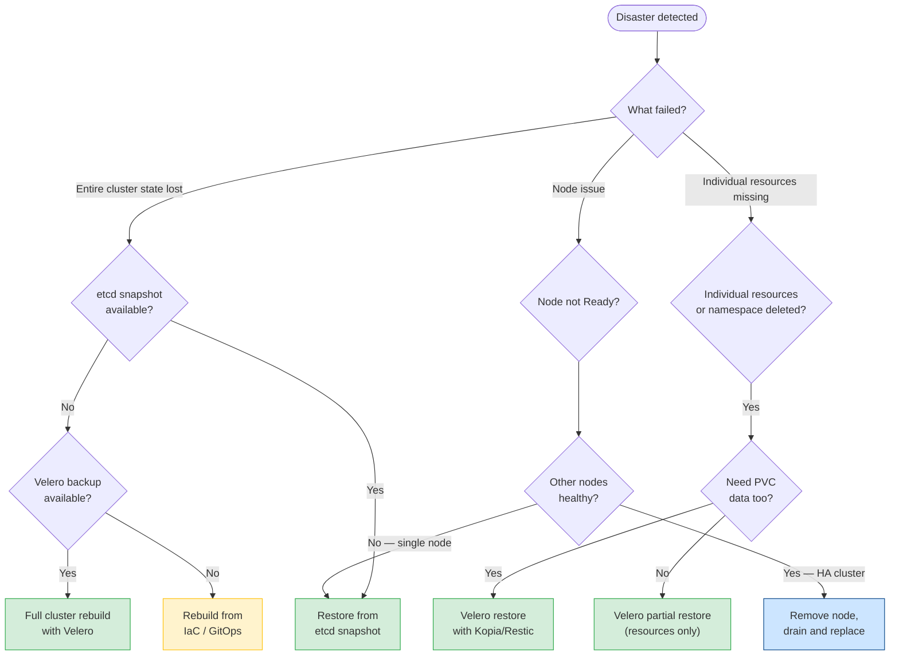
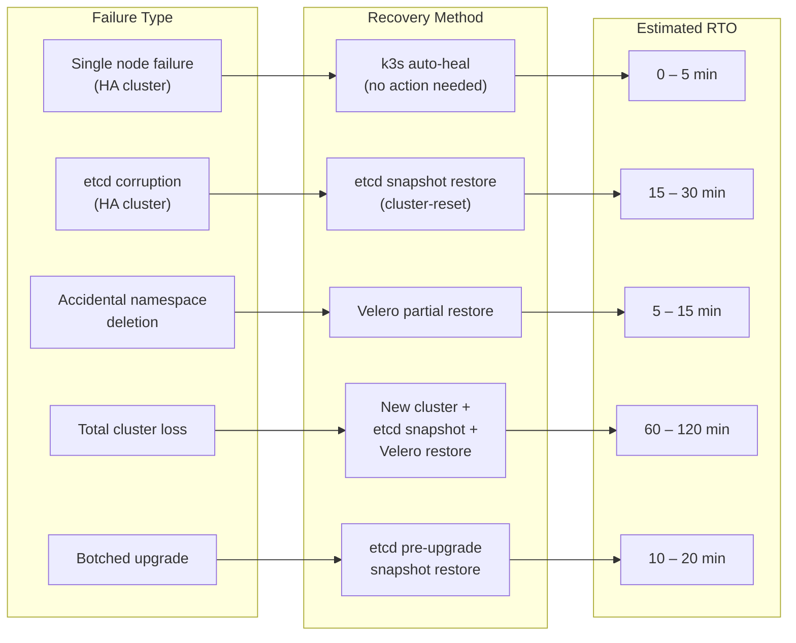
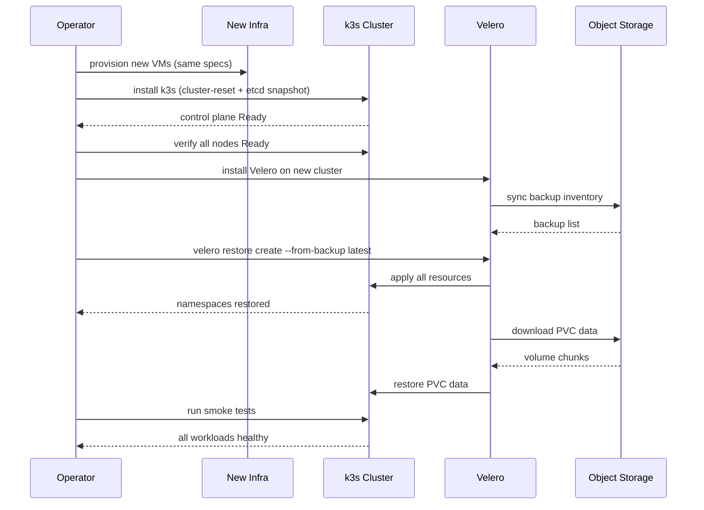
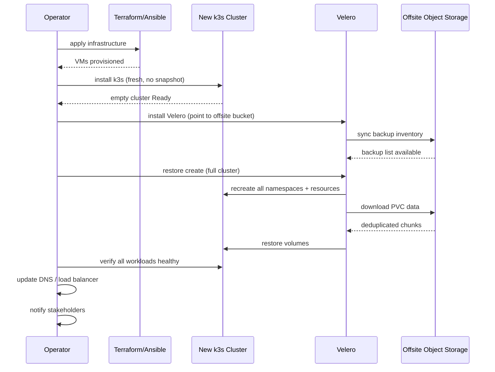
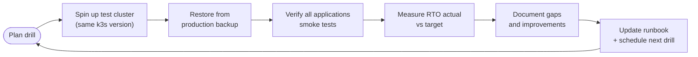

# Cluster Restore
> Module 13 · Lesson 03 | [↑ Course Index](../README.md)

[](../README.md)
[](../LICENSE.md)

## Table of Contents
1. [Disaster Recovery Scenarios](#disaster-recovery-scenarios)
2. [Choosing Your Restore Method](#choosing-your-restore-method)
3. [Recovery Time Objectives](#recovery-time-objectives)
4. [Pre-Restore Checklist](#pre-restore-checklist)
5. [Restoring from an etcd Snapshot](#restoring-from-an-etcd-snapshot)
6. [Restoring with Velero](#restoring-with-velero)
7. [Partial Restores](#partial-restores)
8. [Recovery Scenarios — Runbooks](#recovery-scenarios--runbooks)
9. [Full Cluster Rebuild from Scratch](#full-cluster-rebuild-from-scratch)
10. [Verifying Restore Success](#verifying-restore-success)
11. [Post-Restore Verification Checklist](#post-restore-verification-checklist)
12. [Testing Your Backups — DR Drills](#testing-your-backups--dr-drills)
13. [Runbook Template](#runbook-template)

---

## Disaster Recovery Scenarios

Understanding the scenario determines which recovery tool to use and how long recovery will take.
Misidentifying the scenario is the most common DR mistake — it leads to using the wrong tool and
making the situation worse.

| Scenario | Description | Primary Tool | Secondary Tool |
|---|---|---|---|
| **Node failure** | One server node crashes/lost, HA cluster intact | k3s HA self-heals | etcd snapshot if quorum lost |
| **Data corruption** | etcd data corrupted on disk | etcd snapshot | Velero |
| **Accidental deletion** | Namespace/resource deleted by mistake | Velero | etcd snapshot |
| **Ransomware / full cluster loss** | All nodes unrecoverable | etcd snapshot + Velero | Infrastructure rebuild |
| **Botched upgrade** | Upgrade broke cluster state | etcd snapshot (pre-upgrade) | Velero |
| **Secret / ConfigMap wipe** | Sensitive resources deleted | Velero | etcd snapshot |
| **Total storage loss** | etcd corrupt AND no snapshots | Rebuild from IaC + Velero | Minimal if any |

### Restore Decision Tree



[↑ Back to TOC](#table-of-contents) · [↑ Course Index](../README.md)

---

## Recovery Time Objectives

Before a disaster strikes, define your Recovery Time Objective (RTO) and Recovery Point Objective
(RPO) for each failure type. These inform your backup frequency and topology choices.



### RPO Targets by Workload Type

| Workload | Recommended Backup Frequency | RPO Target |
|---|---|---|
| Stateless applications | Daily (Velero) | 24 hours |
| Stateful apps with databases | Hourly (Velero + etcd snapshots) | 1 hour |
| Critical financial / compliance data | Every 15 min (etcd) + hourly (Velero) | 15 minutes |
| Development clusters | Daily or manual | Best effort |

[↑ Back to TOC](#table-of-contents) · [↑ Course Index](../README.md)

---

## Pre-Restore Checklist

**Stop and verify these items before issuing any restore command.** Skipping this step has caused
operators to restore to the wrong snapshot, overwrite a healthy cluster, or restore to an
incompatible k3s version.

```
PRE-RESTORE VERIFICATION
Date/Time: _______________   Operator: _______________

SNAPSHOT / BACKUP SELECTION
[ ] Correct snapshot name confirmed (not the broken-state snapshot)
[ ] Snapshot timestamp verified against the incident timeline
[ ] Snapshot age is within acceptable RPO window
[ ] k3s version matches between snapshot and current binaries

CREDENTIALS AND ACCESS
[ ] K3S_TOKEN available and confirmed (stored in secrets manager)
[ ] SSH access to all server nodes confirmed
[ ] Object storage (S3/MinIO) credentials available (for S3 snapshots)
[ ] kubectl access to the cluster (or fallback to k3s kubectl on node)

COMMUNICATIONS
[ ] Incident declared — stakeholders notified
[ ] Maintenance window opened (if applicable)
[ ] No active deployments in progress

SAFETY SNAPSHOT
[ ] Fresh snapshot of current (broken) state taken — for forensics
    sudo k3s etcd-snapshot save --name pre-restore-forensics-$(date +%Y%m%d%H%M%S)
[ ] All k3s server processes stopped
    sudo systemctl stop k3s  # on all server nodes
```

[↑ Back to TOC](#table-of-contents) · [↑ Course Index](../README.md)

---

## Restoring from an etcd Snapshot

This procedure covers the complete end-to-end restore for an HA cluster (3 server nodes). For a
single-node SQLite cluster, refer to `01_etcd_snapshots.md` § SQLite Restore.

> **STOP.** Before proceeding:
> - Notify all team members. No one should be deploying while a restore is in progress.
> - Confirm you have the correct snapshot name/path.
> - Confirm you have the cluster token (`K3S_TOKEN`).
> - Take a fresh snapshot of the current (broken) state if possible — you may need it for forensics.

### Phase 1 — Assess and Prepare

```bash
# Identify the available snapshots
sudo k3s etcd-snapshot list

# Or list from S3
sudo k3s etcd-snapshot list --s3 --s3-bucket my-k3s-backups

# Note the snapshot name you want to restore, e.g.:
# etcd-snapshot-20260301-060000
```

### Phase 2 — Stop All Server Nodes

Perform this on **every** server node simultaneously (or in quick succession).

```bash
# Server node 1 (and 2, 3...)
sudo systemctl stop k3s

# Confirm the process is gone
ps aux | grep k3s
```

### Phase 3 — Restore on the First Server Node

Choose the node that currently holds the snapshot file, or any node if restoring from S3.

```bash
# --- LOCAL SNAPSHOT ---
sudo k3s server \
  --cluster-reset \
  --cluster-reset-restore-path=/var/lib/rancher/k3s/server/db/snapshots/etcd-snapshot-20260301-060000

# --- S3 SNAPSHOT ---
sudo k3s server \
  --cluster-reset \
  --cluster-reset-restore-path=etcd-snapshot-20260301-060000 \
  --etcd-s3 \
  --etcd-s3-bucket=my-k3s-backups \
  --etcd-s3-region=us-east-1 \
  --etcd-s3-access-key="${AWS_ACCESS_KEY_ID}" \
  --etcd-s3-secret-key="${AWS_SECRET_ACCESS_KEY}"
```

The command exits after printing:
```
WARN[...] Cluster reset successful. To rejoin nodes, delete their data directories and restart.
```

### Phase 4 — Start the Restored Server

```bash
# On the restore node only
sudo systemctl start k3s

# Wait for it to be healthy (may take 60–90s)
watch sudo k3s kubectl get nodes

# Expected output:
# NAME       STATUS   ROLES                  AGE
# server-1   Ready    control-plane,master   2m
```

### Phase 5 — Re-join Remaining Server Nodes

Perform the following **one node at a time**. Do not proceed to the next node until the current one
shows `Ready`.

```bash
# On server-2 (repeat for server-3):
sudo rm -rf /var/lib/rancher/k3s/server/db/
sudo systemctl start k3s

# Watch from server-1 until this node appears:
watch sudo k3s kubectl get nodes
```

### Phase 6 — Re-join Agent Nodes

```bash
# On each agent node:
sudo systemctl restart k3s-agent
```

Agents do not hold etcd data, so no data directory removal is needed.

### Phase 7 — Verify

```bash
# All nodes Ready
sudo k3s kubectl get nodes -o wide

# System pods running
sudo k3s kubectl get pods -n kube-system

# Application pods restoring
sudo k3s kubectl get pods -A

# Cluster-info
sudo k3s kubectl cluster-info
```

[↑ Back to TOC](#table-of-contents) · [↑ Course Index](../README.md)

---

## Restoring with Velero

### Full-Cluster Restore

```bash
# List available backups
velero backup get

# Restore everything (creates all namespaced resources)
velero restore create full-restore-$(date +%Y%m%d) \
  --from-backup full-cluster-backup-20260301

# Monitor progress
velero restore describe full-restore-20260301 --details
velero restore logs full-restore-20260301

# Check final status (should be "Completed")
velero restore get
```

### Restore to a Fresh Cluster

If restoring to a brand-new cluster after total loss:

```bash
# 1. Install Velero on the new cluster, pointing to the same object store:
velero install \
  --provider aws \
  --plugins velero/velero-plugin-for-aws:v1.9.0 \
  --bucket velero-backups \
  --secret-file /tmp/velero-credentials \
  --backup-location-config region=minio,s3ForcePathStyle=true,s3Url=http://minio.new-cluster:9000 \
  --use-node-agent

# 2. Wait for Velero to sync the backup inventory from the bucket
# (Velero discovers existing backups automatically from the BSL)
sleep 60
velero backup get

# 3. Restore
velero restore create from-old-cluster \
  --from-backup full-cluster-backup-20260301
```

[↑ Back to TOC](#table-of-contents) · [↑ Course Index](../README.md)

---

## Partial Restores

### Restore a Single Namespace

```bash
velero restore create ns-restore \
  --from-backup full-cluster-backup-20260301 \
  --include-namespaces my-deleted-app

kubectl get all -n my-deleted-app
```

### Restore a Single Resource Type

```bash
# Restore only Secrets across all namespaces
velero restore create secrets-restore \
  --from-backup full-cluster-backup-20260301 \
  --include-resources secrets \
  --include-namespaces "*"

# Restore only a single named resource
velero restore create single-cm \
  --from-backup full-cluster-backup-20260301 \
  --include-resources configmaps \
  --include-namespaces my-app \
  --selector "app=my-api"
```

### Namespace Mapping (Restore to Different Namespace)

```bash
# Restore my-app into my-app-restored (must not exist yet, or use --existing-resource-policy)
velero restore create app-migration \
  --from-backup full-cluster-backup-20260301 \
  --include-namespaces my-app \
  --namespace-mappings my-app:my-app-restored
```

[↑ Back to TOC](#table-of-contents) · [↑ Course Index](../README.md)

---

## Recovery Scenarios — Runbooks

The following four runbooks cover the most common real-world DR scenarios. Each one is self-contained
and can be copied into your team's incident management system.

### Scenario 1 — Single Server Crash (SQLite / Single-Node)

**Symptoms:** Control plane unreachable; `kubectl` returns connection refused;
`sudo systemctl status k3s` shows the service stopped or failed.

```bash
# 1. SSH to the server node
ssh admin@k3s-server-1

# 2. Check service status and recent logs
sudo systemctl status k3s
sudo journalctl -u k3s -n 50

# 3. Attempt a simple restart (if this is transient)
sudo systemctl restart k3s
sleep 30
sudo k3s kubectl get nodes

# 4. If the service still fails, check for SQLite corruption:
sudo sqlite3 /var/lib/rancher/k3s/server/db/state.db "PRAGMA integrity_check;"
# If output is anything other than "ok", the database is corrupt — proceed to restore

# 5. List available snapshots
sudo k3s etcd-snapshot list

# 6. Stop k3s and restore from the most recent snapshot
sudo systemctl stop k3s
sudo k3s server \
  --cluster-reset \
  --cluster-reset-restore-path=/var/lib/rancher/k3s/server/db/snapshots/<LATEST_SNAPSHOT>

# 7. Restart k3s
sudo systemctl start k3s
watch sudo k3s kubectl get nodes

# 8. Restart agents
# (On each agent node)
sudo systemctl restart k3s-agent
```

---

### Scenario 2 — etcd Leader Failure in HA Cluster

**Symptoms:** One server node is down; `kubectl get nodes` shows one node `NotReady`; cluster is
still functional because the other two nodes have quorum.

```bash
# Step 1: Verify the cluster still has quorum (2 of 3 nodes up)
kubectl get nodes
# server-1   Ready    control-plane   <age>
# server-2   NotReady control-plane   <age>   <- failed node
# server-3   Ready    control-plane   <age>

# Step 2: Drain the failed node (if it is still visible)
kubectl drain server-2 --ignore-daemonsets --delete-emptydir-data --timeout=60s

# Step 3: Delete the node from the cluster
kubectl delete node server-2

# Step 4: On the failed node — stop k3s and remove etcd data
# (This resets the node so it can rejoin cleanly)
sudo systemctl stop k3s
sudo rm -rf /var/lib/rancher/k3s/server/db/

# Step 5: Restart k3s on the failed node
# It will rejoin the cluster and sync etcd data from the healthy nodes
sudo systemctl start k3s

# Step 6: Monitor from a healthy node
watch kubectl get nodes
# All three nodes should reach Ready state within 2–5 minutes
```

If the node is physically lost (hardware failure), provision a new VM with the same hostname or
update the k3s server configuration, then follow steps 4–6 on the new node.

---

### Scenario 3 — Accidental Namespace Deletion

**Symptoms:** A namespace is missing; applications in that namespace are gone; the incident was
caused by a mistaken `kubectl delete namespace`.

```bash
# Step 1: Confirm the namespace is gone
kubectl get namespace my-app
# Error from server (NotFound): namespaces "my-app" not found

# Step 2: List available Velero backups
velero backup get

# Step 3: Restore only the deleted namespace from the most recent backup
velero restore create recover-my-app-$(date +%Y%m%d%H%M) \
  --from-backup full-cluster-backup-20260325 \
  --include-namespaces my-app

# Step 4: Monitor the restore
velero restore describe recover-my-app-$(date +%Y%m%d%H%M) --watch

# Step 5: Verify the namespace and its workloads
kubectl get all -n my-app
kubectl get pvc -n my-app

# Step 6: If PVC data was also backed up, verify volume restore completion
velero restore describe recover-my-app-$(date +%Y%m%d%H%M) --details | grep -A10 "Volume Restores"

# Step 7: Run application smoke tests
kubectl exec -n my-app deploy/my-api -- /healthz
```

---

### Scenario 4 — Total Cluster Loss

**Symptoms:** All nodes are unrecoverable (hardware failure, data centre loss, ransomware). No
running cluster exists. You must rebuild from scratch.



**Step-by-step procedure:**

```bash
# 1. Provision new infrastructure (same VM specs, same hostnames if possible)
# Use Terraform/Ansible — this is why IaC matters

# 2. Install k3s on new server-1
K3S_VERSION=v1.29.2+k3s1
curl -sfL https://get.k3s.io | \
  INSTALL_K3S_VERSION="${K3S_VERSION}" \
  K3S_TOKEN="${K3S_TOKEN}" \
  sh -s - server \
  --cluster-init

# 3. Restore etcd snapshot (recover cluster-level resources)
sudo systemctl stop k3s
sudo k3s server \
  --cluster-reset \
  --cluster-reset-restore-path=etcd-snapshot-20260301-060000 \
  --etcd-s3 \
  --etcd-s3-bucket=my-k3s-backups \
  --etcd-s3-access-key="${AWS_ACCESS_KEY_ID}" \
  --etcd-s3-secret-key="${AWS_SECRET_ACCESS_KEY}"
sudo systemctl start k3s

# 4. Add remaining server nodes
# (On server-2 and server-3)
curl -sfL https://get.k3s.io | \
  INSTALL_K3S_VERSION="${K3S_VERSION}" \
  K3S_TOKEN="${K3S_TOKEN}" \
  K3S_URL="https://server-1:6443" \
  sh -s - server

# 5. Add agent nodes
curl -sfL https://get.k3s.io | \
  INSTALL_K3S_VERSION="${K3S_VERSION}" \
  K3S_TOKEN="${K3S_TOKEN}" \
  K3S_URL="https://server-1:6443" \
  sh -s - agent

# 6. Verify control plane
kubectl get nodes

# 7. Install Velero pointing at the existing backup bucket
velero install \
  --provider aws \
  --plugins velero/velero-plugin-for-aws:v1.9.0 \
  --bucket velero-backups \
  --secret-file /tmp/velero-credentials \
  --backup-location-config region=minio,s3ForcePathStyle=true,s3Url=http://minio-new:9000 \
  --use-node-agent

# 8. Wait for backup sync
sleep 60
velero backup get

# 9. Restore application state and PVC data
velero restore create full-restore-$(date +%Y%m%d) \
  --from-backup full-cluster-backup-20260301

# 10. Monitor and verify
velero restore describe full-restore-$(date +%Y%m%d) --watch
kubectl get pods -A
kubectl get pvc -A
```

[↑ Back to TOC](#table-of-contents) · [↑ Course Index](../README.md)

---

## Full Cluster Rebuild from Scratch

When both the cluster **and** the etcd snapshots are lost, recovery depends entirely on Velero
backups and infrastructure-as-code. This is the worst-case scenario and takes the longest.



This scenario highlights why **offsite backups** (bucket in a different region or provider) and
**IaC** are non-negotiable for production clusters.

[↑ Back to TOC](#table-of-contents) · [↑ Course Index](../README.md)

---

## Verifying Restore Success

After any restore operation, work through these verification steps systematically.

```bash
# 1. Node health
kubectl get nodes -o wide

# 2. System pods
kubectl get pods -n kube-system
kubectl get pods -n velero

# 3. All application pods
kubectl get pods -A | grep -v Running | grep -v Completed

# 4. Services and endpoints
kubectl get svc -A
kubectl get endpoints -A | grep "<none>"   # endpoints with no backing pods are a warning

# 5. PVCs
kubectl get pvc -A
# STATUS should be Bound, not Pending or Lost

# 6. Application-level smoke tests
# Run your app's own health checks / integration tests

# 7. Ingress / Traefik
kubectl get ingress -A

# 8. Certificate validity
kubectl get certificate -A   # (if cert-manager is installed)
kubectl get secret -A | grep tls
```

[↑ Back to TOC](#table-of-contents) · [↑ Course Index](../README.md)

---

## Post-Restore Verification Checklist

Copy this checklist into your incident ticket and work through it sequentially.

```
CLUSTER RESTORE CHECKLIST
Date/Time: _______________   Operator: _______________
Backup used: _______________  Restore method: etcd / Velero
Incident ticket: _______________

PRE-RESTORE
[ ] 1. Incident declared and stakeholders notified
[ ] 2. Fresh snapshot taken of current (broken) state (if possible)
[ ] 3. Correct snapshot/backup name confirmed
[ ] 4. K3S_TOKEN / credentials confirmed
[ ] 5. All k3s server processes stopped

RESTORE EXECUTION
[ ] 6. Restore command executed on first server node
[ ] 7. First server node restarted and shows Ready
[ ] 8. All additional server nodes: data dir removed, restarted, Ready
[ ] 9. All agent nodes restarted

VERIFICATION (10-item checklist)
[ ] 1.  All nodes show Ready                               kubectl get nodes
[ ] 2.  kube-system pods all Running                       kubectl get pods -n kube-system
[ ] 3.  Application pods all Running or appropriate        kubectl get pods -A
[ ] 4.  No PVCs in Pending or Lost state                   kubectl get pvc -A
[ ] 5.  Services have endpoints                            kubectl get endpoints -A
[ ] 6.  Ingress / Traefik routes responding                kubectl get ingress -A
[ ] 7.  TLS certificates valid and not expired             kubectl get certificate -A
[ ] 8.  Application health endpoints return 200            curl https://my-app.example.com/healthz
[ ] 9.  CronJobs and Jobs status correct                   kubectl get cronjobs -A
[ ] 10. Velero backups resuming (if Velero was restored)   velero backup get

POST-RESTORE
[ ] Post-mortem ticket created
[ ] Root cause documented
[ ] Backup frequency / retention reviewed
[ ] DR runbook updated if gaps found
[ ] Stakeholders notified of resolution
[ ] Snapshot taken of restored (healthy) state
```

[↑ Back to TOC](#table-of-contents) · [↑ Course Index](../README.md)

---

## Testing Your Backups — DR Drills

A backup that has never been tested is a backup of unknown quality. Schedule **DR drills** at least
quarterly to ensure your restore procedures are current and your team has muscle memory.

### GameDay / DR Drill Process



### Regular DR Drill Schedule

| Frequency | Scope | Who runs it |
|---|---|---|
| Weekly (automated) | Single-namespace restore + smoke test | CI/CD pipeline |
| Monthly | Full cluster Velero restore to test environment | On-call engineer |
| Quarterly | Total cluster rebuild from scratch | Full team game day |
| After every major upgrade | Pre-upgrade etcd snapshot restore | Platform team |

### Drill Checklist

```bash
# Step 1: Create an isolated test cluster (k3s in a VM or container)
# Use the same k3s version as production

# Step 2: Install Velero on the test cluster, pointing to the same S3 bucket
# OR copy the etcd snapshot to the test cluster

# Step 3: Perform the restore
# For etcd: sudo k3s server --cluster-reset --cluster-reset-restore-path=...
# For Velero: velero restore create test-restore --from-backup latest-backup

# Step 4: Run smoke tests — time how long they take
time kubectl get pods -A

# Step 5: Record actual RTO
# RTO = time from "restore command started" to "all smoke tests pass"

# Step 6: Destroy test cluster
sudo systemctl stop k3s
sudo /usr/local/bin/k3s-uninstall.sh
```

### Automating Restore Validation

For critical clusters, automate a weekly restore-and-validate pipeline:

```yaml
# Example: GitHub Actions / CI pipeline step
- name: Test k3s backup restore
  run: |
    ./scripts/spin-up-test-cluster.sh
    velero install ...
    velero restore create ci-test-restore --from-backup latest-production
    ./scripts/wait-for-restore.sh ci-test-restore
    ./scripts/smoke-tests.sh
    ./scripts/teardown-test-cluster.sh
```

### What to Test in Each Drill

| Test | Checks |
|---|---|
| All pods reach Running state | Resource restore completeness |
| PVC data is accessible | Volume restore completeness |
| Application returns HTTP 200 on healthz | App-level functionality |
| Database queries return correct data | Data integrity |
| Ingress routes resolve | Network configuration |
| TLS certificates are valid | Secret restore completeness |
| CronJobs are scheduled | Workload restore completeness |

[↑ Back to TOC](#table-of-contents) · [↑ Course Index](../README.md)

---

## Runbook Template

Copy and maintain this runbook in your team's wiki or incident management system.

```markdown
# K3s Cluster Restore Runbook

**Last tested:** YYYY-MM-DD
**Maintained by:** <team name>
**Escalation:** <on-call channel>

## Prerequisites
- SSH access to all server nodes
- `sudo` / root on server nodes
- K3S_TOKEN: stored in <secrets manager path>
- Latest snapshot name: check <S3 bucket / local path>
- AWS credentials: stored in <secrets manager path>

## Step 1 — Declare Incident
- Post in #incidents: "@here k3s cluster restore started"
- Open incident ticket: <link to template>

## Step 2 — Assess
# Check snapshot availability
sudo k3s etcd-snapshot list --s3 --s3-bucket my-k3s-backups

## Step 3 — Stop All Servers
# server-1, server-2, server-3:
sudo systemctl stop k3s

## Step 4 — Restore
# On server-1 only:
sudo k3s server \
  --cluster-reset \
  --cluster-reset-restore-path=<SNAPSHOT_NAME> \
  --etcd-s3 \
  --etcd-s3-bucket=my-k3s-backups \
  --etcd-s3-access-key="$(vault read -field=access_key secret/k3s/s3)" \
  --etcd-s3-secret-key="$(vault read -field=secret_key secret/k3s/s3)"

## Step 5 — Restart Servers
# server-1: sudo systemctl start k3s
# server-2: sudo rm -rf /var/lib/rancher/k3s/server/db/ && sudo systemctl start k3s
# server-3: sudo rm -rf /var/lib/rancher/k3s/server/db/ && sudo systemctl start k3s

## Step 6 — Restart Agents
# All agent nodes:
sudo systemctl restart k3s-agent

## Step 7 — Verify
kubectl get nodes
kubectl get pods -A | grep -v Running

## Step 8 — Communicate Resolution
- Post in #incidents: "k3s cluster restore completed. RTO: X minutes."
- Close incident ticket.

## Contacts
| Role | Name | Contact |
|---|---|---|
| Primary On-Call | | |
| Secondary On-Call | | |
| k3s Admin | | |
| Storage Admin | | |
```

[↑ Back to TOC](#table-of-contents) · [↑ Course Index](../README.md)

---

*Licensed under [CC BY-NC-SA 4.0](../LICENSE.md) · © 2026 UncleJS*
