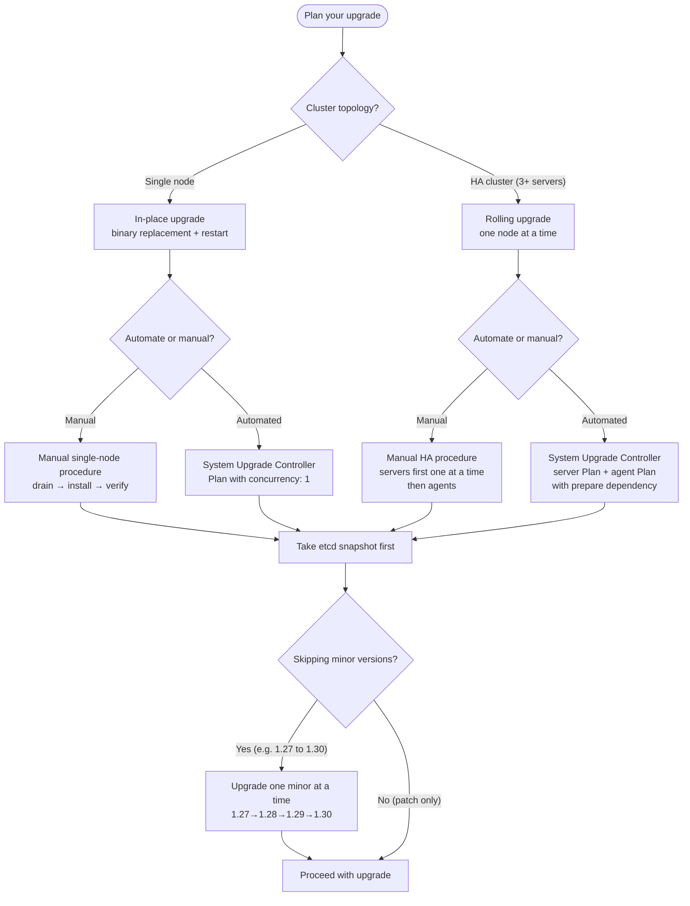
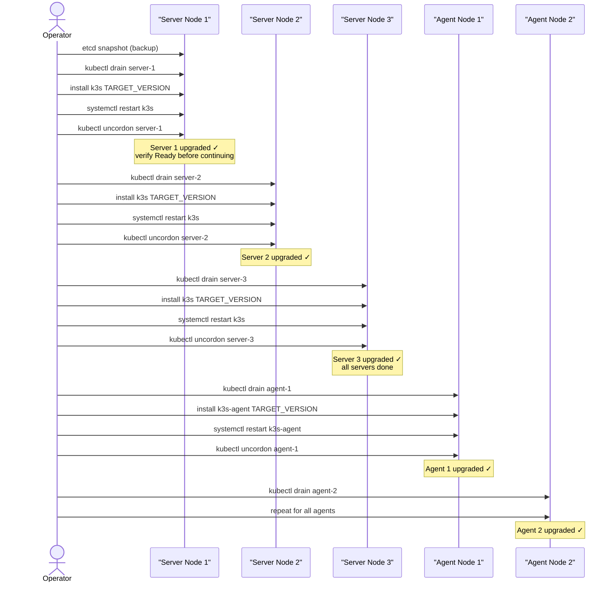
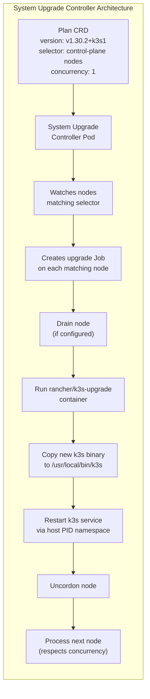
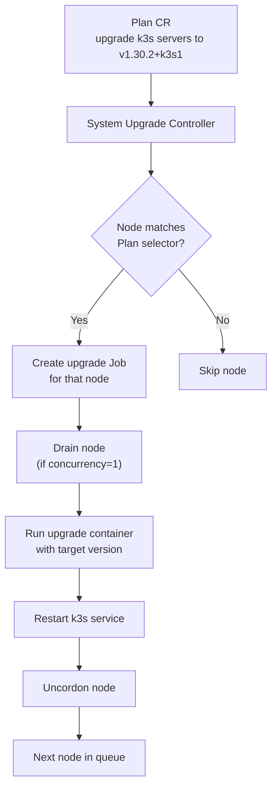

# Upgrading k3s
> Module 14 · Lesson 01 | [↑ Course Index](../README.md)

[](../README.md)
[](../LICENSE.md)

## Table of Contents
1. [Understanding k3s Version Strings](#understanding-k3s-version-strings)
2. [k3s Versioning and Release Channels](#k3s-versioning-and-release-channels)
3. [Pre-Upgrade Checklist](#pre-upgrade-checklist)
4. [Upgrade Strategy — Decision Tree](#upgrade-strategy--decision-tree)
5. [Manual Upgrade — Single Node](#manual-upgrade--single-node)
6. [Manual Upgrade — HA Cluster](#manual-upgrade--ha-cluster)
7. [Automated Upgrade with System Upgrade Controller](#automated-upgrade-with-system-upgrade-controller)
8. [The Plan CRD](#the-plan-crd)
9. [Upgrade Rollback](#upgrade-rollback)
10. [Upgrading Bundled Components](#upgrading-bundled-components)
11. [Upgrade Best Practices](#upgrade-best-practices)
12. [Version Compatibility Matrix](#version-compatibility-matrix)

---

## Understanding k3s Version Strings

k3s version strings encode both the upstream Kubernetes version and the k3s-specific patch revision. Understanding them prevents confusion when reading release notes or specifying target versions.

```
v1.29.4+k3s1
 ^    ^ ^   ^
 |    | |   └── k3s patch revision (increments with k3s-specific fixes)
 |    | └─────── Kubernetes patch version
 |    └───────── Kubernetes minor version
 └────────────── Kubernetes major version (always 1 currently)
```

### What the `+k3s1` suffix means

The `+k3s1` (or `+k3s2`, `+k3s3`, etc.) suffix indicates:
- The k3s-specific patch number on top of the upstream Kubernetes release
- Changes that are specific to k3s — packaging, bundled component versions, configuration defaults
- The underlying Kubernetes code is identical to the upstream release of the same major.minor.patch version

For example:
- `v1.29.4+k3s1` — first k3s release on top of Kubernetes 1.29.4
- `v1.29.4+k3s2` — a second k3s release that fixes a k3s-specific bug, same Kubernetes 1.29.4

When a `+k3s2` release exists, prefer it over `+k3s1` as it contains k3s-specific bug fixes.

### Version format in different contexts

```bash
# k3s binary version
k3s --version
# k3s version v1.29.4+k3s1 (HEAD)
# go version go1.21.8 linux/amd64

# Kubernetes node version (kubelet reports this)
kubectl get node -o wide
# VERSION: v1.29.4+k3s1

# API server version
kubectl version
# Server Version: v1.29.4+k3s1
```

[↑ Back to TOC](#table-of-contents) · [↑ Course Index](../README.md)

---

## k3s Versioning and Release Channels

k3s follows the upstream Kubernetes versioning scheme with an additional k3s patch suffix:

### Release Channels

| Channel | Description | Use Case |
|---|---|---|
| `stable` | Latest stable release, updated periodically | Production |
| `latest` | Most recent release including pre-releases | Testing / CI |
| `v1.29` | Tracks the latest patch of a specific minor | Pinned production |
| `v1.28` | Previous minor — active support | Long-term stability |

### Checking the Current Channel

```bash
# What version is running?
k3s --version

# What version is available on the stable channel?
# (use ctx_execute to avoid curl - handled via API)
kubectl version --short
```

### Release Cadence

- Kubernetes releases a new **minor** version every ~4 months
- k3s typically follows within days of the upstream release
- Each minor version receives patch releases for ~14 months (N-2 minor version support)

[↑ Back to TOC](#table-of-contents) · [↑ Course Index](../README.md)

---

## Pre-Upgrade Checklist

Never begin a k3s upgrade without completing this checklist. A failed upgrade on a cluster without a recent backup can be catastrophic.

```bash
# 1. Check current cluster version and node health
kubectl get nodes -o wide
kubectl get nodes   # all nodes should be Ready

# 2. Check for unhealthy pods — fix before upgrading
kubectl get pods -A | grep -Ev 'Running|Completed|Succeeded'

# 3. Take an etcd snapshot (ALWAYS before upgrading)
sudo k3s etcd-snapshot save --name pre-upgrade-$(date +%Y%m%d-%H%M)
sudo ls -lh /var/lib/rancher/k3s/server/db/snapshots/

# 4. Check disk space — upgrades need room for new binaries + snapshot
df -h /var/lib/rancher/k3s /usr/local/bin

# 5. Review release notes for the target version
# https://github.com/k3s-io/k3s/releases/tag/v1.30.2+k3s1

# 6. Check for deprecated API versions in use
# Install pluto if not already available:
# kubectl apply -f https://github.com/FairwindsOps/pluto/releases/latest/download/install.yaml
# kubectl pluto detect-all-in-cluster --target-versions k8s=v1.30.0

# 7. Check Helm chart compatibility for in-cluster services
helm list -A
# Review each chart's kubeVersion constraint before upgrading

# 8. Notify your team and open a change ticket
# Define your rollback plan before proceeding
```

### Checklist summary

- [ ] All nodes are `Ready`
- [ ] No pods in `Error`, `CrashLoopBackOff`, or `Pending` state
- [ ] etcd snapshot taken and verified
- [ ] Disk space confirmed adequate
- [ ] Release notes reviewed for breaking changes
- [ ] Deprecated API usage checked with pluto or similar
- [ ] Helm chart `kubeVersion` constraints verified
- [ ] Team notified, rollback plan documented

[↑ Back to TOC](#table-of-contents) · [↑ Course Index](../README.md)

---

## Upgrade Strategy — Decision Tree



[↑ Back to TOC](#table-of-contents) · [↑ Course Index](../README.md)

---

## Manual Upgrade — Single Node

A single-node k3s cluster (one server, no external agents) is the simplest upgrade scenario. Because there is only one node, there is no rolling upgrade — the node goes down briefly during the service restart.

### Plan for downtime

On a single-node cluster, upgrading means the API server and workloads will be unavailable for 30–90 seconds while k3s restarts. Plan this with your users.

### Procedure

```bash
# Target version to upgrade to
TARGET_VERSION="v1.30.2+k3s1"

# Step 1: Verify current state
kubectl get nodes
k3s --version

# Step 2: Take an etcd snapshot
sudo k3s etcd-snapshot save --name pre-upgrade-$(date +%Y%m%d)

# Step 3: Run the k3s installer with the target version
# The installer downloads the new binary and restarts the service
sudo INSTALL_K3S_VERSION="${TARGET_VERSION}" \
  sh -c "$(curl -fsSL https://get.k3s.io)"

# Step 4: Verify the upgrade
k3s --version
kubectl get nodes
# Expected: VERSION column now shows the new version

# Step 5: Check all pods recovered
kubectl get pods -A | grep -Ev 'Running|Completed'
# Expected: empty output (all pods running)

# Step 6: Verify core services
kubectl get pods -n kube-system
```

### Expected output after upgrade

```
NAME                      STATUS   ROLES                  AGE   VERSION
my-single-node            Ready    control-plane,master   10d   v1.30.2+k3s1
```

[↑ Back to TOC](#table-of-contents) · [↑ Course Index](../README.md)

---

## Manual Upgrade — HA Cluster

Rolling upgrade of a multi-node HA cluster requires care to maintain etcd quorum and workload availability throughout the process.

**Critical rule:** Always upgrade **server nodes first**, then **agent nodes**. Never upgrade agents before servers.

**Critical rule:** Upgrade **one server node at a time**. A 3-node etcd cluster can tolerate only 1 node being unavailable while maintaining quorum.



### Upgrading a Server Node

```bash
TARGET_VERSION="v1.30.2+k3s1"
NODE="server-1"

# 1. Drain the node (reschedule its pods to other nodes)
kubectl drain ${NODE} \
  --ignore-daemonsets \
  --delete-emptydir-data \
  --timeout=180s

# 2. On the server node itself, run the installer with the target version
# (run this command ON the server node, not from your workstation)
sudo INSTALL_K3S_VERSION="${TARGET_VERSION}" \
  sh -c "$(curl -fsSL https://get.k3s.io)"
# The installer updates the binary and restarts the service automatically

# 3. Wait for the node to rejoin
kubectl wait --for=condition=Ready node/${NODE} --timeout=120s

# 4. Verify the upgraded version
kubectl get node ${NODE} -o jsonpath='{.status.nodeInfo.kubeletVersion}'
# Expected: v1.30.2+k3s1

# 5. Uncordon the node
kubectl uncordon ${NODE}

# 6. WAIT for the node to be fully ready before upgrading the next one
watch kubectl get nodes
```

### Upgrading an Agent Node

```bash
TARGET_VERSION="v1.30.2+k3s1"
NODE="agent-1"

# 1. Drain the agent
kubectl drain ${NODE} \
  --ignore-daemonsets \
  --delete-emptydir-data \
  --timeout=180s

# 2. On the agent node, run the agent installer
# (run ON the agent node)
sudo INSTALL_K3S_VERSION="${TARGET_VERSION}" \
  INSTALL_K3S_EXEC="agent" \
  sh -c "$(curl -fsSL https://get.k3s.io)"

# 3. Verify and uncordon
kubectl wait --for=condition=Ready node/${NODE} --timeout=120s
kubectl uncordon ${NODE}
```

[↑ Back to TOC](#table-of-contents) · [↑ Course Index](../README.md)

---

## Automated Upgrade with System Upgrade Controller

The **System Upgrade Controller (SUC)** is a Kubernetes-native upgrade operator built and maintained by Rancher/SUSE. It reads `Plan` CRs and automatically upgrades k3s nodes without manual SSH.



### Installing the System Upgrade Controller

```bash
# Apply the SUC manifest
kubectl apply -f \
  https://github.com/rancher/system-upgrade-controller/releases/latest/download/system-upgrade-controller.yaml

# Verify
kubectl get pods -n system-upgrade
# NAME                                   READY   STATUS    RESTARTS   AGE
# system-upgrade-controller-xxxx-yyyy    1/1     Running   0          30s
```

### How SUC Works



[↑ Back to TOC](#table-of-contents) · [↑ Course Index](../README.md)

---

## The Plan CRD

A `Plan` is a CRD (Custom Resource Definition) that describes what to upgrade, to what version, and on which nodes.

### Server Plan

```yaml
# upgrade-plan-server.yaml
apiVersion: upgrade.cattle.io/v1
kind: Plan
metadata:
  name: k3s-server-upgrade
  namespace: system-upgrade
spec:
  # Target k3s version — change this to your desired version
  version: v1.30.2+k3s1

  # How many nodes to upgrade at the same time
  # For servers: ALWAYS use 1 to avoid losing etcd quorum
  concurrency: 1

  # Node selector — only apply to server/control-plane nodes
  nodeSelector:
    matchExpressions:
      - key: node-role.kubernetes.io/control-plane
        operator: In
        values: ["true"]

  # Tolerate the control-plane taint so the upgrade Job can run there
  tolerations:
    - key: CriticalAddonsOnly
      operator: Exists
    - key: node-role.kubernetes.io/control-plane
      operator: Exists
      effect: NoSchedule
    - key: node-role.kubernetes.io/etcd
      operator: Exists
      effect: NoExecute

  # Drain the node before upgrading
  drain:
    force: false
    ignoreDaemonSets: true
    deleteEmptydirData: true
    timeout: 120

  # The upgrade container — copies the k3s binary and restarts the service
  upgrade:
    image: rancher/k3s-upgrade
```

### Agent Plan

```yaml
# upgrade-plan-agent.yaml
apiVersion: upgrade.cattle.io/v1
kind: Plan
metadata:
  name: k3s-agent-upgrade
  namespace: system-upgrade
spec:
  version: v1.30.2+k3s1
  concurrency: 2   # Upgrade 2 agents at a time (adjust to your tolerance)

  # Wait for the server plan to finish before starting agent upgrades
  prepare:
    image: rancher/k3s-upgrade
    args: ["prepare", "k3s-server-upgrade"]   # references the server Plan name

  nodeSelector:
    matchExpressions:
      - key: node-role.kubernetes.io/control-plane
        operator: DoesNotExist

  drain:
    force: false
    ignoreDaemonSets: true
    deleteEmptydirData: true
    timeout: 120

  upgrade:
    image: rancher/k3s-upgrade
```

### Applying the Plans

```bash
# Apply server plan first
kubectl apply -f upgrade-plan-server.yaml

# Monitor server upgrade progress
kubectl get plans -n system-upgrade
kubectl get jobs -n system-upgrade -w
kubectl get nodes -w

# Once all servers are upgraded, apply agent plan
kubectl apply -f upgrade-plan-agent.yaml

# Describe a plan for detailed status
kubectl describe plan k3s-server-upgrade -n system-upgrade
```

### Upgrading to Latest Stable Automatically

Instead of specifying a version, you can use the `channel` field:

```yaml
spec:
  channel: https://update.k3s.io/v1-release/channels/stable
  # Remove the 'version' field when using channel
```

> **Warning:** Using the channel without version pinning means your cluster will auto-upgrade whenever a new stable release is published. This is appropriate for test clusters, not production.

[↑ Back to TOC](#table-of-contents) · [↑ Course Index](../README.md)

---

## Upgrade Rollback

k3s does not support automatic rollback. If an upgrade causes problems, you have two recovery paths depending on the severity.

### When to use each rollback option

| Scenario | Recovery Method |
|---|---|
| Binary upgrade broke, node won't start | Option A — reinstall previous binary |
| Application broke due to API version removal | Option A — reinstall previous binary |
| Data corruption or etcd schema change | Option B — restore etcd snapshot |
| Wrong upgrade order broke etcd quorum | Option B — restore etcd snapshot |

### Option A — Reinstall Previous Binary

```bash
# 1. Drain the affected node (if the API server is still responsive)
kubectl drain <node-name> --ignore-daemonsets --delete-emptydir-data

# 2. On the node, reinstall the old version
PREVIOUS_VERSION="v1.29.4+k3s1"
sudo INSTALL_K3S_VERSION="${PREVIOUS_VERSION}" \
  sh -c "$(curl -fsSL https://get.k3s.io)"

# 3. Verify the node came back at the old version
k3s --version
kubectl get node <node-name>

# 4. Uncordon
kubectl uncordon <node-name>
```

### Option B — Restore etcd Snapshot (for API-level changes)

If the upgrade caused data corruption or breaking API changes that affect the entire cluster:

```bash
# Stop k3s on all nodes first
sudo systemctl stop k3s       # on all server nodes
sudo systemctl stop k3s-agent # on all agent nodes

# On the primary server node, restore from the pre-upgrade snapshot
sudo k3s server \
  --cluster-reset \
  --cluster-reset-restore-path=/var/lib/rancher/k3s/server/db/snapshots/pre-upgrade-20260301

# Restart k3s normally after reset completes
sudo systemctl start k3s

# Then restart agents
sudo systemctl start k3s-agent
```

See `../13_backup_and_dr/03_cluster_restore.md` for the full restore procedure.

### Downgrade considerations

Downgrading Kubernetes is generally unsupported — API objects written by the new version may not be readable by the old version. This is why the pre-upgrade etcd snapshot is critical: you restore the state *before* the new version wrote anything.

[↑ Back to TOC](#table-of-contents) · [↑ Course Index](../README.md)

---

## Upgrading Bundled Components

k3s bundles several components that are versioned independently from Kubernetes. They are updated when you upgrade k3s, but the timing and version mapping are important to understand.

### Bundled components and their update behaviour

| Component | How it Updates | Notes |
|---|---|---|
| Traefik | Updates with k3s | Only if HelmChart resource is present; pinned to chart version in k3s release |
| CoreDNS | Updates with k3s | Binary embedded in k3s; updates automatically |
| local-path-provisioner | Updates with k3s | Binary embedded; updates automatically |
| Klipper (ServiceLB) | Updates with k3s | Embedded; updates automatically |
| containerd | Updates with k3s | Runtime embedded in k3s binary |
| CNI plugins | Updates with k3s | Flannel CNI binary embedded |

### When bundled components do NOT automatically update

Traefik is the main exception. k3s deploys Traefik via a HelmChart custom resource (`/var/lib/rancher/k3s/server/manifests/traefik.yaml`). If you have customised Traefik via a `HelmChartConfig`, the update behaviour depends on your configuration:

```bash
# Check Traefik version
kubectl get pods -n kube-system -l app.kubernetes.io/name=traefik \
  -o jsonpath='{.items[0].spec.containers[0].image}'

# Check the HelmChart resource for Traefik
kubectl get helmchart traefik -n kube-system -o yaml | grep version

# If you pinned a specific chart version in HelmChartConfig, it won't auto-update
kubectl get helmchartconfig traefik -n kube-system 2>/dev/null
```

### Manually updating Traefik after a k3s upgrade

```bash
# Check the version k3s wants to deploy
sudo cat /var/lib/rancher/k3s/server/manifests/traefik.yaml | grep version

# Force re-apply the Traefik HelmChart (triggers chart reconciliation)
kubectl annotate helmchart traefik -n kube-system \
  helm.cattle.io/chart-version-override="" --overwrite
```

### Checking component health post-upgrade

```bash
# Verify all core system components are running after upgrade
kubectl get pods -n kube-system

# Check Traefik
kubectl get pods -n kube-system -l app.kubernetes.io/name=traefik

# Check CoreDNS
kubectl get pods -n kube-system -l k8s-app=kube-dns

# Check local-path-provisioner
kubectl get pods -n kube-system -l app=local-path-provisioner

# Verify DNS resolution still works
kubectl run dns-test --image=busybox:1.36 --rm -it \
  -- nslookup kubernetes.default.svc.cluster.local
```

[↑ Back to TOC](#table-of-contents) · [↑ Course Index](../README.md)

---

## Upgrade Best Practices

- **Always snapshot before upgrading.** A pre-upgrade etcd snapshot is your safety net.
- **Test in staging first.** Mirror your production cluster configuration in a staging cluster and test the upgrade path before applying to production.
- **Upgrade one minor version at a time.** Skipping minor versions (e.g., 1.27 → 1.30) is not supported. Upgrade 1.27 → 1.28 → 1.29 → 1.30 sequentially.
- **Server nodes before agents.** The API server must be at the new version before kubelet on agents is upgraded.
- **Upgrade one server at a time.** Concurrent server upgrades in a 3-node etcd cluster can lose quorum. Set `concurrency: 1` in the server Plan.
- **Read the release notes.** Deprecated APIs, removed features, and changed defaults are documented in Kubernetes and k3s release notes.
- **Maintain a version freeze policy.** Define a process for approving version upgrades — don't auto-upgrade production without review.
- **Check Helm chart compatibility.** Helm charts for in-cluster services (cert-manager, Traefik, etc.) may need updating when the Kubernetes version changes.

[↑ Back to TOC](#table-of-contents) · [↑ Course Index](../README.md)

---

## Version Compatibility Matrix

### k3s and Kubernetes Version Relationship

| k3s Version | Kubernetes Version | Notes |
|---|---|---|
| v1.30.x+k3s1 | v1.30.x | Current stable (as of 2026) |
| v1.29.x+k3s1 | v1.29.x | Supported |
| v1.28.x+k3s1 | v1.28.x | Supported |
| v1.27.x+k3s1 | v1.27.x | End of life — upgrade required |

### Helm Chart Compatibility

| Tool | Helm Chart | Kubernetes Version Constraint |
|---|---|---|
| Traefik | `traefik/traefik >= 26.x` | `>= 1.22` |
| cert-manager | `jetstack/cert-manager >= 1.14` | `>= 1.22` |
| Longhorn | `longhorn/longhorn >= 1.6` | `>= 1.21` |
| Velero | `vmware-tanzu/velero >= 6.x` | `>= 1.22` |
| Prometheus | `prometheus-community/kube-prometheus-stack >= 57` | `>= 1.24` |
| MetalLB | `metallb/metallb >= 0.14` | `>= 1.23` |

> Always check each chart's `Chart.yaml` for the `kubeVersion` constraint before upgrading.

### API Removal Warning

Kubernetes regularly removes deprecated API versions. Check the official migration guide for each minor version:
- [Kubernetes Deprecated API Migration Guide](https://kubernetes.io/docs/reference/using-api/deprecation-guide/)

```bash
# Use pluto to detect deprecated APIs in your cluster before upgrading
kubectl apply -f https://github.com/FairwindsOps/pluto/releases/latest/download/install.yaml
kubectl pluto detect-all-in-cluster --target-versions k8s=v1.30.0
```

[↑ Back to TOC](#table-of-contents) · [↑ Course Index](../README.md)

---

*Licensed under [CC BY-NC-SA 4.0](../LICENSE.md) · © 2026 UncleJS*
