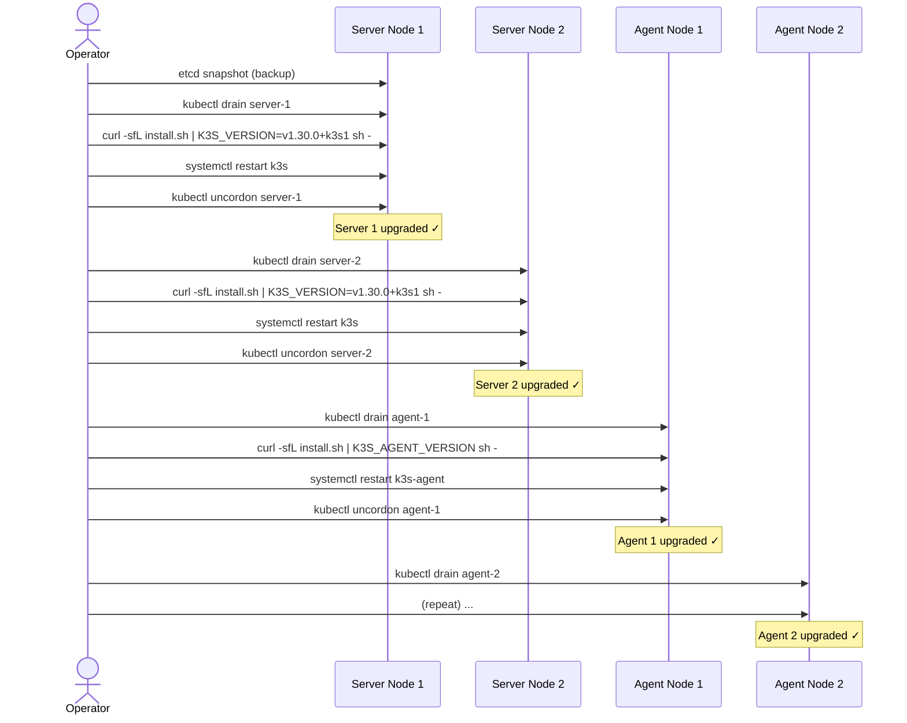

# Upgrading k3s
> Module 14 · Lesson 01 | [↑ Course Index](../README.md)

## Table of Contents
1. [k3s Versioning and Release Channels](#k3s-versioning-and-release-channels)
2. [Manual Upgrade Procedure](#manual-upgrade-procedure)
3. [Automated Upgrade with System Upgrade Controller](#automated-upgrade-with-system-upgrade-controller)
4. [The Plan CRD](#the-plan-crd)
5. [Rollback Procedure](#rollback-procedure)
6. [Upgrade Best Practices](#upgrade-best-practices)
7. [Version Compatibility Matrix](#version-compatibility-matrix)

---

## k3s Versioning and Release Channels

k3s follows the upstream Kubernetes versioning scheme with an additional k3s patch suffix:

```
v1.29.4+k3s1
 ^    ^ ^   ^
 |    | |   └── k3s patch revision
 |    | └─────── Kubernetes patch
 |    └───────── Kubernetes minor
 └────────────── Kubernetes major
```

### Release Channels

| Channel | Description | Use Case |
|---|---|---|
| `stable` | Latest stable release, updated periodically | Production |
| `latest` | Most recent release including pre-releases | Testing / CI |
| `v1.29` | Tracks the latest patch of a specific minor | Pinned production |
| `v1.28` | Previous minor — active support | Long-term stability |

### Checking the Current Channel

```bash
# What version is running?
k3s --version

# What version is available on the stable channel?
curl -fsSL https://update.k3s.io/v1-release/channels | jq '.data[] | select(.name=="stable") | .latest'
```

### Release Cadence

- Kubernetes releases a new **minor** version every ~4 months
- k3s typically follows within days of the upstream release
- Each minor version receives patch releases for ~14 months (N-2 minor version support)

[↑ Back to TOC](#table-of-contents) · [↑ Course Index](../README.md)

---

## Manual Upgrade Procedure

Manual upgrades give you full control and are appropriate for small clusters or infrequent upgrades.

**Rule:** Always upgrade **server nodes first**, then **agent nodes**. Never upgrade agents before servers.

### Upgrade Flow



### Pre-Upgrade Steps

```bash
# 1. Check current version
kubectl get nodes -o wide

# 2. Take an etcd snapshot (ALWAYS before upgrading)
sudo k3s etcd-snapshot save --name pre-upgrade-$(date +%Y%m%d)

# 3. Review the k3s release notes for breaking changes
# https://github.com/k3s-io/k3s/releases

# 4. Verify cluster is healthy before starting
kubectl get nodes
kubectl get pods -A | grep -v Running | grep -v Completed
```

### Upgrading a Server Node

```bash
# 1. Drain the node (reschedule its pods)
kubectl drain server-1 \
  --ignore-daemonsets \
  --delete-emptydir-data \
  --timeout=120s

# 2. On the server node itself, run the installer with the target version
TARGET_VERSION="v1.30.2+k3s1"
curl -sfL https://get.k3s.io | INSTALL_K3S_VERSION="${TARGET_VERSION}" sh -

# The installer updates the binary and restarts the service automatically.

# 3. Verify the node upgraded
kubectl get node server-1 -o jsonpath='{.status.nodeInfo.kubeletVersion}'

# 4. Uncordon the node
kubectl uncordon server-1

# 5. Wait for the node to become fully Ready before upgrading the next one
watch kubectl get nodes
```

### Upgrading an Agent Node

```bash
# 1. Drain the agent
kubectl drain agent-1 \
  --ignore-daemonsets \
  --delete-emptydir-data \
  --timeout=120s

# 2. On the agent node, run the agent installer
TARGET_VERSION="v1.30.2+k3s1"
curl -sfL https://get.k3s.io | \
  INSTALL_K3S_VERSION="${TARGET_VERSION}" \
  INSTALL_K3S_EXEC="agent" \
  sh -

# 3. Uncordon
kubectl uncordon agent-1
```

[↑ Back to TOC](#table-of-contents) · [↑ Course Index](../README.md)

---

## Automated Upgrade with System Upgrade Controller

The **System Upgrade Controller (SUC)** is a Kubernetes-native upgrade operator built and maintained
by Rancher/SUSE. It reads `Plan` CRs and automatically upgrades k3s nodes.

### Installing the System Upgrade Controller

```bash
# Apply the SUC manifest
kubectl apply -f \
  https://github.com/rancher/system-upgrade-controller/releases/latest/download/system-upgrade-controller.yaml

# Verify
kubectl get pods -n system-upgrade
# system-upgrade-controller-xxxx   1/1   Running
```

### How SUC Works

```mermaid
flowchart TD
    Plan[Plan CR\n"upgrade k3s servers\nto v1.30.2+k3s1"] --> SUC[System Upgrade\nController]
    SUC --> Q{Node matches\nPlan selector?}
    Q -->|Yes| J[Create upgrade Job\nfor that node]
    J --> Drain[Drain node\nif concurrency=1]
    Drain --> Upgrade[Run upgrade container\nwith target version]
    Upgrade --> Restart[Restart k3s service]
    Restart --> Uncordon[Uncordon node]
    Uncordon --> Next[Next node in queue]
    Q -->|No| Skip[Skip node]
```

[↑ Back to TOC](#table-of-contents) · [↑ Course Index](../README.md)

---

## The Plan CRD

A `Plan` is a CRD (Custom Resource Definition) that describes what to upgrade, to what version, and
on which nodes.

### Server Plan

```yaml
# upgrade-plan-server.yaml
apiVersion: upgrade.cattle.io/v1
kind: Plan
metadata:
  name: k3s-server-upgrade
  namespace: system-upgrade
spec:
  # Target k3s version — change this to your desired version
  version: v1.30.2+k3s1

  # How many nodes to upgrade at the same time
  # For servers: ALWAYS use 1 to avoid losing etcd quorum
  concurrency: 1

  # Node selector — only apply to server/control-plane nodes
  nodeSelector:
    matchExpressions:
      - key: node-role.kubernetes.io/control-plane
        operator: In
        values: ["true"]

  # Tolerate the control-plane taint so the upgrade Job can run there
  tolerations:
    - key: CriticalAddonsOnly
      operator: Exists
    - key: node-role.kubernetes.io/control-plane
      operator: Exists
      effect: NoSchedule
    - key: node-role.kubernetes.io/etcd
      operator: Exists
      effect: NoExecute

  # Drain the node before upgrading
  drain:
    force: false
    ignoreDaemonSets: true
    deleteEmptydirData: true
    timeout: 120

  # The upgrade container — copies the k3s binary and restarts the service
  upgrade:
    image: rancher/k3s-upgrade
```

### Agent Plan

```yaml
# upgrade-plan-agent.yaml
apiVersion: upgrade.cattle.io/v1
kind: Plan
metadata:
  name: k3s-agent-upgrade
  namespace: system-upgrade
spec:
  version: v1.30.2+k3s1
  concurrency: 2   # Upgrade 2 agents at a time (adjust to your tolerance)

  # Wait for the server plan to finish before starting agent upgrades
  prepare:
    image: rancher/k3s-upgrade
    args: ["prepare", "k3s-server-upgrade"]   # references the server Plan name

  nodeSelector:
    matchExpressions:
      - key: node-role.kubernetes.io/control-plane
        operator: DoesNotExist

  drain:
    force: false
    ignoreDaemonSets: true
    deleteEmptydirData: true
    timeout: 120

  upgrade:
    image: rancher/k3s-upgrade
```

### Applying the Plans

```bash
# Apply server plan first
kubectl apply -f upgrade-plan-server.yaml

# Wait for server upgrades to complete, then apply agent plan
kubectl get plans -n system-upgrade
kubectl get jobs -n system-upgrade -w

# Then:
kubectl apply -f upgrade-plan-agent.yaml

# Monitor progress
kubectl get nodes -w
kubectl describe plan k3s-server-upgrade -n system-upgrade
```

### Upgrading to Latest Stable Automatically

Instead of specifying a version, you can use the `channel` field:

```yaml
spec:
  channel: https://update.k3s.io/v1-release/channels/stable
  # Remove the 'version' field when using channel
```

[↑ Back to TOC](#table-of-contents) · [↑ Course Index](../README.md)

---

## Rollback Procedure

k3s does not support automatic rollback. To roll back to a previous version:

### Option A — Reinstall Previous Binary

```bash
# 1. Drain the node
kubectl drain <node-name> --ignore-daemonsets --delete-emptydir-data

# 2. On the node, reinstall the old version
PREVIOUS_VERSION="v1.29.4+k3s1"
curl -sfL https://get.k3s.io | INSTALL_K3S_VERSION="${PREVIOUS_VERSION}" sh -

# 3. Uncordon
kubectl uncordon <node-name>
```

### Option B — Restore etcd Snapshot (for API-level changes)

If the upgrade caused data corruption or breaking API changes:

```bash
# Restore from the pre-upgrade snapshot
sudo k3s server \
  --cluster-reset \
  --cluster-reset-restore-path=/var/lib/rancher/k3s/server/db/snapshots/pre-upgrade-20260301
```

See `../13_backup_and_dr/03_cluster_restore.md` for the full restore procedure.

[↑ Back to TOC](#table-of-contents) · [↑ Course Index](../README.md)

---

## Upgrade Best Practices

- **Always snapshot before upgrading.** A pre-upgrade etcd snapshot is your safety net.
- **Test in staging first.** Mirror your production cluster configuration in a staging cluster and
  test the upgrade path before applying to production.
- **Upgrade one minor version at a time.** Skipping minor versions (e.g., 1.27 → 1.30) is not
  supported. Upgrade 1.27 → 1.28 → 1.29 → 1.30 sequentially.
- **Server nodes before agents.** The API server must be at the new version before kubelet
  on agents is upgraded.
- **Upgrade one server at a time.** Concurrent server upgrades in a 3-node etcd cluster can lose
  quorum. Set `concurrency: 1` in the server Plan.
- **Read the release notes.** Deprecated APIs, removed features, and changed defaults are
  documented in Kubernetes and k3s release notes.
- **Maintain a version freeze policy.** Define a process for approving version upgrades — don't
  auto-upgrade production without review.
- **Check Helm chart compatibility.** Helm charts for in-cluster services (cert-manager, Traefik,
  etc.) may need updating when the Kubernetes version changes.

[↑ Back to TOC](#table-of-contents) · [↑ Course Index](../README.md)

---

## Version Compatibility Matrix

### k3s and Kubernetes Version Relationship

| k3s Version | Kubernetes Version | Notes |
|---|---|---|
| v1.30.x+k3s1 | v1.30.x | Current stable (as of 2026) |
| v1.29.x+k3s1 | v1.29.x | Supported |
| v1.28.x+k3s1 | v1.28.x | Supported |
| v1.27.x+k3s1 | v1.27.x | End of life — upgrade required |

### Helm Chart Compatibility

| Tool | Helm Chart | Kubernetes Version Constraint |
|---|---|---|
| Traefik | `traefik/traefik >= 26.x` | `>= 1.22` |
| cert-manager | `jetstack/cert-manager >= 1.14` | `>= 1.22` |
| Longhorn | `longhorn/longhorn >= 1.6` | `>= 1.21` |
| Velero | `vmware-tanzu/velero >= 6.x` | `>= 1.22` |
| Prometheus | `prometheus-community/kube-prometheus-stack >= 57` | `>= 1.24` |
| MetalLB | `metallb/metallb >= 0.14` | `>= 1.23` |

> Always check each chart's `Chart.yaml` for the `kubeVersion` constraint before upgrading.

### API Removal Warning

Kubernetes regularly removes deprecated API versions. Check the official migration guide for each
minor version:
- [Kubernetes Deprecated API Migration Guide](https://kubernetes.io/docs/reference/using-api/deprecation-guide/)

```bash
# Use pluto to detect deprecated APIs in your cluster before upgrading
kubectl apply -f https://github.com/FairwindsOps/pluto/releases/latest/download/install.yaml
kubectl pluto detect-all-in-cluster --target-versions k8s=v1.30.0
```

[↑ Back to TOC](#table-of-contents) · [↑ Course Index](../README.md)

---

*Licensed under [CC BY-NC-SA 4.0](../LICENSE.md) · © 2026 UncleJS*
