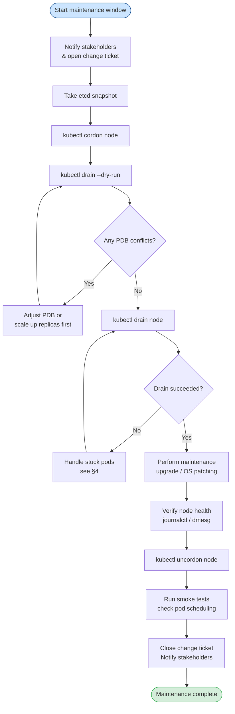

# Node Drain and Cordon
> Module 14 · Lesson 02 | [↑ Course Index](../README.md)

## Table of Contents
1. [Node Cordon — Stop Scheduling](#node-cordon--stop-scheduling)
2. [Node Drain — Evict Pods Safely](#node-drain--evict-pods-safely)
3. [PodDisruptionBudgets (PDB)](#poddisruptionbudgets-pdb)
4. [Handling Pods That Won't Drain](#handling-pods-that-wont-drain)
5. [Bringing a Node Back — Uncordon](#bringing-a-node-back--uncordon)
6. [Maintenance Windows](#maintenance-windows)
7. [Draining Multiple Nodes in HA Clusters](#draining-multiple-nodes-in-ha-clusters)

---

## Node Cordon — Stop Scheduling

Cordoning a node marks it as `SchedulingDisabled`. The scheduler will not place **new** pods on the
node, but existing pods continue to run.

```bash
# Cordon a node
kubectl cordon <node-name>

# Verify
kubectl get nodes
# NAME       STATUS                     ROLES   AGE
# worker-1   Ready,SchedulingDisabled   <none>  5d

# Uncordon (re-enable scheduling)
kubectl uncordon <node-name>
```

**When to cordon without draining:**
- You want to prevent new workloads while investigating an issue
- You are preparing to drain but want a grace period first
- You are adding the node back after maintenance and want to test it first

[↑ Back to TOC](#table-of-contents) · [↑ Course Index](../README.md)

---

## Node Drain — Evict Pods Safely

Draining a node:
1. Cordons the node (marks it `SchedulingDisabled`)
2. Evicts all pods using the Eviction API (respects PodDisruptionBudgets)
3. Waits for pods to terminate gracefully

```bash
# Standard drain
kubectl drain <node-name> \
  --ignore-daemonsets \
  --delete-emptydir-data

# With explicit timeout (default: infinite wait)
kubectl drain <node-name> \
  --ignore-daemonsets \
  --delete-emptydir-data \
  --timeout=120s

# Dry-run first — preview what will be evicted
kubectl drain <node-name> \
  --ignore-daemonsets \
  --delete-emptydir-data \
  --dry-run=client
```

### Drain Flags Explained

| Flag | Description |
|---|---|
| `--ignore-daemonsets` | Skip DaemonSet-managed pods (they cannot be evicted) |
| `--delete-emptydir-data` | Allow deletion of pods with `emptyDir` volumes (data is lost) |
| `--force` | Delete pods not managed by a ReplicaSet/StatefulSet/DaemonSet/Job |
| `--timeout` | Max time to wait for pods to terminate (0 = wait forever) |
| `--pod-selector` | Only evict pods matching this label selector |
| `--grace-period` | Override pod termination grace period (seconds) |
| `--dry-run=client` | Preview what would be drained without making changes |

[↑ Back to TOC](#table-of-contents) · [↑ Course Index](../README.md)

---

## PodDisruptionBudgets (PDB)

A PodDisruptionBudget ensures that a minimum number of pod replicas remain available during
voluntary disruptions (like drains). The drain command will **wait** (and block) if evicting a pod
would violate a PDB.

### PDB Fields

| Field | Description |
|---|---|
| `minAvailable` | Minimum number (or %) of pods that must remain available |
| `maxUnavailable` | Maximum number (or %) of pods that can be unavailable |

You must specify exactly one of `minAvailable` or `maxUnavailable`.

### PDB Examples

```yaml
# Ensure at least 2 replicas of my-api are always available
apiVersion: policy/v1
kind: PodDisruptionBudget
metadata:
  name: my-api-pdb
  namespace: my-app
spec:
  minAvailable: 2
  selector:
    matchLabels:
      app: my-api
```

```yaml
# Allow at most 1 replica of my-worker to be unavailable at a time
apiVersion: policy/v1
kind: PodDisruptionBudget
metadata:
  name: my-worker-pdb
  namespace: my-app
spec:
  maxUnavailable: 1
  selector:
    matchLabels:
      app: my-worker
```

```yaml
# Percentage-based: allow up to 25% unavailable
apiVersion: policy/v1
kind: PodDisruptionBudget
metadata:
  name: my-app-pdb
  namespace: my-app
spec:
  maxUnavailable: "25%"
  selector:
    matchLabels:
      app: my-app
```

### Viewing PDB Status

```bash
kubectl get pdb -n my-app

# NAME          MIN AVAILABLE   MAX UNAVAILABLE   ALLOWED DISRUPTIONS   AGE
# my-api-pdb    2               N/A               1                     3d

# Detailed view
kubectl describe pdb my-api-pdb -n my-app
```

[↑ Back to TOC](#table-of-contents) · [↑ Course Index](../README.md)

---

## Handling Pods That Won't Drain

Sometimes a drain gets stuck. Here is how to diagnose and resolve each case.

### Case 1 — PDB is too restrictive

```bash
# Drain is stuck? Check what is blocking it
kubectl get pdb -A
kubectl describe pdb <name> -n <namespace>

# If the PDB is blocking and you accept the risk:
# Option A: Temporarily delete the PDB, drain, then re-apply it
kubectl delete pdb <name> -n <namespace>
kubectl drain <node-name> --ignore-daemonsets --delete-emptydir-data
kubectl apply -f my-pdb.yaml

# Option B (k8s 1.26+): use --disable-eviction to bypass PDBs
kubectl drain <node-name> \
  --ignore-daemonsets \
  --delete-emptydir-data \
  --disable-eviction=true
```

### Case 2 — Pod ignores SIGTERM / long termination grace period

```bash
# Check the pod's terminationGracePeriodSeconds
kubectl get pod <pod-name> -o jsonpath='{.spec.terminationGracePeriodSeconds}'

# Force-shorten the grace period for the drain
kubectl drain <node-name> \
  --ignore-daemonsets \
  --delete-emptydir-data \
  --grace-period=30
```

### Case 3 — Orphaned pods (not managed by a controller)

```bash
# Drain will refuse to delete unmanaged pods without --force
kubectl drain <node-name> \
  --ignore-daemonsets \
  --delete-emptydir-data \
  --force

# Identify unmanaged pods before forcing:
kubectl get pods -A \
  -o jsonpath='{range .items[?(@.metadata.ownerReferences==null)]}{.metadata.namespace}/{.metadata.name}{"\n"}{end}'
```

### Case 4 — Timeout exceeded

```bash
# A pod is stuck in Terminating — force-delete it
kubectl delete pod <pod-name> -n <namespace> --grace-period=0 --force

# Note: This bypasses the graceful shutdown hook. Use only as a last resort.
```

[↑ Back to TOC](#table-of-contents) · [↑ Course Index](../README.md)

---

## Bringing a Node Back — Uncordon

After maintenance is complete and you have verified the node is healthy:

```bash
# Uncordon the node — re-enable scheduling
kubectl uncordon <node-name>

# Verify
kubectl get nodes

# Pods will gradually be scheduled onto the uncordoned node
# (existing pods on other nodes are NOT automatically moved back)
kubectl get pods -A -o wide | grep <node-name>
```

[↑ Back to TOC](#table-of-contents) · [↑ Course Index](../README.md)

---

## Maintenance Windows

### Recommended Procedure



### Maintenance Scheduling Tips

```bash
# Check when pods were last restarted (identify long-running pods at risk)
kubectl get pods -A \
  --sort-by='.status.startTime' \
  -o custom-columns='NAMESPACE:.metadata.namespace,NAME:.metadata.name,STARTED:.status.startTime'

# Check node conditions before maintenance
kubectl describe node <node-name> | grep -A10 Conditions

# Verify no critical jobs are running
kubectl get jobs -A | grep -v Complete
```

[↑ Back to TOC](#table-of-contents) · [↑ Course Index](../README.md)

---

## Draining Multiple Nodes in HA Clusters

When you need to drain more than one node (e.g., cluster-wide OS patching), work through nodes
**one at a time** to maintain availability.

### Rules for HA Safety

| Cluster Type | Max Nodes Drained Simultaneously |
|---|---|
| 3-node HA (all server) | **1** — draining 2+ loses etcd quorum |
| 3 servers + N workers | **1 server at a time**; workers can be drained in batches |
| Single server + N workers | Server last; workers in batches (respect PDBs) |

### Rolling Maintenance Script

```bash
#!/usr/bin/env bash
# Drain and maintain all worker nodes one at a time
NODES=$(kubectl get nodes -l '!node-role.kubernetes.io/control-plane' -o name)

for node in ${NODES}; do
    node_name="${node#node/}"
    echo "==> Draining ${node_name}"
    kubectl drain "${node_name}" \
        --ignore-daemonsets \
        --delete-emptydir-data \
        --timeout=120s

    echo "==> Perform maintenance on ${node_name} (press ENTER when done)"
    read -r _

    echo "==> Uncordoning ${node_name}"
    kubectl uncordon "${node_name}"

    echo "==> Waiting 30s for pods to reschedule..."
    sleep 30

    kubectl get pods -A -o wide | grep "${node_name}"
done

echo "==> All worker nodes maintained."
```

### HA etcd Quorum Reference

During server node drains in a 3-node etcd cluster:

```
Normal state:    Server-1 ✓   Server-2 ✓   Server-3 ✓   (quorum: 2/3)
1 node drained:  Server-1 ✗   Server-2 ✓   Server-3 ✓   (quorum: 2/3 — SAFE)
2 nodes drained: Server-1 ✗   Server-2 ✗   Server-3 ✓   (quorum: 1/3 — LOST ⚠)
```

> Never drain two server nodes simultaneously in a 3-node HA cluster.

[↑ Back to TOC](#table-of-contents) · [↑ Course Index](../README.md)

---

*Licensed under [CC BY-NC-SA 4.0](../LICENSE.md) · © 2026 UncleJS*
