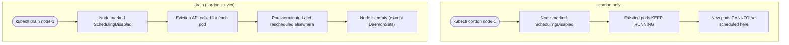
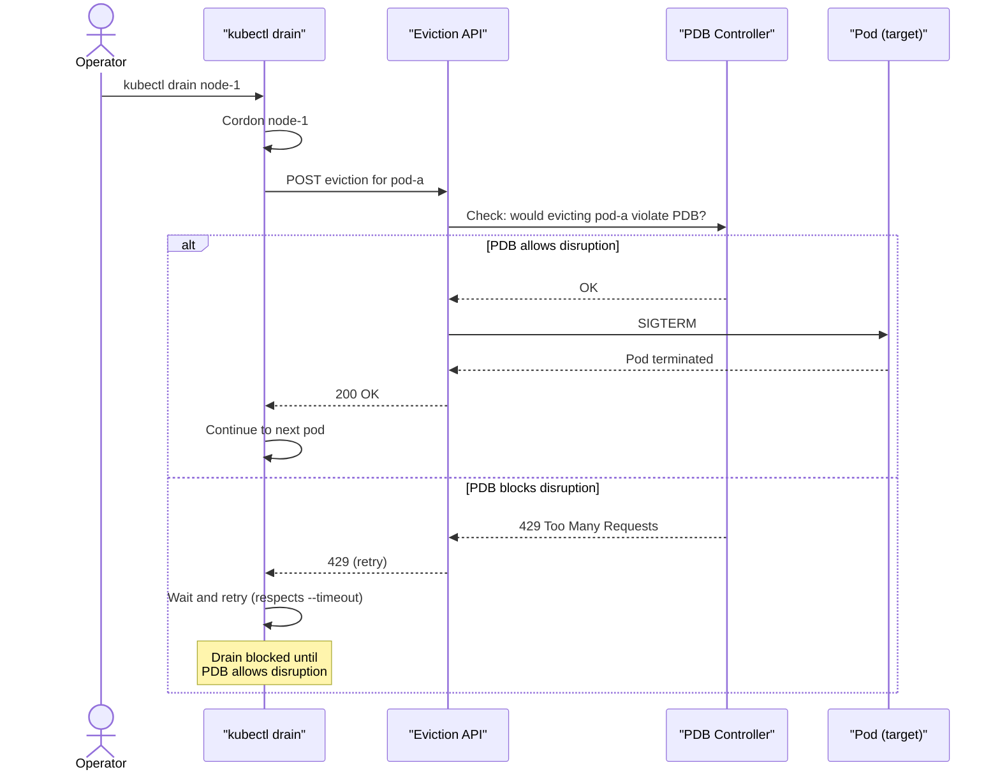
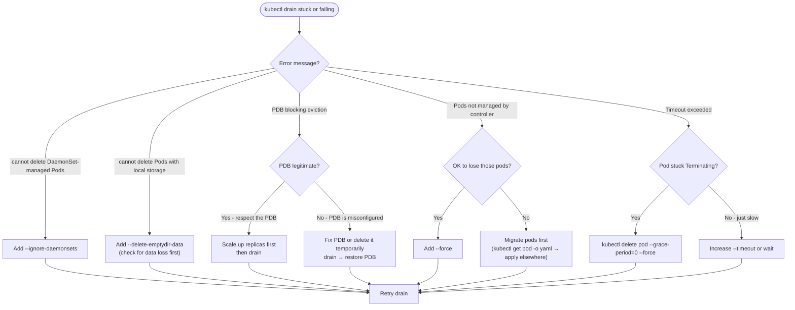
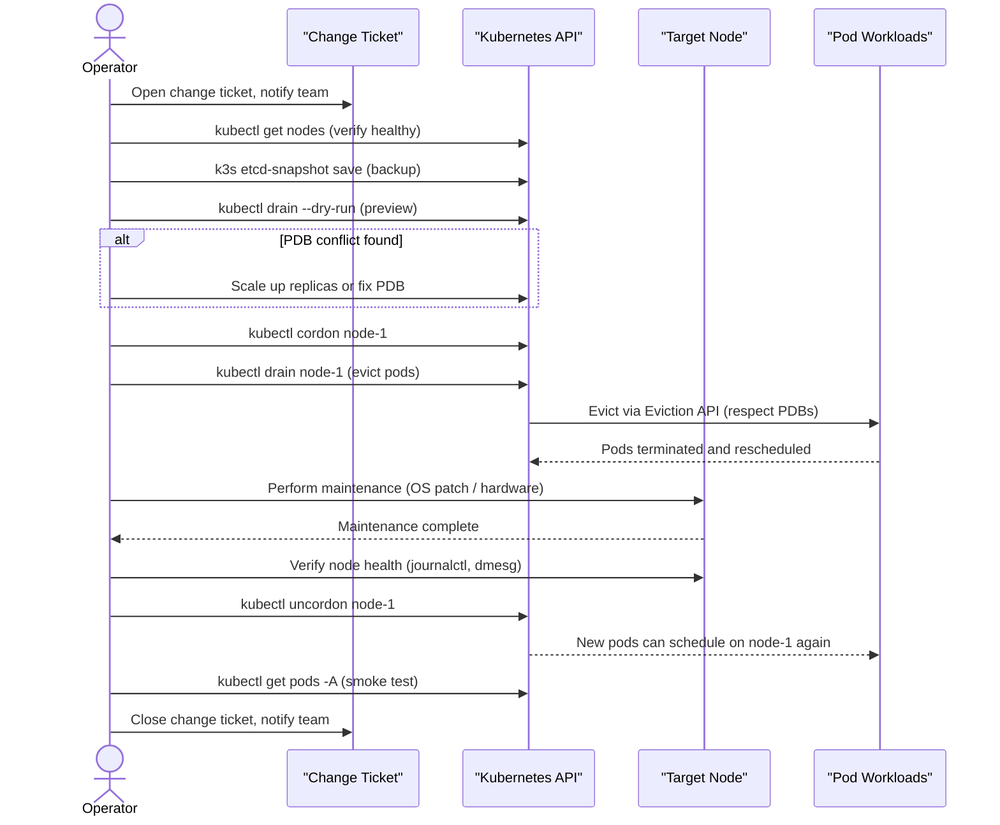

# Node Drain and Cordon
> Module 14 · Lesson 02 | [↑ Course Index](../README.md)

[](../README.md)
[](../LICENSE.md)

## Table of Contents
1. [cordon vs drain — What's the Difference](#cordon-vs-drain--whats-the-difference)
2. [Node Cordon — Stop Scheduling](#node-cordon--stop-scheduling)
3. [Node Drain — Evict Pods Safely](#node-drain--evict-pods-safely)
4. [PodDisruptionBudgets and Drain](#poddisruptionbudgets-and-drain)
5. [DaemonSet Pods During Drain](#daemonset-pods-during-drain)
6. [Pods with Local Storage During Drain](#pods-with-local-storage-during-drain)
7. [Drain Timeouts and Force](#drain-timeouts-and-force)
8. [Handling Pods That Won't Drain](#handling-pods-that-wont-drain)
9. [Bringing a Node Back — Uncordon](#bringing-a-node-back--uncordon)
10. [Maintenance Windows — Full Procedure](#maintenance-windows--full-procedure)
11. [Node Replacement](#node-replacement)
12. [Draining Multiple Nodes in HA Clusters](#draining-multiple-nodes-in-ha-clusters)

---

## cordon vs drain — What's the Difference

These two operations are often confused because `drain` implicitly performs a `cordon` first. Understanding the distinction helps you choose the right tool.



### When to use cordon only

- You suspect a node has a problem and want to stop new pods landing on it while you investigate, without evicting existing workloads
- You want to prepare for a drain but need a grace period (e.g., wait for a maintenance window)
- You are adding a node back after maintenance and want to test scheduling before committing

### When to use drain

- Before performing OS-level maintenance (kernel upgrades, hardware changes, reboots)
- Before a k3s binary upgrade (optional but recommended)
- Before permanently removing a node from the cluster
- When you need the node to be completely empty before working on it

| Operation | Marks unschedulable | Evicts pods | Safe for running workloads |
|---|---|---|---|
| `cordon` | Yes | No | Yes — pods keep running |
| `drain` | Yes | Yes — via Eviction API | Depends on PDBs and grace period |
| `uncordon` | No (removes mark) | No | Yes |

[↑ Back to TOC](#table-of-contents) · [↑ Course Index](../README.md)

---

## Node Cordon — Stop Scheduling

Cordoning a node marks it as `SchedulingDisabled`. The scheduler will not place **new** pods on the node, but existing pods continue to run.

```bash
# Cordon a node
kubectl cordon <node-name>

# Verify
kubectl get nodes
# NAME       STATUS                     ROLES   AGE
# worker-1   Ready,SchedulingDisabled   <none>  5d

# Uncordon (re-enable scheduling)
kubectl uncordon <node-name>
```

**When to cordon without draining:**
- You want to prevent new workloads while investigating an issue
- You are preparing to drain but want a grace period first
- You are adding the node back after maintenance and want to test it first

[↑ Back to TOC](#table-of-contents) · [↑ Course Index](../README.md)

---

## Node Drain — Evict Pods Safely

Draining a node:
1. Cordons the node (marks it `SchedulingDisabled`)
2. Evicts all pods using the Eviction API (respects PodDisruptionBudgets)
3. Waits for pods to terminate gracefully

```bash
# Standard drain
kubectl drain <node-name> \
  --ignore-daemonsets \
  --delete-emptydir-data

# With explicit timeout (default: infinite wait)
kubectl drain <node-name> \
  --ignore-daemonsets \
  --delete-emptydir-data \
  --timeout=120s

# Dry-run first — preview what will be evicted
kubectl drain <node-name> \
  --ignore-daemonsets \
  --delete-emptydir-data \
  --dry-run=client
```

### Drain Flags Explained

| Flag | Description |
|---|---|
| `--ignore-daemonsets` | Skip DaemonSet-managed pods (they cannot be evicted) |
| `--delete-emptydir-data` | Allow deletion of pods with `emptyDir` volumes (data is lost) |
| `--force` | Delete pods not managed by a ReplicaSet/StatefulSet/DaemonSet/Job |
| `--timeout` | Max time to wait for pods to terminate (0 = wait forever) |
| `--pod-selector` | Only evict pods matching this label selector |
| `--grace-period` | Override pod termination grace period (seconds) |
| `--dry-run=client` | Preview what would be drained without making changes |
| `--disable-eviction` | Use DELETE instead of Eviction API (bypasses PDBs) — k8s 1.26+ |

[↑ Back to TOC](#table-of-contents) · [↑ Course Index](../README.md)

---

## PodDisruptionBudgets and Drain

A PodDisruptionBudget (PDB) ensures that a minimum number of pod replicas remain available during voluntary disruptions (like drains). The drain command will **wait** (and block) if evicting a pod would violate a PDB.

### How PDBs interact with drain



### PDB Fields

| Field | Description |
|---|---|
| `minAvailable` | Minimum number (or %) of pods that must remain available |
| `maxUnavailable` | Maximum number (or %) of pods that can be unavailable |

You must specify exactly one of `minAvailable` or `maxUnavailable`.

### PDB Examples

```yaml
# Ensure at least 2 replicas of my-api are always available
apiVersion: policy/v1
kind: PodDisruptionBudget
metadata:
  name: my-api-pdb
  namespace: my-app
spec:
  minAvailable: 2
  selector:
    matchLabels:
      app: my-api
```

```yaml
# Allow at most 1 replica of my-worker to be unavailable at a time
apiVersion: policy/v1
kind: PodDisruptionBudget
metadata:
  name: my-worker-pdb
  namespace: my-app
spec:
  maxUnavailable: 1
  selector:
    matchLabels:
      app: my-worker
```

```yaml
# Percentage-based: allow up to 25% unavailable
apiVersion: policy/v1
kind: PodDisruptionBudget
metadata:
  name: my-app-pdb
  namespace: my-app
spec:
  maxUnavailable: "25%"
  selector:
    matchLabels:
      app: my-app
```

### Diagnosing a PDB-blocked drain

```bash
# View PDB status — ALLOWED DISRUPTIONS shows how many pods can be disrupted now
kubectl get pdb -A
# NAME          MIN AVAILABLE   MAX UNAVAILABLE   ALLOWED DISRUPTIONS   AGE
# my-api-pdb    2               N/A               1                     3d

# Detailed view — shows which pods the PDB covers
kubectl describe pdb my-api-pdb -n my-app

# See the current pod count vs the PDB requirement
kubectl get pods -n my-app -l app=my-api

# If the drain is stuck, check what's blocking it
kubectl get events -n my-app --sort-by=.lastTimestamp | grep -i disrupt
```

### Common PDB trap: `minAvailable` equals replica count

A PDB with `minAvailable: 3` on a deployment with 3 replicas will **permanently block all drains**. You can never drain any node because evicting any pod would drop below `minAvailable`. Scale up before draining:

```bash
# Scale up temporarily to create room for the PDB
kubectl scale deployment my-api -n my-app --replicas=4

# Now drain succeeds (4 running, PDB needs 3, 1 can be disrupted)
kubectl drain <node-name> --ignore-daemonsets --delete-emptydir-data

# Scale back down after maintenance
kubectl scale deployment my-api -n my-app --replicas=3
```

[↑ Back to TOC](#table-of-contents) · [↑ Course Index](../README.md)

---

## DaemonSet Pods During Drain

DaemonSet pods are specifically designed to run on every node. Because they are managed by a DaemonSet controller that will immediately recreate them on the same node, they cannot meaningfully be evicted — the pod would just come back.

### Why `--ignore-daemonsets` is almost always required

Without `--ignore-daemonsets`, `kubectl drain` will refuse to proceed if any DaemonSet pods are running on the node. This makes the flag practically mandatory for most real clusters (which always have DaemonSets for logging, monitoring, networking, etc.).

```bash
# Without the flag — drain fails if DaemonSet pods exist
kubectl drain node-1 --delete-emptydir-data
# error: cannot delete DaemonSet-managed Pods (use --ignore-daemonsets to ignore):
#   kube-system/flannel-ds-abcde, kube-system/node-exporter-xyz12

# With the flag — DaemonSet pods are skipped, everything else is evicted
kubectl drain node-1 \
  --ignore-daemonsets \
  --delete-emptydir-data
```

### What happens to DaemonSet pods during maintenance

DaemonSet pods **keep running** on the cordoned/drained node because:
- The DaemonSet controller does not evict pods from cordoned nodes
- CNI plugins (Flannel, Canal) must keep running even during maintenance — without them the node loses network connectivity entirely
- Log collectors must keep running to capture logs from the OS-level maintenance work

After maintenance and uncordoning, DaemonSet pods continue running normally. Nothing needs to be done.

### When DaemonSet pods DO prevent maintenance

If a DaemonSet pod itself is the reason for the maintenance (e.g., updating the node exporter DaemonSet), you need to either:
1. Delete the pod manually — the DaemonSet will recreate it with the updated spec
2. Do a rolling update on the DaemonSet (handles this automatically across all nodes)

```bash
# Force restart a specific DaemonSet pod (for debugging)
kubectl delete pod <daemonset-pod-name> -n kube-system

# Rolling update of a DaemonSet
kubectl rollout restart daemonset/node-exporter -n monitoring
kubectl rollout status daemonset/node-exporter -n monitoring
```

[↑ Back to TOC](#table-of-contents) · [↑ Course Index](../README.md)

---

## Pods with Local Storage During Drain

Pods that use `emptyDir` volumes (local ephemeral storage) require special handling during drains. The `--delete-emptydir-data` flag is required to evict them, and it comes with a data loss risk.

### Why local storage pods are special

`emptyDir` volumes are stored on the node's local filesystem. When a pod is evicted and rescheduled to another node, the emptyDir data from the original node is **permanently lost**. The pod starts fresh on the new node with an empty volume.

```bash
# Without --delete-emptydir-data — drain refuses to evict emptyDir pods
kubectl drain node-1 --ignore-daemonsets
# error: cannot delete Pods with local storage (use --delete-emptydir-data
# to override): my-app/my-cache-pod-xyz, my-app/my-temp-storage-pod-abc

# With the flag — data in emptyDir is lost when pod moves
kubectl drain node-1 \
  --ignore-daemonsets \
  --delete-emptydir-data   # ⚠ emptyDir data will be lost
```

### Assessing the risk

Before adding `--delete-emptydir-data`, understand what data is in each emptyDir volume:

```bash
# Find all pods with emptyDir volumes on a node
kubectl get pods --field-selector spec.nodeName=node-1 -A \
  -o jsonpath='{range .items[*]}{.metadata.namespace}/{.metadata.name}: {range .spec.volumes[?(@.emptyDir)]}{.name}{" "}{end}{"\n"}{end}'

# For each pod, check what's actually stored in the emptyDir
kubectl exec -n my-app my-cache-pod -- ls -lh /cache
```

### emptyDir use cases and their data loss implications

| Use Case | Data Loss Risk | Safe to Drain? |
|---|---|---|
| Temporary files (`/tmp`) | No meaningful data | Safe |
| In-memory caches (Redis cache sidecar) | Cache will be cold after restart | Safe (will warm up) |
| Shared volume between init and app container | Data recreated by init container | Safe |
| Build artifacts, intermediate files | Regenerated by the workload | Safe |
| Actual application data stored in emptyDir | **Data permanently lost** | Unsafe — use PVC instead |

> **If a pod stores important data in emptyDir, that is a design problem.** Use a PersistentVolumeClaim backed by durable storage instead. emptyDir is for ephemeral data only.

[↑ Back to TOC](#table-of-contents) · [↑ Course Index](../README.md)

---

## Drain Timeouts and Force

### Timeout behaviour

By default, `kubectl drain` waits **indefinitely** for pods to terminate. This can cause a drain to hang if a pod is stuck in `Terminating` state. Use `--timeout` to set a maximum wait time:

```bash
# Wait at most 5 minutes for all pods to drain
kubectl drain node-1 \
  --ignore-daemonsets \
  --delete-emptydir-data \
  --timeout=300s
```

If the timeout is reached, drain exits with an error and the node is left cordoned but with some pods still running. You must decide whether to retry, force, or abort.

### When to use `--force`

`--force` deletes pods that are **not managed by any controller** (not owned by a ReplicaSet, StatefulSet, DaemonSet, or Job). Without `--force`, drain refuses to delete these "unmanaged" pods.

Unmanaged pods are dangerous to force-delete because:
- There is no controller to recreate them
- Once deleted, they are gone permanently
- They may represent important workloads that were created manually

```bash
# Identify unmanaged pods before using --force
kubectl get pods -A \
  -o jsonpath='{range .items[?(@.metadata.ownerReferences==null)]}{.metadata.namespace}/{.metadata.name}{"\n"}{end}'

# If you accept the risk of losing unmanaged pods
kubectl drain node-1 \
  --ignore-daemonsets \
  --delete-emptydir-data \
  --force
```

### Drain decision flowchart



[↑ Back to TOC](#table-of-contents) · [↑ Course Index](../README.md)

---

## Handling Pods That Won't Drain

Sometimes a drain gets stuck. Here is how to diagnose and resolve each case.

### Case 1 — PDB is too restrictive

```bash
# Drain is stuck? Check what is blocking it
kubectl get pdb -A
kubectl describe pdb <name> -n <namespace>

# If the PDB is blocking and you accept the risk:
# Option A: Temporarily delete the PDB, drain, then re-apply it
kubectl delete pdb <name> -n <namespace>
kubectl drain <node-name> --ignore-daemonsets --delete-emptydir-data
kubectl apply -f my-pdb.yaml

# Option B (k8s 1.26+): use --disable-eviction to bypass PDBs
kubectl drain <node-name> \
  --ignore-daemonsets \
  --delete-emptydir-data \
  --disable-eviction=true
```

### Case 2 — Pod ignores SIGTERM / long termination grace period

```bash
# Check the pod's terminationGracePeriodSeconds
kubectl get pod <pod-name> -o jsonpath='{.spec.terminationGracePeriodSeconds}'

# Force-shorten the grace period for the drain
kubectl drain <node-name> \
  --ignore-daemonsets \
  --delete-emptydir-data \
  --grace-period=30
```

### Case 3 — Orphaned pods (not managed by a controller)

```bash
# Drain will refuse to delete unmanaged pods without --force
kubectl drain <node-name> \
  --ignore-daemonsets \
  --delete-emptydir-data \
  --force

# Identify unmanaged pods before forcing:
kubectl get pods -A \
  -o jsonpath='{range .items[?(@.metadata.ownerReferences==null)]}{.metadata.namespace}/{.metadata.name}{"\n"}{end}'
```

### Case 4 — Timeout exceeded

```bash
# A pod is stuck in Terminating — force-delete it
kubectl delete pod <pod-name> -n <namespace> --grace-period=0 --force

# Note: This bypasses the graceful shutdown hook. Use only as a last resort.
```

[↑ Back to TOC](#table-of-contents) · [↑ Course Index](../README.md)

---

## Bringing a Node Back — Uncordon

After maintenance is complete and you have verified the node is healthy:

```bash
# Uncordon the node — re-enable scheduling
kubectl uncordon <node-name>

# Verify
kubectl get nodes

# Pods will gradually be scheduled onto the uncordoned node
# (existing pods on other nodes are NOT automatically moved back)
kubectl get pods -A -o wide | grep <node-name>
```

> **Note:** Uncordoning does not force existing pods to migrate back to the returned node. Pods stay on whatever node they were rescheduled to during the drain. Only new pods (from new deployments, scaling events, pod restarts) will be eligible to land on the uncordoned node. If you need pods re-balanced, you can restart deployments manually or use a cluster re-balancer like Descheduler.

[↑ Back to TOC](#table-of-contents) · [↑ Course Index](../README.md)

---

## Maintenance Windows — Full Procedure

A complete end-to-end playbook for a node maintenance window. Follow these steps in order.



### Step-by-step commands

```bash
NODE="worker-1"

# --- PRE-MAINTENANCE ---

# 1. Open change ticket and notify team before starting

# 2. Verify cluster health
kubectl get nodes
kubectl get pods -A | grep -Ev 'Running|Completed|Succeeded'

# 3. Backup etcd
sudo k3s etcd-snapshot save --name pre-maint-$(date +%Y%m%d-%H%M)

# 4. Dry-run drain to preview
kubectl drain ${NODE} \
  --ignore-daemonsets \
  --delete-emptydir-data \
  --dry-run=client

# 5. Check PDB status
kubectl get pdb -A

# 6. If PDB conflicts, scale up first
# kubectl scale deployment my-api -n my-app --replicas=4

# --- DRAIN ---

# 7. Cordon (stops new pods scheduling, leaves existing pods running)
kubectl cordon ${NODE}

# 8. Drain (evicts all pods respecting PDBs)
kubectl drain ${NODE} \
  --ignore-daemonsets \
  --delete-emptydir-data \
  --timeout=300s

# 9. Verify node is empty (only DaemonSet pods should remain)
kubectl get pods -A -o wide | grep ${NODE}

# --- MAINTENANCE ---

# 10. Perform your maintenance work on the node
#     (OS patching, hardware replacement, k3s binary upgrade, etc.)

# 11. Verify node health after work
#     sudo journalctl -u k3s --since "5 minutes ago"
#     sudo dmesg | tail -20

# --- POST-MAINTENANCE ---

# 12. Uncordon the node
kubectl uncordon ${NODE}

# 13. Verify node is Ready
kubectl get node ${NODE}

# 14. Watch pods reschedule and stabilise
watch kubectl get pods -A -o wide

# 15. Run smoke tests specific to your application
# (e.g., curl the health endpoint of your service)

# 16. Close change ticket and notify team
```

### Maintenance scheduling tips

```bash
# Check when pods were last restarted (identify long-running pods at risk)
kubectl get pods -A \
  --sort-by='.status.startTime' \
  -o custom-columns='NAMESPACE:.metadata.namespace,NAME:.metadata.name,STARTED:.status.startTime'

# Check node conditions before maintenance
kubectl describe node <node-name> | grep -A10 Conditions

# Verify no critical jobs are running
kubectl get jobs -A | grep -v Complete
```

[↑ Back to TOC](#table-of-contents) · [↑ Course Index](../README.md)

---

## Node Replacement

Sometimes a node must be permanently removed from the cluster — hardware failure, decommission, or infrastructure changes. This is different from maintenance (temporary removal) and requires additional cleanup.

### Procedure for permanent node removal

```bash
OLD_NODE="worker-1"

# Step 1: Cordon the node to prevent new pods
kubectl cordon ${OLD_NODE}

# Step 2: Drain the node (evict all workloads)
kubectl drain ${OLD_NODE} \
  --ignore-daemonsets \
  --delete-emptydir-data \
  --timeout=300s \
  --force    # needed if orphaned pods exist

# Step 3: Verify the node is empty
kubectl get pods -A -o wide | grep ${OLD_NODE}

# Step 4: Delete the node from the cluster
kubectl delete node ${OLD_NODE}

# Step 5: On the node being removed (if accessible), uninstall k3s
# For server nodes:
sudo /usr/local/bin/k3s-uninstall.sh
# For agent nodes:
sudo /usr/local/bin/k3s-agent-uninstall.sh
```

### PersistentVolume cleanup

If the removed node had locally provisioned PersistentVolumes (from local-path-provisioner), those volumes are backed by local node storage. After node removal they become orphaned:

```bash
# Find PVs that were on the removed node
kubectl get pv -o wide | grep ${OLD_NODE}

# Check PV reclaim policy
kubectl describe pv <pv-name> | grep "Reclaim Policy"

# For PVs with Retain policy (won't auto-delete), manually reclaim:
kubectl delete pv <pv-name>
# Note: the actual data on the node's disk is already gone with the node
```

### RBAC and label cleanup

```bash
# Check if the node had special labels or taints referenced in policies
kubectl get node ${OLD_NODE} -o yaml | grep -A20 labels
kubectl get node ${OLD_NODE} -o yaml | grep -A10 taints

# If node-specific labels were used in NodeAffinity rules, update those deployments
kubectl get deployments -A -o yaml | grep -l nodeAffinity
```

### Replacing with a new node of the same name

If you are replacing a node with a new one using the same hostname:

```bash
# 1. Delete the old node entry first
kubectl delete node ${OLD_NODE}

# 2. On the new node, install k3s with the same node token
# The new node will re-register with the same name
curl -sfL https://get.k3s.io | \
  K3S_URL="https://<server-ip>:6443" \
  K3S_TOKEN="<your-node-token>" \
  sh -

# 3. Verify the new node registered
kubectl get node ${OLD_NODE}
```

[↑ Back to TOC](#table-of-contents) · [↑ Course Index](../README.md)

---

## Draining Multiple Nodes in HA Clusters

When you need to drain more than one node (e.g., cluster-wide OS patching), work through nodes **one at a time** to maintain availability.

### Rules for HA Safety

| Cluster Type | Max Nodes Drained Simultaneously |
|---|---|
| 3-node HA (all server) | **1** — draining 2+ loses etcd quorum |
| 3 servers + N workers | **1 server at a time**; workers can be drained in batches |
| Single server + N workers | Server last; workers in batches (respect PDBs) |

### Rolling Maintenance Script

```bash
#!/usr/bin/env bash
# Drain and maintain all worker nodes one at a time
NODES=$(kubectl get nodes -l '!node-role.kubernetes.io/control-plane' -o name)

for node in ${NODES}; do
    node_name="${node#node/}"
    echo "==> Draining ${node_name}"
    kubectl drain "${node_name}" \
        --ignore-daemonsets \
        --delete-emptydir-data \
        --timeout=120s

    echo "==> Perform maintenance on ${node_name} (press ENTER when done)"
    read -r _

    echo "==> Uncordoning ${node_name}"
    kubectl uncordon "${node_name}"

    echo "==> Waiting 30s for pods to reschedule..."
    sleep 30

    kubectl get pods -A -o wide | grep "${node_name}"
done

echo "==> All worker nodes maintained."
```

### HA etcd Quorum Reference

During server node drains in a 3-node etcd cluster:

```
Normal state:    Server-1 ✓   Server-2 ✓   Server-3 ✓   (quorum: 2/3)
1 node drained:  Server-1 ✗   Server-2 ✓   Server-3 ✓   (quorum: 2/3 — SAFE)
2 nodes drained: Server-1 ✗   Server-2 ✗   Server-3 ✓   (quorum: 1/3 — LOST ⚠)
```

> Never drain two server nodes simultaneously in a 3-node HA cluster.

[↑ Back to TOC](#table-of-contents) · [↑ Course Index](../README.md)

---

*Licensed under [CC BY-NC-SA 4.0](../LICENSE.md) · © 2026 UncleJS*
