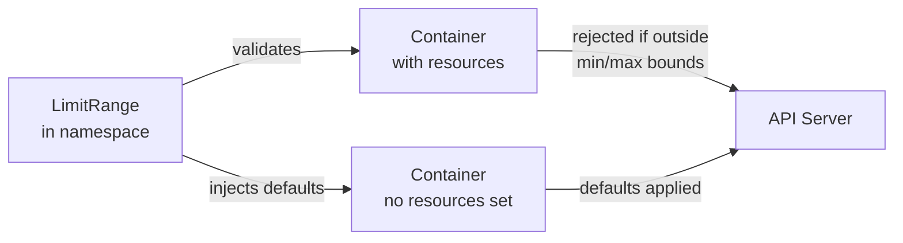
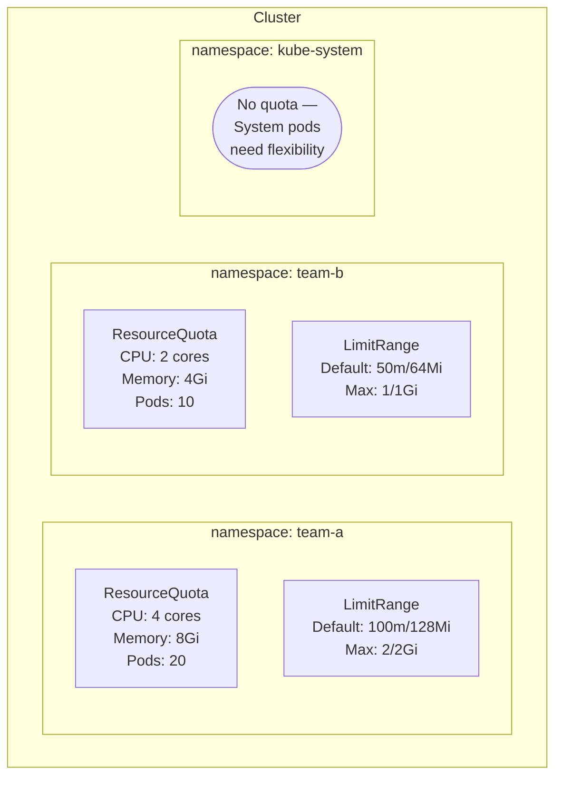
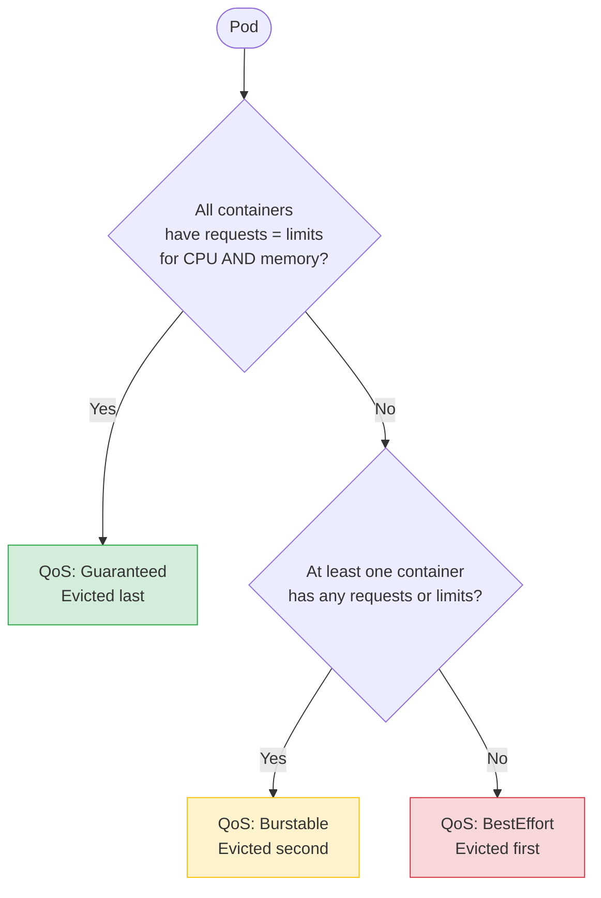

# Resource Management
> Module 14 · Lesson 03 | [↑ Course Index](../README.md)

## Table of Contents
1. [Resource Requests vs Limits](#resource-requests-vs-limits)
2. [LimitRanges — Per-Namespace Defaults](#limitranges--per-namespace-defaults)
3. [ResourceQuotas — Per-Namespace Totals](#resourcequotas--per-namespace-totals)
4. [Namespace Resource Isolation](#namespace-resource-isolation)
5. [Horizontal Pod Autoscaler (HPA)](#horizontal-pod-autoscaler-hpa)
6. [Vertical Pod Autoscaler (VPA)](#vertical-pod-autoscaler-vpa)
7. [Priority Classes](#priority-classes)
8. [Quality of Service Classes](#quality-of-service-classes)
9. [k3s-Specific Resource Considerations](#k3s-specific-resource-considerations)

---

## Resource Requests vs Limits

Every container in a pod can declare resource requirements.

| Field | Meaning | Effect |
|---|---|---|
| `requests.cpu` | Guaranteed CPU allocation | Used by scheduler to find a node with enough headroom |
| `requests.memory` | Guaranteed memory allocation | Used by scheduler; Linux OOM killer respects this |
| `limits.cpu` | Maximum CPU usage | CPU is **throttled** (cgroups) — never killed for CPU |
| `limits.memory` | Maximum memory usage | Container is **OOM-killed** if it exceeds this |

```yaml
resources:
  requests:
    cpu: "100m"       # 0.1 CPU core
    memory: "128Mi"   # 128 mebibytes
  limits:
    cpu: "500m"       # 0.5 CPU core (throttled beyond this)
    memory: "256Mi"   # 256 MiB (OOM-killed beyond this)
```

### CPU Units

| Notation | Meaning |
|---|---|
| `1` | 1 full CPU core (1000 millicores) |
| `500m` | Half a CPU core (500 millicores) |
| `100m` | 0.1 CPU core |
| `10m` | 10 millicores (minimum schedulable unit) |

### Memory Units

| Notation | Meaning |
|---|---|
| `128Mi` | 128 mebibytes (134,217,728 bytes) — **preferred** |
| `128M` | 128 megabytes (134,000,000 bytes) |
| `1Gi` | 1 gibibyte |
| `1G` | 1 gigabyte |

> Always use `Mi`/`Gi` (binary) notation to avoid confusion with SI prefixes.

[↑ Back to TOC](#table-of-contents) · [↑ Course Index](../README.md)

---

## LimitRanges — Per-Namespace Defaults

A `LimitRange` sets default resource values for containers that don't specify their own. It also
enforces minimum and maximum bounds.



### LimitRange Fields

| Field | Scope | Description |
|---|---|---|
| `default` | Container | Default `limits` if container doesn't set them |
| `defaultRequest` | Container | Default `requests` if container doesn't set them |
| `max` | Container / Pod | Maximum allowed value |
| `min` | Container / Pod | Minimum allowed value |
| `maxLimitRequestRatio` | Container | Max ratio of `limits` to `requests` |

### Example LimitRange

```yaml
apiVersion: v1
kind: LimitRange
metadata:
  name: default-limits
  namespace: my-app
spec:
  limits:
    # --- Container-level limits ---
    - type: Container
      # These defaults are applied to containers that don't specify resources
      default:
        cpu: "500m"
        memory: "256Mi"
      defaultRequest:
        cpu: "100m"
        memory: "128Mi"
      # Hard maximums — admission webhook rejects anything higher
      max:
        cpu: "2"
        memory: "2Gi"
      # Hard minimums
      min:
        cpu: "10m"
        memory: "16Mi"

    # --- Pod-level limits (sum of all containers in the pod) ---
    - type: Pod
      max:
        cpu: "4"
        memory: "4Gi"
```

```bash
# Apply
kubectl apply -f limit-range.yaml

# View effective limits
kubectl describe limitrange default-limits -n my-app

# Test: create a pod without resource spec — it will get the defaults
kubectl run test-defaults \
  --image=nginx:alpine \
  -n my-app \
  --restart=Never \
  -- sleep infinity

kubectl get pod test-defaults -n my-app \
  -o jsonpath='{.spec.containers[0].resources}' | jq .
```

[↑ Back to TOC](#table-of-contents) · [↑ Course Index](../README.md)

---

## ResourceQuotas — Per-Namespace Totals

A `ResourceQuota` caps the **total** resource consumption across all objects in a namespace.

```yaml
apiVersion: v1
kind: ResourceQuota
metadata:
  name: team-quota
  namespace: team-a
spec:
  hard:
    # --- Compute resources ---
    requests.cpu: "2"          # Total CPU requests across all pods
    limits.cpu: "4"            # Total CPU limits across all pods
    requests.memory: "2Gi"     # Total memory requests
    limits.memory: "4Gi"       # Total memory limits

    # --- Object counts ---
    pods: "10"                 # Max number of pods
    services: "5"
    persistentvolumeclaims: "3"
    configmaps: "10"
    secrets: "20"
    services.loadbalancers: "1"
    services.nodeports: "0"    # Disallow NodePort services
```

### Checking Quota Usage

```bash
kubectl get resourcequota -n team-a
kubectl describe resourcequota team-quota -n team-a

# Example output:
# Name:                   team-quota
# Namespace:              team-a
# Resource                Used    Hard
# --------                ----    ----
# limits.cpu              1200m   4
# limits.memory           768Mi   4Gi
# pods                    3       10
# requests.cpu            300m    2
# requests.memory         384Mi   2Gi
```

### Quota Scopes

Quotas can be scoped to match only certain types of pods:

```yaml
spec:
  hard:
    pods: "5"
  # Only apply this quota to non-terminating pods
  scopeSelector:
    matchExpressions:
      - operator: NotIn
        scopeName: Terminating
```

[↑ Back to TOC](#table-of-contents) · [↑ Course Index](../README.md)

---

## Namespace Resource Isolation

Combining LimitRange and ResourceQuota provides complete isolation between teams/applications.



### Template for Team Namespace Setup

```bash
# Create a namespace with quota and limits in one go
NS=team-a
kubectl create namespace "${NS}"
kubectl label namespace "${NS}" team="${NS}" environment=production
kubectl apply -f - <<EOF
apiVersion: v1
kind: ResourceQuota
metadata:
  name: team-quota
  namespace: ${NS}
spec:
  hard:
    requests.cpu: "2"
    limits.cpu: "4"
    requests.memory: 2Gi
    limits.memory: 4Gi
    pods: "10"
---
apiVersion: v1
kind: LimitRange
metadata:
  name: default-limits
  namespace: ${NS}
spec:
  limits:
    - type: Container
      default: { cpu: 500m, memory: 256Mi }
      defaultRequest: { cpu: 100m, memory: 128Mi }
      max: { cpu: "2", memory: 2Gi }
      min: { cpu: 10m, memory: 16Mi }
EOF
```

[↑ Back to TOC](#table-of-contents) · [↑ Course Index](../README.md)

---

## Horizontal Pod Autoscaler (HPA)

HPA automatically adjusts the number of pod replicas based on observed metrics.

```yaml
apiVersion: autoscaling/v2
kind: HorizontalPodAutoscaler
metadata:
  name: my-api-hpa
  namespace: my-app
spec:
  scaleTargetRef:
    apiVersion: apps/v1
    kind: Deployment
    name: my-api
  minReplicas: 2
  maxReplicas: 10
  metrics:
    # Scale based on CPU utilization
    - type: Resource
      resource:
        name: cpu
        target:
          type: Utilization
          averageUtilization: 70    # Target 70% of requests.cpu
    # Scale based on memory utilization
    - type: Resource
      resource:
        name: memory
        target:
          type: Utilization
          averageUtilization: 80
  behavior:
    scaleUp:
      stabilizationWindowSeconds: 0    # Scale up immediately
      policies:
        - type: Pods
          value: 2
          periodSeconds: 60
    scaleDown:
      stabilizationWindowSeconds: 300  # Wait 5 min before scaling down
```

```bash
# HPA requires the Metrics Server (included in k3s)
kubectl top pods -n my-app

# Check HPA status
kubectl get hpa -n my-app
kubectl describe hpa my-api-hpa -n my-app
```

[↑ Back to TOC](#table-of-contents) · [↑ Course Index](../README.md)

---

## Vertical Pod Autoscaler (VPA)

VPA automatically adjusts pod `requests` and `limits` based on actual usage history. Unlike HPA,
VPA changes the pod size rather than the replica count.

> VPA is **not** bundled with k3s and must be installed separately.

```bash
# Install VPA
git clone https://github.com/kubernetes/autoscaler.git
cd autoscaler/vertical-pod-autoscaler
./hack/vpa-up.sh
```

```yaml
apiVersion: autoscaling.k8s.io/v1
kind: VerticalPodAutoscaler
metadata:
  name: my-api-vpa
  namespace: my-app
spec:
  targetRef:
    apiVersion: apps/v1
    kind: Deployment
    name: my-api
  updatePolicy:
    updateMode: "Off"    # "Off" = recommend only (no auto-apply)
    # "Auto" = apply recommendations (causes pod restarts)
    # "Initial" = apply at pod creation only
```

```bash
# View VPA recommendations
kubectl describe vpa my-api-vpa -n my-app
# Look for the "Recommendation" section
```

> **HPA + VPA conflict:** Do not use both HPA (CPU-based) and VPA (Auto) on the same deployment.
> They will fight each other. Use HPA for scaling replicas and VPA in "Off" mode for sizing guidance.

[↑ Back to TOC](#table-of-contents) · [↑ Course Index](../README.md)

---

## Priority Classes

Priority classes determine which pods are scheduled first and which are evicted when resources are
scarce.

```yaml
# High-priority class for production workloads
apiVersion: scheduling.k8s.io/v1
kind: PriorityClass
metadata:
  name: high-priority
value: 1000
globalDefault: false
description: "Production workloads — preempts best-effort pods"

---
# Default class for standard workloads
apiVersion: scheduling.k8s.io/v1
kind: PriorityClass
metadata:
  name: standard
value: 500
globalDefault: true
description: "Default priority for regular workloads"

---
# Low-priority for batch / background jobs
apiVersion: scheduling.k8s.io/v1
kind: PriorityClass
metadata:
  name: low-priority
value: 100
description: "Background batch jobs — first to be evicted"
preemptionPolicy: Never   # Won't preempt other pods to get scheduled
```

### Using Priority Classes

```yaml
spec:
  priorityClassName: high-priority
  containers:
    - name: app
      image: my-app:latest
```

### Built-in System Priority Classes

| Name | Value | Description |
|---|---|---|
| `system-cluster-critical` | 2000000000 | Reserved for critical cluster components |
| `system-node-critical` | 2000001000 | Reserved for critical node components |

[↑ Back to TOC](#table-of-contents) · [↑ Course Index](../README.md)

---

## Quality of Service Classes

Kubernetes automatically assigns a Quality of Service (QoS) class to every pod based on its resource
configuration. QoS determines eviction order under memory pressure.

| QoS Class | Criteria | Eviction Order |
|---|---|---|
| `Guaranteed` | Every container has equal `requests` = `limits` for both CPU and memory | Last |
| `Burstable` | At least one container has requests or limits, but not Guaranteed | Middle |
| `BestEffort` | No container has any requests or limits | First |



### Guaranteed QoS Example

```yaml
resources:
  requests:
    cpu: "500m"
    memory: "256Mi"
  limits:
    cpu: "500m"     # exactly equal to requests
    memory: "256Mi" # exactly equal to requests
```

### Checking a Pod's QoS Class

```bash
kubectl get pod <pod-name> -o jsonpath='{.status.qosClass}'
# Guaranteed | Burstable | BestEffort
```

[↑ Back to TOC](#table-of-contents) · [↑ Course Index](../README.md)

---

## k3s-Specific Resource Considerations

### Server Node Overhead

In k3s, the server node runs both the Kubernetes control plane components and, by default, can also
schedule workloads. The k3s server process itself consumes resources that must be accounted for.

**Typical k3s server overhead (single-node):**

| Component | CPU | Memory |
|---|---|---|
| k3s server (API, controller, scheduler) | 100–300m | 256–512Mi |
| containerd | 50–100m | 64–128Mi |
| flannel / CoreDNS | 50–100m | 64–128Mi |
| **Total overhead** | **~300–500m** | **~400–768Mi** |

**Recommendation:** Reserve at least **1 CPU core** and **1 Gi memory** for the k3s server process
on dedicated server nodes.

### Preventing Workloads from Running on Server Nodes

```bash
# Taint server nodes to prevent user workloads
kubectl taint nodes <server-node> \
  node-role.kubernetes.io/control-plane:NoSchedule

# Or add the taint via k3s config (applied at startup):
# /etc/rancher/k3s/config.yaml
# node-taint:
#   - "node-role.kubernetes.io/control-plane:NoSchedule"
```

### SQLite Performance Limits

Single-node k3s with SQLite can become a bottleneck at scale:

| Scenario | SQLite | Embedded etcd |
|---|---|---|
| < 100 nodes, < 1000 pods | Suitable | Suitable |
| 100–500 nodes | Degraded | Suitable |
| > 500 nodes | Not recommended | Suitable |

If you hit SQLite performance limits, migrate to embedded etcd:

```bash
# Start k3s with --cluster-init to switch to embedded etcd
# (requires re-initialising the cluster)
```

### k3s Memory Optimisation Flags

```yaml
# /etc/rancher/k3s/config.yaml
# Reduce API server memory usage (at the cost of watch cache efficiency)
kube-apiserver-arg:
  - "watch-cache=false"
  - "default-watch-cache-size=0"
```

[↑ Back to TOC](#table-of-contents) · [↑ Course Index](../README.md)

---

*Licensed under [CC BY-NC-SA 4.0](../LICENSE.md) · © 2026 UncleJS*
