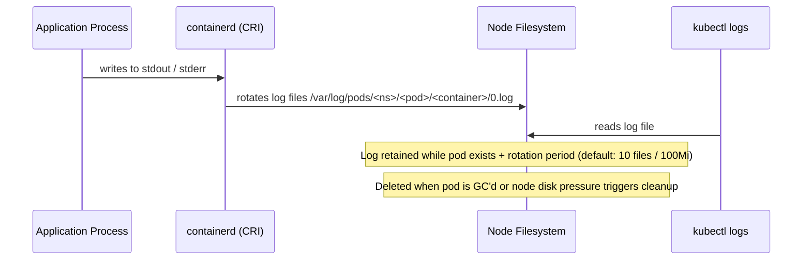

# Logs and Events
> Module 15 · Lesson 01 | [↑ Course Index](../README.md)


[](../README.md)
[](../LICENSE.md)

## Table of Contents
1. [kubectl logs — Pod Log Access](#kubectl-logs--pod-log-access)
2. [Pod Log Lifecycle](#pod-log-lifecycle)
3. [Cluster-Level Logging Options](#cluster-level-logging-options)
4. [kubectl events — Cluster Event Access](#kubectl-events--cluster-event-access)
5. [k3s Node Logs — journalctl](#k3s-node-logs--journalctl)
6. [Container Runtime Logs — containerd](#container-runtime-logs--containerd)
7. [Log Aggregation Overview](#log-aggregation-overview)
8. [Command Reference Table](#command-reference-table)

---

## kubectl logs — Pod Log Access

`kubectl logs` reads from the container's stdout/stderr stream as captured by containerd.

### Basic Usage

```bash
# Logs from a pod (last container's stdout)
kubectl logs <pod-name>

# Logs from a specific container in a multi-container pod
kubectl logs <pod-name> -c <container-name>

# Logs from all containers in a pod
kubectl logs <pod-name> --all-containers=true

# Stream logs in real time (follow)
kubectl logs <pod-name> -f
```

### Useful Flags

```bash
# Show only the last 100 lines
kubectl logs <pod-name> --tail=100

# Show logs from the last 30 minutes
kubectl logs <pod-name> --since=30m

# Show logs since a specific RFC3339 timestamp
kubectl logs <pod-name> --since-time="2026-03-01T06:00:00Z"

# Show logs from the PREVIOUS (crashed) container instance
kubectl logs <pod-name> --previous
# Alias: -p
kubectl logs <pod-name> -p

# Include timestamps from the container runtime
kubectl logs <pod-name> --timestamps=true

# Limit log stream to 5 MiB
kubectl logs <pod-name> --limit-bytes=5242880
```

### Multi-Pod Log Streaming

`kubectl logs` targets a single pod. For streaming from multiple pods matching a label:

```bash
# Using kubectl directly (streams from all matching pods)
kubectl logs -l app=my-api -f --max-log-requests=10

# Using stern (third-party, multi-pod log viewer)
stern -n my-app -l app=my-api
```

### Getting Logs for Completed / Evicted Pods

```bash
# List all pods including Completed and Evicted
kubectl get pods -A --show-all   # (--show-all deprecated; use -A)

# Get logs from a completed Job pod
kubectl logs job/<job-name>

# Get previous container logs after a CrashLoop
kubectl logs <pod-name> -p --tail=200
```

[↑ Back to TOC](#table-of-contents) · [↑ Course Index](../README.md)

---

## Pod Log Lifecycle

Understanding where logs live and when they are lost:



### Log File Location on Node

```bash
# Pod logs are stored at (on the node):
ls /var/log/pods/<namespace>_<pod-name>_<uid>/<container-name>/
# 0.log      ← current log file
# 0.log.gz   ← rotated / compressed

# Symlinked from:
ls /var/log/containers/
# <pod-name>_<namespace>_<container-name>-<container-id>.log -> /var/log/pods/...
```

### When Logs Are Lost

- Pod is deleted (GC removes log files after a configurable period)
- Node disk pressure triggers kubelet log rotation / cleanup
- Container restarted: previous logs accessible only via `--previous` for the **immediately prior**
  run; older runs are gone

[↑ Back to TOC](#table-of-contents) · [↑ Course Index](../README.md)

---

## Cluster-Level Logging Options

For production clusters, implement a centralised logging solution that aggregates logs before they
are lost on the node.

| Approach | Description | Complexity |
|---|---|---|
| **Node agent (DaemonSet)** | Agent on each node reads log files and ships them | Low |
| **Sidecar container** | Sidecar reads app log files and ships them | Medium |
| **Direct write** | App writes directly to a log backend (no agent) | Medium |

### Popular Stacks

| Stack | Components | Notes |
|---|---|---|
| **Grafana Loki** | Promtail (agent) + Loki (storage) + Grafana (UI) | Lightweight; recommended for k3s |
| **EFK** | Fluentd/Fluent Bit + Elasticsearch + Kibana | Heavier; powerful querying |
| **ELK** | Logstash + Elasticsearch + Kibana | Traditional; resource-intensive |

[↑ Back to TOC](#table-of-contents) · [↑ Course Index](../README.md)

---

## kubectl events — Cluster Event Access

Kubernetes Events are ephemeral API objects that record what happened to resources. They are stored
in etcd and expire after ~1 hour by default.

```bash
# All events in current namespace
kubectl get events

# All events cluster-wide
kubectl get events -A

# Events for a specific resource
kubectl describe pod <pod-name>   # Events section at the bottom

# Events sorted by time (most recent last)
kubectl get events --sort-by='.metadata.creationTimestamp'

# Events sorted by time (most recent first — reverse)
kubectl get events \
  --sort-by='.metadata.creationTimestamp' \
  -o json | jq '.items | reverse[] | [.lastTimestamp, .reason, .message] | @tsv' -r

# Filter only Warning events
kubectl get events --field-selector type=Warning

# Filter events for a specific object
kubectl get events \
  --field-selector involvedObject.name=<pod-name>

# Wide output — shows the object, reason, message, count
kubectl get events -A -o wide

# Watch events as they arrive
kubectl get events -A -w
```

### Event Fields

```bash
kubectl get events -A -o custom-columns=\
'TIME:.lastTimestamp,NS:.metadata.namespace,TYPE:.type,REASON:.reason,OBJECT:.involvedObject.name,MESSAGE:.message'
```

[↑ Back to TOC](#table-of-contents) · [↑ Course Index](../README.md)

---

## k3s Node Logs — journalctl

k3s runs as a systemd service. Its logs are captured by journald.

### Server Node Logs

```bash
# Follow k3s server logs in real time
sudo journalctl -u k3s -f

# Last 200 lines
sudo journalctl -u k3s -n 200

# Logs since a specific time
sudo journalctl -u k3s --since "2026-03-01 06:00:00"

# Logs between two times
sudo journalctl -u k3s \
  --since "2026-03-01 06:00:00" \
  --until "2026-03-01 06:30:00"

# Filter for errors only
sudo journalctl -u k3s -p err

# Output as JSON (for log shippers)
sudo journalctl -u k3s -o json | jq .

# Show only the last boot's logs
sudo journalctl -u k3s -b
```

### Agent Node Logs

```bash
# On an agent node:
sudo journalctl -u k3s-agent -f
sudo journalctl -u k3s-agent -n 200 --no-pager
```

### Filtering k3s Logs

```bash
# Find errors and warnings
sudo journalctl -u k3s | grep -E "ERROR|WARN|level=error|level=warn"

# Filter for a specific component (e.g., etcd, flannel)
sudo journalctl -u k3s | grep -i etcd
sudo journalctl -u k3s | grep -i flannel

# Watch for certificate errors
sudo journalctl -u k3s -f | grep -i "certificate\|tls\|x509"
```

[↑ Back to TOC](#table-of-contents) · [↑ Course Index](../README.md)

---

## Container Runtime Logs — containerd

k3s uses containerd as its container runtime. When a pod fails to start or images fail to pull, the
containerd logs may reveal the root cause.

```bash
# containerd logs (k3s bundles containerd into the k3s process)
# These appear within the k3s systemd journal:
sudo journalctl -u k3s | grep -i containerd

# For standalone containerd (if deployed separately):
sudo journalctl -u containerd -f
sudo journalctl -u containerd -n 100

# Inspect container state via crictl (CRI CLI, bundled with k3s)
sudo k3s crictl ps                          # List running containers
sudo k3s crictl ps -a                       # All containers including stopped
sudo k3s crictl logs <container-id>         # Logs for a specific container
sudo k3s crictl inspect <container-id>      # Full JSON container spec + state
sudo k3s crictl images                      # List cached images
sudo k3s crictl pull <image>                # Pull an image manually
sudo k3s crictl rmi <image>                 # Remove a cached image

# List pods known to containerd (at the CRI level)
sudo k3s crictl pods

# Get image pull events (useful for ImagePullBackOff debugging)
sudo k3s crictl pull nginx:badtag 2>&1
```

[↑ Back to TOC](#table-of-contents) · [↑ Course Index](../README.md)

---

## Log Aggregation Overview

For production clusters, implement one of these lightweight stacks:

### Grafana Loki + Promtail (Recommended for k3s)

```bash
# Add Grafana Helm repo
helm repo add grafana https://grafana.github.io/helm-charts
helm repo update

# Install Loki (single-node, simple scalable)
helm install loki grafana/loki \
  --namespace monitoring \
  --create-namespace \
  --set loki.commonConfig.replication_factor=1 \
  --set loki.storage.type=filesystem

# Install Promtail (log agent DaemonSet)
helm install promtail grafana/promtail \
  --namespace monitoring \
  --set config.lokiAddress=http://loki:3100/loki/api/v1/push
```

### Fluent Bit (Lightweight EFK alternative)

```bash
helm repo add fluent https://fluent.github.io/helm-charts
helm install fluent-bit fluent/fluent-bit \
  --namespace logging \
  --create-namespace
```

[↑ Back to TOC](#table-of-contents) · [↑ Course Index](../README.md)

---

## Command Reference Table

| Task | Command |
|---|---|
| View pod logs | `kubectl logs <pod>` |
| Stream pod logs | `kubectl logs <pod> -f` |
| Last N lines | `kubectl logs <pod> --tail=<N>` |
| Logs since duration | `kubectl logs <pod> --since=<duration>` (e.g., `30m`, `2h`) |
| Previous container | `kubectl logs <pod> -p` |
| Specific container | `kubectl logs <pod> -c <container>` |
| All containers | `kubectl logs <pod> --all-containers=true` |
| With timestamps | `kubectl logs <pod> --timestamps=true` |
| All events (namespace) | `kubectl get events` |
| All events (cluster) | `kubectl get events -A` |
| Warning events only | `kubectl get events --field-selector type=Warning` |
| Events for resource | `kubectl get events --field-selector involvedObject.name=<name>` |
| k3s server logs | `sudo journalctl -u k3s -f` |
| k3s agent logs | `sudo journalctl -u k3s-agent -f` |
| List CRI containers | `sudo k3s crictl ps -a` |
| CRI container logs | `sudo k3s crictl logs <container-id>` |
| CRI image list | `sudo k3s crictl images` |

[↑ Back to TOC](#table-of-contents) · [↑ Course Index](../README.md)

---

*Licensed under [CC BY-NC-SA 4.0](../LICENSE.md) · © 2026 UncleJS*
