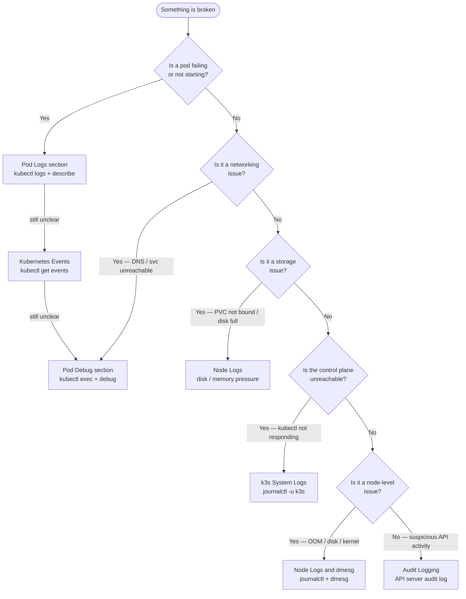
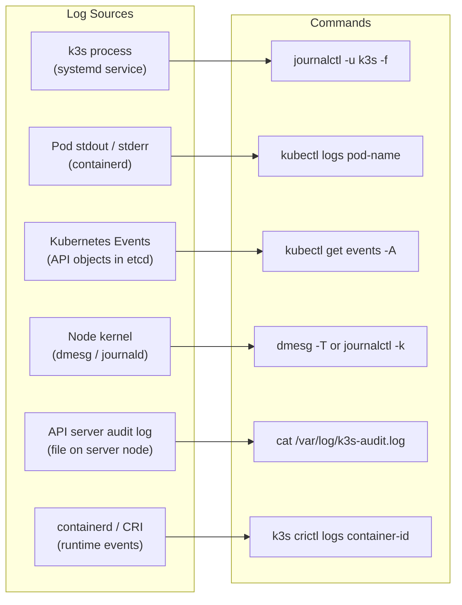
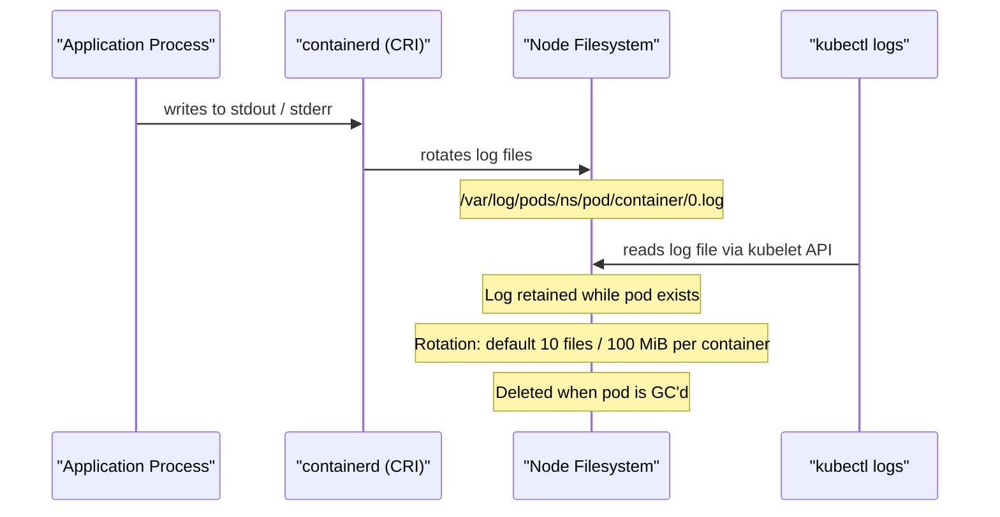

# Logs and Events
> Module 15 · Lesson 01 | [↑ Course Index](../README.md)

[](../README.md)
[](../LICENSE.md)

## Table of Contents
1. [Diagnostic Decision Tree](#diagnostic-decision-tree)
2. [Log Source Map](#log-source-map)
3. [k3s System Logs — journalctl](#k3s-system-logs--journalctl)
4. [Pod Logs — kubectl logs](#pod-logs--kubectl-logs)
5. [Pod Log Lifecycle](#pod-log-lifecycle)
6. [Kubernetes Events](#kubernetes-events)
7. [Node Logs and dmesg](#node-logs-and-dmesg)
8. [Audit Logging in k3s](#audit-logging-in-k3s)
9. [Container Runtime Logs — containerd](#container-runtime-logs--containerd)
10. [Structured Log Querying with jq](#structured-log-querying-with-jq)
11. [Log Aggregation with Loki (Preview)](#log-aggregation-with-loki-preview)
12. [Cluster-Level Logging Options](#cluster-level-logging-options)
13. [Command Reference Table](#command-reference-table)

---

## Diagnostic Decision Tree

Before diving into specific log sources, use this decision tree to route yourself to the right
section. Jumping directly to the wrong log source is a time-sink during incidents.



[↑ Back to TOC](#table-of-contents) · [↑ Course Index](../README.md)

---

## Log Source Map

Understanding where logs come from — and which command to use — prevents wasted time looking in the
wrong place.



Use this map as a quick reference when you receive an alert and need to triage quickly.

[↑ Back to TOC](#table-of-contents) · [↑ Course Index](../README.md)

---

## k3s System Logs — journalctl

k3s runs as a systemd service. All of its output — including logs from the embedded API server,
controller manager, scheduler, etcd, containerd, Flannel, and CoreDNS — is captured by journald.

### Basic Usage

```bash
# Follow k3s server logs in real time
sudo journalctl -u k3s -f

# Last 200 lines (no pager)
sudo journalctl -u k3s -n 200 --no-pager

# Logs since a specific time
sudo journalctl -u k3s --since "2026-03-01 06:00:00"

# Logs between two times
sudo journalctl -u k3s \
  --since "2026-03-01 06:00:00" \
  --until "2026-03-01 06:30:00"

# Show logs from the current boot only
sudo journalctl -u k3s -b

# Output as JSON (useful for log shippers)
sudo journalctl -u k3s -o json | jq .
```

### Agent Node Logs

```bash
# On an agent node, the service is k3s-agent (not k3s)
sudo journalctl -u k3s-agent -f
sudo journalctl -u k3s-agent -n 200 --no-pager
```

### Log Levels

k3s uses logrus for structured logging. The default log level is `info`. Log levels in order of
verbosity:

| Level | Flag | When to use |
|---|---|---|
| `trace` | `--log-level trace` | Deep internal debugging |
| `debug` | `--log-level debug` | Development and detailed tracing |
| `info` | (default) | Normal operations |
| `warn` | — | Warning conditions (output automatically) |
| `error` | — | Errors (output automatically) |
| `fatal` | — | Fatal errors causing exit |

To temporarily enable debug logging:

```bash
# Add --log-level=debug to k3s service configuration
sudo mkdir -p /etc/systemd/system/k3s.service.d/
cat > /etc/systemd/system/k3s.service.d/debug.conf <<'EOF'
[Service]
Environment=K3S_DEBUG=true
EOF

sudo systemctl daemon-reload
sudo systemctl restart k3s

# Remember to remove this override after debugging
sudo rm /etc/systemd/system/k3s.service.d/debug.conf
sudo systemctl daemon-reload && sudo systemctl restart k3s
```

### What to Look For in k3s Logs

```bash
# Find errors and warnings (logrus format)
sudo journalctl -u k3s | grep -E "level=error|level=warning|level=warn"

# Find standard log format errors
sudo journalctl -u k3s | grep -iE "ERROR|WARN|FATAL"

# Filter for a specific component
sudo journalctl -u k3s | grep -i etcd
sudo journalctl -u k3s | grep -i flannel
sudo journalctl -u k3s | grep -i "kube-apiserver"
sudo journalctl -u k3s | grep -i "controller-manager"

# Watch for certificate / TLS issues
sudo journalctl -u k3s -f | grep -i "certificate\|tls\|x509\|expired"

# Watch for OOM or resource pressure
sudo journalctl -u k3s -f | grep -iE "oom|evict|pressure"

# Watch for etcd issues
sudo journalctl -u k3s -f | grep -i "etcd\|raft\|election\|heartbeat"
```

### Common k3s Log Messages and Their Meaning

| Log message | Meaning | Action |
|---|---|---|
| `level=error msg="Failed to get lease"` | etcd election issue | Check etcd cluster health |
| `level=warn msg="Node is not ready"` | kubelet not reporting in | Check agent logs |
| `msg="certificate has expired"` | TLS cert expired | Rotate certificates |
| `msg="failed to connect to peer"` | etcd peer connectivity | Check network between nodes |
| `msg="no space left on device"` | Disk full | Free disk space immediately |

[↑ Back to TOC](#table-of-contents) · [↑ Course Index](../README.md)

---

## Pod Logs — kubectl logs

`kubectl logs` reads from the container's stdout/stderr stream as captured by containerd.

### Basic Usage

```bash
# Logs from a pod (last container's stdout)
kubectl logs <pod-name>

# Logs from a specific container in a multi-container pod
kubectl logs <pod-name> -c <container-name>

# Logs from all containers in a pod
kubectl logs <pod-name> --all-containers=true

# Stream logs in real time (follow)
kubectl logs <pod-name> -f
```

### Essential Flags

```bash
# Show only the last 100 lines
kubectl logs <pod-name> --tail=100

# Show logs from the last 30 minutes
kubectl logs <pod-name> --since=30m

# Show logs since a specific RFC3339 timestamp
kubectl logs <pod-name> --since-time="2026-03-01T06:00:00Z"

# Show logs from the PREVIOUS (crashed) container instance
kubectl logs <pod-name> --previous
# Alias: -p
kubectl logs <pod-name> -p

# Include timestamps from the container runtime
kubectl logs <pod-name> --timestamps=true

# Limit log stream to 5 MiB
kubectl logs <pod-name> --limit-bytes=5242880
```

### Init Container Logs

Init containers run before the main containers and can fail silently. Always check them when a pod
is stuck in `Init:CrashLoopBackOff` or `Init:0/1`.

```bash
# List init containers in a pod
kubectl get pod <pod-name> -o jsonpath='{.spec.initContainers[*].name}'

# Get logs from a specific init container
kubectl logs <pod-name> -c <init-container-name>

# Get previous init container logs after a crash
kubectl logs <pod-name> -c <init-container-name> --previous
```

### Multi-Pod Log Streaming

`kubectl logs` targets a single pod. For streaming from multiple pods matching a label:

```bash
# Using kubectl directly (streams from all matching pods)
kubectl logs -l app=my-api -f --max-log-requests=10

# Using stern (third-party, multi-pod log viewer — install separately)
# https://github.com/stern/stern
stern -n my-app -l app=my-api
stern --namespace my-app "my-api.*" --since 1h
```

### Getting Logs for Completed / Evicted Pods

```bash
# Get logs from a completed Job pod
kubectl logs job/<job-name>

# Get previous container logs after a CrashLoop
kubectl logs <pod-name> -p --tail=200

# List all pods including Completed
kubectl get pods -A --field-selector=status.phase!=Running
```

[↑ Back to TOC](#table-of-contents) · [↑ Course Index](../README.md)

---

## Pod Log Lifecycle

Understanding where logs live and when they are lost:



### Log File Location on Node

```bash
# Pod logs are stored at (on the node):
ls /var/log/pods/<namespace>_<pod-name>_<uid>/<container-name>/
# 0.log      <- current log file
# 0.log.gz   <- rotated / compressed

# Symlinked from:
ls /var/log/containers/
# <pod-name>_<namespace>_<container-name>-<container-id>.log -> /var/log/pods/...
```

### When Logs Are Lost

- Pod is deleted (GC removes log files after a configurable period)
- Node disk pressure triggers kubelet log rotation / cleanup
- Container restarted: previous logs accessible only via `--previous` for the **immediately prior**
  run; older runs are gone
- Node is replaced or reimaged

This is why log aggregation (Loki/EFK) is essential for any production cluster.

[↑ Back to TOC](#table-of-contents) · [↑ Course Index](../README.md)

---

## Kubernetes Events

Kubernetes Events are ephemeral API objects that record what happened to resources. They are stored
in etcd and expire after ~1 hour by default. Events are the first place to look when a pod is
stuck in `Pending`, `ContainerCreating`, or has unexpected restarts.

### Basic Commands

```bash
# All events in current namespace
kubectl get events

# All events cluster-wide
kubectl get events -A

# Events for a specific resource (shown at bottom of describe output)
kubectl describe pod <pod-name>

# Events sorted by time (most recent last)
kubectl get events --sort-by='.metadata.creationTimestamp'

# Filter only Warning events
kubectl get events --field-selector type=Warning

# Filter events for a specific object
kubectl get events \
  --field-selector involvedObject.name=<pod-name>

# Wide output — shows the object, reason, message, count
kubectl get events -A -o wide

# Watch events as they arrive (live stream)
kubectl get events -A -w
```

### Sorting Events by Most Recent First

The default sort puts most recent events last. To reverse:

```bash
kubectl get events \
  --sort-by='.metadata.creationTimestamp' \
  -o json | jq '.items | reverse[] | [.lastTimestamp, .reason, .message] | @tsv' -r
```

### Custom Columns for Events

```bash
kubectl get events -A -o custom-columns=\
'TIME:.lastTimestamp,NS:.metadata.namespace,TYPE:.type,REASON:.reason,OBJECT:.involvedObject.name,MESSAGE:.message'
```

### Important Event Reasons and Their Meaning

| Reason | Type | Meaning |
|---|---|---|
| `Scheduled` | Normal | Pod assigned to a node |
| `Pulling` | Normal | Image pull started |
| `Pulled` | Normal | Image pulled successfully |
| `Created` | Normal | Container created |
| `Started` | Normal | Container started |
| `BackOff` | Warning | Container restart backoff |
| `Failed` | Warning | Container or operation failed |
| `FailedScheduling` | Warning | Scheduler could not place the pod |
| `FailedMount` | Warning | Volume mount failed |
| `OOMKilling` | Warning | Container OOM killed |
| `EvictionThresholdMet` | Warning | Node under memory/disk pressure |
| `NodeNotReady` | Warning | Node reporting not ready |
| `Unhealthy` | Warning | Readiness/liveness probe failed |

[↑ Back to TOC](#table-of-contents) · [↑ Course Index](../README.md)

---

## Node Logs and dmesg

When pod or container diagnostics do not reveal the root cause, the issue may be at the node level:
OOM killer invocations, disk full conditions, kernel panics, hardware errors, or network driver
issues all appear in node-level logs rather than Kubernetes logs.

### dmesg — Kernel Ring Buffer

```bash
# Show the kernel ring buffer (most recent messages)
dmesg -T

# Filter for OOM killer messages
dmesg -T | grep -i "oom\|out of memory\|killed process"

# Filter for disk errors
dmesg -T | grep -iE "I/O error|EXT4-fs error|SCSI error|blk_update_request"

# Filter for network issues
dmesg -T | grep -iE "link is down|carrier lost|eth0|ens"

# Follow new kernel messages (like tail -f)
dmesg -Tw
```

### journalctl for Node-Level Issues

```bash
# All kernel messages via journald
sudo journalctl -k -f

# Kernel messages from this boot
sudo journalctl -k -b

# OOM events
sudo journalctl -k | grep -i "oom\|out of memory"

# Systemd unit failures
sudo journalctl -p err -b

# Disk / filesystem errors
sudo journalctl -b | grep -iE "ext4|xfs|btrfs|I/O error|disk full"
```

### When to Check Node Logs

Check node-level logs when you see:

| Symptom | What to check |
|---|---|
| Pod OOMKilled (exit code 137) | `dmesg -T | grep oom` |
| PVC mount fails with I/O error | `dmesg -T | grep -i "i/o error"` |
| Node shows `MemoryPressure` condition | `free -h` + `dmesg | grep oom` |
| Node shows `DiskPressure` condition | `df -h` + `du -sh /var/lib/rancher/k3s/` |
| Unexpected node reboots | `sudo journalctl -b -1` (previous boot) |
| Network connectivity issues | `dmesg | grep -i "link is down"` |

### Checking Node Conditions

```bash
# Node conditions include MemoryPressure, DiskPressure, PIDPressure, NetworkUnavailable
kubectl describe node <node-name> | grep -A20 "Conditions:"

# Check allocatable vs actual resource usage
kubectl describe node <node-name> | grep -A5 "Allocatable:"
kubectl top node <node-name>   # requires metrics-server
```

[↑ Back to TOC](#table-of-contents) · [↑ Course Index](../README.md)

---

## Audit Logging in k3s

The Kubernetes API server audit log records every request made to the API server: who made it, what
resource was accessed, what action was taken, and whether it succeeded. Audit logs are essential for
security forensics, compliance, and debugging mysterious state changes.

### Enabling Audit Logging in k3s

k3s passes audit flags directly to the embedded kube-apiserver via the `--kube-apiserver-arg` flag.

**Step 1: Create an audit policy file.**

```yaml
# /etc/k3s/audit-policy.yaml
apiVersion: audit.k8s.io/v1
kind: Policy
rules:
  # Log all requests at the Metadata level (who, what resource, response code — no request body)
  - level: Metadata
    omitStages:
      - RequestReceived

  # Log full RequestResponse for Secrets and ConfigMaps (captures data changes)
  - level: RequestResponse
    resources:
      - group: ""
        resources: ["secrets", "configmaps"]

  # Ignore noisy read-only requests from system components
  - level: None
    users: ["system:kube-proxy"]
    verbs: ["watch", "list", "get"]

  - level: None
    nonResourceURLs:
      - "/healthz*"
      - "/readyz*"
      - "/livez*"
      - "/metrics"
```

**Step 2: Configure k3s to use the audit policy.**

```bash
# Create the k3s configuration file (or add to existing)
cat >> /etc/rancher/k3s/config.yaml <<'EOF'
kube-apiserver-arg:
  - "audit-log-path=/var/log/k3s-audit.log"
  - "audit-policy-file=/etc/k3s/audit-policy.yaml"
  - "audit-log-maxage=30"       # Keep audit logs for 30 days
  - "audit-log-maxbackup=10"    # Keep 10 rotated audit log files
  - "audit-log-maxsize=100"     # Rotate when file reaches 100 MiB
EOF

sudo systemctl restart k3s
```

**Step 3: Verify audit logging is active.**

```bash
ls -la /var/log/k3s-audit.log
sudo tail -5 /var/log/k3s-audit.log | jq .
```

### Reading Audit Logs

Audit log entries are JSON objects, one per line. Key fields:

```bash
# Who deleted something in the last hour?
sudo jq 'select(.verb == "delete") | {time: .requestReceivedTimestamp, user: .user.username, resource: .objectRef.resource, name: .objectRef.name}' \
  /var/log/k3s-audit.log

# All failed requests (responseStatus.code >= 400)
sudo jq 'select(.responseStatus.code >= 400) | {time: .requestReceivedTimestamp, code: .responseStatus.code, user: .user.username, url: .requestURI}' \
  /var/log/k3s-audit.log

# Who created or modified Secrets?
sudo jq 'select(.objectRef.resource == "secrets" and (.verb == "create" or .verb == "update" or .verb == "patch"))' \
  /var/log/k3s-audit.log
```

### Example Audit Policy for Compliance

```yaml
# Audit policy suitable for CIS Kubernetes Benchmark compliance
apiVersion: audit.k8s.io/v1
kind: Policy
rules:
  - level: RequestResponse
    users: ["admin"]          # Full audit trail for admin users
  - level: Metadata
    verbs: ["create", "update", "patch", "delete"]  # All mutations
  - level: None
    resources:
      - group: ""
        resources: ["events"]   # Events are noisy, skip them
  - level: Metadata             # Everything else at metadata level
```

[↑ Back to TOC](#table-of-contents) · [↑ Course Index](../README.md)

---

## Container Runtime Logs — containerd

k3s uses containerd as its container runtime. When a pod fails to start or images fail to pull, the
containerd logs may reveal the root cause.

```bash
# containerd logs (k3s bundles containerd into the k3s process)
# These appear within the k3s systemd journal:
sudo journalctl -u k3s | grep -i containerd

# Inspect container state via crictl (CRI CLI, bundled with k3s)
sudo k3s crictl ps                          # List running containers
sudo k3s crictl ps -a                       # All containers including stopped
sudo k3s crictl logs <container-id>         # Logs for a specific container
sudo k3s crictl inspect <container-id>      # Full JSON container spec + state
sudo k3s crictl images                      # List cached images
sudo k3s crictl pull <image>                # Pull an image manually
sudo k3s crictl rmi <image>                 # Remove a cached image

# List pods known to containerd (at the CRI level)
sudo k3s crictl pods

# Get image pull events (useful for ImagePullBackOff debugging)
sudo k3s crictl pull nginx:badtag 2>&1
```

[↑ Back to TOC](#table-of-contents) · [↑ Course Index](../README.md)

---

## Structured Log Querying with jq

Many Kubernetes commands support `-o json` output. Combining this with `jq` enables powerful,
ad-hoc log analysis without a dedicated log aggregation platform.

### Practical jq Examples

```bash
# Get all pods that are NOT in Running phase
kubectl get pods -A -o json | jq \
  '.items[] | select(.status.phase != "Running") | {ns: .metadata.namespace, name: .metadata.name, phase: .status.phase}'

# Find containers with non-zero restart counts
kubectl get pods -A -o json | jq \
  '.items[].status.containerStatuses[]? | select(.restartCount > 0) | {name: .name, restarts: .restartCount}'

# Get the last termination reason for every container
kubectl get pods -A -o json | jq \
  '.items[] | {pod: .metadata.name, ns: .metadata.namespace, containers: [.status.containerStatuses[]? | {name: .name, lastState: .lastState.terminated}]}'

# Find pods using more memory than their limit (if metrics-server installed)
kubectl top pods -A --no-headers | awk '$4 > 500 {print $0}'

# Find all Warning events sorted by time
kubectl get events -A -o json | jq \
  '[.items[] | select(.type == "Warning")] | sort_by(.lastTimestamp) | reverse[] | {time: .lastTimestamp, ns: .metadata.namespace, reason: .reason, msg: .message}'

# Extract resource requests and limits from all pods
kubectl get pods -A -o json | jq \
  '[.items[] | {pod: .metadata.name, ns: .metadata.namespace, containers: [.spec.containers[] | {name: .name, requests: .resources.requests, limits: .resources.limits}]}]'
```

### Parsing k3s Journal Logs as JSON

```bash
# k3s logs can be output as JSON by journald
sudo journalctl -u k3s -o json | jq \
  'select(.PRIORITY == "3" or .PRIORITY == "4") | {time: .__REALTIME_TIMESTAMP, msg: .MESSAGE}'
```

### Using kubectl with Custom Columns

When you don't need the full JSON pipeline, custom columns are faster:

```bash
# Show pod name, node, phase, and IP
kubectl get pods -A -o custom-columns=\
'NS:.metadata.namespace,NAME:.metadata.name,NODE:.spec.nodeName,PHASE:.status.phase,IP:.status.podIP'

# Show container restart counts
kubectl get pods -A -o custom-columns=\
'NS:.metadata.namespace,NAME:.metadata.name,RESTARTS:.status.containerStatuses[0].restartCount'
```

[↑ Back to TOC](#table-of-contents) · [↑ Course Index](../README.md)

---

## Log Aggregation with Loki (Preview)

Node-level log rotation and the ephemeral nature of pod logs make it essential to ship logs to a
centralised store for any production cluster. Grafana Loki is the recommended lightweight solution
for k3s.

### How Loki Works

Loki stores logs as compressed chunks in object storage (local filesystem, S3, or MinIO). Unlike
Elasticsearch, Loki does not index log content — it indexes only metadata labels. This makes it
dramatically cheaper to run while still enabling powerful log queries via LogQL.

**Components:**
- **Promtail** — DaemonSet agent that reads `/var/log/pods/` and ships to Loki
- **Loki** — Log storage and query engine
- **Grafana** — Visualisation and search UI (or use `logcli` from the command line)

### Installing Loki + Promtail on k3s

```bash
helm repo add grafana https://grafana.github.io/helm-charts
helm repo update

# Install Loki (single-node, filesystem storage — suitable for small clusters)
helm install loki grafana/loki \
  --namespace monitoring \
  --create-namespace \
  --set loki.commonConfig.replication_factor=1 \
  --set loki.storage.type=filesystem \
  --set singleBinary.replicas=1

# Install Promtail (log agent DaemonSet)
helm install promtail grafana/promtail \
  --namespace monitoring \
  --set config.lokiAddress=http://loki.monitoring.svc.cluster.local:3100/loki/api/v1/push
```

### Querying Logs with LogQL

```bash
# Port-forward to Loki or use logcli
kubectl port-forward svc/loki -n monitoring 3100:3100 &

# Install logcli
LOKI_VERSION=v2.9.4
curl -fsSL "https://github.com/grafana/loki/releases/download/${LOKI_VERSION}/logcli-linux-amd64.zip" | \
  gunzip > /usr/local/bin/logcli && chmod +x /usr/local/bin/logcli

export LOKI_ADDR=http://localhost:3100

# Query: all logs from the my-app namespace in the last 1 hour
logcli query '{namespace="my-app"}' --since=1h

# Query: error logs from a specific app
logcli query '{namespace="my-app", app="my-api"} |= "ERROR"' --since=2h

# Query: structured log filter (JSON log lines)
logcli query '{namespace="my-app"} | json | level="error"' --since=1h

# Query: metric — log rate per second by namespace
logcli query 'sum by(namespace) (rate({job="containerd"}[5m]))'
```

### Promtail Configuration for k3s

Promtail automatically discovers pod logs on k3s nodes using its built-in Kubernetes service
discovery:

```yaml
# Custom Promtail config (values for Helm chart)
config:
  snippets:
    pipelineStages:
      - cri: {}             # Parse CRI-format log lines (containerd)
      - json:               # Parse JSON log messages
          expressions:
            level: level
            msg: msg
      - labels:
          level:            # Add 'level' as a Loki label for fast filtering
```

[↑ Back to TOC](#table-of-contents) · [↑ Course Index](../README.md)

---

## Cluster-Level Logging Options

For production clusters, implement a centralised logging solution that aggregates logs before they
are lost on the node.

| Approach | Description | Complexity |
|---|---|---|
| **Node agent (DaemonSet)** | Agent on each node reads log files and ships them | Low |
| **Sidecar container** | Sidecar reads app log files and ships them | Medium |
| **Direct write** | App writes directly to a log backend (no agent) | Medium |

### Popular Stacks

| Stack | Components | Notes |
|---|---|---|
| **Grafana Loki** | Promtail (agent) + Loki (storage) + Grafana (UI) | Lightweight; recommended for k3s |
| **EFK** | Fluentd/Fluent Bit + Elasticsearch + Kibana | Heavier; powerful querying |
| **ELK** | Logstash + Elasticsearch + Kibana | Traditional; resource-intensive |

### Fluent Bit (Lightweight Alternative)

```bash
helm repo add fluent https://fluent.github.io/helm-charts
helm install fluent-bit fluent/fluent-bit \
  --namespace logging \
  --create-namespace
```

[↑ Back to TOC](#table-of-contents) · [↑ Course Index](../README.md)

---

## Command Reference Table

| Task | Command |
|---|---|
| View pod logs | `kubectl logs <pod>` |
| Stream pod logs | `kubectl logs <pod> -f` |
| Last N lines | `kubectl logs <pod> --tail=<N>` |
| Logs since duration | `kubectl logs <pod> --since=<duration>` (e.g., `30m`, `2h`) |
| Previous container | `kubectl logs <pod> -p` |
| Specific container | `kubectl logs <pod> -c <container>` |
| Init container logs | `kubectl logs <pod> -c <init-container-name>` |
| All containers | `kubectl logs <pod> --all-containers=true` |
| With timestamps | `kubectl logs <pod> --timestamps=true` |
| All events (namespace) | `kubectl get events` |
| All events (cluster) | `kubectl get events -A` |
| Warning events only | `kubectl get events --field-selector type=Warning` |
| Events for resource | `kubectl get events --field-selector involvedObject.name=<name>` |
| Watch events live | `kubectl get events -A -w` |
| k3s server logs | `sudo journalctl -u k3s -f` |
| k3s agent logs | `sudo journalctl -u k3s-agent -f` |
| k3s error logs only | `sudo journalctl -u k3s -p err` |
| Kernel OOM messages | `dmesg -T | grep -i oom` |
| Node conditions | `kubectl describe node <node> | grep -A20 Conditions` |
| List CRI containers | `sudo k3s crictl ps -a` |
| CRI container logs | `sudo k3s crictl logs <container-id>` |
| CRI image list | `sudo k3s crictl images` |
| Pod restart counts | `kubectl get pods -A -o json | jq '...'` |
| Audit log (recent) | `sudo tail -f /var/log/k3s-audit.log | jq .` |

[↑ Back to TOC](#table-of-contents) · [↑ Course Index](../README.md)

---

*Licensed under [CC BY-NC-SA 4.0](../LICENSE.md) · © 2026 UncleJS*
