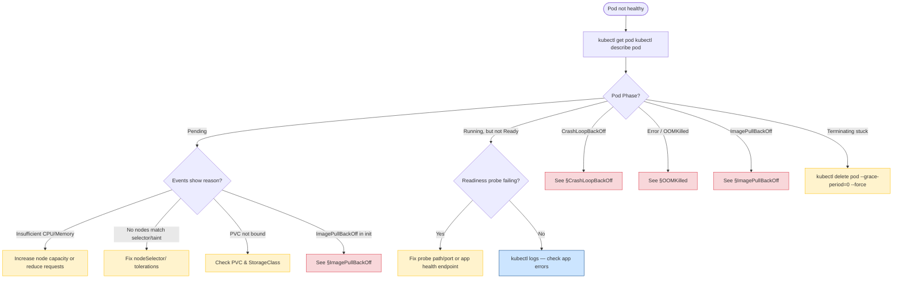

# Common Problems
> Module 15 · Lesson 02 | [↑ Course Index](../README.md)

## Table of Contents
1. [Pod State Decision Tree](#pod-state-decision-tree)
2. [ImagePullBackOff](#imagepullbackoff)
3. [CrashLoopBackOff](#crashloopbackoff)
4. [Pending Pods](#pending-pods)
5. [OOMKilled](#oomkilled)
6. [Node NotReady](#node-notready)
7. [Certificate Errors](#certificate-errors)
8. [DNS Failures](#dns-failures)
9. [Persistent Volume Issues](#persistent-volume-issues)
10. [RBAC Permission Errors](#rbac-permission-errors)

---

## Pod State Decision Tree



[↑ Back to TOC](#table-of-contents) · [↑ Course Index](../README.md)

---

## ImagePullBackOff

### Symptoms

```
STATUS: ImagePullBackOff
STATUS: ErrImagePull
```

The container image could not be pulled from the registry.

### Diagnosis

```bash
# Check the specific error message
kubectl describe pod <pod-name> | grep -A5 "Events:"
# Look for: Failed to pull image "...", reason: ...

# Common messages:
# "unauthorized: authentication required"
# "not found" or "manifest unknown"
# "connection refused" / "no route to host"
# "x509: certificate signed by unknown authority"
```

### Causes and Fixes

| Cause | Fix |
|---|---|
| Image tag does not exist | Verify the tag: `docker pull <image>:<tag>` |
| Private registry — no credentials | Create an `imagePullSecret` and reference it in the pod |
| Registry is unreachable from the cluster | Check DNS, firewall, proxy settings |
| Self-signed registry certificate | Configure containerd to trust the CA or use `insecure-registries` |

```bash
# Fix: Create an imagePullSecret for a private registry
kubectl create secret docker-registry regcred \
  --docker-server=registry.example.com \
  --docker-username=myuser \
  --docker-password=mypassword \
  --namespace=my-app

# Reference in pod spec:
# spec:
#   imagePullSecrets:
#     - name: regcred

# Fix: Configure k3s for an insecure registry
# /etc/rancher/k3s/registries.yaml (on every node):
# mirrors:
#   "registry.example.com":
#     endpoint:
#       - "http://registry.example.com"
# Then: sudo systemctl restart k3s (or k3s-agent)

# Test image pull manually
sudo k3s crictl pull registry.example.com/myimage:tag
```

[↑ Back to TOC](#table-of-contents) · [↑ Course Index](../README.md)

---

## CrashLoopBackOff

### Symptoms

```
STATUS: CrashLoopBackOff
RESTARTS: 5 (6m ago)
```

The container starts, crashes, Kubernetes restarts it, it crashes again. Kubernetes applies an
exponential back-off (10s → 20s → 40s → ... max 5 minutes) between restarts.

### Diagnosis

```bash
# Step 1: Check current logs (the RUNNING container)
kubectl logs <pod-name>

# Step 2: Check PREVIOUS container logs (the one that crashed)
kubectl logs <pod-name> -p
kubectl logs <pod-name> -p --tail=100

# Step 3: Check the exit code
kubectl describe pod <pod-name> | grep -A5 "Last State:"
# Last State:  Terminated
#   Reason:    Error
#   Exit Code: 1    ← application returned non-zero

# Step 4: Check events
kubectl describe pod <pod-name> | grep -A20 Events
```

### Common Causes and Fixes

| Exit Code | Meaning | Fix |
|---|---|---|
| 1 | Generic application error | Check app logs for startup errors |
| 2 | Bash/shell error | Check entrypoint script |
| 126 | Permission denied (cannot execute) | Fix file permissions in image |
| 127 | Command not found | Fix CMD/ENTRYPOINT in Dockerfile |
| 137 | OOMKilled (SIGKILL) | Increase memory limits |
| 139 | Segmentation fault | Application bug |
| 143 | Graceful SIGTERM | App didn't handle SIGTERM — may be normal |

```bash
# Fix: run the container locally to reproduce the crash
docker run --rm registry.example.com/myimage:tag

# Fix: exec into the container before it crashes (add a sleep)
# Temporarily override the command:
kubectl patch deployment my-app -p '{"spec":{"template":{"spec":{"containers":[{"name":"app","command":["sleep","infinity"]}]}}}}'
kubectl exec -it <pod-name> -- /bin/sh

# Fix: check if a ConfigMap/Secret is missing
kubectl describe pod <pod-name> | grep -i "envfrom\|secretkeyref\|configmapkeyref"
# Error: couldn't find key X in Secret default/my-secret
```

[↑ Back to TOC](#table-of-contents) · [↑ Course Index](../README.md)

---

## Pending Pods

### Symptoms

```
STATUS: Pending
(pod stays Pending for more than a few seconds)
```

### Diagnosis

```bash
kubectl describe pod <pod-name>
# Look at the Events section:
# Warning  FailedScheduling  0/3 nodes are available: ...

# Common messages:
# "Insufficient cpu"
# "Insufficient memory"
# "node(s) had untolerated taint"
# "node(s) didn't match Pod's node affinity/selector"
# "pod has unbound immediate PersistentVolumeClaims"
```

### Cause: Insufficient Resources

```bash
# Check node capacity vs allocated
kubectl describe nodes | grep -A8 "Allocated resources:"

# Check top nodes
kubectl top nodes

# Fix: scale down other workloads, or add nodes
```

### Cause: Node Selector / Taint Mismatch

```bash
# Check what taints nodes have
kubectl describe nodes | grep Taints

# Check what tolerations/selectors the pod has
kubectl get pod <pod-name> -o jsonpath='{.spec.tolerations}' | jq .
kubectl get pod <pod-name> -o jsonpath='{.spec.nodeSelector}' | jq .

# Fix: remove incorrect nodeSelector or add tolerations to the pod
```

### Cause: PVC Unbound

```bash
# Check PVC status
kubectl get pvc -n <namespace>
# STATUS: Pending ← the PVC itself cannot bind

# Check PVC events
kubectl describe pvc <pvc-name>
# "no persistent volumes available for this claim and no storage class is set"
# "storageclass.storage.k8s.io "local-path" not found"

# Fix: ensure default StorageClass exists
kubectl get storageclass
# If missing in k3s, install local-path-provisioner:
kubectl apply -f https://raw.githubusercontent.com/rancher/local-path-provisioner/master/deploy/local-path-storage.yaml
```

[↑ Back to TOC](#table-of-contents) · [↑ Course Index](../README.md)

---

## OOMKilled

### Symptoms

```
STATUS: OOMKilled
Exit Code: 137
RESTARTS: N
```

The container exceeded its memory `limit` and was killed by the Linux OOM killer.

### Diagnosis

```bash
# Check the container's last state
kubectl describe pod <pod-name>
# Last State: Terminated
#   Reason:   OOMKilled
#   Exit Code: 137

# Check memory usage before it was killed
kubectl top pod <pod-name> --containers

# Check historical memory usage (requires metrics-server)
kubectl top pods -A --sort-by=memory
```

### Fix

```bash
# Option 1: Increase memory limit
kubectl patch deployment <name> -p \
  '{"spec":{"template":{"spec":{"containers":[{"name":"app","resources":{"limits":{"memory":"512Mi"}}}]}}}}'

# Option 2: Investigate memory leak in the application
# Enable Go pprof or Java heap dumps

# Option 3: Check if the limit is unreasonably low
kubectl get pod <pod-name> -o jsonpath='{.spec.containers[0].resources}'
```

> **Tip:** A container is never killed for exceeding its CPU `limit` — it is only throttled.
> Only exceeding the memory `limit` causes an OOMKill.

[↑ Back to TOC](#table-of-contents) · [↑ Course Index](../README.md)

---

## Node NotReady

### Symptoms

```bash
kubectl get nodes
# NAME       STATUS     ROLES    AGE
# worker-2   NotReady   <none>   5d
```

### Diagnosis

```bash
# Step 1: Check node conditions
kubectl describe node <node-name>
# Look for: Conditions section
# KubeletReady       False  kubelet stopped posting node status
# DiskPressure       True   disk is nearly full
# MemoryPressure     True   node is low on memory
# PIDPressure        True   too many processes

# Step 2: Check kubelet (k3s-agent) on the node
sudo journalctl -u k3s-agent -n 100 --no-pager
# OR on server nodes:
sudo journalctl -u k3s -n 100 --no-pager

# Step 3: Check node resource usage
df -h          # disk
free -h        # memory
top            # CPU + processes
```

### Common Causes and Fixes

| Condition | Cause | Fix |
|---|---|---|
| `KubeletReady=False` | k3s-agent stopped | `sudo systemctl restart k3s-agent` |
| `DiskPressure=True` | Disk full | Clean up images: `sudo k3s crictl rmi --prune`; clean logs |
| `MemoryPressure=True` | RAM exhausted | Reduce pod density; add swap (not recommended for prod) |
| `NetworkUnavailable=True` | flannel not configured | Check flannel pod on the node |
| Network partition | Node cannot reach API server | Check firewall, VPN, MTU |

```bash
# Quick fix: restart k3s-agent
sudo systemctl restart k3s-agent
sleep 30
kubectl get nodes

# Clean up unused images (frees disk space)
sudo k3s crictl rmi --prune

# Clean up unused containers
sudo k3s crictl rm $(sudo k3s crictl ps -a -q --state Exited) 2>/dev/null || true
```

[↑ Back to TOC](#table-of-contents) · [↑ Course Index](../README.md)

---

## Certificate Errors

### Symptoms

```
x509: certificate signed by unknown authority
x509: certificate has expired or is not yet valid
tls: failed to verify certificate
```

### Diagnosis

```bash
# Check k3s certificate expiry
sudo k3s certificate check

# Or inspect manually
sudo openssl x509 -in /var/lib/rancher/k3s/server/tls/server-ca.crt \
  -noout -dates

# Check node certificate
sudo openssl x509 -in /var/lib/rancher/k3s/server/tls/serving-kube-apiserver.crt \
  -noout -dates

# Check if the clock is in sync (common cause of cert errors)
timedatectl status
chronyc tracking
```

### Fix: Rotate k3s Certificates

```bash
# k3s certificates expire after 1 year (auto-renewed if k3s restarts before expiry)
# Force certificate rotation:
sudo k3s certificate rotate

# Restart to apply:
sudo systemctl restart k3s
```

### Fix: Certificate Mismatch (node added with wrong IP/hostname)

```bash
# Regenerate certificates after a hostname/IP change:
sudo systemctl stop k3s
sudo rm -f /var/lib/rancher/k3s/server/tls/*.crt
sudo rm -f /var/lib/rancher/k3s/server/tls/*.key
sudo systemctl start k3s
# k3s will regenerate all certificates on startup
```

[↑ Back to TOC](#table-of-contents) · [↑ Course Index](../README.md)

---

## DNS Failures

### Symptoms

- Pods cannot resolve service names (e.g., `postgres.default.svc.cluster.local`)
- `nslookup` returns `NXDOMAIN` or times out inside a pod
- Applications log `dial tcp: lookup my-service: no such host`

### Diagnosis

```bash
# Step 1: Check CoreDNS pods are running
kubectl get pods -n kube-system -l k8s-app=kube-dns

# Step 2: Run DNS test from a pod
kubectl run dns-test --image=busybox:1.36 --rm -it --restart=Never -- \
  nslookup kubernetes.default.svc.cluster.local

# Step 3: Check CoreDNS logs
kubectl logs -n kube-system -l k8s-app=kube-dns --tail=50

# Step 4: Verify DNS ConfigMap
kubectl get configmap coredns -n kube-system -o yaml
```

### Common Causes and Fixes

```bash
# Fix 1: CoreDNS pods are crashing — restart them
kubectl rollout restart deployment/coredns -n kube-system

# Fix 2: DNS ConfigMap has an error
kubectl edit configmap coredns -n kube-system
# Ensure the Corefile syntax is correct

# Fix 3: Pod's /etc/resolv.conf is wrong (check inside the pod)
kubectl exec -it <pod-name> -- cat /etc/resolv.conf
# Should contain: nameserver 10.43.0.10 (or your cluster DNS IP)

# Fix 4: CoreDNS resource exhaustion — increase replicas
kubectl scale deployment coredns --replicas=3 -n kube-system

# Check cluster DNS service IP
kubectl get svc -n kube-system kube-dns
```

[↑ Back to TOC](#table-of-contents) · [↑ Course Index](../README.md)

---

## Persistent Volume Issues

### PVC Stuck in Pending

```bash
kubectl describe pvc <name> -n <namespace>
# "waiting for first consumer to be created before binding"
# → StorageClass has volumeBindingMode: WaitForFirstConsumer (expected)
# → PVC will bind when a pod is scheduled

# OR:
# "no persistent volumes available for this claim"
# → No matching PV exists and no dynamic provisioner is configured
kubectl get storageclass
kubectl get pv
```

### PV in Released or Failed State

```bash
# A PV in Released state was bound to a deleted PVC
# It will NOT rebind automatically (for data safety)
kubectl get pv

# Fix: patch the PV to remove the claimRef (allows rebinding)
kubectl patch pv <pv-name> -p '{"spec":{"claimRef": null}}'
```

### Volume Mount Failures

```bash
kubectl describe pod <pod-name>
# Events:
# Warning  FailedMount  Unable to attach or mount volumes:
#   MountVolume.SetUp failed: ...

# Fix: check if another pod is holding the ReadWriteOnce volume
kubectl get pvc <pvc-name>
# ACCESSMODE: RWO (ReadWriteOnce) — only one pod can mount at a time

# Find which pod has the volume mounted
kubectl get pods -A -o jsonpath='{range .items[*]}{.metadata.name}{"\t"}{.spec.volumes[*].persistentVolumeClaim.claimName}{"\n"}{end}' \
  | grep <pvc-name>
```

[↑ Back to TOC](#table-of-contents) · [↑ Course Index](../README.md)

---

## RBAC Permission Errors

### Symptoms

```
Error from server (Forbidden): pods is forbidden:
User "system:serviceaccount:my-app:my-sa" cannot list resource "pods"
in API group "" in the namespace "my-app"
```

### Diagnosis

```bash
# Check what permissions a service account has
kubectl auth can-i list pods \
  --namespace my-app \
  --as system:serviceaccount:my-app:my-sa

# List all RBAC bindings in a namespace
kubectl get rolebindings,clusterrolebindings -n my-app -o wide

# Describe the role to see its rules
kubectl describe role <role-name> -n my-app
kubectl describe clusterrole <clusterrole-name>

# Check if the service account exists
kubectl get serviceaccount -n my-app
```

### Fix

```bash
# Create a Role with the necessary permissions
kubectl create role pod-reader \
  --verb=get,list,watch \
  --resource=pods \
  -n my-app

# Bind the Role to the service account
kubectl create rolebinding pod-reader-binding \
  --role=pod-reader \
  --serviceaccount=my-app:my-sa \
  -n my-app

# Or use a ClusterRole for cluster-wide access:
kubectl create clusterrolebinding pod-reader-global \
  --clusterrole=view \
  --serviceaccount=my-app:my-sa

# Verify
kubectl auth can-i list pods \
  --namespace my-app \
  --as system:serviceaccount:my-app:my-sa
# yes
```

[↑ Back to TOC](#table-of-contents) · [↑ Course Index](../README.md)

---

*Licensed under [CC BY-NC-SA 4.0](../LICENSE.md) · © 2026 UncleJS*
