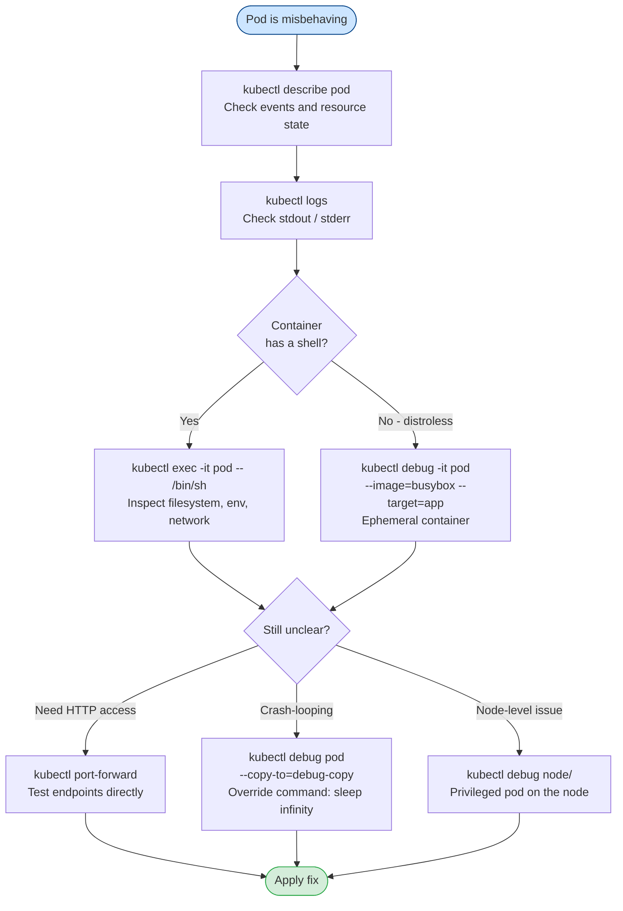

# Debugging Pods
> Module 15 · Lesson 03 | [↑ Course Index](../README.md)

## Table of Contents
1. [Debug Workflow Overview](#debug-workflow-overview)
2. [kubectl exec — Running Commands in a Container](#kubectl-exec--running-commands-in-a-container)
3. [kubectl debug — Ephemeral Containers](#kubectl-debug--ephemeral-containers)
4. [kubectl cp — Copying Files](#kubectl-cp--copying-files)
5. [kubectl port-forward — Direct Port Access](#kubectl-port-forward--direct-port-access)
6. [kubectl run — Temporary Debug Pods](#kubectl-run--temporary-debug-pods)
7. [Inspecting Running Processes](#inspecting-running-processes)
8. [Accessing the Node Filesystem from a Pod](#accessing-the-node-filesystem-from-a-pod)
9. [Kubernetes Debug Profiles](#kubernetes-debug-profiles)

---

## Debug Workflow Overview

When a pod is misbehaving, work through these layers from the inside out:



[↑ Back to TOC](#table-of-contents) · [↑ Course Index](../README.md)

---

## kubectl exec — Running Commands in a Container

`kubectl exec` runs a command inside a running container. Use it to inspect the container's
filesystem, environment, and process state.

```bash
# Open an interactive shell
kubectl exec -it <pod-name> -- /bin/sh
kubectl exec -it <pod-name> -- /bin/bash

# Exec into a specific container in a multi-container pod
kubectl exec -it <pod-name> -c <container-name> -- /bin/sh

# Run a one-off command (non-interactive)
kubectl exec <pod-name> -- env
kubectl exec <pod-name> -- cat /etc/config/app.yaml
kubectl exec <pod-name> -- ps aux
kubectl exec <pod-name> -- curl -s http://localhost:8080/healthz

# Check what files exist
kubectl exec <pod-name> -- ls -la /app

# Check network configuration inside the container
kubectl exec <pod-name> -- ip addr
kubectl exec <pod-name> -- netstat -tlpn
kubectl exec <pod-name> -- ss -tlpn

# Test connectivity to a service from inside the container
kubectl exec <pod-name> -- wget -qO- http://my-service.my-namespace.svc.cluster.local/
```

### When exec Fails

If the container has no shell (distroless or scratch-based images), `exec` will fail:

```
OCI runtime exec failed: exec failed: unable to start container process:
exec: "/bin/sh": stat /bin/sh: no such file or directory
```

In this case, use `kubectl debug` with an ephemeral container (see next section).

[↑ Back to TOC](#table-of-contents) · [↑ Course Index](../README.md)

---

## kubectl debug — Ephemeral Containers

Ephemeral containers are temporary containers added to a **running** pod for debugging purposes.
They share the pod's network namespace and can optionally share the process namespace.

> Requires Kubernetes 1.23+ (enabled by default). k3s includes this from v1.23+.

### Debug a Running Pod (No Shell Required)

```bash
# Add a debug container with a shell to a running pod
# (the target container shares its network/process namespace)
kubectl debug -it <pod-name> \
  --image=busybox:1.36 \
  --target=<container-name>

# Use a richer image for network debugging
kubectl debug -it <pod-name> \
  --image=nicolaka/netshoot \
  --target=<container-name>

# The --target flag shares the target container's process namespace
# This lets you see the target container's processes:
# ps aux → you will see the target container's processes too
```

### Debug a Crashed Pod (CrashLoopBackOff)

When a pod is crash-looping, you can copy it with a modified command:

```bash
# Create a copy of the pod with the command overridden to 'sleep infinity'
# The original pod continues running
kubectl debug <pod-name> \
  --copy-to=debug-copy \
  --image=<original-image> \
  -- sleep infinity

# Exec into the debug copy
kubectl exec -it debug-copy -- /bin/sh

# When done, delete the copy
kubectl delete pod debug-copy
```

### Debug a Node via a Privileged Pod

```bash
# Create a privileged debug pod on a specific node
# This mounts the host filesystem at /host
kubectl debug node/<node-name> \
  -it \
  --image=ubuntu:22.04

# Inside the debug pod, the node's filesystem is at /host:
chroot /host
# Now you are in a shell on the node's root filesystem
journalctl -u k3s -n 50
ls /var/lib/rancher/k3s/
```

[↑ Back to TOC](#table-of-contents) · [↑ Course Index](../README.md)

---

## kubectl cp — Copying Files

```bash
# Copy a file FROM a container TO your local machine
kubectl cp <pod-name>:/path/to/remote/file /local/destination

# Copy with a specific container name
kubectl cp <pod-name>:/app/logs/error.log ./error.log -c <container-name>

# Copy a file FROM your local machine TO a container
kubectl cp /local/config.yaml <pod-name>:/app/config.yaml

# Copy a directory
kubectl cp <pod-name>:/app/data/ ./data-backup/

# Cross-namespace
kubectl cp my-namespace/<pod-name>:/app/file.txt ./file.txt
```

> `kubectl cp` uses `tar` under the hood and requires `tar` to be present in the container.
> For distroless containers, use `kubectl debug` to add a sidecar with `tar`, then copy.

[↑ Back to TOC](#table-of-contents) · [↑ Course Index](../README.md)

---

## kubectl port-forward — Direct Port Access

`port-forward` creates a tunnel between your local machine and a port on a pod or service. It is
useful for accessing services that are not exposed externally.

```bash
# Forward local port 8080 to container port 80
kubectl port-forward pod/<pod-name> 8080:80

# Forward to a Service (uses the service's target port)
kubectl port-forward svc/<service-name> 8080:80

# Forward to a Deployment (picks any ready pod)
kubectl port-forward deployment/<deployment-name> 8080:80

# Forward multiple ports
kubectl port-forward pod/<pod-name> 8080:80 5432:5432

# Bind to a specific local address (default: 127.0.0.1)
kubectl port-forward pod/<pod-name> 8080:80 --address 0.0.0.0

# In a different namespace
kubectl port-forward -n my-app svc/my-api 8080:80
```

### Examples

```bash
# Debug a web app
kubectl port-forward pod/my-api-xxxx 8080:8080 &
curl http://localhost:8080/healthz

# Debug a database
kubectl port-forward pod/postgres-0 5432:5432 -n my-app &
psql -h localhost -U postgres

# Access Prometheus
kubectl port-forward svc/prometheus -n monitoring 9090:9090
# Then open http://localhost:9090 in your browser
```

[↑ Back to TOC](#table-of-contents) · [↑ Course Index](../README.md)

---

## kubectl run — Temporary Debug Pods

Use `kubectl run` to launch a one-off pod for testing connectivity, DNS, or other in-cluster
behaviour.

```bash
# Interactive shell with busybox
kubectl run debug-shell --rm -it --restart=Never \
  --image=busybox:1.36 \
  -- /bin/sh

# DNS test (nslookup)
kubectl run dns-test --rm -it --restart=Never \
  --image=busybox:1.36 \
  -- nslookup kubernetes.default.svc.cluster.local

# HTTP connectivity test
kubectl run http-test --rm -it --restart=Never \
  --image=curlimages/curl:8.6.0 \
  -- curl -v http://my-service.my-namespace.svc.cluster.local/healthz

# Run in a specific namespace
kubectl run debug-shell -n my-app --rm -it --restart=Never \
  --image=nicolaka/netshoot \
  -- /bin/bash

# Run on a specific node
kubectl run debug-shell --rm -it --restart=Never \
  --image=busybox:1.36 \
  --overrides='{"spec":{"nodeSelector":{"kubernetes.io/hostname":"worker-1"}}}' \
  -- /bin/sh
```

[↑ Back to TOC](#table-of-contents) · [↑ Course Index](../README.md)

---

## Inspecting Running Processes

### From Inside the Container

```bash
kubectl exec <pod-name> -- ps aux

# If ps is not available, read /proc directly
kubectl exec <pod-name> -- ls /proc
kubectl exec <pod-name> -- cat /proc/1/cmdline | tr '\0' ' '

# Check open file descriptors (if lsof is available)
kubectl exec <pod-name> -- lsof -p 1

# Check listening ports (ss or netstat)
kubectl exec <pod-name> -- ss -tlpn
kubectl exec <pod-name> -- netstat -tlpn 2>/dev/null || \
  kubectl exec <pod-name> -- ss -tlpn
```

### From the Node (via crictl)

```bash
# On the node, find the container ID
sudo k3s crictl ps | grep <pod-name>

# Inspect the container
sudo k3s crictl inspect <container-id>

# Get the container's PID on the host
CONTAINER_ID=$(sudo k3s crictl ps | grep <pod-name> | awk '{print $1}')
PID=$(sudo k3s crictl inspect ${CONTAINER_ID} | jq '.info.pid')

# Read the process's environment
sudo cat /proc/${PID}/environ | tr '\0' '\n'

# Read the process's open files
sudo ls -la /proc/${PID}/fd/

# Read the process's memory maps
sudo cat /proc/${PID}/maps | head -20
```

[↑ Back to TOC](#table-of-contents) · [↑ Course Index](../README.md)

---

## Accessing the Node Filesystem from a Pod

To inspect the host node's files from a privileged pod:

```bash
# Launch a privileged pod with the node's filesystem mounted at /host
kubectl run node-inspector --rm -it --restart=Never \
  --image=ubuntu:22.04 \
  --overrides='{
    "spec": {
      "hostPID": true,
      "hostNetwork": true,
      "tolerations": [{"operator":"Exists"}],
      "nodeSelector": {"kubernetes.io/hostname": "worker-1"},
      "containers": [{
        "name": "node-inspector",
        "image": "ubuntu:22.04",
        "command": ["/bin/bash"],
        "stdin": true,
        "tty": true,
        "securityContext": {"privileged": true},
        "volumeMounts": [{
          "name": "host-root",
          "mountPath": "/host"
        }]
      }],
      "volumes": [{
        "name": "host-root",
        "hostPath": {"path": "/"}
      }]
    }
  }'

# Inside the pod:
chroot /host bash
# You are now in a shell on the node
journalctl -u k3s -n 50
cat /var/lib/rancher/k3s/server/db/snapshots/
```

> **Security note:** Privileged pods with host filesystem access are extremely powerful.
> Remove them immediately after debugging. Never leave privileged debug pods running.

[↑ Back to TOC](#table-of-contents) · [↑ Course Index](../README.md)

---

## Kubernetes Debug Profiles

`kubectl debug` supports built-in profiles that preconfigure security contexts and volume mounts.

| Profile | Description | Use Case |
|---|---|---|
| `general` (default) | Non-privileged ephemeral container | Basic app debugging |
| `baseline` | Restricted capabilities, no host access | Security-conscious debugging |
| `restricted` | Most restrictive (Pod Security Standards) | Hardened environments |
| `sysadmin` | Privileged, host PID/IPC/Network | Node-level debugging |
| `netadmin` | `NET_ADMIN` + `NET_RAW` caps | Network packet inspection |

```bash
# Default (general) profile — most common
kubectl debug -it <pod-name> \
  --image=busybox:1.36 \
  --profile=general

# Network admin profile — for packet capture
kubectl debug -it <pod-name> \
  --image=nicolaka/netshoot \
  --profile=netadmin \
  --target=<container-name>

# Sysadmin profile for node debugging
kubectl debug node/<node-name> \
  -it \
  --image=ubuntu:22.04 \
  --profile=sysadmin
```

### Step-by-Step Debug Workflow Example

```bash
# Scenario: my-api pod is running but returning 500 errors

# Step 1: Check recent logs
kubectl logs my-api-xxxx --tail=50

# Step 2: Check events
kubectl describe pod my-api-xxxx | tail -20

# Step 3: Exec in and test connectivity
kubectl exec -it my-api-xxxx -- /bin/sh
# Inside: curl -v http://postgres.my-app:5432
# Inside: nslookup postgres.my-app.svc.cluster.local
# Inside: env | grep DATABASE

# Step 4: If no shell, add an ephemeral container
kubectl debug -it my-api-xxxx \
  --image=nicolaka/netshoot \
  --target=api

# Step 5: Port-forward and test locally
kubectl port-forward pod/my-api-xxxx 8080:8080 &
curl -v http://localhost:8080/api/v1/health

# Step 6: Copy config/log files for analysis
kubectl cp my-api-xxxx:/app/logs/app.log ./app.log

# Step 7: If crashed, create a debug copy
kubectl debug my-api-xxxx \
  --copy-to=my-api-debug \
  -- sleep infinity
kubectl exec -it my-api-debug -- /bin/sh
```

[↑ Back to TOC](#table-of-contents) · [↑ Course Index](../README.md)

---

*Licensed under [CC BY-NC-SA 4.0](../LICENSE.md) · © 2026 UncleJS*
