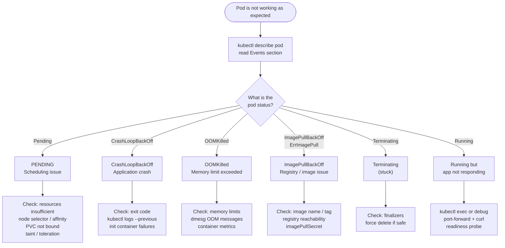
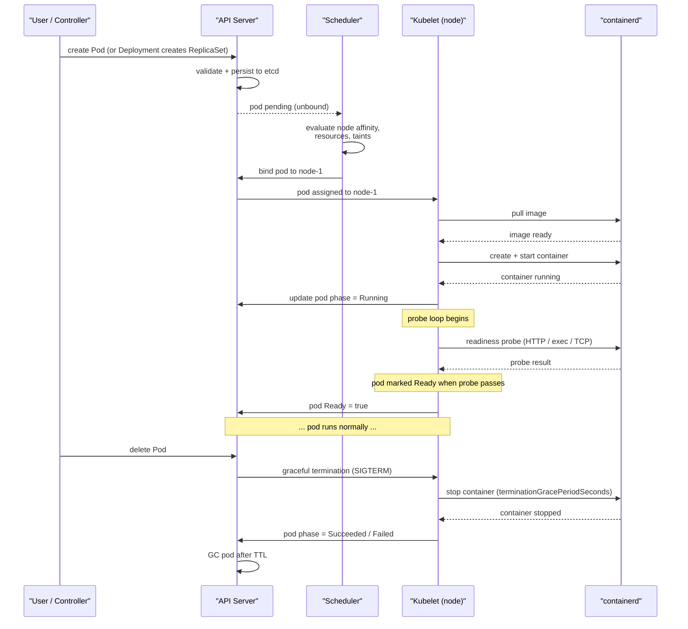
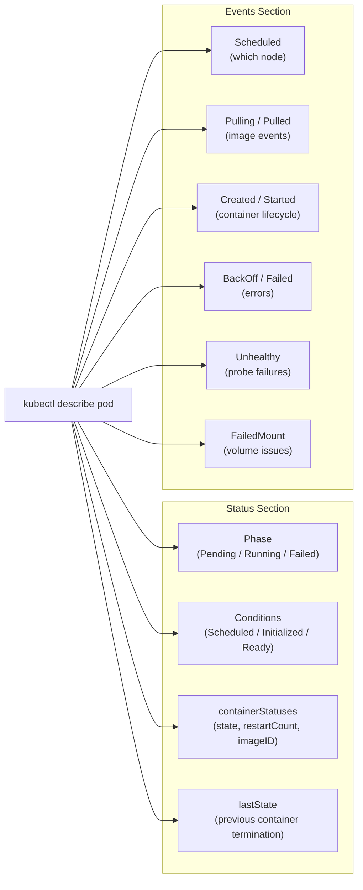

# Debugging Pods
> Module 15 · Lesson 03 | [↑ Course Index](../README.md)

[](../README.md)
[](../LICENSE.md)

## Table of Contents
1. [Pod Debug Decision Tree](#pod-debug-decision-tree)
2. [Pod Lifecycle](#pod-lifecycle)
3. [What kubectl describe pod Reveals](#what-kubectl-describe-pod-reveals)
4. [Pod Status Cheat Sheet](#pod-status-cheat-sheet)
5. [Pending Pods — Diagnosis](#pending-pods--diagnosis)
6. [CrashLoopBackOff — Diagnosis](#crashloopbackoff--diagnosis)
7. [ImagePullBackOff — Diagnosis](#imagepullbackoff--diagnosis)
8. [OOMKilled — Diagnosis](#oomkilled--diagnosis)
9. [Stuck Terminating Pods](#stuck-terminating-pods)
10. [Resource Contention](#resource-contention)
11. [kubectl exec — Running Commands in a Container](#kubectl-exec--running-commands-in-a-container)
12. [Debugging with Ephemeral Containers](#debugging-with-ephemeral-containers)
13. [kubectl cp — Copying Files](#kubectl-cp--copying-files)
14. [kubectl port-forward — Direct Port Access](#kubectl-port-forward--direct-port-access)
15. [kubectl run — Temporary Debug Pods](#kubectl-run--temporary-debug-pods)
16. [Inspecting Running Processes](#inspecting-running-processes)
17. [Accessing the Node Filesystem from a Pod](#accessing-the-node-filesystem-from-a-pod)
18. [Kubernetes Debug Profiles](#kubernetes-debug-profiles)

---

## Pod Debug Decision Tree

Start here. Routing yourself to the correct diagnosis path immediately saves significant time during
incidents.



[↑ Back to TOC](#table-of-contents) · [↑ Course Index](../README.md)

---

## Pod Lifecycle

Understanding the normal pod lifecycle helps you distinguish expected state transitions from genuine
failures.



### Phase Transitions

| Phase | Meaning |
|---|---|
| `Pending` | Created but not yet scheduled or containers not started |
| `Running` | At least one container is running |
| `Succeeded` | All containers exited with code 0 (Jobs) |
| `Failed` | All containers exited, at least one non-zero |
| `Unknown` | Node communication lost — pod state unknown |

[↑ Back to TOC](#table-of-contents) · [↑ Course Index](../README.md)

---

## What kubectl describe pod Reveals

`kubectl describe pod` is your single richest source of pod diagnostic data. It combines the pod
spec, status, conditions, and events into one view.



### Key Fields to Check

```bash
kubectl describe pod <pod-name> -n <namespace>

# What to look for in the output:
#
# Status:          Running / Pending / Terminating
# Conditions:
#   Type               Status
#   Initialized        True
#   Ready              False    <- pod not ready
#   ContainersReady    False
#   PodScheduled       True
#
# Containers:
#   my-container:
#     State:          Waiting
#       Reason:       CrashLoopBackOff
#     Last State:     Terminated
#       Reason:       Error
#       Exit Code:    1         <- non-zero = application error
#     Restart Count:  5
#
# Events:
#   Warning  BackOff         2m    kubelet  Back-off restarting failed container
#   Warning  FailedMount     5m    kubelet  MountVolume.SetUp failed for volume "data"
```

[↑ Back to TOC](#table-of-contents) · [↑ Course Index](../README.md)

---

## Pod Status Cheat Sheet

| Status / Condition | Meaning | First Diagnostic Step |
|---|---|---|
| `Pending` | Pod created but not running | `kubectl describe pod` — check Events |
| `ContainerCreating` | Image pulling or volume mounting | `kubectl describe pod` — check FailedMount events |
| `Running` | Container(s) running | Check readiness, liveness probes |
| `CrashLoopBackOff` | Container keeps crashing | `kubectl logs --previous` |
| `OOMKilled` | Container killed — memory limit exceeded | `kubectl describe pod` — check Exit Code 137 |
| `Error` | Container exited with non-zero code | `kubectl logs` for application error |
| `Completed` | Container exited with code 0 (Job/init container) | Normal — check if expected |
| `ImagePullBackOff` | Image pull failing with backoff | `kubectl describe pod` — check image name + Events |
| `ErrImagePull` | Image pull failed (first attempt) | `kubectl describe pod` — check registry |
| `Terminating` | Pod being deleted | Check for stuck finalizers |
| `Unknown` | kubelet can't report status | Check node health |
| `Init:0/1` | Init container running / waiting | `kubectl logs -c <init-container>` |
| `Init:CrashLoopBackOff` | Init container crash-looping | `kubectl logs -c <init-container> -p` |
| `PodInitializing` | Init containers done, main starting | Usually transient — wait |
| `Unschedulable` | Scheduler can't place pod | `kubectl describe pod` — check FailedScheduling |

[↑ Back to TOC](#table-of-contents) · [↑ Course Index](../README.md)

---

## Pending Pods — Diagnosis

A pod stuck in `Pending` means the scheduler could not place it on a node. There are four common
causes.

### 1. Insufficient Resources

The pod's resource requests exceed what any node has available.

```bash
# Check the event message
kubectl describe pod <pod-name> | grep -A5 "Events:"
# Warning  FailedScheduling  ...  0/3 nodes are available:
#   1 Insufficient cpu, 2 Insufficient memory

# Check what each node has available
kubectl describe nodes | grep -A5 "Allocated resources:"

# Check the pod's requests
kubectl get pod <pod-name> -o json | jq \
  '.spec.containers[].resources'

# Fix: either reduce requests, add nodes, or free up resources
```

### 2. Node Selector or Affinity Mismatch

```bash
# Check if a nodeSelector is set
kubectl get pod <pod-name> -o json | jq '.spec.nodeSelector'

# Check if nodes have the required label
kubectl get nodes --show-labels | grep <required-label>

# Fix: add the label to a node
kubectl label node <node-name> <key>=<value>

# Or remove the nodeSelector if it was set incorrectly
kubectl patch deployment <deployment-name> \
  --type=json \
  -p='[{"op":"remove","path":"/spec/template/spec/nodeSelector"}]'
```

### 3. PVC Not Bound

A pod requiring a PVC will stay Pending until the PVC is bound to a PV.

```bash
# Check PVC status
kubectl get pvc -n <namespace>
# NAME      STATUS    VOLUME   CAPACITY   ACCESS MODES
# my-data   Pending   <none>   <none>                   <- Pending means no PV found

# Why is the PVC pending?
kubectl describe pvc my-data -n <namespace>
# Events:
#   Warning  ProvisioningFailed  ...  storageclass.storage.k8s.io "my-sc" not found

# Fix: check StorageClass exists
kubectl get storageclass

# Check if a default StorageClass is set
kubectl get storageclass -o json | jq '.items[] | select(.metadata.annotations."storageclass.kubernetes.io/is-default-class" == "true") | .metadata.name'
```

### 4. Taint / Toleration Mismatch

```bash
# Check node taints
kubectl describe node <node-name> | grep -A5 "Taints:"
# Taints: node-role.kubernetes.io/control-plane:NoSchedule

# Check pod tolerations
kubectl get pod <pod-name> -o json | jq '.spec.tolerations'

# Fix: add a toleration to the pod spec
# (or remove the taint from the node if appropriate)
kubectl taint nodes <node-name> <key>-    # remove a taint
```

[↑ Back to TOC](#table-of-contents) · [↑ Course Index](../README.md)

---

## CrashLoopBackOff — Diagnosis

`CrashLoopBackOff` means the container keeps crashing and Kubernetes is applying exponential backoff
before each restart attempt. The backoff doubles from 10s up to 5 minutes.

### Reading Exit Codes

The exit code is the most important clue. Check it in `kubectl describe pod`:

```bash
kubectl describe pod <pod-name> | grep "Exit Code"
# Exit Code: 137
```

| Exit Code | Meaning | Common Cause |
|---|---|---|
| `0` | Clean exit | Container completed successfully (not a crash) |
| `1` | Generic application error | Check application logs |
| `2` | Misuse of shell builtin | Check entrypoint / command |
| `126` | Permission denied (can't execute) | File not executable |
| `127` | Command not found | Wrong image or path |
| `128` | Invalid argument to exit | Check entrypoint |
| `137` | SIGKILL (128+9) | OOM killed or manually killed |
| `143` | SIGTERM (128+15) | Graceful shutdown — may be readiness / liveness probe timeout |

### Diagnosing with Logs

```bash
# Get logs from the current container run
kubectl logs <pod-name>

# Get logs from the PREVIOUS (crashed) container run
kubectl logs <pod-name> --previous
kubectl logs <pod-name> -p --tail=100

# Get previous logs for a specific container
kubectl logs <pod-name> -c <container-name> --previous

# Get previous logs for an init container
kubectl logs <pod-name> -c <init-container-name> --previous
```

### Debugging a Crash-Looping Container

If the container exits too fast to exec into, create a debug copy with the command overridden:

```bash
# Create a debug copy with 'sleep infinity' as the command
kubectl debug <pod-name> \
  --copy-to=debug-copy \
  --image=<same-image-as-original> \
  -- sleep infinity

# Exec into the debug copy
kubectl exec -it debug-copy -- /bin/sh

# Manually run the original entrypoint to see the error
/app/entrypoint.sh   # or whatever the original command was

# Clean up
kubectl delete pod debug-copy
```

### Init Container Failures

Init containers run sequentially before main containers start. If one fails, the pod stays in
`Init:CrashLoopBackOff`.

```bash
# List all init containers
kubectl describe pod <pod-name> | grep -A3 "Init Containers:"

# Get logs from the failing init container
kubectl logs <pod-name> -c <init-container-name>
kubectl logs <pod-name> -c <init-container-name> --previous

# Common init container failures:
# - Database migration job fails
# - Config file not found (missing ConfigMap/Secret mount)
# - Network connectivity check fails (wait-for script times out)
```

[↑ Back to TOC](#table-of-contents) · [↑ Course Index](../README.md)

---

## ImagePullBackOff — Diagnosis

`ImagePullBackOff` (and `ErrImagePull` for the first attempt) means containerd could not pull the
container image. Like `CrashLoopBackOff`, exponential backoff applies between retry attempts.

### Cause 1: Registry Unreachable

```bash
# Check the event message for details
kubectl describe pod <pod-name> | grep -A10 "Events:"
# Failed to pull image "registry.example.com/my-app:1.0": rpc error:
# code = Unknown desc = failed to pull and unpack image:
# dial tcp: lookup registry.example.com: no such host

# Test registry connectivity from a node
kubectl run net-test --rm -it --restart=Never --image=busybox:1.36 -- \
  wget -qO- https://registry.example.com/v2/

# Check DNS resolution for the registry
kubectl run dns-test --rm -it --restart=Never --image=busybox:1.36 -- \
  nslookup registry.example.com
```

### Cause 2: Wrong Image Name or Tag

```bash
# Check the exact image specified
kubectl get pod <pod-name> -o json | jq '.spec.containers[].image'

# Common mistakes:
# - registry.example.com/my-app:lates  (typo in tag name)
# - my-app:v2.0 (tag doesn't exist in registry)
# - nginx:alpine-3.18 (non-existent variant)

# Verify the image exists (test from node with crictl)
sudo k3s crictl pull <image-name>
```

### Cause 3: Missing imagePullSecret

```bash
# Check if the pod specifies an imagePullSecret
kubectl get pod <pod-name> -o json | jq '.spec.imagePullSecrets'
# null  <- no secret specified

# Check if the ServiceAccount has an imagePullSecret
kubectl get serviceaccount default -n <namespace> -o json | jq '.imagePullSecrets'

# Create the pull secret
kubectl create secret docker-registry my-registry-secret \
  --docker-server=registry.example.com \
  --docker-username=my-user \
  --docker-password=my-password \
  --namespace=<namespace>

# Add to the pod spec (or patch the ServiceAccount for all pods in the namespace)
kubectl patch serviceaccount default -n <namespace> \
  -p '{"imagePullSecrets": [{"name": "my-registry-secret"}]}'
```

### Cause 4: Docker Hub Rate Limits

Docker Hub imposes pull rate limits on unauthenticated and free accounts. This is a common
cause of `ImagePullBackOff` in CI/CD and multi-node clusters.

```bash
# Symptom in events:
# toomanyrequests: You have reached your pull rate limit.

# Fix: authenticate to Docker Hub
kubectl create secret docker-registry dockerhub-creds \
  --docker-server=https://index.docker.io/v1/ \
  --docker-username=<your-dockerhub-username> \
  --docker-password=<your-dockerhub-password>

# Or use a registry mirror / cache (configured at containerd level):
# /etc/rancher/k3s/registries.yaml
# mirrors:
#   docker.io:
#     endpoint:
#       - "https://my-registry-mirror.example.com"
```

[↑ Back to TOC](#table-of-contents) · [↑ Course Index](../README.md)

---

## OOMKilled — Diagnosis

`OOMKilled` means the Linux OOM (Out-of-Memory) killer terminated the container because it exceeded
its memory limit. The exit code is always `137` (SIGKILL = signal 9, 128+9).

### Reading the OOM Event

```bash
# Check exit code and reason
kubectl describe pod <pod-name> | grep -B2 -A5 "Last State"
# Last State:     Terminated
#   Reason:       OOMKilled
#   Exit Code:    137
#   Started:      Mon, 25 Mar 2026 10:00:00 +0000
#   Finished:     Mon, 25 Mar 2026 10:01:30 +0000

# Check the memory limit configured
kubectl get pod <pod-name> -o json | jq \
  '.spec.containers[] | {name: .name, limits: .resources.limits, requests: .resources.requests}'
```

### Checking dmesg for OOM Messages

```bash
# On the node where the pod ran:
dmesg -T | grep -i "oom\|out of memory\|killed process"
# [Mon Mar 25 10:01:30 2026] Out of memory: Kill process 12345 (node) score 900 or sacrifice child
# [Mon Mar 25 10:01:30 2026] Killed process 12345 (node) total-vm:2048000kB, anon-rss:1536000kB

# Check which node the pod ran on
kubectl get pod <pod-name> -o wide
# NAME       READY   STATUS      RESTARTS   AGE   IP          NODE
# my-app-0   0/1     OOMKilled   3          10m   10.0.0.5    worker-1
```

### Profiling Memory Usage

```bash
# Check actual memory usage (requires metrics-server)
kubectl top pod <pod-name>
kubectl top pod <pod-name> --containers

# Check memory usage over time (if Prometheus is installed)
# PromQL: container_memory_working_set_bytes{pod="my-app-0"}

# From inside the container (if still running):
kubectl exec <pod-name> -- cat /proc/meminfo
kubectl exec <pod-name> -- cat /sys/fs/cgroup/memory/memory.limit_in_bytes
kubectl exec <pod-name> -- cat /sys/fs/cgroup/memory/memory.usage_in_bytes
```

### Setting Memory Requests and Limits

```yaml
# Correct resource configuration
resources:
  requests:
    memory: "256Mi"    # Scheduler uses this for placement
    cpu: "100m"
  limits:
    memory: "512Mi"    # OOM killer triggers at this threshold
    cpu: "500m"

# Rules of thumb:
# - Set requests to the normal working set memory
# - Set limits to 1.5x–2x the requests (headroom for spikes)
# - Start without limits if unsure, profile, then set them
# - Never set memory limits lower than requests
```

### Common OOMKilled Causes

| Cause | Diagnosis | Fix |
|---|---|---|
| Memory leak | Gradual increase in usage over time | Fix the leak; increase limit temporarily |
| Insufficient limit | Usage spikes exceed limit | Increase `resources.limits.memory` |
| JVM heap not bounded | Java apps default to 25% of physical RAM | Set `-Xmx` via env var |
| Memory-intensive operation | Bulk processing, large file loads | Increase limit or batch smaller chunks |
| Shared node memory pressure | Other pods consuming memory | Tune `requests` so scheduler spreads pods |

[↑ Back to TOC](#table-of-contents) · [↑ Course Index](../README.md)

---

## Stuck Terminating Pods

A pod stuck in `Terminating` is usually caused by a finalizer that has not been cleared, or a
volume that failed to unmount.

### Why Pods Get Stuck Terminating

```bash
# Check if the pod has finalizers
kubectl get pod <pod-name> -o json | jq '.metadata.finalizers'
# ["foregroundDeletion", "my-custom-controller/cleanup"]

# Check the deletion timestamp (non-null means it's being deleted)
kubectl get pod <pod-name> -o json | jq '.metadata.deletionTimestamp'
# "2026-03-25T10:00:00Z"   <- pod has been requested to delete

# Check Events for volume unmount failures
kubectl describe pod <pod-name> | grep -A20 "Events:"
# Warning  FailedUnmount  ...  error unmounting: ...
```

### Force Deleting a Stuck Pod

> **Warning:** Force deletion bypasses the graceful shutdown sequence and may leave orphaned
> resources. Only use this after confirming the pod's workload is not running.

```bash
# Force delete (sets gracePeriod to 0 and removes finalizers via --force)
kubectl delete pod <pod-name> --force --grace-period=0

# If the pod still appears after force delete, remove the finalizer manually
kubectl patch pod <pod-name> \
  -p '{"metadata":{"finalizers":[]}}' \
  --type=merge
```

### Diagnosing Volume-Related Stuck Termination

```bash
# Common cause: NFS/CSI volume stuck in unmounting state
kubectl describe pod <pod-name> | grep -i "unmount\|detach\|volume"

# On the node, check for stuck mount processes
sudo lsof /var/lib/kubelet/pods/<pod-uid>/volumes/

# If an NFS mount is stuck, unmount it manually (only after pod is safe to remove)
sudo umount -lf /var/lib/kubelet/pods/<pod-uid>/volumes/kubernetes.io~nfs/<pvc-name>
```

[↑ Back to TOC](#table-of-contents) · [↑ Course Index](../README.md)

---

## Resource Contention

Resource contention manifests as degraded application performance, throttled CPU, or evicted pods
rather than outright crashes.

### CPU Throttling

```bash
# Check CPU throttling (requires metrics-server for top, Prometheus for throttle ratio)
kubectl top pod <pod-name> --containers

# Prometheus query for CPU throttle ratio:
# rate(container_cpu_throttled_seconds_total{pod="my-app-0"}[5m])
# / rate(container_cpu_usage_seconds_total{pod="my-app-0"}[5m])

# Check CPU limits
kubectl get pod <pod-name> -o json | jq \
  '.spec.containers[] | {name: .name, cpuLimit: .resources.limits.cpu, cpuRequest: .resources.requests.cpu}'

# CPU throttling fix:
# - Increase CPU limits
# - Or remove CPU limits entirely (no throttle but no isolation)
# - Profile the application for CPU hotspots
```

### Memory Pressure and Eviction

When a node is under memory pressure, the kubelet starts evicting pods in priority order (BestEffort
first, then Burstable, then Guaranteed).

```bash
# Check for node memory pressure
kubectl describe node <node-name> | grep "MemoryPressure"

# Check eviction events
kubectl get events -A --field-selector reason=Evicted

# Check if a pod was evicted
kubectl describe pod <pod-name> | grep -i evict

# Prevent critical pods from being evicted
# Set PriorityClass and ensure Guaranteed QoS (requests == limits)
```

### QoS Classes

Kubernetes assigns a QoS class to every pod based on resource configuration:

| QoS Class | Criteria | Eviction Priority |
|---|---|---|
| `Guaranteed` | All containers have requests == limits | Evicted last |
| `Burstable` | Some containers have requests set | Evicted second |
| `BestEffort` | No containers have requests or limits | Evicted first |

```bash
# Check a pod's QoS class
kubectl get pod <pod-name> -o json | jq '.status.qosClass'
# "Burstable"

# To make a pod Guaranteed QoS:
resources:
  requests:
    cpu: "500m"
    memory: "512Mi"
  limits:
    cpu: "500m"       # limits must equal requests for Guaranteed
    memory: "512Mi"
```

### kubectl top — Live Resource Usage

```bash
# Node-level resource usage
kubectl top nodes

# Pod-level resource usage (all namespaces)
kubectl top pods -A

# Container-level breakdown
kubectl top pods -A --containers

# Sort by memory
kubectl top pods -A --sort-by=memory

# Sort by CPU
kubectl top pods -A --sort-by=cpu
```

[↑ Back to TOC](#table-of-contents) · [↑ Course Index](../README.md)

---

## kubectl exec — Running Commands in a Container

`kubectl exec` runs a command inside a running container. Use it to inspect the container's
filesystem, environment, and process state.

```bash
# Open an interactive shell
kubectl exec -it <pod-name> -- /bin/sh
kubectl exec -it <pod-name> -- /bin/bash

# Exec into a specific container in a multi-container pod
kubectl exec -it <pod-name> -c <container-name> -- /bin/sh

# Run a one-off command (non-interactive)
kubectl exec <pod-name> -- env
kubectl exec <pod-name> -- cat /etc/config/app.yaml
kubectl exec <pod-name> -- ps aux
kubectl exec <pod-name> -- ls -la /app

# Check network configuration inside the container
kubectl exec <pod-name> -- ip addr
kubectl exec <pod-name> -- netstat -tlpn
kubectl exec <pod-name> -- ss -tlpn

# Test connectivity to a service from inside the container
kubectl exec <pod-name> -- wget -qO- http://my-service.my-namespace.svc.cluster.local/
```

### When exec Fails

If the container has no shell (distroless or scratch-based images), `exec` will fail:

```
OCI runtime exec failed: exec failed: unable to start container process:
exec: "/bin/sh": stat /bin/sh: no such file or directory
```

In this case, use `kubectl debug` with an ephemeral container (see next section).

[↑ Back to TOC](#table-of-contents) · [↑ Course Index](../README.md)

---

## Debugging with Ephemeral Containers

Ephemeral containers are temporary containers added to a **running** pod for debugging purposes.
They share the pod's network namespace and can optionally share the process namespace.

> Requires Kubernetes 1.23+ (enabled by default). k3s includes this from v1.23+.

### Debug a Running Pod (No Shell Required)

```bash
# Add a busybox debug container sharing the target container's namespace
kubectl debug -it <pod-name> \
  --image=busybox:1.36 \
  --target=<container-name>

# Use netshoot for rich network debugging (curl, tcpdump, nslookup, etc.)
kubectl debug -it <pod-name> \
  --image=nicolaka/netshoot \
  --target=<container-name>

# The --target flag shares the target container's process namespace
# Inside the debug container, run:
# ps aux     <- you can see the target container's processes
# ls -la /proc/1/root/   <- browse target container's filesystem
# curl -v http://localhost:8080/healthz  <- test local port
```

### netshoot as Debug Sidecar

`nicolaka/netshoot` is a Docker image purpose-built for network debugging. It includes:
- `curl`, `wget` — HTTP testing
- `tcpdump` — packet capture
- `nslookup`, `dig` — DNS debugging
- `netstat`, `ss`, `ip` — network state
- `traceroute`, `mtr` — path tracing
- `nmap` — port scanning

```bash
# Debug network connectivity from inside the pod's network namespace
kubectl debug -it <pod-name> \
  --image=nicolaka/netshoot \
  --target=<container-name>

# Inside netshoot:
# Test DNS
nslookup postgres.my-app.svc.cluster.local

# Test HTTP
curl -v http://my-service.my-app.svc.cluster.local/healthz

# Capture packets
tcpdump -i eth0 -n port 5432

# Check routing table
ip route show
```

### Debug a Crashed Pod (CrashLoopBackOff)

When a pod is crash-looping, you can copy it with a modified command:

```bash
# Create a copy of the pod with the command overridden to 'sleep infinity'
kubectl debug <pod-name> \
  --copy-to=debug-copy \
  --image=<original-image> \
  -- sleep infinity

# Exec into the debug copy
kubectl exec -it debug-copy -- /bin/sh

# Manually run the original entrypoint to reproduce the failure
# Example: /app/start.sh
# This lets you see the exact error without the CrashLoopBackOff delay

# When done, delete the copy
kubectl delete pod debug-copy
```

### Debug a Node via a Privileged Pod

```bash
# Create a privileged debug pod on a specific node
# This mounts the host filesystem at /host
kubectl debug node/<node-name> \
  -it \
  --image=ubuntu:22.04

# Inside the debug pod, the node's filesystem is at /host:
chroot /host
# Now you are in a shell on the node's root filesystem
journalctl -u k3s -n 50
ls /var/lib/rancher/k3s/
dmesg -T | tail -20
```

[↑ Back to TOC](#table-of-contents) · [↑ Course Index](../README.md)

---

## kubectl cp — Copying Files

```bash
# Copy a file FROM a container TO your local machine
kubectl cp <pod-name>:/path/to/remote/file /local/destination

# Copy with a specific container name
kubectl cp <pod-name>:/app/logs/error.log ./error.log -c <container-name>

# Copy a file FROM your local machine TO a container
kubectl cp /local/config.yaml <pod-name>:/app/config.yaml

# Copy a directory
kubectl cp <pod-name>:/app/data/ ./data-backup/

# Cross-namespace
kubectl cp my-namespace/<pod-name>:/app/file.txt ./file.txt
```

> `kubectl cp` uses `tar` under the hood and requires `tar` to be present in the container.
> For distroless containers, use `kubectl debug` to add a sidecar with `tar`, then copy.

[↑ Back to TOC](#table-of-contents) · [↑ Course Index](../README.md)

---

## kubectl port-forward — Direct Port Access

`port-forward` creates a tunnel between your local machine and a port on a pod or service. It is
useful for accessing services that are not exposed externally.

```bash
# Forward local port 8080 to container port 80
kubectl port-forward pod/<pod-name> 8080:80

# Forward to a Service (uses the service's target port)
kubectl port-forward svc/<service-name> 8080:80

# Forward to a Deployment (picks any ready pod)
kubectl port-forward deployment/<deployment-name> 8080:80

# Forward multiple ports
kubectl port-forward pod/<pod-name> 8080:80 5432:5432

# Bind to a specific local address (default: 127.0.0.1)
kubectl port-forward pod/<pod-name> 8080:80 --address 0.0.0.0

# In a different namespace
kubectl port-forward -n my-app svc/my-api 8080:80
```

### Examples

```bash
# Debug a web app
kubectl port-forward pod/my-api-xxxx 8080:8080 &
curl http://localhost:8080/healthz

# Debug a database
kubectl port-forward pod/postgres-0 5432:5432 -n my-app &
psql -h localhost -U postgres

# Access Prometheus
kubectl port-forward svc/prometheus -n monitoring 9090:9090
# Then open http://localhost:9090 in your browser
```

[↑ Back to TOC](#table-of-contents) · [↑ Course Index](../README.md)

---

## kubectl run — Temporary Debug Pods

Use `kubectl run` to launch a one-off pod for testing connectivity, DNS, or other in-cluster
behaviour.

```bash
# Interactive shell with busybox
kubectl run debug-shell --rm -it --restart=Never \
  --image=busybox:1.36 \
  -- /bin/sh

# DNS test (nslookup)
kubectl run dns-test --rm -it --restart=Never \
  --image=busybox:1.36 \
  -- nslookup kubernetes.default.svc.cluster.local

# HTTP connectivity test
kubectl run http-test --rm -it --restart=Never \
  --image=curlimages/curl:8.6.0 \
  -- curl -v http://my-service.my-namespace.svc.cluster.local/healthz

# Run in a specific namespace
kubectl run debug-shell -n my-app --rm -it --restart=Never \
  --image=nicolaka/netshoot \
  -- /bin/bash

# Run on a specific node
kubectl run debug-shell --rm -it --restart=Never \
  --image=busybox:1.36 \
  --overrides='{"spec":{"nodeSelector":{"kubernetes.io/hostname":"worker-1"}}}' \
  -- /bin/sh
```

[↑ Back to TOC](#table-of-contents) · [↑ Course Index](../README.md)

---

## Inspecting Running Processes

### From Inside the Container

```bash
kubectl exec <pod-name> -- ps aux

# If ps is not available, read /proc directly
kubectl exec <pod-name> -- ls /proc
kubectl exec <pod-name> -- cat /proc/1/cmdline | tr '\0' ' '

# Check open file descriptors (if lsof is available)
kubectl exec <pod-name> -- lsof -p 1

# Check listening ports (ss or netstat)
kubectl exec <pod-name> -- ss -tlpn
kubectl exec <pod-name> -- netstat -tlpn 2>/dev/null || \
  kubectl exec <pod-name> -- ss -tlpn
```

### From the Node (via crictl)

```bash
# On the node, find the container ID
sudo k3s crictl ps | grep <pod-name>

# Inspect the container
sudo k3s crictl inspect <container-id>

# Get the container's PID on the host
CONTAINER_ID=$(sudo k3s crictl ps | grep <pod-name> | awk '{print $1}')
PID=$(sudo k3s crictl inspect ${CONTAINER_ID} | jq '.info.pid')

# Read the process's environment
sudo cat /proc/${PID}/environ | tr '\0' '\n'

# Read the process's open files
sudo ls -la /proc/${PID}/fd/
```

[↑ Back to TOC](#table-of-contents) · [↑ Course Index](../README.md)

---

## Accessing the Node Filesystem from a Pod

To inspect the host node's files from a privileged pod:

```bash
# Launch a privileged pod with the node's filesystem mounted at /host
kubectl run node-inspector --rm -it --restart=Never \
  --image=ubuntu:22.04 \
  --overrides='{
    "spec": {
      "hostPID": true,
      "hostNetwork": true,
      "tolerations": [{"operator":"Exists"}],
      "nodeSelector": {"kubernetes.io/hostname": "worker-1"},
      "containers": [{
        "name": "node-inspector",
        "image": "ubuntu:22.04",
        "command": ["/bin/bash"],
        "stdin": true,
        "tty": true,
        "securityContext": {"privileged": true},
        "volumeMounts": [{
          "name": "host-root",
          "mountPath": "/host"
        }]
      }],
      "volumes": [{
        "name": "host-root",
        "hostPath": {"path": "/"}
      }]
    }
  }'

# Inside the pod:
chroot /host bash
# You are now in a shell on the node
journalctl -u k3s -n 50
cat /var/lib/rancher/k3s/server/db/snapshots/
```

> **Security note:** Privileged pods with host filesystem access are extremely powerful.
> Remove them immediately after debugging. Never leave privileged debug pods running.

[↑ Back to TOC](#table-of-contents) · [↑ Course Index](../README.md)

---

## Kubernetes Debug Profiles

`kubectl debug` supports built-in profiles that preconfigure security contexts and volume mounts.

| Profile | Description | Use Case |
|---|---|---|
| `general` (default) | Non-privileged ephemeral container | Basic app debugging |
| `baseline` | Restricted capabilities, no host access | Security-conscious debugging |
| `restricted` | Most restrictive (Pod Security Standards) | Hardened environments |
| `sysadmin` | Privileged, host PID/IPC/Network | Node-level debugging |
| `netadmin` | `NET_ADMIN` + `NET_RAW` caps | Network packet inspection |

```bash
# Default (general) profile — most common
kubectl debug -it <pod-name> \
  --image=busybox:1.36 \
  --profile=general

# Network admin profile — for packet capture
kubectl debug -it <pod-name> \
  --image=nicolaka/netshoot \
  --profile=netadmin \
  --target=<container-name>

# Sysadmin profile for node debugging
kubectl debug node/<node-name> \
  -it \
  --image=ubuntu:22.04 \
  --profile=sysadmin
```

### Step-by-Step Debug Workflow Example

```bash
# Scenario: my-api pod is running but returning 500 errors

# Step 1: Check recent logs
kubectl logs my-api-xxxx --tail=50

# Step 2: Check events
kubectl describe pod my-api-xxxx | tail -20

# Step 3: Exec in and test connectivity
kubectl exec -it my-api-xxxx -- /bin/sh
# Inside: curl -v http://postgres.my-app:5432
# Inside: nslookup postgres.my-app.svc.cluster.local
# Inside: env | grep DATABASE

# Step 4: If no shell, add an ephemeral container
kubectl debug -it my-api-xxxx \
  --image=nicolaka/netshoot \
  --target=api

# Step 5: Port-forward and test locally
kubectl port-forward pod/my-api-xxxx 8080:8080 &
curl -v http://localhost:8080/api/v1/health

# Step 6: Copy config/log files for analysis
kubectl cp my-api-xxxx:/app/logs/app.log ./app.log

# Step 7: If crashed, create a debug copy
kubectl debug my-api-xxxx \
  --copy-to=my-api-debug \
  -- sleep infinity
kubectl exec -it my-api-debug -- /bin/sh
```

[↑ Back to TOC](#table-of-contents) · [↑ Course Index](../README.md)

---

*Licensed under [CC BY-NC-SA 4.0](../LICENSE.md) · © 2026 UncleJS*
