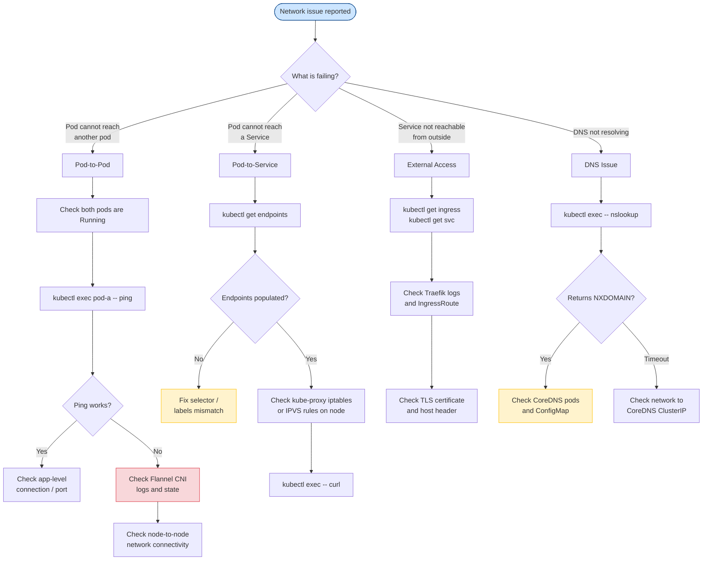

# Network Debugging
> Module 15 · Lesson 04 | [↑ Course Index](../README.md)

## Table of Contents
1. [Network Troubleshooting Flowchart](#network-troubleshooting-flowchart)
2. [DNS Debugging In-Cluster](#dns-debugging-in-cluster)
3. [Connectivity Testing with netshoot and busybox](#connectivity-testing-with-netshoot-and-busybox)
4. [Checking Flannel CNI State](#checking-flannel-cni-state)
5. [Service Endpoint Debugging](#service-endpoint-debugging)
6. [Traefik Routing Debug](#traefik-routing-debug)
7. [iptables / nftables Rules Inspection](#iptables--nftables-rules-inspection)
8. [Checking kube-proxy and Flannel Logs](#checking-kube-proxy-and-flannel-logs)
9. [Common Network Problems](#common-network-problems)

---

## Network Troubleshooting Flowchart



[↑ Back to TOC](#table-of-contents) · [↑ Course Index](../README.md)

---

## DNS Debugging In-Cluster

### Basic DNS Resolution Test

```bash
# Quick DNS test — should return the cluster IP of the kubernetes service
kubectl run dns-test --rm -it --restart=Never \
  --image=busybox:1.36 \
  -- nslookup kubernetes.default.svc.cluster.local

# Expected output:
# Server:    10.43.0.10
# Address 1: 10.43.0.10 kube-dns.kube-system.svc.cluster.local
# Name:      kubernetes.default.svc.cluster.local
# Address 1: 10.43.0.1
```

### DNS with dig (more detail)

```bash
kubectl run dns-test --rm -it --restart=Never \
  --image=nicolaka/netshoot \
  -- dig kubernetes.default.svc.cluster.local

# Short answer only
kubectl run dns-test --rm -it --restart=Never \
  --image=nicolaka/netshoot \
  -- dig +short kubernetes.default.svc.cluster.local

# Full DNS trace (to see which server responds)
kubectl run dns-test --rm -it --restart=Never \
  --image=nicolaka/netshoot \
  -- dig +trace kubernetes.default.svc.cluster.local

# Test from inside an existing pod
kubectl exec <pod-name> -- nslookup my-service.my-namespace.svc.cluster.local
kubectl exec <pod-name> -- nslookup my-service   # short name (same namespace)
```

### DNS Service Name Formats

| Format | Resolves To | Notes |
|---|---|---|
| `my-service` | Service in same namespace | Only works from pods in the same namespace |
| `my-service.my-namespace` | Service in specific namespace | Works across namespaces |
| `my-service.my-namespace.svc` | Same as above | More explicit |
| `my-service.my-namespace.svc.cluster.local` | FQDN | Most explicit; always works |

### Check CoreDNS Configuration

```bash
# View CoreDNS ConfigMap
kubectl get configmap coredns -n kube-system -o yaml

# View CoreDNS pod logs
kubectl logs -n kube-system -l k8s-app=kube-dns --tail=50

# Check CoreDNS metrics (if Prometheus is running)
kubectl port-forward -n kube-system svc/kube-dns 9153:9153 &
curl localhost:9153/metrics | grep coredns_dns_requests_total
```

[↑ Back to TOC](#table-of-contents) · [↑ Course Index](../README.md)

---

## Connectivity Testing with netshoot and busybox

### netshoot — All-in-one Network Debug Image

`nicolaka/netshoot` includes: `curl`, `wget`, `nmap`, `tcpdump`, `iperf3`, `dig`, `netstat`, `ss`,
`traceroute`, `mtr`, `ping`, `iptables`, `conntrack`, and many more.

```bash
# One-shot interactive session
kubectl run netshoot --rm -it --restart=Never \
  --image=nicolaka/netshoot \
  -- /bin/bash

# Test HTTP connectivity to a service
curl -v http://my-service.my-namespace.svc.cluster.local:8080/healthz

# Test TCP connectivity (without HTTP)
nc -zv my-service.my-namespace.svc.cluster.local 5432

# TCP port scan
nmap -p 80,443,8080 my-service.my-namespace.svc.cluster.local

# Bandwidth test between pods (requires iperf3 server in target)
iperf3 -c my-iperf-server.my-namespace.svc.cluster.local

# Trace the network path to the target
mtr --report my-service.my-namespace.svc.cluster.local

# Capture packets (tcpdump — requires hostNetwork or netadmin cap)
tcpdump -i eth0 -n host 10.43.1.5
tcpdump -i any -n port 80 -w /tmp/capture.pcap

# Show current connections
ss -tulnp
netstat -an | grep ESTABLISHED
```

### busybox — Lightweight Testing

```bash
kubectl run busybox-test --rm -it --restart=Never \
  --image=busybox:1.36 \
  -- /bin/sh

# Inside busybox:
wget -qO- http://my-service.my-namespace.svc.cluster.local/
ping -c3 my-service
nslookup my-service.my-namespace.svc.cluster.local
telnet my-service 8080   # test TCP connection
```

[↑ Back to TOC](#table-of-contents) · [↑ Course Index](../README.md)

---

## Checking Flannel CNI State

k3s uses Flannel as its default CNI (Container Network Interface). Flannel provides pod-to-pod
networking across nodes using a VXLAN overlay.

```bash
# Flannel runs as a DaemonSet (embedded in k3s, but also exposes as a pod in some configs)
kubectl get pods -n kube-system | grep flannel

# Check flannel pod logs
kubectl logs -n kube-system -l app=flannel --tail=50

# Check the flannel network configuration on the node
cat /run/flannel/subnet.env
# FLANNEL_NETWORK=10.42.0.0/16
# FLANNEL_SUBNET=10.42.1.0/24
# FLANNEL_MTU=1450
# FLANNEL_IPMASQ=true

# Inspect the VXLAN interface
ip link show flannel.1
ip route show | grep flannel
ip route show | grep 10.42

# Check the flannel configuration
cat /var/lib/rancher/k3s/agent/etc/flannel/net-conf.json

# View the node's pod CIDR assignment
kubectl get node <node-name> \
  -o jsonpath='{.spec.podCIDR}'

# Cross-node flannel connectivity test
# From pod on node-1, ping a pod IP on node-2:
kubectl exec <pod-on-node-1> -- ping -c3 <pod-ip-on-node-2>
```

### MTU Issues

MTU mismatches are a common cause of intermittent connectivity failures (large packets drop):

```bash
# Check effective MTU on flannel interface
ip link show flannel.1 | grep mtu

# Default: VXLAN overhead reduces MTU by 50 bytes
# Physical NIC MTU 1500 → VXLAN MTU 1450 → Flannel flannel.1 MTU 1450

# Test with a large packet
ping -c3 -M do -s 1400 <pod-ip>  # 1400 bytes + 28 header = 1428

# Fix: Set flannel MTU explicitly in k3s config
# /etc/rancher/k3s/config.yaml:
# flannel-iface: eth0
# flannel-backend: vxlan
```

[↑ Back to TOC](#table-of-contents) · [↑ Course Index](../README.md)

---

## Service Endpoint Debugging

A Kubernetes Service routes traffic to pods via Endpoints. If endpoints are empty, no traffic
reaches any pod.

```bash
# List services and their cluster IPs
kubectl get svc -n my-app

# Check endpoints for a service
kubectl get endpoints my-service -n my-app

# Example output (healthy):
# NAME         ENDPOINTS                         AGE
# my-service   10.42.1.5:8080,10.42.2.3:8080    5d

# Example output (broken — no endpoints):
# NAME         ENDPOINTS   AGE
# my-service   <none>      5d

# Diagnose missing endpoints
kubectl describe endpoints my-service -n my-app

# Check if the service selector matches any pods
kubectl get svc my-service -n my-app \
  -o jsonpath='{.spec.selector}' | jq .
# e.g. {"app":"my-api"}

kubectl get pods -n my-app -l app=my-api
# If no pods are returned, the labels don't match

# Fix: correct the service selector or pod labels
kubectl edit svc my-service -n my-app
```

### EndpointSlices (Kubernetes 1.21+)

```bash
# k3s uses EndpointSlices by default
kubectl get endpointslices -n my-app
kubectl describe endpointslice <name> -n my-app
```

### Test Service Cluster IP Directly

```bash
# From inside a pod in the same cluster:
kubectl exec <any-pod> -- curl -v http://10.43.XXX.XXX:80/

# Resolve the cluster IP
kubectl get svc my-service -n my-app \
  -o jsonpath='{.spec.clusterIP}'
```

[↑ Back to TOC](#table-of-contents) · [↑ Course Index](../README.md)

---

## Traefik Routing Debug

k3s bundles Traefik as its default ingress controller.

### Check Traefik Status

```bash
# Traefik runs in the kube-system namespace
kubectl get pods -n kube-system -l app.kubernetes.io/name=traefik

# View Traefik logs
kubectl logs -n kube-system -l app.kubernetes.io/name=traefik --tail=100

# Follow logs while making requests
kubectl logs -n kube-system -l app.kubernetes.io/name=traefik -f
```

### Inspect Traefik Configuration

```bash
# View the Traefik dashboard (port-forward)
kubectl port-forward -n kube-system svc/traefik 9000:9000 &
# Then open http://localhost:9000/dashboard/

# List all IngressRoutes
kubectl get ingressroutes -A
kubectl get ingress -A

# Describe a specific Ingress
kubectl describe ingress my-ingress -n my-app

# Check if the Traefik middleware is applied correctly
kubectl get middlewares -A
kubectl describe middleware my-middleware -n my-app
```

### Debug Routing Issues

```bash
# Test external routing
curl -v -H "Host: my-app.example.com" http://<node-ip>/api/v1/health

# Check TLS certificate
openssl s_client -connect my-app.example.com:443 -servername my-app.example.com \
  </dev/null 2>/dev/null | openssl x509 -noout -dates

# Check if Traefik picked up the IngressRoute (via dashboard or API)
kubectl port-forward -n kube-system svc/traefik 9000:9000 &
curl http://localhost:9000/api/rawdata | jq '.routers | keys[]'

# Traefik access log (if enabled)
kubectl logs -n kube-system -l app.kubernetes.io/name=traefik | grep 404
kubectl logs -n kube-system -l app.kubernetes.io/name=traefik | grep 502
```

[↑ Back to TOC](#table-of-contents) · [↑ Course Index](../README.md)

---

## iptables / nftables Rules Inspection

kube-proxy (or the kube-proxy-free mode in k3s) programs iptables rules to implement Service
ClusterIP routing. Inspecting these rules can reveal broken DNAT entries.

```bash
# List all iptables rules (run on the node)
sudo iptables -t nat -L -n -v

# List only the KUBE-SERVICES chain (service ClusterIP rules)
sudo iptables -t nat -L KUBE-SERVICES -n -v

# Find rules for a specific ClusterIP
CLUSTER_IP=$(kubectl get svc my-service -n my-app -o jsonpath='{.spec.clusterIP}')
sudo iptables -t nat -L -n -v | grep "${CLUSTER_IP}"

# For nftables (some newer OS versions)
sudo nft list ruleset | grep -A5 "kube-"

# Flush and reload (CAUTION — this will break existing connections temporarily)
# Only do this if you are sure the rules are corrupt:
# sudo iptables -t nat -F KUBE-SERVICES
# sudo systemctl restart k3s
```

### Checking Conntrack

```bash
# Show established connections through the service
sudo conntrack -L -p tcp | grep <cluster-ip>

# Show connection tracking stats
sudo conntrack -S

# Clear conntrack table (CAUTION — drops all existing connections)
# sudo conntrack -F
```

[↑ Back to TOC](#table-of-contents) · [↑ Course Index](../README.md)

---

## Checking kube-proxy and Flannel Logs

k3s does not run a separate kube-proxy binary. Service routing is handled internally by the k3s
process using iptables.

```bash
# k3s logs contain both Flannel and service routing logs
sudo journalctl -u k3s | grep -i flannel
sudo journalctl -u k3s | grep -i "proxy\|iptables\|service"

# On agent nodes:
sudo journalctl -u k3s-agent | grep -i flannel

# Check Flannel pod logs (if running as separate pods)
kubectl logs -n kube-system -l k8s-app=flannel --tail=50

# Check the Flannel subnet configuration
cat /run/flannel/subnet.env

# Check node annotations for VTEP information
kubectl get node <node-name> -o jsonpath='{.metadata.annotations}' | jq .
# Look for: flannel.alpha.coreos.com/public-ip
#           flannel.alpha.coreos.com/backend-data
```

[↑ Back to TOC](#table-of-contents) · [↑ Course Index](../README.md)

---

## Common Network Problems

### Pod-to-Pod Connectivity Failure

```bash
# Symptoms: ping/curl between pods on different nodes fails
# Diagnosis:
kubectl get pods -o wide    # Note pod IPs and nodes

# Test from pod-a to pod-b's IP
kubectl exec pod-a -- ping -c3 <pod-b-ip>

# Check if node-to-node traffic is blocked (firewall/security groups)
# From node-1, try to reach the VXLAN port on node-2:
curl telnet://<node-2-ip>:8472    # VXLAN UDP port (use nc -zu instead)
nc -zu <node-2-ip> 8472

# Fix: open UDP 8472 between all cluster nodes (VXLAN)
# AWS Security Group: UDP 8472 from the cluster CIDR
# UFW: sudo ufw allow from <cluster-cidr> to any port 8472 proto udp
```

### Pod-to-Service Connectivity Failure

```bash
# Symptoms: curl http://my-service fails; endpoint IPs work directly
# Diagnosis:
kubectl get endpoints my-service -n my-app
# Check for <none>

# If endpoints exist but ClusterIP doesn't work:
# iptables rules may be stale — check on the node:
sudo iptables -t nat -L KUBE-SERVICES -n -v | grep <cluster-ip>

# Fix: restart k3s to re-sync iptables
sudo systemctl restart k3s
```

### External DNS Resolution Failure

```bash
# Symptoms: pods can reach internal services but not external hostnames
# e.g. curl https://api.example.com fails with "Temporary failure in name resolution"

# Check CoreDNS forwards to upstream DNS
kubectl get configmap coredns -n kube-system -o yaml
# Look for: forward . 8.8.8.8 (or your upstream resolver)

# Test external DNS from inside a pod
kubectl exec <pod-name> -- nslookup google.com

# Check if the node has external DNS working (run on the node):
nslookup google.com

# Fix: add/correct the upstream forwarder in CoreDNS ConfigMap
kubectl edit configmap coredns -n kube-system
# Ensure: forward . /etc/resolv.conf   OR  forward . 1.1.1.1 8.8.8.8
kubectl rollout restart deployment/coredns -n kube-system
```

### High Latency / Packet Loss

```bash
# Run a latency test between pods
kubectl run latency-test --rm -it --restart=Never \
  --image=nicolaka/netshoot \
  -- mtr --report --report-cycles=10 <pod-ip>

# Run iperf3 bandwidth test
# First, start iperf3 server in a pod:
kubectl run iperf-server --rm -it --restart=Never \
  --image=nicolaka/netshoot \
  -- iperf3 -s

# From another pod, run the client:
kubectl run iperf-client --rm -it --restart=Never \
  --image=nicolaka/netshoot \
  -- iperf3 -c <iperf-server-pod-ip> -t 10

# Typical intra-node bandwidth: 5–10 Gbps
# Typical inter-node bandwidth: depends on physical NIC (1–25 Gbps)
# Inter-node VXLAN overhead: ~50 bytes per packet
```

[↑ Back to TOC](#table-of-contents) · [↑ Course Index](../README.md)

---

*Licensed under [CC BY-NC-SA 4.0](../LICENSE.md) · © 2026 UncleJS*
