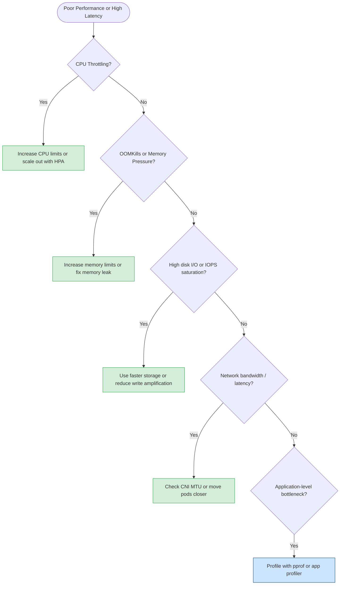

# Performance Tuning
> Module 15 · Lesson 05 | [↑ Course Index](../README.md)


[](../README.md)
[](../LICENSE.md)

## Table of Contents
1. [Identifying Bottlenecks](#identifying-bottlenecks)
2. [kubectl top — Resource Usage](#kubectl-top--resource-usage)
3. [Common Performance Issues in k3s](#common-performance-issues-in-k3s)
4. [Node-Level Tuning](#node-level-tuning)
5. [Container Resource Limits Impact](#container-resource-limits-impact)
6. [HPA Configuration for Performance](#hpa-configuration-for-performance)
7. [Profiling Go Services with pprof](#profiling-go-services-with-pprof)
8. [Benchmarking Commands and Tuning Reference](#benchmarking-commands-and-tuning-reference)

---

## Identifying Bottlenecks

Performance problems in Kubernetes typically fall into four resource categories:



### Performance Investigation Checklist

```bash
# 1. Node resources
kubectl top nodes

# 2. Pod resources (sorted by CPU)
kubectl top pods -A --sort-by=cpu

# 3. Pod resources (sorted by memory)
kubectl top pods -A --sort-by=memory

# 4. Find CPU-throttled containers (via cgroup stats)
# On the node:
cat /sys/fs/cgroup/cpu/kubepods/*/cpu.stat | grep throttled

# 5. Find OOMKill events
kubectl get events -A --field-selector reason=OOMKilling
dmesg | grep -i oom

# 6. Check disk I/O on the node
iostat -x 1 5   # requires sysstat package
iotop -a        # requires iotop

# 7. Check network I/O
vnstat -i eth0
sar -n DEV 1 5
```

[↑ Back to TOC](#table-of-contents) · [↑ Course Index](../README.md)

---

## kubectl top — Resource Usage

`kubectl top` queries the Metrics Server (built into k3s) for live CPU and memory usage.

```bash
# Node-level resource usage
kubectl top nodes

# Example output:
# NAME       CPU(cores)   CPU%   MEMORY(bytes)   MEMORY%
# server-1   312m         15%    1589Mi          41%
# worker-1   89m          4%     823Mi           21%

# Pod-level resource usage (all namespaces)
kubectl top pods -A

# Sort by CPU descending
kubectl top pods -A --sort-by=cpu

# Sort by memory descending
kubectl top pods -A --sort-by=memory

# Pod resource usage with container breakdown
kubectl top pods -A --containers

# Filter to a specific namespace
kubectl top pods -n my-app

# Watch mode (re-run every 3 seconds)
watch -n3 kubectl top pods -A --sort-by=cpu
```

### Metrics Server Troubleshooting

```bash
# Verify metrics-server is running (k3s includes this by default)
kubectl get pods -n kube-system | grep metrics-server

# If kubectl top returns "error: Metrics API not available":
kubectl get apiservice v1beta1.metrics.k8s.io
# Should be Available: True

# Check metrics-server logs
kubectl logs -n kube-system -l k8s-app=metrics-server
```

[↑ Back to TOC](#table-of-contents) · [↑ Course Index](../README.md)

---

## Common Performance Issues in k3s

### SQLite Datastore Bottleneck

Single-node k3s uses SQLite as the default datastore. SQLite is single-writer and can become a
bottleneck under heavy API server load.

**Symptoms:**
- High API server latency (`kubectl` commands are slow)
- k3s logs show: `slow SQL query` or SQLite lock contention

```bash
# Check API server latency
time kubectl get pods -A

# Check SQLite database size and fragmentation
sudo sqlite3 /var/lib/rancher/k3s/server/db/state.db \
  "SELECT page_count * page_size / 1024 / 1024 AS size_mb FROM pragma_page_count(), pragma_page_size();"

# Vacuum the SQLite database (reclaim space, defragment)
sudo systemctl stop k3s
sudo sqlite3 /var/lib/rancher/k3s/server/db/state.db "VACUUM;"
sudo systemctl start k3s
```

**Long-term fix:** Migrate to embedded etcd (`--cluster-init`) for clusters with > 100 nodes or
heavy API load.

### Traefik Overhead

Traefik processes all ingress traffic and can become a bottleneck under high request volume.

```bash
# Check Traefik CPU/memory
kubectl top pods -n kube-system -l app.kubernetes.io/name=traefik

# Increase Traefik replicas (horizontal scaling)
kubectl scale deployment traefik --replicas=3 -n kube-system

# Or configure via HelmChartConfig:
cat <<EOF | kubectl apply -f -
apiVersion: helm.cattle.io/v1
kind: HelmChartConfig
metadata:
  name: traefik
  namespace: kube-system
spec:
  valuesContent: |-
    deployment:
      replicas: 3
    resources:
      requests:
        cpu: 200m
        memory: 128Mi
      limits:
        cpu: 2000m
        memory: 512Mi
EOF
```

### etcd Tuning (Embedded etcd Clusters)

For HA clusters with embedded etcd:

```bash
# Check etcd performance
sudo k3s etcdctl endpoint status --write-out=table

# Check etcd I/O latency
sudo k3s etcdctl check perf

# etcd tuning via k3s config:
# /etc/rancher/k3s/config.yaml
# etcd-arg:
#   - "quota-backend-bytes=4294967296"    # 4Gi max DB size (default 2Gi)
#   - "auto-compaction-mode=periodic"
#   - "auto-compaction-retention=1h"
#   - "snapshot-count=5000"              # Compact more frequently (default 10000)
```

### API Server Memory

```bash
# Check API server memory usage
kubectl top pods -n kube-system | grep api-server

# Reduce API server memory with watch cache tuning:
# /etc/rancher/k3s/config.yaml
# kube-apiserver-arg:
#   - "watch-cache=false"               # Disable watch cache (reduces memory, increases API load)
#   - "default-watch-cache-size=100"    # Reduce cache size (default: varies)
```

[↑ Back to TOC](#table-of-contents) · [↑ Course Index](../README.md)

---

## Node-Level Tuning

### Kernel Parameters (sysctl)

```bash
# Apply the following for production Kubernetes nodes
# /etc/sysctl.d/99-k3s.conf

cat <<'EOF' | sudo tee /etc/sysctl.d/99-k3s.conf
# Network performance
net.core.somaxconn = 32768
net.ipv4.tcp_max_syn_backlog = 8096
net.core.netdev_max_backlog = 16384
net.ipv4.ip_local_port_range = 10240 65535

# TCP keep-alive (faster detection of dead connections)
net.ipv4.tcp_keepalive_time = 600
net.ipv4.tcp_keepalive_intvl = 60
net.ipv4.tcp_keepalive_probes = 9

# Memory: allow more file handles for pods
fs.file-max = 2097152
fs.inotify.max_user_instances = 8192
fs.inotify.max_user_watches = 524288

# VM tuning for database workloads
vm.swappiness = 10              # Reduce swap usage (0 = disable swap)
vm.dirty_ratio = 30
vm.dirty_background_ratio = 5
EOF

sudo sysctl --system
```

### CPU Governor

Set the CPU scaling governor to `performance` to eliminate frequency scaling latency:

```bash
# Check current governor
cat /sys/devices/system/cpu/cpu0/cpufreq/scaling_governor

# Set to performance (apply to all CPUs)
echo performance | sudo tee /sys/devices/system/cpu/cpu*/cpufreq/scaling_governor

# Persist across reboots (using cpupower)
sudo apt-get install -y linux-tools-common cpupower
sudo cpupower frequency-set -g performance

# Or via systemd:
cat <<'EOF' | sudo tee /etc/systemd/system/cpu-performance.service
[Unit]
Description=Set CPU governor to performance

[Service]
Type=oneshot
ExecStart=/bin/sh -c 'echo performance > /sys/devices/system/cpu/cpu*/cpufreq/scaling_governor'

[Install]
WantedBy=multi-user.target
EOF
sudo systemctl enable --now cpu-performance
```

### Disk Scheduler

For NVMe SSDs, use the `none` scheduler (no scheduling overhead):

```bash
# Check current scheduler
cat /sys/block/nvme0n1/queue/scheduler

# Set to none (NVMe) or mq-deadline (SATA SSD)
echo none | sudo tee /sys/block/nvme0n1/queue/scheduler
echo mq-deadline | sudo tee /sys/block/sda/queue/scheduler

# Persist via udev rule
cat <<'EOF' | sudo tee /etc/udev/rules.d/60-io-scheduler.rules
ACTION=="add|change", KERNEL=="nvme[0-9]*", ATTR{queue/scheduler}="none"
ACTION=="add|change", KERNEL=="sd[a-z]", ATTR{queue/rotational}=="0", ATTR{queue/scheduler}="mq-deadline"
EOF
sudo udevadm trigger
```

[↑ Back to TOC](#table-of-contents) · [↑ Course Index](../README.md)

---

## Container Resource Limits Impact

### CPU Throttling

CPU throttling occurs when a container's CPU usage exceeds its `limits.cpu`. Throttled time is
counted in the `cpu.throttled_time` cgroup metric.

```bash
# Check CPU throttling stats for a pod's containers (run on the node)
# Find the cgroup path for the pod
kubectl get pod <pod-name> -o jsonpath='{.metadata.uid}'
# Then:
find /sys/fs/cgroup -name "cpu.stat" -path "*<pod-uid>*" -exec cat {} \;

# A simpler approach: check with cAdvisor metrics (if Prometheus installed)
# container_cpu_cfs_throttled_seconds_total{namespace="my-app"}

# Rule of thumb: if throttled_periods / total_periods > 25%, increase CPU limits
```

### Memory Pressure and OOM

```bash
# Check current memory usage vs limits for each container
kubectl top pods -n my-app --containers

# Check for OOMKill events
kubectl get events -n my-app --field-selector reason=OOMKilling

# Find containers approaching their memory limit
kubectl top pods -A --containers | awk '
NR>1 {
  # Parse memory usage (strip Mi suffix)
  # This is a basic example — use Prometheus for production monitoring
  print $0
}'
```

### Recommended Resource Sizing Process

```bash
# Step 1: Deploy with NO limits (or very high limits)
# Step 2: Run realistic load tests
# Step 3: Observe actual usage:
kubectl top pods -n my-app --containers
# Step 4: Set requests = P50 usage, limits = P99 usage (with 20% headroom)
# Step 5: Enable HPA to handle spikes rather than oversizing limits
```

[↑ Back to TOC](#table-of-contents) · [↑ Course Index](../README.md)

---

## HPA Configuration for Performance

HPA automatically adds replicas to handle increased load, reducing the need for oversized resource
limits.

```yaml
apiVersion: autoscaling/v2
kind: HorizontalPodAutoscaler
metadata:
  name: my-api-hpa
  namespace: my-app
spec:
  scaleTargetRef:
    apiVersion: apps/v1
    kind: Deployment
    name: my-api
  minReplicas: 2
  maxReplicas: 20
  metrics:
    - type: Resource
      resource:
        name: cpu
        target:
          type: Utilization
          averageUtilization: 60    # Scale when avg CPU > 60% of requests.cpu
  behavior:
    scaleUp:
      # Scale up aggressively during traffic spikes
      stabilizationWindowSeconds: 30
      policies:
        - type: Percent
          value: 100        # Double replicas at most per period
          periodSeconds: 30
        - type: Pods
          value: 5          # Add at most 5 pods per period
          periodSeconds: 30
      selectPolicy: Max     # Use the more aggressive of the two policies
    scaleDown:
      # Scale down slowly to avoid flapping
      stabilizationWindowSeconds: 600   # 10 minutes
      policies:
        - type: Percent
          value: 10
          periodSeconds: 60
```

```bash
# Monitor HPA scaling activity
kubectl describe hpa my-api-hpa -n my-app
kubectl get events -n my-app | grep HorizontalPodAutoscaler

# Watch HPA status
watch kubectl get hpa -n my-app
```

[↑ Back to TOC](#table-of-contents) · [↑ Course Index](../README.md)

---

## Profiling Go Services with pprof

The Kubernetes control plane and many in-cluster services (including k3s itself) are written in Go.
Go's `pprof` profiler can identify CPU and memory bottlenecks.

### Accessing pprof on k3s Components

```bash
# k3s exposes a pprof endpoint on the API server (disabled by default)
# Enable via: --kube-apiserver-arg=enable-pprof (not recommended for production)

# Port-forward to the API server debug endpoint
kubectl port-forward -n kube-system \
  $(kubectl get pods -n kube-system -l component=kube-apiserver -o name | head -n1) \
  6060:6060 &

# Collect a 30-second CPU profile
go tool pprof http://localhost:6060/debug/pprof/profile?seconds=30

# Collect a heap memory profile
go tool pprof http://localhost:6060/debug/pprof/heap

# Collect goroutine trace
curl -s http://localhost:6060/debug/pprof/goroutine?debug=1 | head -50
```

### Profiling Your Own Go Applications

```yaml
# Add pprof endpoint to your app
# import _ "net/http/pprof"
# go func() { log.Fatal(http.ListenAndServe(":6060", nil)) }()

# Then port-forward and profile:
kubectl port-forward pod/my-go-app-xxxx 6060:6060 &

# CPU profile
go tool pprof http://localhost:6060/debug/pprof/profile?seconds=30

# Memory profile
go tool pprof http://localhost:6060/debug/pprof/heap

# Visualise (requires graphviz)
# Inside pprof interactive:
# (pprof) web
```

[↑ Back to TOC](#table-of-contents) · [↑ Course Index](../README.md)

---

## Benchmarking Commands and Tuning Reference

### Benchmarking Commands

```bash
# API Server latency benchmark
time kubectl get pods -A --request-timeout=60s

# etcd performance check
sudo k3s etcdctl check perf --load=l   # l = large dataset

# Network bandwidth between nodes (requires iperf3)
# On target node, run: iperf3 -s
iperf3 -c <target-node-ip> -t 30 -P 4

# Disk I/O benchmark (using fio)
fio --name=seqwrite --rw=write --bs=1M --size=4G \
  --numjobs=1 --runtime=30 --time_based \
  --filename=/var/lib/rancher/k3s/bench-test \
  --ioengine=libaio --iodepth=32 \
  --group_reporting && \
  rm -f /var/lib/rancher/k3s/bench-test

# DNS query benchmark
kubectl run dns-bench --rm -it --restart=Never \
  --image=nicolaka/netshoot \
  -- bash -c 'for i in $(seq 1 100); do
    dig +short kubernetes.default.svc.cluster.local @10.43.0.10 > /dev/null
  done; echo done'
```

### Performance Tuning Reference Table

| Area | Default | Tuned Value | When to Apply |
|---|---|---|---|
| SQLite WAL mode | OFF | ON | k3s single-node with heavy API writes |
| etcd snapshot-count | 10000 | 5000 | Reduce memory usage / compaction lag |
| etcd quota-backend-bytes | 2Gi | 4–8Gi | Large clusters / many objects |
| CPU governor | powersave / ondemand | performance | Latency-sensitive workloads |
| Disk I/O scheduler (NVMe) | mq-deadline | none | NVMe SSDs only |
| net.core.somaxconn | 128 | 32768 | High connection rate services |
| fs.inotify.max_user_watches | 8192 | 524288 | Large number of watched files (e.g., Prometheus) |
| vm.swappiness | 60 | 10 | All Kubernetes nodes |
| Traefik replicas | 1 | 2–4 | High-traffic ingress |
| CoreDNS replicas | 1 | 2–3 | Large clusters / high DNS query rate |
| HPA scaleUp window | 0s | 30s | Prevent rapid thrashing |
| HPA scaleDown window | 300s | 600s | Prevent premature scale-down |

[↑ Back to TOC](#table-of-contents) · [↑ Course Index](../README.md)

---

*Licensed under [CC BY-NC-SA 4.0](../LICENSE.md) · © 2026 UncleJS*
