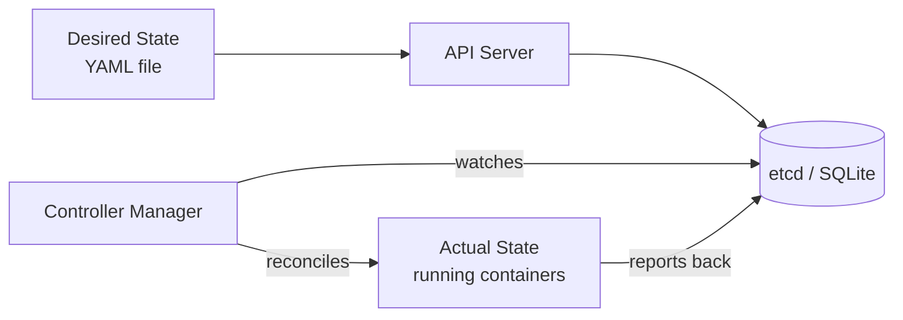
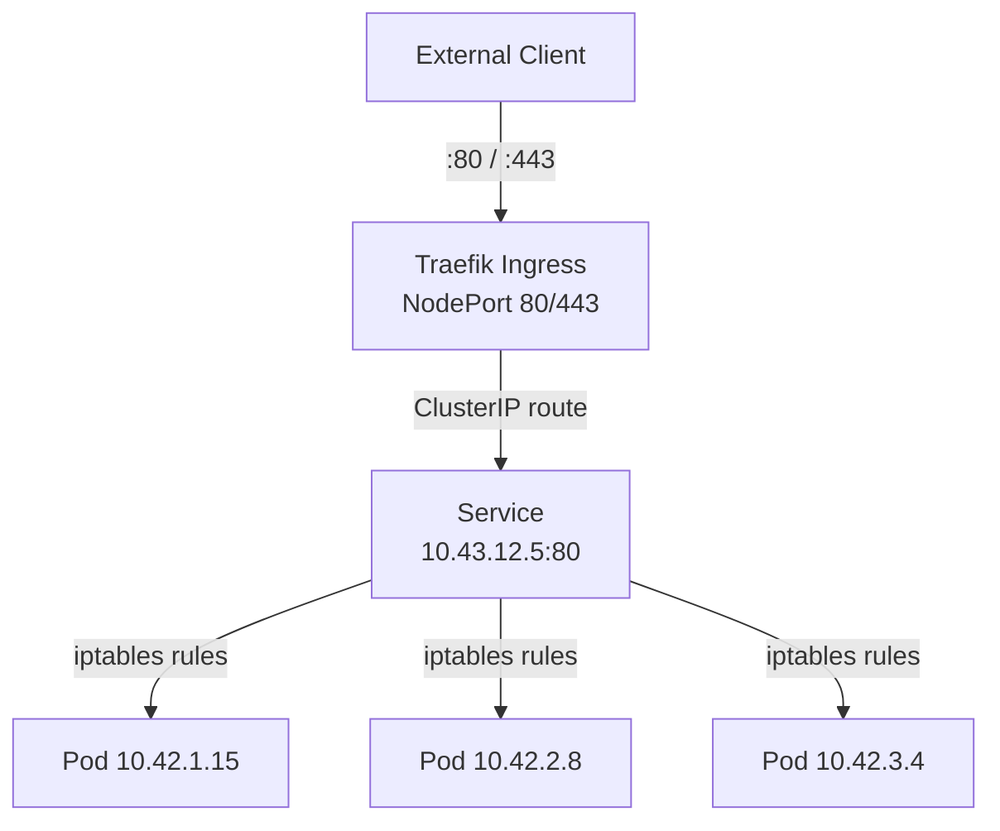

# Podman vs Kubernetes: Mental Model Shift
> Module 16 · Lesson 01 | [↑ Course Index](../README.md)

## Table of Contents
- [Overview](#overview)
- [The Core Difference: Imperative vs Declarative](#the-core-difference-imperative-vs-declarative)
- [Concept Mapping: Podman → k3s](#concept-mapping-podman--k3s)
- [How Podman Commands Map to kubectl](#how-podman-commands-map-to-kubectl)
- [Networking Mental Model Shift](#networking-mental-model-shift)
- [Volume and Storage Mental Model Shift](#volume-and-storage-mental-model-shift)
- [The Systemd Quad → Kubernetes Deployment Analogy](#the-systemd-quad--kubernetes-deployment-analogy)
- [What k3s Does That Podman Cannot](#what-k3s-does-that-podman-cannot)
- [What You Lose (and the Workarounds)](#what-you-lose-and-the-workarounds)
- [Mindset Checklist](#mindset-checklist)

---

## Overview

If you've been running containers with Podman (rootless or rootful), you already understand images, containers, volumes, and networking. Moving to k3s is not starting from scratch — it's a shift in *where decisions are made* and *who enforces them*. This module bridges that gap.

```mermaid
graph LR
    subgraph Podman World
        direction TB
        P1[podman run] --> C1[Container]
        P2[Containerfile] --> I1[Image]
        P3[podman-compose] --> C2[Multi-container app]
        P4[Quadlet .container] --> SVC[systemd service]
    end
    subgraph k3s World
        direction TB
        K1[kubectl apply] --> POD[Pod]
        K2[Deployment] --> RS[ReplicaSet → Pods]
        K3[Service] --> NET[Network endpoint]
        K4[Helm chart] --> APP[Full application]
    end
    Podman World -->|mental model shift| k3s World
```

[↑ Back to TOC](#table-of-contents) · [↑ Course Index](../README.md)

---

## The Core Difference: Imperative vs Declarative

| Aspect | Podman (imperative) | k3s / Kubernetes (declarative) |
|--------|---------------------|-------------------------------|
| **How you act** | Tell the system *what to do* | Tell the system *what you want* |
| **Example** | `podman run -d --name web nginx` | `kind: Deployment … replicas: 1` |
| **State tracking** | You track what's running | Kubernetes tracks desired vs actual |
| **Recovery** | You restart crashed containers | k3s restarts pods automatically |
| **Scaling** | `podman` doesn't scale — you script it | `kubectl scale deploy/web --replicas=5` |
| **Config stored** | In your shell history / scripts | In YAML files (Git-versionable) |

The key insight: **you describe the end state, and k3s continuously works to make reality match it.** This is called the *reconciliation loop*.



[↑ Back to TOC](#table-of-contents) · [↑ Course Index](../README.md)

---

## Concept Mapping: Podman → k3s

| Podman Concept | k3s / Kubernetes Equivalent | Notes |
|---------------|----------------------------|-------|
| Container | Pod (1 container) | A Pod is the smallest deployable unit |
| Multi-container pod | Pod (multiple containers) | Sidecar pattern |
| `podman-compose` app | Deployment + Service(s) | Kubernetes splits concerns |
| Image | Image (same OCI format) | Same registries work |
| `podman volume` | PersistentVolumeClaim | Abstracted through StorageClass |
| Bind mount | `hostPath` volume | Discouraged in production |
| `--network` | Service / CNI (Flannel) | All pods get IPs automatically |
| Port mapping `-p 8080:80` | Service `NodePort` / `Ingress` | Managed by kube-proxy / Traefik |
| `podman pod` | Pod | Same concept, different API |
| Quadlet `.container` file | Deployment YAML | Declarative in both cases |
| `podman secret` | Kubernetes `Secret` | Both support env var + file mount |
| `podman network create` | NetworkPolicy + Namespace | More powerful isolation model |
| Registry | ImagePullSecret + registry config | Same OCI registries |
| `podman healthcheck` | `livenessProbe` / `readinessProbe` | More expressive in k8s |
| Resource limits `--memory` | `resources.limits.memory` | Same kernel cgroups underneath |
| `podman logs` | `kubectl logs` | Same idea |
| `podman exec` | `kubectl exec` | Same idea |
| `podman stats` | `kubectl top pod` | Similar; Prometheus for deep metrics |
| `systemctl` service | Deployment + ReplicaSet | k3s ensures pods stay running |

[↑ Back to TOC](#table-of-contents) · [↑ Course Index](../README.md)

---

## How Podman Commands Map to kubectl

```bash
# ── Run a container ───────────────────────────────────────────────────────────
# Podman
podman run -d --name web -p 8080:80 nginx:alpine

# k3s equivalent (imperative shortcut — use YAML in production)
kubectl run web --image=nginx:alpine --port=80
kubectl expose pod web --type=NodePort --port=80 --target-port=80

# ── List running containers / pods ────────────────────────────────────────────
podman ps
kubectl get pods

podman ps -a
kubectl get pods -A   # all namespaces

# ── View logs ─────────────────────────────────────────────────────────────────
podman logs web
kubectl logs web

podman logs -f web
kubectl logs -f web

podman logs --tail=50 web
kubectl logs --tail=50 web

# ── Execute commands ──────────────────────────────────────────────────────────
podman exec -it web sh
kubectl exec -it web -- sh

podman exec web ls /etc/nginx
kubectl exec web -- ls /etc/nginx

# ── Stop / Delete ─────────────────────────────────────────────────────────────
podman stop web && podman rm web
kubectl delete pod web

# ── Inspect ───────────────────────────────────────────────────────────────────
podman inspect web
kubectl describe pod web

podman inspect web --format '{{.NetworkSettings.IPAddress}}'
kubectl get pod web -o jsonpath='{.status.podIP}'

# ── Pull an image ─────────────────────────────────────────────────────────────
podman pull nginx:alpine
# k3s pre-pulls on first deployment; or use:
sudo k3s ctr images pull docker.io/library/nginx:alpine

# ── Resource usage ────────────────────────────────────────────────────────────
podman stats
kubectl top pods

# ── Copy files ────────────────────────────────────────────────────────────────
podman cp web:/etc/nginx/nginx.conf ./nginx.conf
kubectl cp web:/etc/nginx/nginx.conf ./nginx.conf
```

[↑ Back to TOC](#table-of-contents) · [↑ Course Index](../README.md)

---

## Networking Mental Model Shift

### Podman Networking
In Podman you explicitly map host ports:
```bash
podman run -p 8080:80 nginx         # host:8080 → container:80
podman run --network=mynet nginx    # attach to named network
```

### k3s Networking
Every Pod gets its own IP on a **cluster-internal network** (10.42.0.0/16 by default). You don't map ports at the container level — instead you create **Services**:

```
Pod IP: 10.42.1.15:80  →  ClusterIP Service: 10.43.12.5:80  →  NodePort: 192.168.1.10:30080
                                                                     ↓
                                                               Ingress (Traefik): example.com → :80
```



**Key difference:** you never think about port mappings between host and container. You think about **Services** and **Ingress** rules.

[↑ Back to TOC](#table-of-contents) · [↑ Course Index](../README.md)

---

## Volume and Storage Mental Model Shift

### Podman Volumes
```bash
podman volume create mydata
podman run -v mydata:/data nginx

# Or bind mount
podman run -v /home/user/data:/data nginx
```

### k3s Volumes
k3s introduces an abstraction layer:

```
StorageClass  →  PersistentVolume (PV)  →  PersistentVolumeClaim (PVC)  →  Pod volume
```

```yaml
# The Pod just claims storage — it doesn't specify where it lives
volumes:
- name: mydata
  persistentVolumeClaim:
    claimName: mydata-pvc
```

The **k3s local-path provisioner** automatically creates PVs on the node's filesystem — the closest equivalent to a named Podman volume. The **benefit**: when you scale to multiple nodes, you can swap StorageClass from `local-path` to `longhorn` and get replicated storage without changing your Pod YAML.

**Quick reference:**

| Podman | k3s |
|--------|-----|
| Named volume | PVC + local-path StorageClass |
| Bind mount | `hostPath` volume (use sparingly) |
| tmpfs mount | `emptyDir: {medium: Memory}` |
| Volume plugin | CSI driver + StorageClass |

[↑ Back to TOC](#table-of-contents) · [↑ Course Index](../README.md)

---

## The Systemd Quad → Kubernetes Deployment Analogy

Podman **Quadlet** files are declarative systemd units for containers — already a step toward the Kubernetes model. Here is a direct comparison:

### Podman Quadlet (`.container` file)
```ini
# /etc/containers/systemd/web.container
[Unit]
Description=My Web App
After=network-online.target

[Container]
Image=docker.io/myorg/myapp:latest
PublishPort=8080:8080
Environment=APP_ENV=production
Volume=myapp-data.volume:/data
HealthCmd=curl -f http://localhost:8080/health

[Service]
Restart=always

[Install]
WantedBy=default.target
```

### Kubernetes Deployment (equivalent)
```yaml
apiVersion: apps/v1
kind: Deployment
metadata:
  name: web
spec:
  replicas: 1          # Quadlet: single instance managed by systemd
  selector:
    matchLabels:
      app: web
  template:
    metadata:
      labels:
        app: web
    spec:
      containers:
      - name: web
        image: docker.io/myorg/myapp:latest
        ports:
        - containerPort: 8080
        env:
        - name: APP_ENV
          value: production
        volumeMounts:
        - name: data
          mountPath: /data
        livenessProbe:             # Quadlet: HealthCmd
          httpGet:
            path: /health
            port: 8080
      volumes:
      - name: data
        persistentVolumeClaim:
          claimName: myapp-data   # Quadlet: Volume=myapp-data.volume
---
apiVersion: v1
kind: Service
metadata:
  name: web
spec:
  selector:
    app: web
  ports:
  - port: 8080
    targetPort: 8080
  type: NodePort             # Quadlet: PublishPort=8080:8080
```

The patterns are strikingly similar — the Kubernetes version adds scheduling, self-healing at scale, and the Service abstraction.

[↑ Back to TOC](#table-of-contents) · [↑ Course Index](../README.md)

---

## What k3s Does That Podman Cannot

| Capability | Podman | k3s |
|-----------|--------|-----|
| Schedule across multiple hosts | ❌ | ✅ |
| Automatic pod restart with backoff | Limited (systemd Restart=) | ✅ Built-in |
| Rolling updates with zero downtime | ❌ | ✅ Deployment strategy |
| Auto-scale based on CPU/memory | ❌ | ✅ HPA |
| Load balance across pod replicas | ❌ | ✅ Service kube-proxy |
| Service discovery by DNS name | ❌ (manual) | ✅ CoreDNS auto |
| Secret rotation without restart | ❌ | ✅ (with projected volumes) |
| Namespace-level resource quotas | ❌ | ✅ ResourceQuota |
| Declarative desired state enforcement | Limited (Quadlet) | ✅ Controller loop |
| Multi-tenant workload isolation | ❌ | ✅ Namespaces + RBAC |
| Ingress / TLS termination | ❌ | ✅ Traefik built-in |

[↑ Back to TOC](#table-of-contents) · [↑ Course Index](../README.md)

---

## What You Lose (and the Workarounds)

| Podman Feature | Status in k3s | Workaround |
|---------------|---------------|------------|
| Rootless containers | ✅ k3s supports rootless mode | `INSTALL_K3S_EXEC="--rootless"` |
| `podman build` (image builds) | ❌ Not in k3s | Use Buildah / Podman on a build host; push to registry |
| `podman play kube` | N/A (k3s is the "play") | Use `kubectl apply` |
| `podman generate systemd` | N/A | Quadlet is replaced by k3s service management |
| `podman pod` | ✅ Replaced by k3s Pod | Use Deployment YAML |
| Interactive one-shot containers | Partial | `kubectl run --restart=Never --rm -it` |
| Local image build without registry | ❌ | Use local registry (see Lesson 03) |
| `--userns=keep-id` | ❌ | Use `runAsUser` in SecurityContext |
| `podman machine` (macOS/Win VM) | N/A | k3s runs natively on Linux |

[↑ Back to TOC](#table-of-contents) · [↑ Course Index](../README.md)

---

## Mindset Checklist

Before moving on, make sure you can answer yes to each of these:

- [ ] I understand that k3s *continuously reconciles* state rather than executing one-shot commands
- [ ] I know that a **Pod** is the k3s equivalent of a Podman container
- [ ] I know that a **Service** replaces port mappings (`-p host:container`)
- [ ] I know that a **PVC** replaces named Podman volumes
- [ ] I understand that **Deployments** replace both `podman run` and Quadlet `.container` files
- [ ] I know that `kubectl exec` and `kubectl logs` work the same way as their `podman` counterparts
- [ ] I understand that image builds happen *outside* k3s (using Podman/Buildah) and images are pushed to a registry

[↑ Back to TOC](#table-of-contents) · [↑ Course Index](../README.md)

---
*Licensed under [CC BY-NC-SA 4.0](../LICENSE.md) · © 2026 UncleJS*
