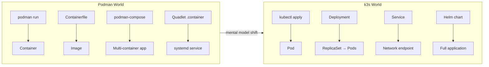
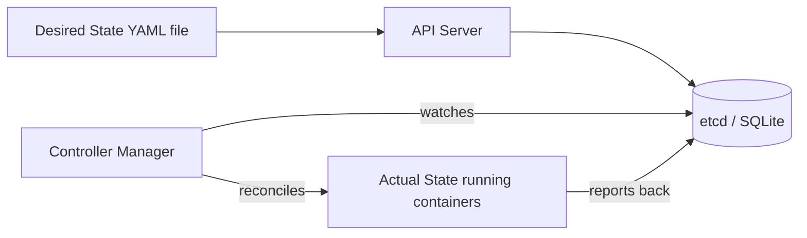
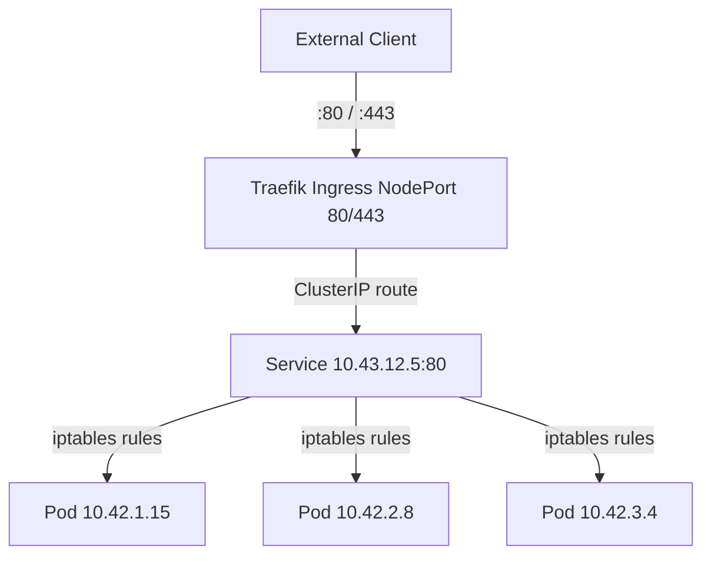
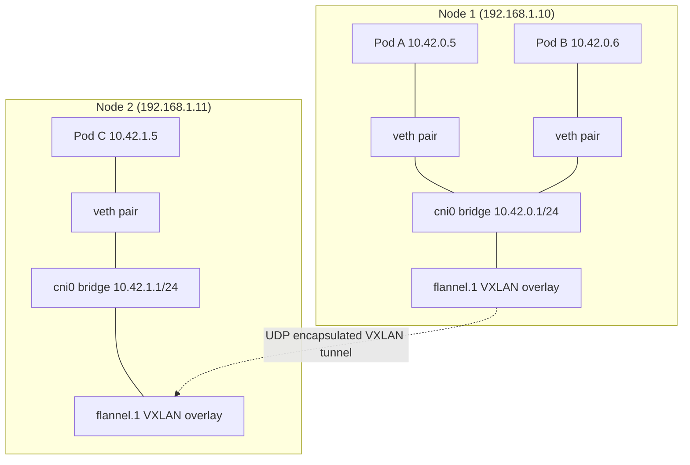
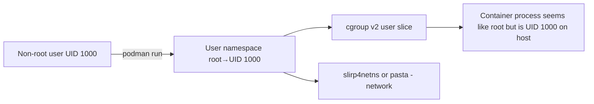
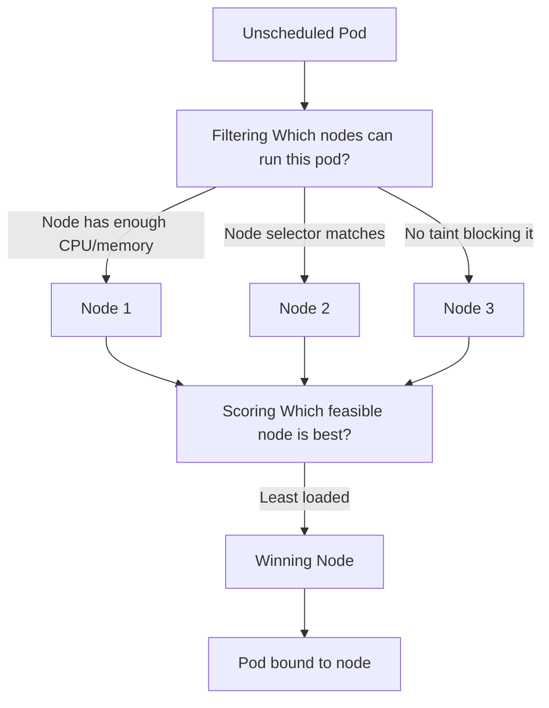
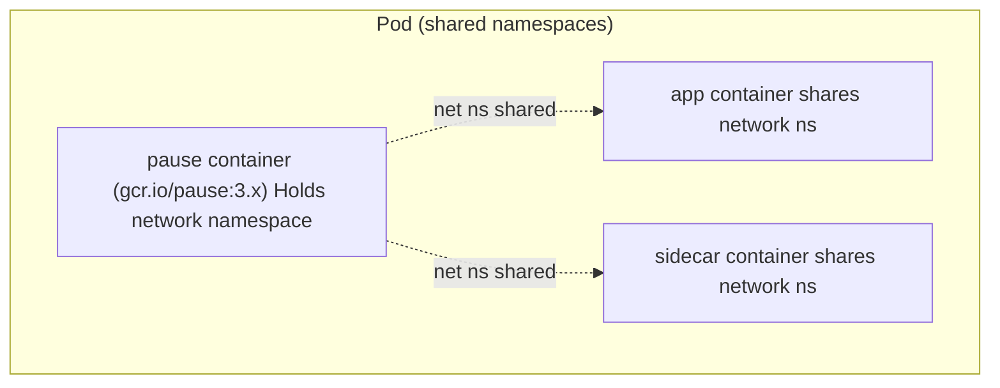

# Podman vs Kubernetes: Mental Model Shift
> Module 16 · Lesson 01 | [↑ Course Index](../README.md)


[](../README.md)
[](../LICENSE.md)

## Table of Contents
- [Overview](#overview)
- [The Core Difference: Imperative vs Declarative](#the-core-difference-imperative-vs-declarative)
- [Concept Mapping: Podman → k3s](#concept-mapping-podman--k3s)
- [How Podman Commands Map to kubectl](#how-podman-commands-map-to-kubectl)
- [Networking Mental Model Shift](#networking-mental-model-shift)
- [CNI Deep Dive: How Pod Networking Actually Works](#cni-deep-dive-how-pod-networking-actually-works)
- [Volume and Storage Mental Model Shift](#volume-and-storage-mental-model-shift)
- [The Systemd Quad → Kubernetes Deployment Analogy](#the-systemd-quad--kubernetes-deployment-analogy)
- [Rootless Containers: Cgroups & User Namespaces](#rootless-containers-cgroups--user-namespaces)
- [ConfigMaps: The Missing Primitive](#configmaps-the-missing-primitive)
- [The Scheduler: Affinity, Taints & Tolerations](#the-scheduler-affinity-taints--tolerations)
- [The Pause Container](#the-pause-container)
- [What k3s Does That Podman Cannot](#what-k3s-does-that-podman-cannot)
- [What You Lose (and the Workarounds)](#what-you-lose-and-the-workarounds)
- [Common Pitfalls](#common-pitfalls)
- [Mindset Checklist](#mindset-checklist)

---

## Overview

If you've been running containers with Podman (rootless or rootful), you already understand images, containers, volumes, and networking. Moving to k3s is not starting from scratch — it's a shift in *where decisions are made* and *who enforces them*. This module bridges that gap.



**What this lesson covers:**
- The imperative vs declarative mindset change
- Every major Podman concept mapped to its k3s equivalent
- How the CNI (Flannel) and Service model replace port mappings
- Where rootless cgroups and user namespaces fit in k3s
- ConfigMaps — a concept Podman has no direct equivalent for
- The scheduler, affinity, taints, and why they matter
- The pause container and what it means for your pods

[↑ Back to TOC](#table-of-contents) · [↑ Course Index](../README.md)

---

## The Core Difference: Imperative vs Declarative

| Aspect | Podman (imperative) | k3s / Kubernetes (declarative) |
|--------|---------------------|-------------------------------|
| **How you act** | Tell the system *what to do* | Tell the system *what you want* |
| **Example** | `podman run -d --name web nginx` | `kind: Deployment … replicas: 1` |
| **State tracking** | You track what's running | Kubernetes tracks desired vs actual |
| **Recovery** | You restart crashed containers | k3s restarts pods automatically |
| **Scaling** | `podman` doesn't scale — you script it | `kubectl scale deploy/web --replicas=5` |
| **Config stored** | In your shell history / scripts | In YAML files (Git-versionable) |

The key insight: **you describe the end state, and k3s continuously works to make reality match it.** This is called the *reconciliation loop*.



### The Reconciliation Loop in Practice

When you run `kubectl apply -f deploy.yaml`, here is what happens step by step:

1. **kubectl** serialises the YAML and sends it as an HTTP `PUT`/`PATCH` to the API server
2. **API server** validates the object, stores it in etcd, and returns 200 OK — *no container has been created yet*
3. The **Deployment controller** notices a new Deployment object and creates a **ReplicaSet**
4. The **ReplicaSet controller** notices the ReplicaSet needs pods; it creates **Pod** objects in etcd
5. The **scheduler** notices unscheduled pods; it picks a node and writes `spec.nodeName` to the Pod object
6. The **kubelet** on that node notices a Pod scheduled for it; it calls the container runtime (containerd in k3s) to create the containers
7. The **kubelet** reports the pod as `Running` and updates Pod status in etcd

If a pod crashes at step 7, the ReplicaSet controller sees that `actualReplicas < desiredReplicas` and creates a replacement pod — without any human intervention.

**Compare to Podman:** `podman run` is a single synchronous call. If the process exits, nothing restarts it unless you also set up a systemd unit or Quadlet.

[↑ Back to TOC](#table-of-contents) · [↑ Course Index](../README.md)

---

## Concept Mapping: Podman → k3s

| Podman Concept | k3s / Kubernetes Equivalent | Notes |
|---------------|----------------------------|-------|
| Container | Pod (1 container) | A Pod is the smallest deployable unit |
| Multi-container pod | Pod (multiple containers) | Sidecar pattern |
| `podman-compose` app | Deployment + Service(s) | Kubernetes splits concerns |
| Image | Image (same OCI format) | Same registries work |
| `podman volume` | PersistentVolumeClaim | Abstracted through StorageClass |
| Bind mount | `hostPath` volume | Discouraged in production |
| `--network` | Service / CNI (Flannel) | All pods get IPs automatically |
| Port mapping `-p 8080:80` | Service `NodePort` / `Ingress` | Managed by kube-proxy / Traefik |
| `podman pod` | Pod | Same concept, different API |
| Quadlet `.container` file | Deployment YAML | Declarative in both cases |
| `podman secret` | Kubernetes `Secret` | Both support env var + file mount |
| `podman network create` | NetworkPolicy + Namespace | More powerful isolation model |
| Registry | ImagePullSecret + registry config | Same OCI registries |
| `podman healthcheck` | `livenessProbe` / `readinessProbe` | More expressive in k8s |
| Resource limits `--memory` | `resources.limits.memory` | Same kernel cgroups underneath |
| `podman logs` | `kubectl logs` | Same idea |
| `podman exec` | `kubectl exec` | Same idea |
| `podman stats` | `kubectl top pod` | Similar; Prometheus for deep metrics |
| `systemctl` service | Deployment + ReplicaSet | k3s ensures pods stay running |
| **No equivalent** | ConfigMap | Key-value config injected as env/files |
| **No equivalent** | Namespace | Logical cluster partition |
| **No equivalent** | RBAC (Role/ClusterRole) | Fine-grained access control |
| **No equivalent** | HPA | Auto-scale on CPU/memory metrics |

[↑ Back to TOC](#table-of-contents) · [↑ Course Index](../README.md)

---

## How Podman Commands Map to kubectl

```bash
# ── Run a container ───────────────────────────────────────────────────────────
# Podman
podman run -d --name web -p 8080:80 nginx:alpine

# k3s equivalent (imperative shortcut — use YAML in production)
kubectl run web --image=nginx:alpine --port=80
kubectl expose pod web --type=NodePort --port=80 --target-port=80

# ── List running containers / pods ────────────────────────────────────────────
podman ps
kubectl get pods

podman ps -a
kubectl get pods -A   # all namespaces

# ── View logs ─────────────────────────────────────────────────────────────────
podman logs web
kubectl logs web

podman logs -f web
kubectl logs -f web

podman logs --tail=50 web
kubectl logs --tail=50 web

# ── Execute commands ──────────────────────────────────────────────────────────
podman exec -it web sh
kubectl exec -it web -- sh

podman exec web ls /etc/nginx
kubectl exec web -- ls /etc/nginx

# ── Stop / Delete ─────────────────────────────────────────────────────────────
podman stop web && podman rm web
kubectl delete pod web

# ── Inspect ───────────────────────────────────────────────────────────────────
podman inspect web
kubectl describe pod web

podman inspect web --format '{{.NetworkSettings.IPAddress}}'
kubectl get pod web -o jsonpath='{.status.podIP}'

# ── Pull an image ─────────────────────────────────────────────────────────────
podman pull nginx:alpine
# k3s pre-pulls on first deployment; or pre-load with:
sudo k3s ctr images pull docker.io/library/nginx:alpine

# ── Resource usage ────────────────────────────────────────────────────────────
podman stats
kubectl top pods

# ── Copy files ────────────────────────────────────────────────────────────────
podman cp web:/etc/nginx/nginx.conf ./nginx.conf
kubectl cp web:/etc/nginx/nginx.conf ./nginx.conf
```

[↑ Back to TOC](#table-of-contents) · [↑ Course Index](../README.md)

---

## Networking Mental Model Shift

### Podman Networking
In Podman you explicitly map host ports:
```bash
podman run -p 8080:80 nginx         # host:8080 → container:80
podman run --network=mynet nginx    # attach to named network
```

### k3s Networking
Every Pod gets its own IP on a **cluster-internal network** (10.42.0.0/16 by default). You don't map ports at the container level — instead you create **Services**:

```
Pod IP: 10.42.1.15:80  →  ClusterIP Service: 10.43.12.5:80  →  NodePort: 192.168.1.10:30080
                                                                      ↓
                                                                Ingress (Traefik): example.com → :80
```



**Key difference:** you never think about port mappings between host and container. You think about **Services** and **Ingress** rules.

### Service Types at a Glance

| Type | Reachable from | When to use |
|------|----------------|-------------|
| `ClusterIP` (default) | Inside cluster only | Internal microservice communication |
| `NodePort` | Outside cluster via `<NodeIP>:<port>` | Dev/test; behind a firewall |
| `LoadBalancer` | External IP (cloud or Klipper) | Production external access |
| `Ingress` (Traefik) | External via hostname/path | HTTP/HTTPS with TLS termination |

[↑ Back to TOC](#table-of-contents) · [↑ Course Index](../README.md)

---

## CNI Deep Dive: How Pod Networking Actually Works

k3s ships with **Flannel** as its default CNI (Container Network Interface) plugin. Understanding what CNI does bridges the gap from Podman's simpler networking model.



### What Happens When a Pod Starts

1. **containerd** creates the **pause container** (network namespace holder)
2. **CNI plugin** (Flannel) is called; it creates a **veth pair**: one end in the pod's netns, one end on the host bridge (`cni0`)
3. An IP from the node's pod CIDR (e.g. `10.42.0.0/24`) is assigned to the pod
4. Routes are programmed so traffic to `10.42.1.0/24` (another node's pods) goes via the VXLAN tunnel

### How This Differs from Podman

| Aspect | Podman | k3s / Flannel |
|--------|--------|---------------|
| Network namespace | Per container or per pod | Per pod (shared by all containers in pod) |
| IP assignment | User-managed (CNI also, but simpler) | Automatic, managed by Flannel |
| Cross-host routing | Not applicable (single host) | VXLAN or WireGuard tunnel |
| DNS resolution | `/etc/resolv.conf` modified manually | CoreDNS auto-populates for all Services |
| Port mapping | `--publish` flag | Service object + iptables DNAT rules |

### CoreDNS — The Internal DNS Server

Every Service in k3s gets a DNS name automatically:
```
<service-name>.<namespace>.svc.cluster.local
```

So `myapp` in namespace `production` is reachable as:
```bash
curl http://myapp.production.svc.cluster.local
# or within the same namespace simply:
curl http://myapp
```

This is a massive improvement over Podman, where you have to manage `/etc/hosts` or use `--link` (deprecated). In k3s, DNS just works.

[↑ Back to TOC](#table-of-contents) · [↑ Course Index](../README.md)

---

## Volume and Storage Mental Model Shift

### Podman Volumes
```bash
podman volume create mydata
podman run -v mydata:/data nginx

# Or bind mount
podman run -v /home/user/data:/data nginx
```

### k3s Volumes
k3s introduces an abstraction layer:

```
StorageClass  →  PersistentVolume (PV)  →  PersistentVolumeClaim (PVC)  →  Pod volume
```

```yaml
# The Pod just claims storage — it doesn't specify where it lives
volumes:
- name: mydata
  persistentVolumeClaim:
    claimName: mydata-pvc
```

The **k3s local-path provisioner** automatically creates PVs on the node's filesystem — the closest equivalent to a named Podman volume. The **benefit**: when you scale to multiple nodes, you can swap StorageClass from `local-path` to `longhorn` and get replicated storage without changing your Pod YAML.

**Quick reference:**

| Podman | k3s |
|--------|-----|
| Named volume | PVC + local-path StorageClass |
| Bind mount | `hostPath` volume (use sparingly) |
| tmpfs mount | `emptyDir: {medium: Memory}` |
| Volume plugin | CSI driver + StorageClass |

### Why the Abstraction Exists

The StorageClass abstraction solves a problem Podman doesn't need to solve: **you can't hard-code a host path in a pod spec and expect the pod to run on any node in a cluster.** The PVC → StorageClass → PV chain allows the scheduler to place a pod on *any* node and have storage provisioned there automatically.

[↑ Back to TOC](#table-of-contents) · [↑ Course Index](../README.md)

---

## The Systemd Quad → Kubernetes Deployment Analogy

Podman **Quadlet** files are declarative systemd units for containers — already a step toward the Kubernetes model. Here is a direct comparison:

### Podman Quadlet (`.container` file)
```ini
# /etc/containers/systemd/web.container
[Unit]
Description=My Web App
After=network-online.target

[Container]
Image=docker.io/myorg/myapp:latest
PublishPort=8080:8080
Environment=APP_ENV=production
Volume=myapp-data.volume:/data
HealthCmd=curl -f http://localhost:8080/health

[Service]
Restart=always

[Install]
WantedBy=default.target
```

### Kubernetes Deployment (equivalent)
```yaml
apiVersion: apps/v1
kind: Deployment
metadata:
  name: web
spec:
  replicas: 1          # Quadlet: single instance managed by systemd
  selector:
    matchLabels:
      app: web
  template:
    metadata:
      labels:
        app: web
    spec:
      containers:
      - name: web
        image: docker.io/myorg/myapp:latest
        ports:
        - containerPort: 8080
        env:
        - name: APP_ENV
          value: production
        volumeMounts:
        - name: data
          mountPath: /data
        livenessProbe:             # Quadlet: HealthCmd
          httpGet:
            path: /health
            port: 8080
      volumes:
      - name: data
        persistentVolumeClaim:
          claimName: myapp-data   # Quadlet: Volume=myapp-data.volume
---
apiVersion: v1
kind: Service
metadata:
  name: web
spec:
  selector:
    app: web
  ports:
  - port: 8080
    targetPort: 8080
  type: NodePort             # Quadlet: PublishPort=8080:8080
```

The patterns are strikingly similar — the Kubernetes version adds scheduling, self-healing at scale, and the Service abstraction.

[↑ Back to TOC](#table-of-contents) · [↑ Course Index](../README.md)

---

## Rootless Containers: Cgroups & User Namespaces

Podman's biggest selling point over Docker is **rootless operation** — running containers as a non-root user with full isolation. k3s supports rootless mode too, but the implementation differs. Understanding both helps you make the right security choices.

### How Podman Rootless Works



Key mechanisms:
- **User namespace mapping**: UID 0 inside the container maps to your UID on the host (e.g. `1000`). The container *thinks* it's root, but the host disagrees.
- **cgroup v2**: Resource limits applied under the user's cgroup subtree — no root needed.
- **slirp4netns / pasta**: Userspace network stack; no root needed for networking.
- **newuidmap / newgidmap**: Kernel feature that allows sub-UID/GID range mapping in `/etc/subuid` and `/etc/subgid`.

### How k3s Rootless Works

k3s rootless mode (available since v1.24) uses a different approach:

```bash
# Install k3s as a regular user
curl -sfL https://get.k3s.io | INSTALL_K3S_EXEC="--rootless" sh -

# The k3s process runs as your user; containerd runs rootless too
systemctl --user status k3s
```

Under the hood:
- k3s uses **rootlesskit** to create a user namespace + network namespace
- containerd also runs rootless (using `containerd-rootless-setuptool.sh`)
- Port numbers below 1024 require either `net.ipv4.ip_unprivileged_port_start=0` or use of a proxy

### Cgroup v2 in k3s

k3s requires cgroup v2 for rootless mode. On modern Linux:
```bash
# Check if cgroup v2 is enabled
mount | grep cgroup2
# or
cat /proc/filesystems | grep cgroup2

# Enable (if needed, grub-based systems)
# Add "systemd.unified_cgroup_hierarchy=1" to GRUB_CMDLINE_LINUX in /etc/default/grub
```

**The key difference from Podman rootless:** in k3s rootless, the *entire control plane* (API server, scheduler, etcd) runs as a non-root user, not just the containers. This is a more complete isolation model.

### SecurityContext: User Namespaces in Pod Specs

Even in rootful k3s, you control container UIDs via `securityContext`:

```yaml
spec:
  securityContext:
    runAsNonRoot: true
    runAsUser: 1000          # ← equivalent to podman run --user=1000
    runAsGroup: 1000
    fsGroup: 2000            # ← all files in volume owned by GID 2000
  containers:
  - name: app
    securityContext:
      allowPrivilegeEscalation: false
      readOnlyRootFilesystem: true
      capabilities:
        drop: [ALL]
```

This replaces Podman's `--user`, `--cap-drop`, `--read-only` flags.

[↑ Back to TOC](#table-of-contents) · [↑ Course Index](../README.md)

---

## ConfigMaps: The Missing Primitive

Podman has no direct equivalent of Kubernetes **ConfigMaps**. When you run a Podman container, you typically pass config via:
- Environment variables (`-e KEY=value`)
- Bind-mounted config files (`-v /host/config:/app/config`)
- Hardcoded defaults in the image

**ConfigMaps** solve these problems declaratively and allow config to be updated without rebuilding images or modifying host files.

### What a ConfigMap Replaces

| Podman pattern | ConfigMap equivalent |
|----------------|---------------------|
| `-e DATABASE_URL=postgres://...` | `envFrom.configMapRef` |
| `-v /etc/myapp/config.yaml:/app/config.yaml` | `volumeMounts` from ConfigMap |
| Hardcoded in Containerfile `ENV KEY=val` | ConfigMap + `env.valueFrom.configMapKeyRef` |
| `.env` file passed with `--env-file` | ConfigMap with `envFrom` |

### ConfigMap Examples

```yaml
# Define configuration
apiVersion: v1
kind: ConfigMap
metadata:
  name: myapp-config
  namespace: production
data:
  # Environment variable style
  DATABASE_HOST: "postgres.production.svc.cluster.local"
  LOG_LEVEL: "info"
  # File style (multiline)
  nginx.conf: |
    server {
      listen 80;
      location / { proxy_pass http://backend:8080; }
    }
```

```yaml
# Consume in a Pod
spec:
  containers:
  - name: app
    image: myapp:latest
    # All keys become env vars
    envFrom:
    - configMapRef:
        name: myapp-config
    # Or individual keys
    env:
    - name: DB_HOST
      valueFrom:
        configMapKeyRef:
          name: myapp-config
          key: DATABASE_HOST
    # Or mount as files
    volumeMounts:
    - name: config
      mountPath: /etc/nginx/conf.d
  volumes:
  - name: config
    configMap:
      name: myapp-config
      items:
      - key: nginx.conf
        path: default.conf
```

### ConfigMap vs Secret — When to Use Each

| Data type | Use |
|-----------|-----|
| Non-sensitive config (URLs, feature flags, log levels) | ConfigMap |
| Passwords, tokens, API keys, TLS certs | Secret |
| Large binary blobs | ConfigMap (with `binaryData:`) |

> ⚠️ **Never commit Secrets with plaintext values to Git.** Use `stringData:` in development only and SealedSecrets for production GitOps.

[↑ Back to TOC](#table-of-contents) · [↑ Course Index](../README.md)

---

## The Scheduler: Affinity, Taints & Tolerations

Podman has no concept of scheduling — a container runs on whatever machine you ran `podman run` on. k3s has a **scheduler** that decides which node each pod runs on. Understanding the scheduler's rules helps you influence placement.



### Node Selector (simple placement)

```yaml
spec:
  nodeSelector:
    kubernetes.io/hostname: worker-1   # Run only on worker-1
    disktype: ssd                       # Custom label — add with:
                                        # kubectl label node worker-1 disktype=ssd
```

### Affinity (advanced placement)

```yaml
spec:
  affinity:
    # Require pods to run on SSD nodes
    nodeAffinity:
      requiredDuringSchedulingIgnoredDuringExecution:
        nodeSelectorTerms:
        - matchExpressions:
          - key: disktype
            operator: In
            values: [ssd]
    # Prefer pods NOT on same node as other replicas (spread)
    podAntiAffinity:
      preferredDuringSchedulingIgnoredDuringExecution:
      - weight: 100
        podAffinityTerm:
          labelSelector:
            matchLabels:
              app: myapp
          topologyKey: kubernetes.io/hostname
```

### Taints and Tolerations

**Taints** on nodes repel pods. **Tolerations** on pods allow them to be scheduled on tainted nodes.

```bash
# Taint a node (only pods with toleration can run here)
kubectl taint nodes gpu-node hardware=gpu:NoSchedule

# Remove taint
kubectl taint nodes gpu-node hardware=gpu:NoSchedule-
```

```yaml
# Pod that tolerates the GPU taint
spec:
  tolerations:
  - key: hardware
    operator: Equal
    value: gpu
    effect: NoSchedule
```

**Common k3s taint patterns:**
- Server nodes in k3s are automatically tainted `node-role.kubernetes.io/master:NoSchedule` (by default in older versions)
- Use `--node-taint` at install time to reserve nodes for specific workloads

### Why This Matters for Podman Users

You never had to think about scheduling with Podman. In k3s, if a pod is stuck in `Pending`, the most common causes are:
1. **No node satisfies the nodeSelector** — check `kubectl describe pod` → Events
2. **Taint without matching toleration** — `kubectl describe node` shows taints
3. **Insufficient resources** — the node doesn't have enough CPU/memory

[↑ Back to TOC](#table-of-contents) · [↑ Course Index](../README.md)

---

## The Pause Container

Every k3s Pod contains a hidden container called the **pause container** (also called the *infra container*). Podman users who have used `podman pod create` will recognise this — Podman uses the same pattern.



### What the Pause Container Does

1. **Holds the network namespace**: The pod IP belongs to the pause container. App containers join its network namespace (they share `localhost`, the same IP, the same ports).
2. **Holds the IPC namespace**: Containers in the same pod can communicate via shared memory.
3. **Acts as PID 1**: In some configurations, pause reaps zombie processes.
4. **Survives container restarts**: When your app container crashes and restarts, the pause container keeps running — the pod IP does not change.

### Practical Implications

```bash
# You'll see pause containers in crictl but NOT in kubectl get pods
sudo k3s crictl ps | grep pause

# The pause image is pre-loaded — if you're airgapping, include it
sudo k3s ctr images ls | grep pause
```

- All containers in a pod share `localhost` — container A can connect to container B on `localhost:5432`
- You cannot run two containers in the same pod that both listen on port 80
- The pod IP is the pause container's IP — this is what `kubectl get pod -o wide` shows

[↑ Back to TOC](#table-of-contents) · [↑ Course Index](../README.md)

---

## What k3s Does That Podman Cannot

| Capability | Podman | k3s |
|-----------|--------|-----|
| Schedule across multiple hosts | ❌ | ✅ |
| Automatic pod restart with backoff | Limited (systemd Restart=) | ✅ Built-in |
| Rolling updates with zero downtime | ❌ | ✅ Deployment strategy |
| Auto-scale based on CPU/memory | ❌ | ✅ HPA |
| Load balance across pod replicas | ❌ | ✅ Service kube-proxy |
| Service discovery by DNS name | ❌ (manual) | ✅ CoreDNS auto |
| Secret rotation without restart | ❌ | ✅ (with projected volumes) |
| Namespace-level resource quotas | ❌ | ✅ ResourceQuota |
| Declarative desired state enforcement | Limited (Quadlet) | ✅ Controller loop |
| Multi-tenant workload isolation | ❌ | ✅ Namespaces + RBAC |
| Ingress / TLS termination | ❌ | ✅ Traefik built-in |
| ConfigMap hot-reload | ❌ | ✅ (projected volumes update live) |
| Scheduled workloads | ❌ (use cron) | ✅ CronJob |
| One-shot tasks with retry | ❌ (use systemd oneshot) | ✅ Job |

[↑ Back to TOC](#table-of-contents) · [↑ Course Index](../README.md)

---

## What You Lose (and the Workarounds)

| Podman Feature | Status in k3s | Workaround |
|---------------|---------------|------------|
| Rootless containers | ✅ k3s supports rootless mode | Run installer as non-root with `--rootless` flag |
| `podman build` (image builds) | ❌ Not in k3s | Use Buildah / Podman on a build host; push to registry |
| `podman play kube` | N/A (k3s is the "play") | Use `kubectl apply` |
| `podman generate systemd` | N/A | Quadlet is replaced by k3s service management |
| `podman pod` | ✅ Replaced by k3s Pod | Use Deployment YAML |
| Interactive one-shot containers | Partial | `kubectl run --restart=Never --rm -it` |
| Local image build without registry | ❌ | Use local registry (see Lesson 03) or `k3s ctr images import` |
| `--userns=keep-id` | ❌ | Use `runAsUser` in SecurityContext |
| `podman machine` (macOS/Win VM) | N/A | k3s runs natively on Linux |
| `podman auto-update` | ❌ | Use image update controllers (Flux image automation) |
| Per-container network aliases | Replaced | Use Service DNS names |

[↑ Back to TOC](#table-of-contents) · [↑ Course Index](../README.md)

---

## Common Pitfalls

| Issue | Symptom | Fix |
|-------|---------|-----|
| Using `localhost` for cross-pod communication | Connection refused | Use the Service DNS name: `<service>.<namespace>` |
| Expecting containers in different pods to share localhost | Cannot connect | Only containers in the *same pod* share localhost |
| Hard-coding host paths in volumes | Pod fails on another node | Use PVC with local-path or Longhorn |
| Binding to 127.0.0.1 inside a container | Service has no endpoints | Bind to `0.0.0.0`; k3s routes via pod IP |
| `podman build` expecting to run in cluster | Build fails | Build outside cluster, push image, reference in Deployment |
| Expecting port < 1024 in rootless k3s | Permission denied | Set `net.ipv4.ip_unprivileged_port_start=80` or use NodePort ≥ 30000 |
| Forgetting `imagePullPolicy: Always` | Stale image runs | Set `imagePullPolicy: Always` when using mutable tags like `latest` |
| Mismatched label selectors | Service has no endpoints | `kubectl get ep <svc>` — check `spec.selector` matches pod labels |

[↑ Back to TOC](#table-of-contents) · [↑ Course Index](../README.md)

---

## Mindset Checklist

Before moving on, make sure you can answer yes to each of these:

**Core model:**
- [ ] I understand that k3s *continuously reconciles* state rather than executing one-shot commands
- [ ] I know that a **Pod** is the k3s equivalent of a Podman container
- [ ] I know that a **Service** replaces port mappings (`-p host:container`)
- [ ] I know that a **PVC** replaces named Podman volumes
- [ ] I understand that **Deployments** replace both `podman run` and Quadlet `.container` files
- [ ] I know that `kubectl exec` and `kubectl logs` work the same way as their `podman` counterparts
- [ ] I understand that image builds happen *outside* k3s (using Podman/Buildah) and images are pushed to a registry

**Networking:**
- [ ] I understand that every pod gets its own IP from Flannel's overlay network
- [ ] I know that CoreDNS gives every Service an automatic DNS name
- [ ] I can explain the difference between ClusterIP, NodePort, and Ingress

**Advanced concepts:**
- [ ] I understand what the pause container does and why it exists
- [ ] I know that ConfigMaps are the k3s replacement for bind-mounted config files and `--env-file`
- [ ] I understand that the scheduler places pods on nodes — and what can prevent placement (taints, affinity, resource limits)
- [ ] I know how `securityContext` replaces Podman's `--user`, `--cap-drop`, and `--read-only` flags
- [ ] I understand that rootless k3s uses user namespaces + rootlesskit, similar to rootless Podman

[↑ Back to TOC](#table-of-contents) · [↑ Course Index](../README.md)

---
*Licensed under [CC BY-NC-SA 4.0](../LICENSE.md) · © 2026 UncleJS*
