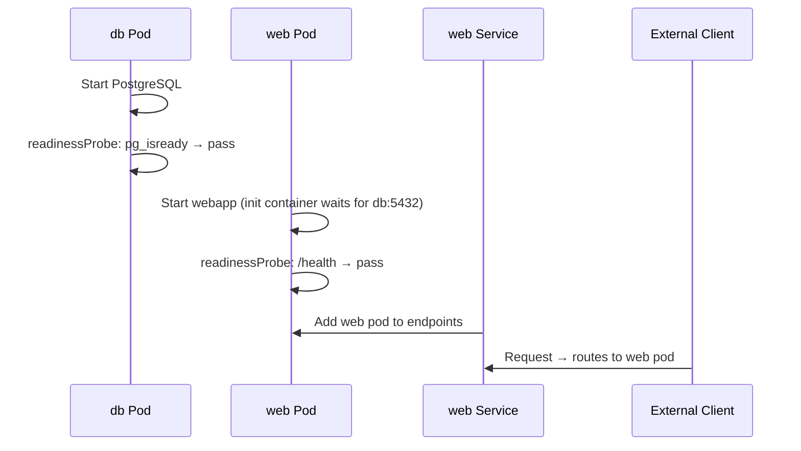

# Translating Podman Compose to Kubernetes Manifests
> Module 16 · Lesson 02 | [↑ Course Index](../README.md)

## Table of Contents
- [Overview](#overview)
- [A Typical Podman Compose App](#a-typical-podman-compose-app)
- [Step 1: Services → Deployments](#step-1-services--deployments)
- [Step 2: Port Mappings → Kubernetes Services](#step-2-port-mappings--kubernetes-services)
- [Step 3: Volumes → PersistentVolumeClaims](#step-3-volumes--persistentvolumeclaims)
- [Step 4: Environment Variables and Secrets](#step-4-environment-variables-and-secrets)
- [Step 5: Health Checks → Probes](#step-5-health-checks--probes)
- [Step 6: Depends-On → Init Containers and Readiness](#step-6-depends-on--init-containers-and-readiness)
- [Step 7: Networking → Services and DNS](#step-7-networking--services-and-dns)
- [Step 8: Ingress for External Access](#step-8-ingress-for-external-access)
- [Using Kompose for Automated Translation](#using-kompose-for-automated-translation)
- [Complete Before and After Example](#complete-before-and-after-example)
- [Lab](#lab)

---

## Overview

This lesson takes a realistic `podman-compose.yml` (web app + database + cache) and translates it piece-by-piece into Kubernetes manifests. By the end you'll have a reusable mental template for any Compose-to-k3s migration.

[↑ Back to TOC](#table-of-contents) · [↑ Course Index](../README.md)

---

## A Typical Podman Compose App

Here is the starting point — a three-tier web application:

```yaml
# podman-compose.yml (BEFORE)
version: "3.9"

services:
  web:
    image: myorg/webapp:1.2.0
    ports:
      - "8080:8080"
    environment:
      DATABASE_URL: postgres://app:secret@db:5432/appdb
      REDIS_URL: redis://cache:6379
      LOG_LEVEL: info
    depends_on:
      db:
        condition: service_healthy
      cache:
        condition: service_started
    healthcheck:
      test: ["CMD", "curl", "-f", "http://localhost:8080/health"]
      interval: 30s
      timeout: 5s
      retries: 3
    volumes:
      - uploads:/app/uploads

  db:
    image: postgres:16-alpine
    environment:
      POSTGRES_DB: appdb
      POSTGRES_USER: app
      POSTGRES_PASSWORD: secret
    volumes:
      - pgdata:/var/lib/postgresql/data
    healthcheck:
      test: ["CMD-SHELL", "pg_isready -U app -d appdb"]
      interval: 10s
      timeout: 5s
      retries: 5

  cache:
    image: redis:7-alpine
    volumes:
      - redisdata:/data

volumes:
  uploads:
  pgdata:
  redisdata:
```

We will translate this into 12 Kubernetes manifests across a dedicated namespace.

[↑ Back to TOC](#table-of-contents) · [↑ Course Index](../README.md)

---

## Step 1: Services → Deployments

Each `service:` in Compose becomes a `Deployment` in Kubernetes.

```yaml
# Compose
services:
  web:
    image: myorg/webapp:1.2.0
```

```yaml
# Kubernetes
apiVersion: apps/v1
kind: Deployment
metadata:
  name: web
  namespace: myapp
spec:
  replicas: 1
  selector:
    matchLabels:
      app: web
  template:
    metadata:
      labels:
        app: web
    spec:
      containers:
      - name: web
        image: myorg/webapp:1.2.0
```

> **Stateful services** (databases) should use a `StatefulSet` instead of a `Deployment` — covered in Step 3.

[↑ Back to TOC](#table-of-contents) · [↑ Course Index](../README.md)

---

## Step 2: Port Mappings → Kubernetes Services

```yaml
# Compose
ports:
  - "8080:8080"   # host:container
```

In k3s, pod ports are NOT exposed to the host. You create a separate `Service` object:

```yaml
# For internal cluster access only (pod-to-pod)
apiVersion: v1
kind: Service
metadata:
  name: web
  namespace: myapp
spec:
  selector:
    app: web
  ports:
  - port: 8080
    targetPort: 8080
  type: ClusterIP   # internal only
```

For external access, use `NodePort` (direct port) or `Ingress` (recommended — covered in Step 8).

**Database and cache services** are internal-only — use `ClusterIP`:
```yaml
apiVersion: v1
kind: Service
metadata:
  name: db
  namespace: myapp
spec:
  selector:
    app: db
  ports:
  - port: 5432
    targetPort: 5432
  type: ClusterIP
---
apiVersion: v1
kind: Service
metadata:
  name: cache
  namespace: myapp
spec:
  selector:
    app: cache
  ports:
  - port: 6379
    targetPort: 6379
  type: ClusterIP
```

[↑ Back to TOC](#table-of-contents) · [↑ Course Index](../README.md)

---

## Step 3: Volumes → PersistentVolumeClaims

Named Compose volumes become PVCs backed by a `StorageClass`.

```yaml
# Compose
volumes:
  pgdata:
  uploads:
```

```yaml
# Kubernetes — one PVC per volume
apiVersion: v1
kind: PersistentVolumeClaim
metadata:
  name: pgdata
  namespace: myapp
spec:
  accessModes: [ReadWriteOnce]
  storageClassName: local-path   # k3s built-in
  resources:
    requests:
      storage: 5Gi
---
apiVersion: v1
kind: PersistentVolumeClaim
metadata:
  name: uploads
  namespace: myapp
spec:
  accessModes: [ReadWriteOnce]
  storageClassName: local-path
  resources:
    requests:
      storage: 10Gi
```

Mount in the Pod:
```yaml
# In the Deployment template.spec
volumes:
- name: pgdata
  persistentVolumeClaim:
    claimName: pgdata

containers:
- name: db
  volumeMounts:
  - name: pgdata
    mountPath: /var/lib/postgresql/data
```

> **For databases, use `StatefulSet` not `Deployment`** — it gives stable network identity and ordered pod management:
> ```yaml
> kind: StatefulSet
> spec:
>   volumeClaimTemplates:
>   - metadata:
>       name: pgdata
>     spec:
>       accessModes: [ReadWriteOnce]
>       storageClassName: local-path
>       resources:
>         requests:
>           storage: 5Gi
> ```

[↑ Back to TOC](#table-of-contents) · [↑ Course Index](../README.md)

---

## Step 4: Environment Variables and Secrets

### Plain environment variables
```yaml
# Compose
environment:
  LOG_LEVEL: info
```

```yaml
# Kubernetes
env:
- name: LOG_LEVEL
  value: info
```

### Sensitive values → Kubernetes Secrets
```yaml
# Compose
environment:
  POSTGRES_PASSWORD: secret
  DATABASE_URL: postgres://app:secret@db:5432/appdb
```

```yaml
# Kubernetes: create a Secret
apiVersion: v1
kind: Secret
metadata:
  name: app-secrets
  namespace: myapp
type: Opaque
stringData:
  postgres-password: "secret"
  database-url: "postgres://app:secret@db:5432/appdb"
  redis-url: "redis://cache:6379"
```

Reference in the pod:
```yaml
env:
- name: DATABASE_URL
  valueFrom:
    secretKeyRef:
      name: app-secrets
      key: database-url
- name: POSTGRES_PASSWORD
  valueFrom:
    secretKeyRef:
      name: app-secrets
      key: postgres-password
```

Or mount all keys as environment variables at once:
```yaml
envFrom:
- secretRef:
    name: app-secrets
```

[↑ Back to TOC](#table-of-contents) · [↑ Course Index](../README.md)

---

## Step 5: Health Checks → Probes

```yaml
# Compose
healthcheck:
  test: ["CMD", "curl", "-f", "http://localhost:8080/health"]
  interval: 30s
  timeout: 5s
  retries: 3
```

```yaml
# Kubernetes — two probe types work together
livenessProbe:          # kill + restart if this fails
  httpGet:
    path: /health
    port: 8080
  initialDelaySeconds: 15
  periodSeconds: 30
  timeoutSeconds: 5
  failureThreshold: 3

readinessProbe:         # stop sending traffic if this fails (no restart)
  httpGet:
    path: /health
    port: 8080
  initialDelaySeconds: 5
  periodSeconds: 10
  timeoutSeconds: 3
  failureThreshold: 3
```

For the database `pg_isready` check:
```yaml
livenessProbe:
  exec:
    command: ["pg_isready", "-U", "app", "-d", "appdb"]
  initialDelaySeconds: 30
  periodSeconds: 10
  failureThreshold: 5
```

[↑ Back to TOC](#table-of-contents) · [↑ Course Index](../README.md)

---

## Step 6: Depends-On → Init Containers and Readiness

Compose `depends_on` has no direct Kubernetes equivalent. Instead:

### Option A: Init Container (wait for dependency)
```yaml
initContainers:
- name: wait-for-db
  image: busybox:1.36
  command: ['sh', '-c',
    'until nc -z db 5432; do echo "Waiting for db..."; sleep 2; done']
```

### Option B: Readiness Probes (preferred)
The better pattern: set a `readinessProbe` on the database pod. The web app's pod will be started but traffic only routes to it once both it *and* its dependencies are ready (Service endpoints only include ready pods).



[↑ Back to TOC](#table-of-contents) · [↑ Course Index](../README.md)

---

## Step 7: Networking → Services and DNS

In Compose, services talk to each other by service name (e.g., `db`, `cache`). **Kubernetes DNS works the same way** — with the namespace appended:

| Compose connection | Kubernetes DNS name | Short form (same namespace) |
|-------------------|--------------------|-----------------------------|
| `db:5432` | `db.myapp.svc.cluster.local:5432` | `db:5432` ✅ |
| `cache:6379` | `cache.myapp.svc.cluster.local:6379` | `cache:6379` ✅ |

So `DATABASE_URL: postgres://app:secret@db:5432/appdb` works **unchanged** in Kubernetes as long as the Service is named `db` and is in the same namespace.

[↑ Back to TOC](#table-of-contents) · [↑ Course Index](../README.md)

---

## Step 8: Ingress for External Access

Compose used `ports: "8080:8080"` to expose the app. In k3s, use Traefik Ingress:

```yaml
apiVersion: traefik.containo.us/v1alpha1
kind: IngressRoute
metadata:
  name: web
  namespace: myapp
spec:
  entryPoints: [websecure]
  routes:
  - match: Host(`myapp.example.com`)
    kind: Rule
    services:
    - name: web
      port: 8080
  tls:
    secretName: myapp-tls
```

This is far more powerful than a port mapping: TLS termination, host-based routing, rate limiting, and more are all available through middleware.

[↑ Back to TOC](#table-of-contents) · [↑ Course Index](../README.md)

---

## Using Kompose for Automated Translation

`kompose` is an official tool that converts `docker-compose.yml` / `podman-compose.yml` to Kubernetes manifests:

```bash
# Install kompose
curl -L https://github.com/kubernetes/kompose/releases/latest/download/kompose-linux-amd64 \
  -o /usr/local/bin/kompose
chmod +x /usr/local/bin/kompose

# Convert
kompose convert -f podman-compose.yml --out ./k8s/

# Or convert and immediately apply
kompose up -f podman-compose.yml
```

**Limitations of kompose output:**
- Uses `Deployment` for databases (you should convert to `StatefulSet`)
- Creates `hostPath` volumes instead of PVCs (fix manually)
- No Ingress — generates `NodePort` services
- No resource limits or probes
- Treats all env vars as plain (no Secrets)

Use kompose as a **starting point**, then review and improve the output.

[↑ Back to TOC](#table-of-contents) · [↑ Course Index](../README.md)

---

## Complete Before and After Example

See the lab file [`labs/compose-to-k3s.yaml`](labs/compose-to-k3s.yaml) for the complete translation of the example app above into production-ready Kubernetes manifests including:
- Namespace
- Secrets
- PVCs
- StatefulSet for PostgreSQL
- Deployment for Redis and Web
- ClusterIP Services for all components
- IngressRoute for external HTTPS access

[↑ Back to TOC](#table-of-contents) · [↑ Course Index](../README.md)

---

## Lab

```bash
# Install kompose
curl -L https://github.com/kubernetes/kompose/releases/latest/download/kompose-linux-amd64 \
  -o /usr/local/bin/kompose && chmod +x /usr/local/bin/kompose

# Convert the sample compose file
kompose convert -f labs/podman-compose-example.yml --out ./kompose-out/
ls kompose-out/

# Compare with the hand-crafted version
kubectl apply -f labs/compose-to-k3s.yaml
kubectl get all -n myapp

# Test DNS resolution between services
kubectl exec -n myapp deploy/web -- nslookup db
kubectl exec -n myapp deploy/web -- nslookup cache

# Clean up
kubectl delete namespace myapp
```

[↑ Back to TOC](#table-of-contents) · [↑ Course Index](../README.md)

---
*Licensed under [CC BY-NC-SA 4.0](../LICENSE.md) · © 2026 UncleJS*
