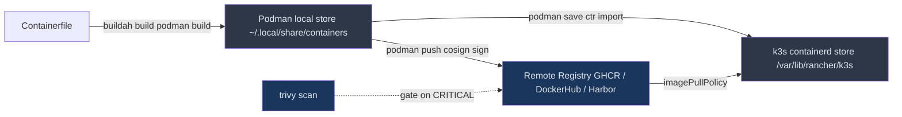
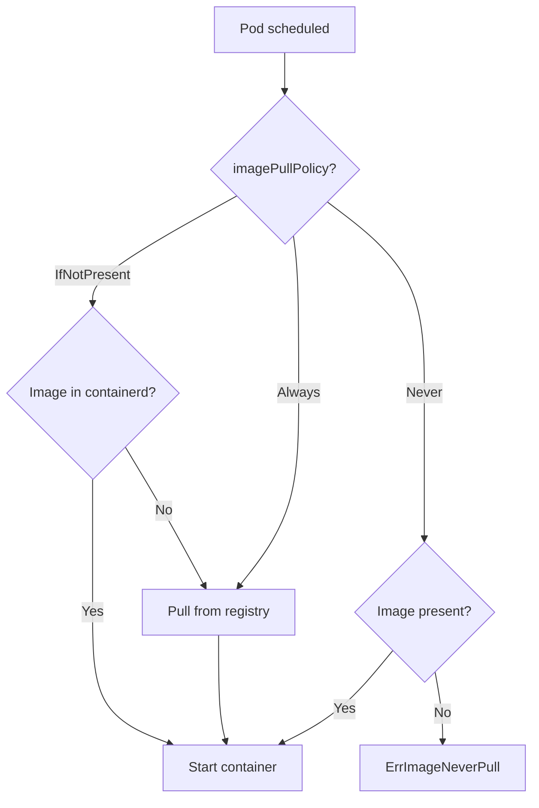
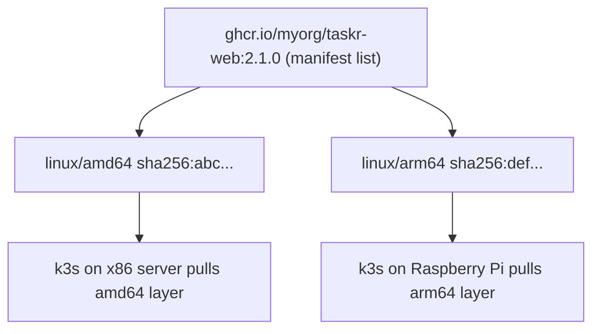
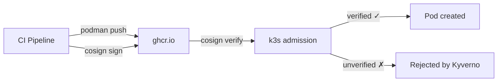
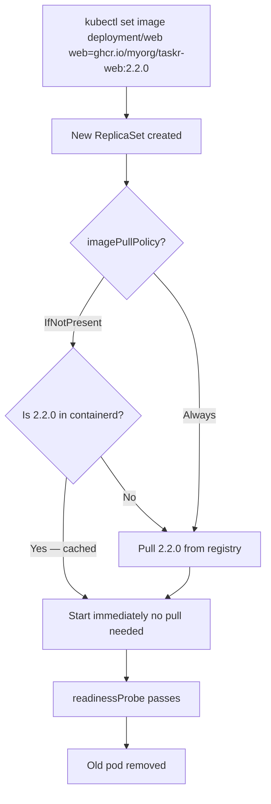
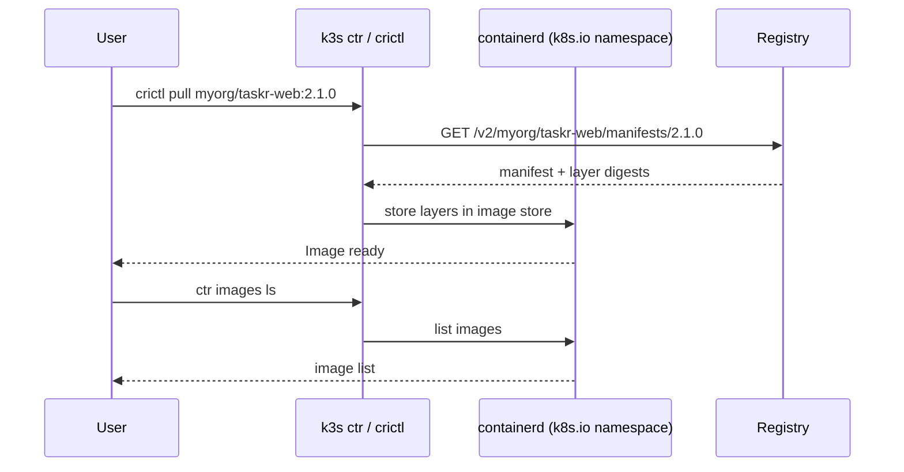
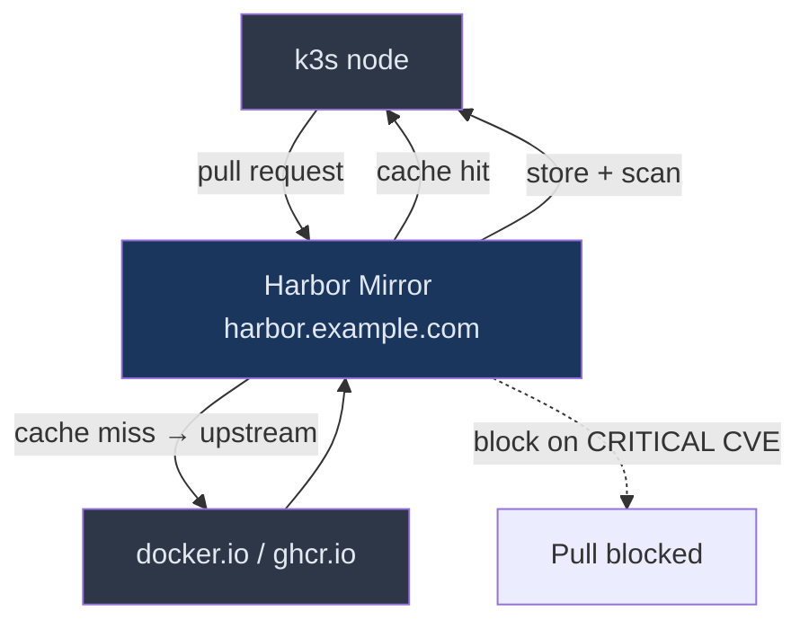

# Images and Registries: From Podman to k3s
> Module 16 · Lesson 03 | [↑ Course Index](../README.md)


[](../README.md)
[](../LICENSE.md)

## Table of Contents
- [Overview](#overview)
- [How k3s Pulls Images](#how-k3s-pulls-images)
- [Building Images with Podman and Buildah](#building-images-with-podman-and-buildah)
- [Multi-Arch Builds with buildah manifest](#multi-arch-builds-with-buildah-manifest)
- [BuildKit Cache Mounts in Containerfiles](#buildkit-cache-mounts-in-containerfiles)
- [Pushing to a Remote Registry](#pushing-to-a-remote-registry)
  - [Docker Hub](#docker-hub)
  - [GitHub Container Registry (GHCR)](#github-container-registry-ghcr)
- [Image Signing with cosign](#image-signing-with-cosign)
- [Vulnerability Scanning with Trivy](#vulnerability-scanning-with-trivy)
- [OCI Artifacts: Beyond Container Images](#oci-artifacts-beyond-container-images)
- [Running a Local Registry Inside k3s](#running-a-local-registry-inside-k3s)
- [Configuring k3s for Private and Insecure Registries](#configuring-k3s-for-private-and-insecure-registries)
- [imagePullPolicy in Rolling Deploys](#imagepullpolicy-in-rolling-deploys)
- [Credential Rotation](#credential-rotation)
- [Inspecting Images on the Node with crictl and ctr](#inspecting-images-on-the-node-with-crictl-and-ctr)
- [Pre-loading Images for Air-Gapped Environments](#pre-loading-images-for-air-gapped-environments)
- [Configuring Mirror Registries](#configuring-mirror-registries)
- [Common Pitfalls](#common-pitfalls)
- [Further Reading](#further-reading)
- [Lab](#lab)

---

## Overview

When you run `podman run myimage`, Podman pulls and stores the image in your user's local OCI image store. k3s works differently: it uses **containerd** as the container runtime and has its own image store, completely separate from Podman's. This lesson explains the full image lifecycle inside k3s, how to get your Podman-built images into it, and how to configure private or local registries — including multi-arch builds, signing, scanning, and credential rotation.



[↑ Back to TOC](#table-of-contents) · [↑ Course Index](../README.md)

---

## How k3s Pulls Images

k3s uses **containerd** (not Podman, not Docker) as its CRI (Container Runtime Interface). When a Pod is scheduled, containerd fetches the image from a registry using the pull policy defined in the manifest:

| `imagePullPolicy` | Behaviour | When to use |
|---|---|---|
| `IfNotPresent` (default when tag ≠ `latest`) | Pull only if not cached in containerd's store | Production — faster, deterministic |
| `Always` (default when tag = `latest`) | Pull on every Pod start | Dev/staging with mutable tags |
| `Never` | Never pull — image **must** already be imported | Air-gapped environments |



> **Key difference from Podman:** Podman images and k3s/containerd images are in **completely separate stores**. Building an image with `podman build` does NOT make it available to k3s workloads — you must either push it to a registry or manually import it with `ctr images import`.

[↑ Back to TOC](#table-of-contents) · [↑ Course Index](../README.md)

---

## Building Images with Podman and Buildah

### Using `podman build`

```bash
# Standard build — creates an image in your local Podman store
podman build -t myorg/taskr-web:2.1.0 .

# Build with a specific Containerfile name
podman build -f Containerfile.prod -t myorg/taskr-web:prod .

# Build with build-time arguments
podman build \
  --build-arg NODE_VERSION=20 \
  --build-arg APP_ENV=production \
  -t ghcr.io/myorg/taskr-web:2.1.0 .
```

### Tagging for a Registry

Always tag with the full registry path before pushing:

```bash
# GitHub Container Registry
podman tag myorg/taskr-web:2.1.0 ghcr.io/myorg/taskr-web:2.1.0

# Private registry
podman tag myorg/taskr-web:2.1.0 registry.example.com:5000/myorg/taskr-web:2.1.0
```

### Production-ready Containerfile

```dockerfile
# Containerfile — multi-stage, non-root, pinned versions
FROM node:20-alpine AS deps
WORKDIR /app
COPY package.json package-lock.json ./
RUN npm ci --only=production

FROM node:20-alpine AS build
WORKDIR /app
COPY package.json package-lock.json ./
RUN npm ci
COPY . .
RUN npm run build

FROM node:20-alpine AS runtime
# Create non-root user — matches k3s securityContext defaults
RUN addgroup -S appgroup && adduser -S appuser -G appgroup
WORKDIR /app
COPY --from=deps --chown=appuser:appgroup /app/node_modules ./node_modules
COPY --from=build --chown=appuser:appgroup /app/dist ./dist
USER appuser
EXPOSE 3000
ENTRYPOINT ["node", "dist/server.js"]
```

Key practices:
- **Multi-stage builds** — dependencies and build tools stay in earlier stages
- **Non-root user** — matches `securityContext.runAsNonRoot: true`
- **Pinned base image versions** — never use `latest`
- **Alpine or distroless** base images — smallest attack surface
- **`COPY --chown`** — sets ownership in one layer instead of a separate `RUN chown`

[↑ Back to TOC](#table-of-contents) · [↑ Course Index](../README.md)

---

## Multi-Arch Builds with buildah manifest

k3s runs on both `amd64` (x86-64 servers) and `arm64` (Raspberry Pi, Apple Silicon, ARM cloud). Building a multi-arch image with a single manifest list means one image tag works everywhere.

```bash
# ── Step 1: Build amd64 image ──────────────────────────────────────────────
buildah build \
  --platform linux/amd64 \
  --manifest ghcr.io/myorg/taskr-web:2.1.0 \
  -f Containerfile .

# ── Step 2: Build arm64 image ──────────────────────────────────────────────
buildah build \
  --platform linux/arm64 \
  --manifest ghcr.io/myorg/taskr-web:2.1.0 \
  -f Containerfile .

# ── Step 3: Inspect the manifest list ────────────────────────────────────
buildah manifest inspect ghcr.io/myorg/taskr-web:2.1.0

# ── Step 4: Push the multi-arch manifest list ────────────────────────────
buildah manifest push \
  --all \
  ghcr.io/myorg/taskr-web:2.1.0 \
  docker://ghcr.io/myorg/taskr-web:2.1.0
```



> **Cross-compilation without emulation:** `buildah build --platform linux/arm64` can build ARM images on an AMD64 host using QEMU binfmt emulation. Install `qemu-user-static` on the host to enable this.
> ```bash
> sudo dnf install qemu-user-static   # Fedora/RHEL
> ```

[↑ Back to TOC](#table-of-contents) · [↑ Course Index](../README.md)

---

## BuildKit Cache Mounts in Containerfiles

Standard `RUN npm ci` re-downloads packages on every build, even if `package.json` hasn't changed. **Cache mounts** persist the package manager cache between builds, dramatically speeding up CI:

```dockerfile
# Standard (slow — re-downloads every time)
RUN npm ci

# With BuildKit cache mount (fast — reuses the npm cache)
RUN --mount=type=cache,target=/root/.npm \
    npm ci
```

```bash
# Podman uses BuildKit syntax by default in newer versions
# For older Podman, enable explicitly:
BUILDAH_LAYERS=true buildah build \
  --layers \
  -t ghcr.io/myorg/taskr-web:2.1.0 .
```

**Other useful cache mount targets:**

| Package manager | Cache mount target |
|---|---|
| npm / Node.js | `/root/.npm` |
| pnpm | `/root/.local/share/pnpm/store` |
| pip / Python | `/root/.cache/pip` |
| Go | `/root/.cache/go-build` and `/go/pkg/mod` |
| Rust / cargo | `/usr/local/cargo/registry` |
| apt (Debian/Ubuntu) | `/var/cache/apt/archives` |

```dockerfile
# Go example with dual cache mounts
RUN --mount=type=cache,target=/root/.cache/go-build \
    --mount=type=cache,target=/go/pkg/mod \
    go build -o /app/server ./cmd/server
```

> **CI/CD tip:** In GitHub Actions or Gitea Actions, persist the Podman/Buildah layer cache with `actions/cache` on `/var/lib/containers/storage` to reuse these cache mounts across pipeline runs.

[↑ Back to TOC](#table-of-contents) · [↑ Course Index](../README.md)

---

## Pushing to a Remote Registry

### Docker Hub

```bash
# Log in (prompts for password; use access token in CI)
podman login docker.io -u myorg

# Push
podman push docker.io/myorg/taskr-web:2.1.0

# Push with all tags
podman push docker.io/myorg/taskr-web --all-tags
```

For private Docker Hub images, k3s needs a pull secret:

```bash
kubectl create secret docker-registry dockerhub-creds \
  --docker-server=https://index.docker.io/v1/ \
  --docker-username=myorg \
  --docker-password=<access-token> \
  --docker-email=ci@example.com \
  -n taskr
```

Reference it in your Pod spec:

```yaml
spec:
  imagePullSecrets:
    - name: dockerhub-creds
  containers:
    - name: web
      image: docker.io/myorg/taskr-web:2.1.0
```

### GitHub Container Registry (GHCR)

```bash
# Generate a Personal Access Token (PAT) with read:packages + write:packages
echo $GITHUB_PAT | podman login ghcr.io -u myorg --password-stdin

# Push
podman push ghcr.io/myorg/taskr-web:2.1.0
```

GHCR pull secret for k3s:

```bash
kubectl create secret docker-registry ghcr-creds \
  --docker-server=ghcr.io \
  --docker-username=myorg \
  --docker-password=$GITHUB_PAT \
  -n taskr
```

> **Tip:** For GitOps workflows (Module 11), store pull secrets in SealedSecrets or the External Secrets Operator so they are never committed as plain text.

[↑ Back to TOC](#table-of-contents) · [↑ Course Index](../README.md)

---

## Image Signing with cosign

**cosign** (from Sigstore) allows you to cryptographically sign container images and verify signatures before deploying. This is the supply-chain security standard for k8s workloads.

```bash
# Install cosign
curl -L https://github.com/sigstore/cosign/releases/latest/download/cosign-linux-amd64 \
  -o /usr/local/bin/cosign && chmod +x /usr/local/bin/cosign

# ── Generate a key pair (store private key in your secrets vault) ──────────
cosign generate-key-pair

# ── Sign after push ────────────────────────────────────────────────────────
podman push ghcr.io/myorg/taskr-web:2.1.0
cosign sign --key cosign.key ghcr.io/myorg/taskr-web:2.1.0

# ── Verify before deploy ────────────────────────────────────────────────────
cosign verify --key cosign.pub ghcr.io/myorg/taskr-web:2.1.0
```

**Policy enforcement with Kyverno** (enforces signed images cluster-wide):
```yaml
apiVersion: kyverno.io/v1
kind: ClusterPolicy
metadata:
  name: require-signed-images
spec:
  validationFailureAction: enforce
  rules:
  - name: check-image-signature
    match:
      any:
      - resources:
          kinds: [Pod]
          namespaces: [taskr]
    verifyImages:
    - imageReferences: ["ghcr.io/myorg/*"]
      attestors:
      - entries:
        - keys:
            publicKeys: |-
              -----BEGIN PUBLIC KEY-----
              <your cosign.pub contents>
              -----END PUBLIC KEY-----
```



[↑ Back to TOC](#table-of-contents) · [↑ Course Index](../README.md)

---

## Vulnerability Scanning with Trivy

**Trivy** (by Aqua Security) scans container images for CVEs. Integrate it into your build pipeline to gate on `CRITICAL` vulnerabilities before pushing.

```bash
# Install trivy
curl -sfL https://raw.githubusercontent.com/aquasecurity/trivy/main/contrib/install.sh \
  | sh -s -- -b /usr/local/bin

# ── Scan a local image (before push) ──────────────────────────────────────
trivy image ghcr.io/myorg/taskr-web:2.1.0

# ── Scan and exit non-zero on CRITICAL (use in CI gates) ──────────────────
trivy image --exit-code 1 --severity CRITICAL ghcr.io/myorg/taskr-web:2.1.0

# ── Scan a specific Containerfile ─────────────────────────────────────────
trivy config Containerfile

# ── Generate a SARIF report (for GitHub Security tab) ─────────────────────
trivy image --format sarif --output trivy.sarif ghcr.io/myorg/taskr-web:2.1.0

# ── Scan an already-deployed image in k3s ─────────────────────────────────
trivy k8s --report=summary --namespace taskr deployment/web
```

**CI/CD gate example (Gitea Actions / GitHub Actions):**
```yaml
- name: Scan image
  run: |
    trivy image \
      --exit-code 1 \
      --ignore-unfixed \
      --severity CRITICAL,HIGH \
      ghcr.io/myorg/taskr-web:${{ github.sha }}

- name: Push only if scan passes
  if: success()
  run: podman push ghcr.io/myorg/taskr-web:${{ github.sha }}
```

> **Trivy + Podman tip:** Trivy can scan from Podman's local store directly:
> ```bash
> trivy image --input <(podman save myorg/taskr-web:2.1.0)
> ```

[↑ Back to TOC](#table-of-contents) · [↑ Course Index](../README.md)

---

## OCI Artifacts: Beyond Container Images

OCI registries can store more than container images — Helm charts, Kustomize configs, and even policy files are stored as **OCI artifacts**. This lets you use a single registry for all your build outputs.

```bash
# Push a Helm chart as an OCI artifact
helm package ./charts/taskr
helm push taskr-2.1.0.tgz oci://ghcr.io/myorg/charts

# Pull and install
helm install taskr oci://ghcr.io/myorg/charts/taskr --version 2.1.0

# Push a raw file (e.g., Kustomize config or policy)
cosign upload blob -f kustomization.yaml ghcr.io/myorg/configs/taskr-kustomize:latest

# List OCI artifacts in a registry
oras ls ghcr.io/myorg/charts
```

**Using Helm OCI charts in k3s with FluxCD:**
```yaml
apiVersion: source.toolkit.fluxcd.io/v1beta2
kind: HelmRepository
metadata:
  name: myorg
  namespace: flux-system
spec:
  type: oci
  url: oci://ghcr.io/myorg/charts
  interval: 1h
  secretRef:
    name: ghcr-creds
```

[↑ Back to TOC](#table-of-contents) · [↑ Course Index](../README.md)

---

## Running a Local Registry Inside k3s

For development or air-gapped environments, run a registry as a k3s Deployment:

```yaml
# local-registry.yaml
apiVersion: v1
kind: Namespace
metadata:
  name: registry
---
apiVersion: apps/v1
kind: Deployment
metadata:
  name: registry
  namespace: registry
spec:
  replicas: 1
  selector:
    matchLabels:
      app: registry
  template:
    metadata:
      labels:
        app: registry
    spec:
      containers:
        - name: registry
          image: docker.io/library/registry:2.8
          ports:
            - containerPort: 5000
          env:
            - name: REGISTRY_STORAGE_FILESYSTEM_ROOTDIRECTORY
              value: /var/lib/registry
          volumeMounts:
            - name: registry-data
              mountPath: /var/lib/registry
      volumes:
        - name: registry-data
          persistentVolumeClaim:
            claimName: registry-pvc
---
apiVersion: v1
kind: PersistentVolumeClaim
metadata:
  name: registry-pvc
  namespace: registry
spec:
  accessModes: [ReadWriteOnce]
  storageClassName: local-path
  resources:
    requests:
      storage: 20Gi
---
apiVersion: v1
kind: Service
metadata:
  name: registry
  namespace: registry
spec:
  selector:
    app: registry
  ports:
    - port: 5000
      targetPort: 5000
  type: NodePort
```

```bash
kubectl apply -f local-registry.yaml

# Find the NodePort
kubectl get svc registry -n registry
# NAME       TYPE       CLUSTER-IP    EXTERNAL-IP   PORT(S)          AGE
# registry   NodePort   10.43.5.200   <none>        5000:31234/TCP   1m

# Push to it from the host
podman tag myorg/taskr-web:2.1.0 localhost:31234/myorg/taskr-web:2.1.0
podman push --tls-verify=false localhost:31234/myorg/taskr-web:2.1.0
```

[↑ Back to TOC](#table-of-contents) · [↑ Course Index](../README.md)

---

## Configuring k3s for Private and Insecure Registries

k3s reads `/etc/rancher/k3s/registries.yaml` at startup to configure registry mirrors and credentials. **Edit this file and restart k3s** to apply changes.

```yaml
# /etc/rancher/k3s/registries.yaml

mirrors:
  # Mirror Docker Hub pulls through your local registry
  "docker.io":
    endpoint:
      - "http://registry.registry.svc.cluster.local:5000"

  # Local NodePort registry (insecure)
  "localhost:31234":
    endpoint:
      - "http://localhost:31234"

  # Private corporate registry
  "registry.example.com":
    endpoint:
      - "https://registry.example.com"

configs:
  # Credentials for private registry
  "registry.example.com":
    auth:
      username: robot$myapp
      password: "super-secret-token"
    tls:
      insecure_skip_verify: false
      ca_file: /etc/ssl/certs/my-ca.crt

  # Allow an insecure (plain HTTP) local registry
  "localhost:31234":
    tls:
      insecure_skip_verify: true
```

After editing:

```bash
# Restart k3s server
sudo systemctl restart k3s

# On agent nodes, restart the agent
sudo systemctl restart k3s-agent
```

> **Important:** `registries.yaml` must exist on **every node** in the cluster (server and agents). In multi-node setups, automate distribution via Ansible or a config management tool.

[↑ Back to TOC](#table-of-contents) · [↑ Course Index](../README.md)

---

## imagePullPolicy in Rolling Deploys

`imagePullPolicy` interacts with `RollingUpdate` in important ways — get it wrong and rolling deploys will either be slow or skip updated images entirely.



**Rules for rolling deploys:**

| Scenario | Recommended policy | Reason |
|---|---|---|
| Immutable semantic tags (`2.1.0`, `v1.5.3`) | `IfNotPresent` | Tag never changes — caching is safe |
| Mutable tags (`latest`, `main`, `dev`) | `Always` | Must pull on every deploy to get new content |
| Air-gapped or pre-loaded images | `Never` | Image already imported — no registry needed |
| Canary deployment | `IfNotPresent` | New tag per canary — cached after first pull |

```yaml
# Production: pin to semver tag + IfNotPresent
containers:
- name: web
  image: ghcr.io/myorg/taskr-web:2.2.0
  imagePullPolicy: IfNotPresent

# Dev/staging: use commit SHA with Always
containers:
- name: web
  image: ghcr.io/myorg/taskr-web:sha-abc1234
  imagePullPolicy: Always
```

> **Never deploy `latest` to production.** `imagePullPolicy: Always` with `:latest` means pods on different nodes may end up running different versions if the image is updated mid-rollout.

[↑ Back to TOC](#table-of-contents) · [↑ Course Index](../README.md)

---

## Credential Rotation

Pull secret credentials (registry tokens, PATs) expire. A pull secret that has expired causes `ImagePullBackOff` across the cluster. Plan for rotation from day one.

### Manual rotation
```bash
# Delete the old secret
kubectl delete secret ghcr-creds -n taskr

# Re-create with a new token
kubectl create secret docker-registry ghcr-creds \
  --docker-server=ghcr.io \
  --docker-username=myorg \
  --docker-password=$NEW_GITHUB_PAT \
  -n taskr

# No pod restart needed — pull secrets are read at image pull time
```

### Automating rotation with External Secrets Operator
```yaml
# external-secret.yaml
apiVersion: external-secrets.io/v1beta1
kind: ExternalSecret
metadata:
  name: ghcr-creds
  namespace: taskr
spec:
  refreshInterval: 1h     # re-sync every hour
  secretStoreRef:
    name: vault-backend   # or aws-secrets-manager, doppler, etc.
    kind: ClusterSecretStore
  target:
    name: ghcr-creds
    template:
      type: kubernetes.io/dockerconfigjson
      data:
        .dockerconfigjson: |
          {"auths":{"ghcr.io":{"username":"myorg","password":"{{ .token }}"}}}
  data:
  - secretKey: token
    remoteRef:
      key: ci/ghcr-pat
```

### Best practices for pull secret lifetime

| Practice | Benefit |
|---|---|
| Use short-lived tokens (GitHub PAT with 30-day expiry) | Limits blast radius if leaked |
| Set a calendar reminder or CI rotation job | Never be surprised by expiry |
| Use `imagePullSecrets` at the namespace default service account | Don't repeat it in every Deployment |
| Monitor `ImagePullBackOff` with alerting | Know before users do |

```bash
# Attach pull secret to the default service account (applies to all pods in namespace)
kubectl patch serviceaccount default -n taskr \
  -p '{"imagePullSecrets":[{"name":"ghcr-creds"}]}'
```

[↑ Back to TOC](#table-of-contents) · [↑ Course Index](../README.md)

---

## Inspecting Images on the Node with crictl and ctr

k3s bundles two tools for inspecting the containerd image store:

### `crictl` — CRI-level inspection

```bash
# List all images known to containerd
sudo k3s crictl images

# Pull an image manually (useful for pre-caching)
sudo k3s crictl pull ghcr.io/myorg/taskr-web:2.1.0

# Inspect image details
sudo k3s crictl inspecti ghcr.io/myorg/taskr-web:2.1.0

# List running containers
sudo k3s crictl ps

# Get logs from a container by container ID
sudo k3s crictl logs <container-id>
```

### `ctr` — containerd native CLI

```bash
# List images in the k8s.io namespace (what k3s uses)
sudo k3s ctr images ls

# Pull an image into the k8s.io namespace
sudo k3s ctr images pull ghcr.io/myorg/taskr-web:2.1.0

# Import a tar archive (air-gapped import)
sudo k3s ctr images import webapp-2.1.0.tar

# Remove an image
sudo k3s ctr images rm ghcr.io/myorg/taskr-web:2.1.0

# Tag an existing image to a new name
sudo k3s ctr images tag \
  ghcr.io/myorg/taskr-web:2.1.0 \
  localhost:31234/myorg/taskr-web:2.1.0
```

> **Namespace note:** containerd uses namespaces to isolate images. k3s stores its images in the `k8s.io` namespace. Always use `k3s ctr` (not raw `ctr`) to ensure you're operating in the right namespace.



[↑ Back to TOC](#table-of-contents) · [↑ Course Index](../README.md)

---

## Pre-loading Images for Air-Gapped Environments

When the k3s nodes have no internet access, pre-load images by exporting from Podman and importing into containerd:

```bash
# ─── On a machine WITH internet access ───────────────────────────────────

# Pull the images you need
podman pull ghcr.io/myorg/taskr-web:2.1.0
podman pull docker.io/library/postgres:15-alpine
podman pull docker.io/library/redis:7-alpine

# Save all to a single tar archive
podman save \
  ghcr.io/myorg/taskr-web:2.1.0 \
  postgres:15-alpine \
  redis:7-alpine \
  -o airgap-images.tar

# Copy to the k3s node(s)
scp airgap-images.tar node1:/tmp/
scp airgap-images.tar node2:/tmp/

# ─── On each k3s node ────────────────────────────────────────────────────

# Import into containerd's k8s.io namespace
sudo k3s ctr images import /tmp/airgap-images.tar

# Verify
sudo k3s ctr images ls | grep -E "taskr|postgres|redis"
```

### k3s Air-Gap Bundle (preferred for clusters)

k3s itself supports a special pre-loaded images directory:

```bash
# Place .tar files here; k3s imports them automatically on startup
sudo mkdir -p /var/lib/rancher/k3s/agent/images/

podman save ghcr.io/myorg/taskr-web:2.1.0 \
  -o /var/lib/rancher/k3s/agent/images/taskr-web.tar

# Restart k3s and it will auto-import
sudo systemctl restart k3s
```

> **Tip:** For large clusters, the official [k3s air-gap bundle](https://docs.k3s.io/installation/airgap) with a pre-populated `agent/images/` directory on each node scales better than per-node manual imports.

[↑ Back to TOC](#table-of-contents) · [↑ Course Index](../README.md)

---

## Configuring Mirror Registries

Mirror registries let you transparently redirect image pulls from a public registry to a local cache (e.g., to reduce bandwidth, enforce security scanning, or survive upstream outages):

```yaml
# /etc/rancher/k3s/registries.yaml — mirror configuration

mirrors:
  # All docker.io pulls go through a local Harbor/Nexus cache first
  "docker.io":
    endpoint:
      - "https://harbor.example.com/proxy-docker"
      - "https://index.docker.io"   # fallback to upstream

  # Mirror ghcr.io
  "ghcr.io":
    endpoint:
      - "https://harbor.example.com/proxy-ghcr"
      - "https://ghcr.io"

configs:
  "harbor.example.com":
    auth:
      username: k3s-puller
      password: "harbor-robot-token"
```



[↑ Back to TOC](#table-of-contents) · [↑ Course Index](../README.md)

---

## Common Pitfalls

| Issue | Symptom | Fix |
|---|---|---|
| Image not found in k3s after `podman build` | `ErrImagePull` on Pod | Push to registry first, or use `ctr images import` |
| `ImagePullBackOff` for private image | `kubectl describe pod` → `401 Unauthorized` | Create `imagePullSecrets` with correct credentials |
| Expired PAT / registry token | All pods with that image fail to start | Rotate the pull secret (see Credential Rotation section) |
| `latest` tag mismatch mid-rollout | Different nodes run different image versions | Use immutable semver tags; never use `latest` in prod |
| `registries.yaml` change not applied | Old registry config still in effect | Restart `k3s` service on all nodes |
| Air-gap import wrong namespace | Image imported but pod still `ErrImageNeverPull` | Use `k3s ctr images import` (not bare `ctr`) — ensures `k8s.io` namespace |
| Multi-arch manifest not pushed | ARM node pulls wrong architecture | Use `buildah manifest push --all` not plain `podman push` |
| Trivy scan blocks on unfixed CVEs | CI never passes | Add `--ignore-unfixed` to skip CVEs with no available fix |
| cosign verify fails on first deploy | Kyverno blocks unsigned images | Sign image immediately after push in the same CI job |
| `ctr images ls` shows no images | Running bare `ctr` instead of `k3s ctr` | Always use `sudo k3s ctr images ls` |

[↑ Back to TOC](#table-of-contents) · [↑ Course Index](../README.md)

---

## Further Reading

- [k3s Private Registry Configuration](https://docs.k3s.io/installation/private-registry) — official registries.yaml reference
- [buildah manifest](https://github.com/containers/buildah/blob/main/docs/buildah-manifest.md) — multi-arch build guide
- [cosign documentation](https://docs.sigstore.dev/cosign/overview/) — image signing and verification
- [Trivy documentation](https://aquasecurity.github.io/trivy/) — container vulnerability scanning
- [OCI Distribution Spec](https://github.com/opencontainers/distribution-spec) — how registries and artifacts work
- [Kyverno image verification](https://kyverno.io/docs/writing-policies/verify-images/) — cluster-wide signature enforcement
- [External Secrets Operator](https://external-secrets.io/) — automatic credential rotation
- [k3s air-gap installation](https://docs.k3s.io/installation/airgap) — pre-loading images for offline clusters

[↑ Back to TOC](#table-of-contents) · [↑ Course Index](../README.md)

---

## Lab

**Goal:** Build a local image with Podman, scan it with Trivy, sign it with cosign, push it to a local in-cluster registry, and deploy it to k3s.

```bash
# ── Prerequisites ──────────────────────────────────────────────────────────
# k3s running, kubectl configured, podman + buildah installed

# Install trivy
curl -sfL https://raw.githubusercontent.com/aquasecurity/trivy/main/contrib/install.sh \
  | sh -s -- -b /usr/local/bin

# Install cosign
curl -L https://github.com/sigstore/cosign/releases/latest/download/cosign-linux-amd64 \
  -o /usr/local/bin/cosign && chmod +x /usr/local/bin/cosign

# ── Part 1: Deploy the local registry ─────────────────────────────────────
kubectl apply -f - <<'EOF'
apiVersion: v1
kind: Namespace
metadata:
  name: registry
---
apiVersion: apps/v1
kind: Deployment
metadata:
  name: registry
  namespace: registry
spec:
  replicas: 1
  selector:
    matchLabels:
      app: registry
  template:
    metadata:
      labels:
        app: registry
    spec:
      containers:
        - name: registry
          image: docker.io/library/registry:2.8
          ports:
            - containerPort: 5000
---
apiVersion: v1
kind: Service
metadata:
  name: registry
  namespace: registry
spec:
  selector:
    app: registry
  ports:
    - port: 5000
      targetPort: 5000
  type: NodePort
EOF

REGISTRY_PORT=$(kubectl get svc registry -n registry \
  -o jsonpath='{.spec.ports[0].nodePort}')
echo "Registry on localhost:${REGISTRY_PORT}"

# ── Part 2: Build and scan the image ──────────────────────────────────────
mkdir -p /tmp/hello-k3s
cat > /tmp/hello-k3s/Containerfile <<'CFILE'
FROM docker.io/library/alpine:3.19
RUN addgroup -S appgroup && adduser -S appuser -G appgroup
WORKDIR /app
RUN echo '#!/bin/sh' > /app/run.sh && \
    echo 'while true; do echo "Hello k3s"; sleep 5; done' >> /app/run.sh && \
    chmod +x /app/run.sh
USER appuser
CMD ["/app/run.sh"]
CFILE

podman build -t localhost:${REGISTRY_PORT}/hello-k3s:1.0.0 /tmp/hello-k3s

# Scan the image — fails if CRITICAL CVEs found
trivy image \
  --exit-code 0 \
  --severity CRITICAL,HIGH \
  localhost:${REGISTRY_PORT}/hello-k3s:1.0.0

# ── Part 3: Sign the image ─────────────────────────────────────────────────
cosign generate-key-pair   # creates cosign.key and cosign.pub
# Signing a local (not yet pushed) image — sign after push in production
echo "Keys generated. In production: sign after pushing to registry."

# ── Part 4: Push to the local registry ────────────────────────────────────
podman push --tls-verify=false localhost:${REGISTRY_PORT}/hello-k3s:1.0.0

# ── Part 5: Configure k3s to allow the insecure registry ─────────────────
sudo tee /etc/rancher/k3s/registries.yaml <<YAML
mirrors:
  "localhost:${REGISTRY_PORT}":
    endpoint:
      - "http://localhost:${REGISTRY_PORT}"
configs:
  "localhost:${REGISTRY_PORT}":
    tls:
      insecure_skip_verify: true
YAML

sudo systemctl restart k3s
sleep 15  # wait for k3s to come back

# ── Part 6: Deploy the image ──────────────────────────────────────────────
kubectl create deployment hello-k3s \
  --image=localhost:${REGISTRY_PORT}/hello-k3s:1.0.0 \
  -n default
kubectl rollout status deployment/hello-k3s

# ── Part 7: Verify the image is in containerd's store ────────────────────
sudo k3s ctr images ls | grep hello-k3s
kubectl logs deployment/hello-k3s

# ── Part 8: Test multi-arch build (amd64 only on this lab host) ──────────
buildah build \
  --platform linux/amd64 \
  --manifest localhost:${REGISTRY_PORT}/hello-k3s:multiarch \
  /tmp/hello-k3s

buildah manifest inspect localhost:${REGISTRY_PORT}/hello-k3s:multiarch

# ── Cleanup ───────────────────────────────────────────────────────────────
kubectl delete deployment hello-k3s
kubectl delete namespace registry
```

[↑ Back to TOC](#table-of-contents) · [↑ Course Index](../README.md)

---
*Licensed under [CC BY-NC-SA 4.0](../LICENSE.md) · © 2026 UncleJS*
