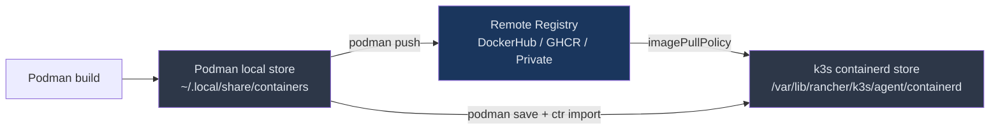
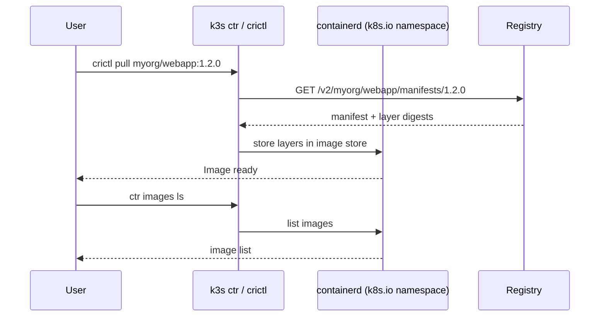
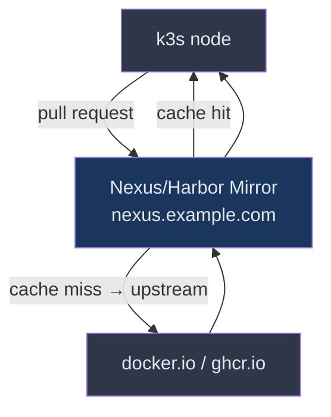

# Images and Registries: From Podman to k3s
> Module 16 · Lesson 03 | [↑ Course Index](../README.md)

## Table of Contents
- [Overview](#overview)
- [How k3s Pulls Images](#how-k3s-pulls-images)
- [Building Images with Podman and Buildah](#building-images-with-podman-and-buildah)
- [Pushing to a Remote Registry](#pushing-to-a-remote-registry)
  - [Docker Hub](#docker-hub)
  - [GitHub Container Registry (GHCR)](#github-container-registry-ghcr)
- [Running a Local Registry Inside k3s](#running-a-local-registry-inside-k3s)
- [Configuring k3s for Private and Insecure Registries](#configuring-k3s-for-private-and-insecure-registries)
- [Inspecting Images on the Node with crictl and ctr](#inspecting-images-on-the-node-with-crictl-and-ctr)
- [Pre-loading Images for Air-Gapped Environments](#pre-loading-images-for-air-gapped-environments)
- [Configuring Mirror Registries](#configuring-mirror-registries)
- [Lab](#lab)

---

## Overview

When you run `podman run myimage`, Podman pulls and stores the image in your user's local OCI image store. k3s works differently: it uses **containerd** as the container runtime and has its own image store, completely separate from Podman's. This lesson explains the full image lifecycle inside k3s, how to get your Podman-built images into it, and how to configure private or local registries.



[↑ Back to TOC](#table-of-contents) · [↑ Course Index](../README.md)

---

## How k3s Pulls Images

k3s uses **containerd** (not Podman, not Docker) as its CRI (Container Runtime Interface). When a Pod is scheduled, containerd fetches the image from a registry using the pull policy defined in the manifest:

| `imagePullPolicy` | Behaviour |
|---|---|
| `IfNotPresent` (default) | Pull only if not cached in containerd's store |
| `Always` | Pull on every Pod start |
| `Never` | Never pull — image **must** already be imported |

> **Key difference from Podman:** Podman images and k3s/containerd images are in **completely separate stores**. Building an image with `podman build` does NOT make it available to k3s workloads — you must either push it to a registry or manually import it.

[↑ Back to TOC](#table-of-contents) · [↑ Course Index](../README.md)

---

## Building Images with Podman and Buildah

### Using `podman build`

```bash
# Standard build — creates an image in your local Podman store
podman build -t myorg/webapp:1.2.0 .

# Multi-platform build using buildah
buildah build --platform linux/amd64,linux/arm64 \
  -t myorg/webapp:1.2.0 .

# Build with a specific Containerfile name
podman build -f Containerfile.prod -t myorg/webapp:prod .
```

### Tagging for a Registry

Always tag with the full registry path before pushing:

```bash
# Docker Hub
podman tag myorg/webapp:1.2.0 docker.io/myorg/webapp:1.2.0

# GitHub Container Registry
podman tag myorg/webapp:1.2.0 ghcr.io/myorg/webapp:1.2.0

# Private registry
podman tag myorg/webapp:1.2.0 registry.example.com:5000/myorg/webapp:1.2.0
```

### Best Practices for k3s-Bound Images

```dockerfile
# Example: a production-ready Containerfile
FROM node:20-alpine AS build
WORKDIR /app
COPY package*.json ./
RUN npm ci --only=production
COPY . .
RUN npm run build

FROM node:20-alpine AS runtime
# Run as non-root — matches k3s security defaults
RUN addgroup -S appgroup && adduser -S appuser -G appgroup
WORKDIR /app
COPY --from=build /app/dist ./dist
COPY --from=build /app/node_modules ./node_modules
USER appuser
EXPOSE 3000
ENTRYPOINT ["node", "dist/server.js"]
```

Key practices:
- Use **multi-stage builds** to minimize image size
- Run as a **non-root user** (matches k3s `securityContext` defaults)
- Pin **exact base image versions** (not `latest`)
- Use **Alpine or distroless** base images where possible

[↑ Back to TOC](#table-of-contents) · [↑ Course Index](../README.md)

---

## Pushing to a Remote Registry

### Docker Hub

```bash
# Log in (prompts for password; use access token in CI)
podman login docker.io -u myorg

# Push
podman push docker.io/myorg/webapp:1.2.0

# Push with all tags
podman push docker.io/myorg/webapp --all-tags
```

For private Docker Hub images, k3s needs a pull secret:

```bash
kubectl create secret docker-registry dockerhub-creds \
  --docker-server=https://index.docker.io/v1/ \
  --docker-username=myorg \
  --docker-password=<access-token> \
  --docker-email=ci@example.com \
  -n myapp
```

Reference it in your Pod spec:

```yaml
spec:
  imagePullSecrets:
    - name: dockerhub-creds
  containers:
    - name: web
      image: docker.io/myorg/webapp:1.2.0
```

### GitHub Container Registry (GHCR)

```bash
# Generate a Personal Access Token (PAT) with read:packages + write:packages
echo $GITHUB_PAT | podman login ghcr.io -u myorg --password-stdin

# Push
podman push ghcr.io/myorg/webapp:1.2.0
```

GHCR pull secret for k3s:

```bash
kubectl create secret docker-registry ghcr-creds \
  --docker-server=ghcr.io \
  --docker-username=myorg \
  --docker-password=$GITHUB_PAT \
  -n myapp
```

> **Tip:** For GitOps workflows (Module 11), store the pull secret in a SealedSecret or External Secret so it is never committed as plain text.

[↑ Back to TOC](#table-of-contents) · [↑ Course Index](../README.md)

---

## Running a Local Registry Inside k3s

For development or air-gapped environments you can run a registry as a k3s Deployment:

```yaml
# local-registry.yaml
---
apiVersion: v1
kind: Namespace
metadata:
  name: registry

---
apiVersion: apps/v1
kind: Deployment
metadata:
  name: registry
  namespace: registry
spec:
  replicas: 1
  selector:
    matchLabels:
      app: registry
  template:
    metadata:
      labels:
        app: registry
    spec:
      containers:
        - name: registry
          image: docker.io/library/registry:2.8
          ports:
            - containerPort: 5000
          env:
            - name: REGISTRY_STORAGE_FILESYSTEM_ROOTDIRECTORY
              value: /var/lib/registry
          volumeMounts:
            - name: registry-data
              mountPath: /var/lib/registry
      volumes:
        - name: registry-data
          persistentVolumeClaim:
            claimName: registry-pvc

---
apiVersion: v1
kind: PersistentVolumeClaim
metadata:
  name: registry-pvc
  namespace: registry
spec:
  accessModes: [ReadWriteOnce]
  resources:
    requests:
      storage: 20Gi

---
apiVersion: v1
kind: Service
metadata:
  name: registry
  namespace: registry
spec:
  selector:
    app: registry
  ports:
    - port: 5000
      targetPort: 5000
  type: NodePort        # exposes on a random high port on the node
```

```bash
kubectl apply -f local-registry.yaml

# Find the NodePort
kubectl get svc registry -n registry
# NAME       TYPE       CLUSTER-IP    EXTERNAL-IP   PORT(S)          AGE
# registry   NodePort   10.43.5.200   <none>        5000:31234/TCP   1m

# Push to it from the host
podman tag myorg/webapp:1.2.0 localhost:31234/myorg/webapp:1.2.0
podman push --tls-verify=false localhost:31234/myorg/webapp:1.2.0
```

[↑ Back to TOC](#table-of-contents) · [↑ Course Index](../README.md)

---

## Configuring k3s for Private and Insecure Registries

k3s reads `/etc/rancher/k3s/registries.yaml` at startup to configure registry mirrors and credentials. **Edit this file and restart k3s** to apply changes.

```yaml
# /etc/rancher/k3s/registries.yaml

mirrors:
  # Mirror Docker Hub pulls through your local registry
  "docker.io":
    endpoint:
      - "http://registry.registry.svc.cluster.local:5000"

  # Local NodePort registry (insecure)
  "localhost:31234":
    endpoint:
      - "http://localhost:31234"

  # Private corporate registry
  "registry.example.com":
    endpoint:
      - "https://registry.example.com"

configs:
  # Credentials for private registry
  "registry.example.com":
    auth:
      username: robot$myapp
      password: "super-secret-token"
    tls:
      insecure_skip_verify: false
      ca_file: /etc/ssl/certs/my-ca.crt

  # Allow an insecure (plain HTTP) local registry
  "localhost:31234":
    tls:
      insecure_skip_verify: true
```

After editing:

```bash
# Restart k3s server
sudo systemctl restart k3s

# On agent nodes, restart the agent
sudo systemctl restart k3s-agent
```

> **Important:** `registries.yaml` must exist on **every node** in the cluster (server and agents). In multi-node setups, automate distribution via Ansible or a Config Management tool.

[↑ Back to TOC](#table-of-contents) · [↑ Course Index](../README.md)

---

## Inspecting Images on the Node with crictl and ctr

k3s bundles two tools for inspecting the containerd image store:

### `crictl` — CRI-level inspection

```bash
# List all images known to containerd
sudo k3s crictl images

# Pull an image manually (useful for pre-caching)
sudo k3s crictl pull docker.io/myorg/webapp:1.2.0

# Inspect image details
sudo k3s crictl inspecti docker.io/myorg/webapp:1.2.0

# List running containers
sudo k3s crictl ps

# Get logs from a container by container ID
sudo k3s crictl logs <container-id>
```

### `ctr` — containerd native CLI

```bash
# List images in the k8s.io namespace (what k3s uses)
sudo k3s ctr images ls

# Pull an image into the k8s.io namespace
sudo k3s ctr images pull docker.io/myorg/webapp:1.2.0

# Import a tar archive (air-gapped import)
sudo k3s ctr images import webapp-1.2.0.tar

# Remove an image
sudo k3s ctr images rm docker.io/myorg/webapp:1.2.0
```

> **Namespace note:** containerd uses namespaces to isolate images. k3s stores its images in the `k8s.io` namespace. Always use `k3s ctr` (not raw `ctr`) to ensure you're operating in the right namespace.



[↑ Back to TOC](#table-of-contents) · [↑ Course Index](../README.md)

---

## Pre-loading Images for Air-Gapped Environments

When the k3s nodes have no internet access, pre-load images by exporting from Podman and importing into containerd:

```bash
# --- On a machine WITH internet access ---

# Pull the images you need
podman pull docker.io/myorg/webapp:1.2.0
podman pull docker.io/library/postgres:15-alpine
podman pull docker.io/library/redis:7-alpine

# Save all to a single tar archive
podman save \
  myorg/webapp:1.2.0 \
  postgres:15-alpine \
  redis:7-alpine \
  -o airgap-images.tar

# Copy to the k3s node(s)
scp airgap-images.tar node1:/tmp/
scp airgap-images.tar node2:/tmp/

# --- On each k3s node ---

# Import into containerd's k8s.io namespace
sudo k3s ctr images import /tmp/airgap-images.tar

# Verify
sudo k3s ctr images ls | grep -E "webapp|postgres|redis"
```

### k3s Air-Gap Bundle (Alternative)

k3s itself supports a special pre-loaded images directory:

```bash
# Place .tar files here; k3s imports them automatically on startup
sudo mkdir -p /var/lib/rancher/k3s/agent/images/

podman save myorg/webapp:1.2.0 -o /var/lib/rancher/k3s/agent/images/webapp.tar

# Restart k3s and it will auto-import
sudo systemctl restart k3s
```

> **Tip:** For large clusters, building a custom k3s ISO or using the official [k3s air-gap bundle](https://docs.k3s.io/installation/airgap) is more scalable than per-node imports.

[↑ Back to TOC](#table-of-contents) · [↑ Course Index](../README.md)

---

## Configuring Mirror Registries

Mirror registries let you transparently redirect image pulls from a public registry to a local cache (e.g., to reduce bandwidth or enforce security scanning):

```yaml
# /etc/rancher/k3s/registries.yaml — mirror configuration

mirrors:
  # All docker.io pulls go through a local Nexus/Harbor cache first
  "docker.io":
    endpoint:
      - "https://nexus.example.com/repository/docker-proxy"
      - "https://index.docker.io"   # fallback to upstream

  # Mirror quay.io
  "quay.io":
    endpoint:
      - "https://nexus.example.com/repository/quay-proxy"
      - "https://quay.io"

  # Mirror ghcr.io
  "ghcr.io":
    endpoint:
      - "https://nexus.example.com/repository/ghcr-proxy"
      - "https://ghcr.io"

configs:
  "nexus.example.com":
    auth:
      username: k3s-puller
      password: "nexus-token"
```



[↑ Back to TOC](#table-of-contents) · [↑ Course Index](../README.md)

---

## Lab

**Goal:** Build a local image with Podman, push it to a local in-cluster registry, and deploy it to k3s.

### Prerequisites

- k3s running (single-node is fine)
- Podman installed on the host
- `kubectl` configured

### Steps

```bash
# 1. Deploy the local registry
kubectl apply -f - <<'EOF'
apiVersion: v1
kind: Namespace
metadata:
  name: registry
---
apiVersion: apps/v1
kind: Deployment
metadata:
  name: registry
  namespace: registry
spec:
  replicas: 1
  selector:
    matchLabels:
      app: registry
  template:
    metadata:
      labels:
        app: registry
    spec:
      containers:
        - name: registry
          image: docker.io/library/registry:2.8
          ports:
            - containerPort: 5000
---
apiVersion: v1
kind: Service
metadata:
  name: registry
  namespace: registry
spec:
  selector:
    app: registry
  ports:
    - port: 5000
      targetPort: 5000
  type: NodePort
EOF

# 2. Get the NodePort
REGISTRY_PORT=$(kubectl get svc registry -n registry \
  -o jsonpath='{.spec.ports[0].nodePort}')
echo "Registry NodePort: $REGISTRY_PORT"

# 3. Create a tiny Containerfile
mkdir -p /tmp/hello-k3s
cat > /tmp/hello-k3s/Containerfile <<'CFILE'
FROM docker.io/library/alpine:3.19
RUN echo "Hello from k3s lab!" > /index.html
CMD ["sh", "-c", "while true; do echo 'Hello k3s'; sleep 5; done"]
CFILE

# 4. Build the image with Podman
podman build -t localhost:${REGISTRY_PORT}/hello-k3s:latest /tmp/hello-k3s

# 5. Push to the local registry (insecure)
podman push --tls-verify=false localhost:${REGISTRY_PORT}/hello-k3s:latest

# 6. Configure k3s to allow the insecure registry
sudo tee /etc/rancher/k3s/registries.yaml <<YAML
mirrors:
  "localhost:${REGISTRY_PORT}":
    endpoint:
      - "http://localhost:${REGISTRY_PORT}"
configs:
  "localhost:${REGISTRY_PORT}":
    tls:
      insecure_skip_verify: true
YAML

sudo systemctl restart k3s
sleep 10  # wait for k3s to come back

# 7. Deploy the image
kubectl create deployment hello-k3s \
  --image=localhost:${REGISTRY_PORT}/hello-k3s:latest \
  -n default

# 8. Watch the pod come up
kubectl rollout status deployment/hello-k3s

# 9. Check logs
kubectl logs deployment/hello-k3s

# 10. Verify the image is in containerd's store
sudo k3s ctr images ls | grep hello-k3s

# Clean up
kubectl delete deployment hello-k3s
```

[↑ Back to TOC](#table-of-contents) · [↑ Course Index](../README.md)

---
*Licensed under [CC BY-NC-SA 4.0](../LICENSE.md) · © 2026 UncleJS*
