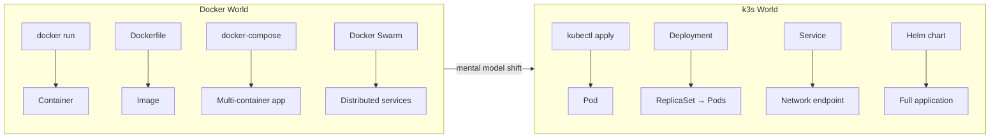
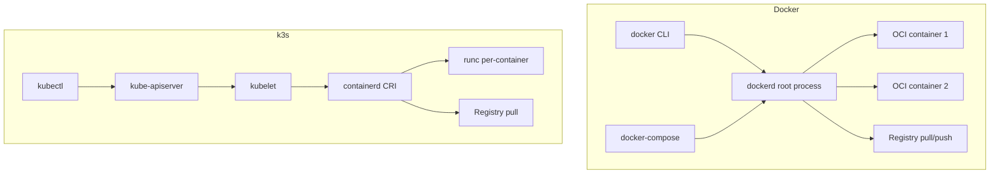
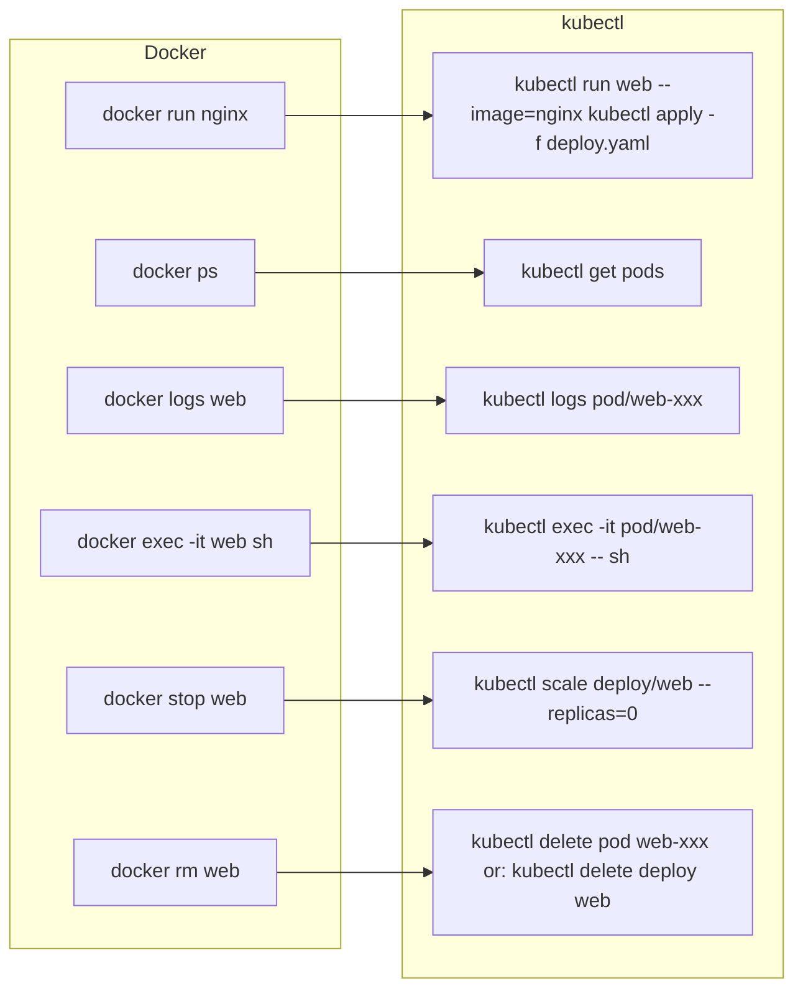
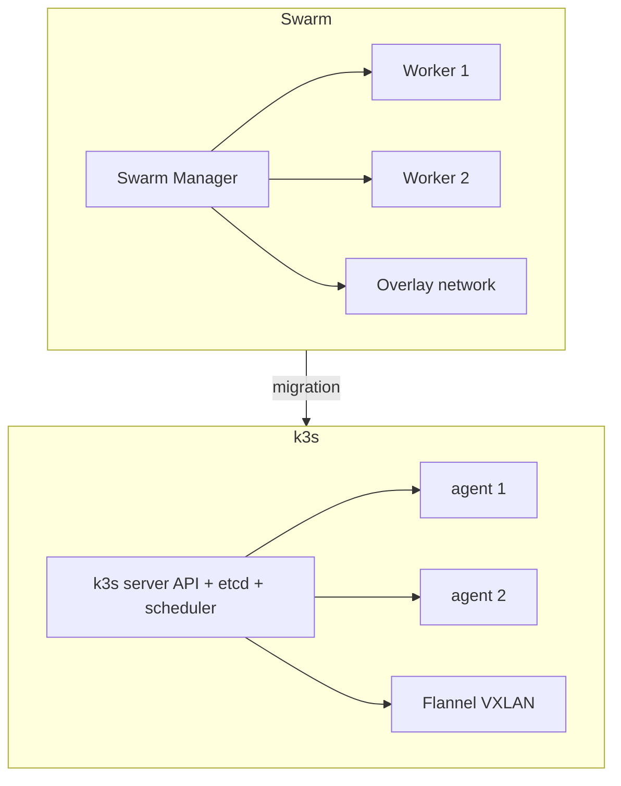
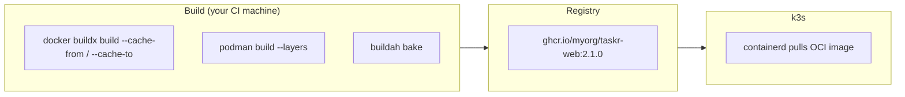
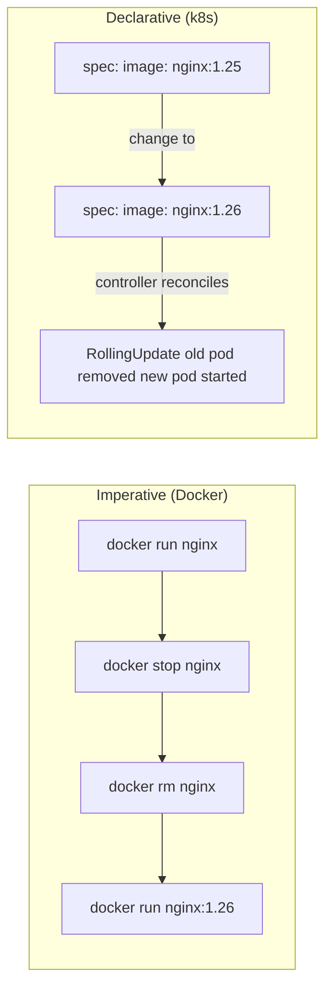

# Docker vs Kubernetes: Mental Model Shift
> Module 17 · Lesson 01 | [↑ Course Index](../README.md)

## Table of Contents
- [Overview](#overview)
- [Docker Daemon vs Daemonless Architecture](#docker-daemon-vs-daemonless-architecture)
- [Docker → Kubernetes Concept Table](#docker--kubernetes-concept-table)
- [How Docker Commands Map to kubectl](#how-docker-commands-map-to-kubectl)
- [Docker Desktop Quirks](#docker-desktop-quirks)
- [Docker Swarm → Kubernetes Mapping](#docker-swarm--kubernetes-mapping)
- [The Docker Socket Anti-Pattern](#the-docker-socket-anti-pattern)
- [BuildKit and Layer Cache in k3s](#buildkit-and-layer-cache-in-k3s)
- [What You Lose Moving to k3s](#what-you-lose-moving-to-k3s)
- [What You Gain Moving to k3s](#what-you-gain-moving-to-k3s)
- [The Declarative Mindset](#the-declarative-mindset)
- [Common Pitfalls](#common-pitfalls)
- [Mindset Checklist](#mindset-checklist)

---

## Overview

If you have been building and running containers with Docker, you already know images, containers, volumes, and networking. Moving to k3s is not about learning containers from scratch — it is about learning *who is in charge* and *how decisions are enforced at scale*. This module bridges the gap from Docker's developer-centric workflow to Kubernetes' operator-centric model.



**What this lesson covers:**
- Why k3s has no Docker daemon and why that is good
- Every major Docker concept and its Kubernetes equivalent
- Docker Desktop quirks that create false mental models
- Docker Swarm concepts mapped to Kubernetes resources
- The Docker socket: why it's dangerous and how k3s replaces it
- BuildKit and image layer caching strategy for k3s workflows
- Honest inventory of what you lose and gain in the move

[↑ Back to TOC](#table-of-contents) · [↑ Course Index](../README.md)

---

## Docker Daemon vs Daemonless Architecture

Docker requires a persistent background daemon (`dockerd`) running as root. Every `docker` CLI command, every container start, every image pull goes through this central process.



**Key differences:**

| Aspect | Docker | k3s / containerd |
|---|---|---|
| Central daemon | `dockerd` (always running) | No single daemon — kubelet + containerd |
| Root requirement | `dockerd` runs as root | k3s components run as root; pods run as non-root by default |
| Image store | `~/.docker/` or `/var/lib/docker` | `/var/lib/rancher/k3s/agent/containerd` |
| Build tool | `docker build` (BuildKit) | Build happens *outside* the cluster (Podman, Buildah, Docker) |
| CLI entry point | `docker run/ps/logs` | `kubectl get/describe/logs` |
| Networking | `docker network` | Flannel CNI — managed by k3s |

> **The most important shift:** Docker is a tool you *interact with* to run containers. k3s is a system that *enforces* your desired state using a control loop. You declare what you want; k3s makes it happen and keeps it that way.

[↑ Back to TOC](#table-of-contents) · [↑ Course Index](../README.md)

---

## Docker → Kubernetes Concept Table

| Docker concept | Kubernetes equivalent | Notes |
|---|---|---|
| `docker run` | `kubectl run` / `Pod` | Use Deployments in practice, not bare Pods |
| `Dockerfile` | `Dockerfile` / `Containerfile` | Unchanged — k3s runs OCI images |
| `docker build` | Build outside cluster (Docker, Podman, Buildah) | k3s does not build images |
| `docker-compose.yml` | Deployment + Service + PVC + Secret | One-to-many translation |
| `docker-compose up` | `kubectl apply -f` | Declarative, not imperative |
| `docker network create` | Namespace (isolation) + NetworkPolicy | Implicit — all pods share cluster network |
| `docker volume` | PersistentVolumeClaim + StorageClass | PVCs survive pod restarts; volumes may not |
| `docker ps` | `kubectl get pods` | Pods ≠ containers; pods can have many containers |
| `docker logs` | `kubectl logs` | Same concept, different scope |
| `docker exec` | `kubectl exec` | Same concept |
| `docker inspect` | `kubectl describe` | More structured in k8s |
| `docker stats` | `kubectl top pods` | Requires metrics-server |
| `docker pull` | `imagePullPolicy: Always/IfNotPresent` | Declared in pod spec |
| `docker stop/rm` | `kubectl delete pod` (pod restarts) / `kubectl scale --replicas=0` | Deleting a pod just recreates it |
| `docker restart` | `kubectl rollout restart deployment/name` | Controlled restart |
| `docker tag/push` | `docker tag && docker push` (unchanged) | Done before applying manifests |
| `docker login` | `imagePullSecrets` in pod spec | Credentials stored as k8s Secrets |
| `HEALTHCHECK` in Dockerfile | `livenessProbe` + `readinessProbe` | Two separate concerns in k8s |
| `--restart=always` | `restartPolicy: Always` (default) | Applied at pod level |
| `--restart=on-failure` | `restartPolicy: OnFailure` | Used in Jobs |
| `--env-file` | `envFrom: configMapRef / secretRef` | Injected from ConfigMap or Secret |
| `--memory / --cpus` | `resources.limits.memory / cpu` | Enforced by Linux cgroups via kubelet |
| Docker Hub `latest` tag | Avoid in production — use semver tags | Same advice, harder to enforce in Docker |
| Swarm `service` | Deployment + Service | See the Swarm mapping section below |
| Swarm `stack` | Helm chart or Kustomize overlay | Same concept, richer tooling |
| Swarm `secret` | Kubernetes Secret | Similar, with SealedSecrets for GitOps |
| Swarm `config` | ConfigMap | Direct equivalent |

[↑ Back to TOC](#table-of-contents) · [↑ Course Index](../README.md)

---

## How Docker Commands Map to kubectl



**Side-by-side command reference:**

```bash
# ── Running a container ────────────────────────────────────────────────────
# Docker
docker run -d --name web -p 8080:80 nginx:1.25-alpine

# k3s
kubectl run web --image=nginx:1.25-alpine --port=80
# Or (preferred):
kubectl create deployment web --image=nginx:1.25-alpine --replicas=1
kubectl expose deployment web --port=80 --target-port=80 --type=NodePort

# ── Listing containers / pods ──────────────────────────────────────────────
docker ps                                  # Docker containers
kubectl get pods -n myapp                  # k3s pods

docker ps -a                               # all containers including stopped
kubectl get pods -A                        # all namespaces

# ── Viewing logs ───────────────────────────────────────────────────────────
docker logs web --tail=50 --follow
kubectl logs deployment/web --tail=50 --follow -n myapp

# ── Shell into a container ────────────────────────────────────────────────
docker exec -it web sh
kubectl exec -it deployment/web -n myapp -- sh

# ── Inspect / describe ────────────────────────────────────────────────────
docker inspect web
kubectl describe pod web-xxx -n myapp
kubectl describe deployment web -n myapp

# ── Resource usage ────────────────────────────────────────────────────────
docker stats
kubectl top pods -n myapp

# ── Copy files ────────────────────────────────────────────────────────────
docker cp web:/app/log.txt ./log.txt
kubectl cp myapp/web-xxx:/app/log.txt ./log.txt

# ── Environment variables ─────────────────────────────────────────────────
docker run -e NODE_ENV=production nginx
# k3s: set in deployment.yaml env: or envFrom:

# ── Volume mount ──────────────────────────────────────────────────────────
docker run -v pgdata:/var/lib/postgresql/data postgres
# k3s: PVC + volumeMount in pod spec
```

[↑ Back to TOC](#table-of-contents) · [↑ Course Index](../README.md)

---

## Docker Desktop Quirks

Docker Desktop (on macOS or Windows) creates a Linux VM. Several behaviours are specific to this VM and will not translate to a real k3s cluster running on Linux:

| Docker Desktop behaviour | Reality in k3s on Linux | Fix |
|---|---|---|
| `host.docker.internal` resolves to the host | No such hostname in k3s | Use the node's actual IP or a Service |
| Port mappings work with `localhost` on the Mac | k3s NodePorts require the node IP | `kubectl port-forward` for local dev |
| File mounts work from Mac paths | PVCs require actual storage classes | Use `local-path` StorageClass or Longhorn |
| Kubernetes is "built in" to Docker Desktop | That is a single-node k8s, not k3s | Behaviour is similar but config differs |
| `docker scan` (Snyk) integrated | Use Trivy separately with k3s workflows | `trivy image my-image:tag` |
| `docker buildx bake` | Supported — k3s doesn't affect build tool choice | Continue using Buildx; push to registry |
| Automatic `~/.docker/config.json` auth | Must create k8s `imagePullSecrets` explicitly | `kubectl create secret docker-registry` |
| Resource limits set in Docker Desktop settings | k3s respects Linux kernel cgroups limits | Set `resources:` in pod spec |

> **Docker Desktop's built-in Kubernetes is not k3s.** It is a patched upstream Kubernetes with different defaults. Don't assume configuration from Docker Desktop's k8s transfers directly to k3s.

[↑ Back to TOC](#table-of-contents) · [↑ Course Index](../README.md)

---

## Docker Swarm → Kubernetes Mapping

If you are coming from Docker Swarm, here is the concept mapping:

| Swarm concept | Kubernetes equivalent | Notes |
|---|---|---|
| `docker stack deploy` | `kubectl apply -k overlays/prod` | Kustomize replaces stack files |
| `docker service create` | `Deployment` + `Service` | Same idea, richer API |
| Swarm `service` (replicated) | `Deployment` | `.spec.replicas` = `--replicas` |
| Swarm `service` (global) | `DaemonSet` | One pod per node |
| Swarm `stack` (compose file) | Helm chart or Kustomize base | More powerful overlay system |
| Swarm `secret` | `kind: Secret` | Use SealedSecrets for GitOps |
| Swarm `config` | `kind: ConfigMap` | Direct equivalent |
| Swarm `network` overlay | Flannel VXLAN (auto) + Namespace | Built in — no explicit creation |
| Swarm `placement constraints` | `nodeSelector` / `nodeAffinity` | More expressive in k8s |
| Swarm `update_config` | `strategy: RollingUpdate` | Same concept, explicit tuning |
| Swarm `healthcheck` | `livenessProbe` + `readinessProbe` | Separated into two concerns |
| Swarm `resource_limits` | `resources.limits` | Same, per-container not per-service |
| Swarm manager nodes | k3s server nodes | Similar quorum requirements |
| Swarm worker nodes | k3s agent nodes | Direct equivalent |



> **Swarm is end-of-life for most use cases.** Docker Inc. has not significantly developed Swarm since 2019. k8s/k3s is the production-grade successor with a richer ecosystem.

[↑ Back to TOC](#table-of-contents) · [↑ Course Index](../README.md)

---

## The Docker Socket Anti-Pattern

Many Docker-based workflows mount the Docker socket (`/var/run/docker.sock`) into containers to allow "Docker-in-Docker" or to let CI runners launch containers. **This is a critical security vulnerability** — any container with access to the Docker socket has root access to the host.

```mermaid
graph TD
    subgraph Dangerous["⚠️ Docker socket mount"]
        HOST[Host root] <-->|full access| SOCK[/var/run/docker.sock]
        SOCK --> CONTAINER[Container with --volume /var/run/docker.sock:/var/run/docker.sock]
        CONTAINER --> ESCAPE[Container escape Root on host]
    end
    subgraph K3sSafe["✅ k3s alternative"]
        BUILD[Kaniko / Buildah / img] --> REGISTRY[Push to registry]
        REGISTRY --> K3SCLUSTER[k3s pulls image]
    end
```

**Common Docker socket use cases and their k3s replacements:**

| Docker socket use | k3s / secure alternative |
|---|---|
| CI: `docker build` inside a runner | Use Kaniko (runs in a pod, no socket), or Buildah rootless |
| CI: `docker push` | Use Skopeo or `buildah push` |
| Monitoring: read container metrics | Use Prometheus + cAdvisor (no socket needed) |
| Portainer / management UI | Use Lens or k9s (connect via kubeconfig, not socket) |
| Launching containers from a container | Use k8s Jobs — submit via the Kubernetes API instead |
| `docker-socket-proxy` sidecar | Use a proper service mesh or RBAC-scoped service account |

```yaml
# k3s secure alternative: Kaniko for in-cluster image builds
apiVersion: batch/v1
kind: Job
metadata:
  name: build-taskr-image
  namespace: ci
spec:
  template:
    spec:
      restartPolicy: Never
      containers:
      - name: kaniko
        image: gcr.io/kaniko-project/executor:latest
        args:
        - "--context=git://github.com/myorg/taskr#refs/heads/main"
        - "--destination=ghcr.io/myorg/taskr-web:$(BUILD_TAG)"
        - "--cache=true"
        env:
        - name: BUILD_TAG
          value: "2.2.0"
        volumeMounts:
        - name: kaniko-secret
          mountPath: /kaniko/.docker
      volumes:
      - name: kaniko-secret
        secret:
          secretName: ghcr-creds
          items:
          - key: .dockerconfigjson
            path: config.json
```

[↑ Back to TOC](#table-of-contents) · [↑ Course Index](../README.md)

---

## BuildKit and Layer Cache in k3s

Docker's BuildKit produces OCI images. k3s / containerd consumes OCI images. The build tool is completely separate from the runtime — you can use Docker, Podman, Buildah, or Kaniko to build, and k3s will run the result.



**Optimising Docker builds for k3s CI pipelines:**

```dockerfile
# Containerfile / Dockerfile — layer cache optimisation
# Put rarely-changing layers FIRST

FROM node:20-alpine AS deps
WORKDIR /app
# These layers only rebuild when package.json changes
COPY package.json package-lock.json ./
RUN npm ci --only=production

FROM node:20-alpine AS build
WORKDIR /app
COPY package.json package-lock.json ./
RUN npm ci
COPY . .
RUN npm run build

FROM node:20-alpine AS runtime
RUN addgroup -S app && adduser -S app -G app
WORKDIR /app
COPY --from=deps --chown=app:app /app/node_modules ./node_modules
COPY --from=build --chown=app:app /app/dist ./dist
USER app
EXPOSE 3000
ENTRYPOINT ["node", "dist/server.js"]
```

```bash
# Docker BuildKit with registry cache (reuse layers between CI runs)
docker buildx build \
  --cache-from type=registry,ref=ghcr.io/myorg/taskr-web:cache \
  --cache-to   type=registry,ref=ghcr.io/myorg/taskr-web:cache,mode=max \
  --tag ghcr.io/myorg/taskr-web:2.1.0 \
  --push .
```

> **k3s never builds images** — it only pulls and runs them. Your existing Docker build workflow is unchanged. The only new requirement: always push to a registry before applying manifests.

[↑ Back to TOC](#table-of-contents) · [↑ Course Index](../README.md)

---

## What You Lose Moving to k3s

Be honest with yourself — there are genuine trade-offs:

| What you lose | Severity | Mitigation |
|---|---|---|
| `docker run` for quick experiments | 🟡 Medium | `kubectl run --rm -it busybox -- sh` is almost as fast |
| Local image without a registry | 🟡 Medium | Use `k3s ctr images import` for dev; set up a local registry |
| `docker-compose up` for local dev | 🟡 Medium | Keep Docker Compose for local dev; use k3s for staging/prod |
| Instant feedback (`docker logs -f`) | 🟢 Low | `kubectl logs -f` is identical |
| GUI tools (Docker Desktop) | 🟢 Low | Use Lens or k9s — richer than Docker Desktop for k8s |
| `docker stats` built-in | 🟢 Low | `kubectl top pods` with metrics-server (k3s built-in) |
| Automatic TLS (Docker Desktop) | 🟡 Medium | cert-manager automates this on k3s — more powerful |
| `depends_on` simplicity | 🟡 Medium | Use init containers or readiness probes |
| Swarm mode (if using) | 🔴 High | Full re-architecture required; see Module 17 Lesson 05 |

[↑ Back to TOC](#table-of-contents) · [↑ Course Index](../README.md)

---

## What You Gain Moving to k3s

| What you gain | Value |
|---|---|
| Self-healing: pods restart automatically | 🔴 High |
| Horizontal scaling: `kubectl scale` or HPA | 🔴 High |
| Rolling deploys with zero downtime | 🔴 High |
| GitOps: cluster state in git, auto-synced | 🔴 High |
| Declarative config: desired state always enforced | 🔴 High |
| RBAC: fine-grained access control | 🔴 High |
| Namespace isolation: multi-team / multi-app | 🟡 Medium |
| Ingress: TLS + routing without a separate proxy service | 🟡 Medium |
| Metrics and observability (Prometheus, Grafana) | 🔴 High |
| Secrets management (SealedSecrets, External Secrets) | 🔴 High |
| Multi-node workloads and failure domains | 🔴 High |
| Standardised ecosystem: Helm, Flux, ArgoCD | 🔴 High |

[↑ Back to TOC](#table-of-contents) · [↑ Course Index](../README.md)

---

## The Declarative Mindset

The biggest mental shift is not technical — it is philosophical. Docker is **imperative**: you tell it what to do step by step. Kubernetes is **declarative**: you describe the end state and the system reconciles reality toward it.



**Practical rules:**
1. **Never `docker run` in production** — write a manifest instead
2. **Never edit running pods** — edit the Deployment spec and `kubectl apply`
3. **Never `kubectl delete pod`** to "fix" something — fix the underlying Deployment
4. **Never use `latest` tags** — immutable semver tags make rollbacks safe
5. **Store all manifests in git** — the cluster state is the diff between git and reality
6. **Prefer `kubectl apply`** over `kubectl create` — idempotent

[↑ Back to TOC](#table-of-contents) · [↑ Course Index](../README.md)

---

## Common Pitfalls

| Issue | Symptom | Fix |
|---|---|---|
| Expecting `docker run` to work on k3s | `command not found: docker` on k3s node | Build image separately; push to registry; apply manifest |
| Using `localhost` for service-to-service calls | `connection refused` | Use Kubernetes Service DNS: `<service>.<namespace>.svc.cluster.local` |
| `host.docker.internal` in app config | DNS resolution fails in pods | Replace with the k8s Service name |
| Mounting Docker socket in k3s pod | `no such file: /var/run/docker.sock` (and a security risk) | Use Kaniko or build outside the cluster |
| Expecting bind mounts to work (`-v ./data:/data`) | Paths don't exist on the k3s node | Use PVC with `local-path` StorageClass |
| `latest` tag with `imagePullPolicy: IfNotPresent` | Old image used after push | Always update the image tag; use `Always` only for dev |
| Swarm YAML used as k8s manifest | `unknown field "deploy"` error | Re-write as Deployment + Service — not backwards compatible |
| Docker Compose `build: .` in manifest | kompose generates broken output | Build and push image first; reference it by tag |
| Port 80/443 not exposed after `kubectl apply` | App not reachable | You need an Ingress or NodePort Service — ports are not auto-exposed |
| `docker stats` shows nothing for k3s pods | Wrong tool | Use `kubectl top pods` (requires metrics-server, built into k3s) |

[↑ Back to TOC](#table-of-contents) · [↑ Course Index](../README.md)

---

## Mindset Checklist

Work through this before starting a Docker → k3s migration:

```
[ ] I understand that k3s has no Docker daemon — containerd is the runtime
[ ] I know my Docker images are OCI-compatible and will run unchanged in k3s
[ ] I have a registry to push images to (GHCR, Docker Hub, or local)
[ ] I will replace docker-compose with Kubernetes manifests for production
[ ] I understand that pod restarts are normal — not a sign of failure
[ ] I know that deleting a pod does not delete the Deployment (it restarts)
[ ] I will set resource limits on every container
[ ] I will use liveness AND readiness probes — not just HEALTHCHECK
[ ] I will store all sensitive values in Secrets, not plain ConfigMaps or env vars
[ ] I understand that Services provide stable DNS — I won't use pod IPs
[ ] I know that Ingress replaces my nginx/Caddy proxy container
[ ] I will use immutable image tags (semver) and never deploy :latest to prod
[ ] I have a plan for local dev (keep Docker Compose) vs staging/prod (k3s)
[ ] I accept that the first week feels slower — it pays off at scale
```

[↑ Back to TOC](#table-of-contents) · [↑ Course Index](../README.md)

---
*Licensed under [CC BY-NC-SA 4.0](../LICENSE.md) · © 2026 UncleJS*
