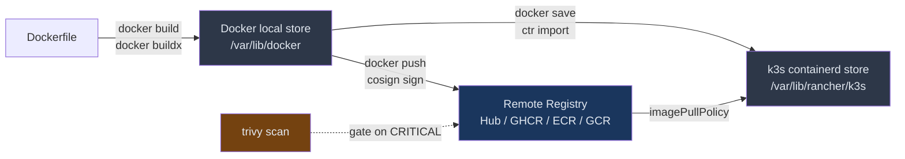
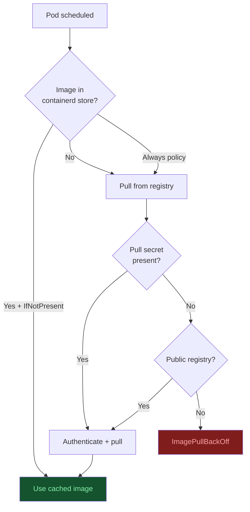
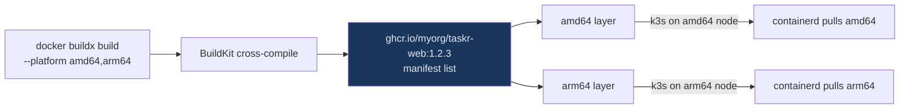
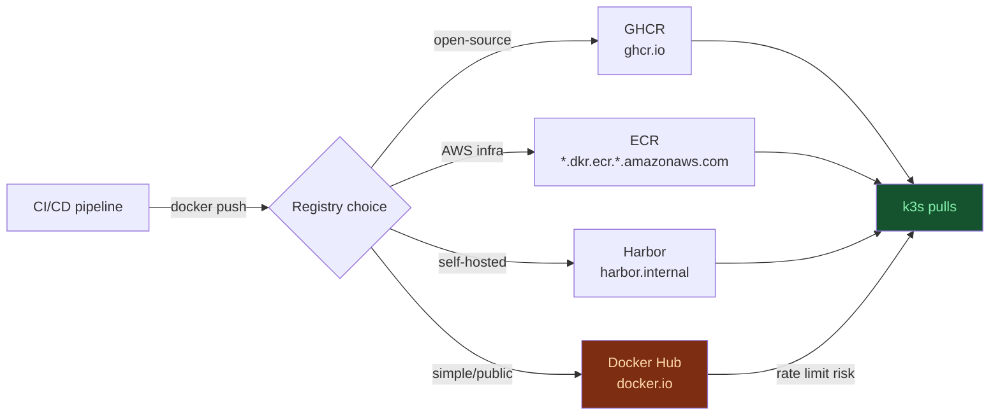
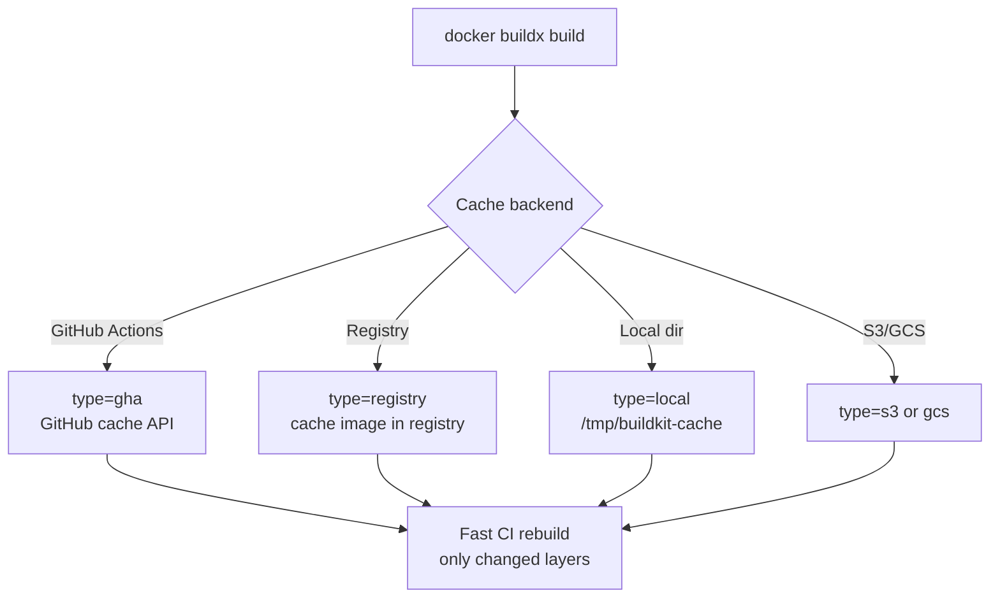
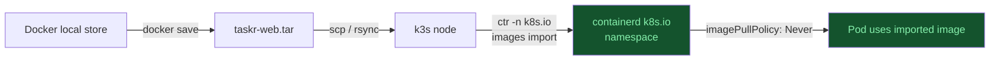

# Images and Registries: From Docker to k3s
> Module 17 · Lesson 03 | [↑ Course Index](../README.md)

## Table of Contents
- [Overview](#overview)
- [How k3s Pulls Images vs Docker](#how-k3s-pulls-images-vs-docker)
- [Building Images with Docker and BuildKit](#building-images-with-docker-and-buildkit)
  - [Multi-Stage Dockerfiles](#multi-stage-dockerfiles)
  - [docker buildx: Multi-Arch Builds](#docker-buildx-multi-arch-builds)
  - [BuildKit Cache Mounts](#buildkit-cache-mounts)
- [Docker Hub: Rate Limits and Alternatives](#docker-hub-rate-limits-and-alternatives)
  - [Hub vs GHCR vs ECR vs GCR](#hub-vs-ghcr-vs-ecr-vs-gcr)
  - [Hub Automated Builds → CI/CD Pipelines](#hub-automated-builds--cicd-pipelines)
  - [Authenticating to Docker Hub from k3s](#authenticating-to-docker-hub-from-k3s)
- [FROM scratch and Distroless Images](#from-scratch-and-distroless-images)
- [Layer Caching in CI](#layer-caching-in-ci)
- [Pushing to a Remote Registry](#pushing-to-a-remote-registry)
- [Image Signing with cosign](#image-signing-with-cosign)
- [Vulnerability Scanning with Trivy](#vulnerability-scanning-with-trivy)
- [docker save / load → ctr import](#docker-save--load--ctr-import)
- [Official Images Policy and Provenance](#official-images-policy-and-provenance)
- [Configuring k3s for Private and Insecure Registries](#configuring-k3s-for-private-and-insecure-registries)
- [imagePullPolicy in Rolling Deploys](#imagepullpolicy-in-rolling-deploys)
- [Credential Rotation](#credential-rotation)
- [Pre-loading Images for Air-Gapped Environments](#pre-loading-images-for-air-gapped-environments)
- [Common Pitfalls](#common-pitfalls)
- [Further Reading](#further-reading)
- [Lab](#lab)

---

## Overview

When you run `docker run myimage`, Docker pulls and stores the image in its daemon-managed local store at `/var/lib/docker`. k3s works completely differently: it uses **containerd** as its container runtime, with its own separate image store at `/var/lib/rancher/k3s/agent/containerd`. Images in Docker's store are invisible to k3s and vice versa.

This lesson covers the full image lifecycle from a Docker background: how BuildKit works under the hood, Docker Hub rate limits and alternatives, multi-arch builds with `docker buildx`, CI layer caching, and how to get your Docker-built images reliably into k3s — including signing, scanning, and credential rotation.



[↑ Back to TOC](#table-of-contents) · [↑ Course Index](../README.md)

---

## How k3s Pulls Images vs Docker

k3s uses **containerd** (not Docker daemon) as its CRI. When a Pod is scheduled, containerd fetches the image from a registry using the `imagePullPolicy` defined in the manifest. Docker images you have locally are **not automatically available** to k3s.

| `imagePullPolicy` | Behaviour | When to use |
|---|---|---|
| `IfNotPresent` (default when tag ≠ `latest`) | Pull only if not cached | Production — faster, deterministic |
| `Always` (default when tag = `latest`) | Pull on every Pod start | Dev/staging with mutable tags |
| `Never` | Never pull — must already be imported | Air-gapped environments |



> **Key difference from Docker:** Docker daemon handles auth via `docker login` which writes to `~/.docker/config.json`. k3s uses Kubernetes `imagePullSecrets` attached to the ServiceAccount or Pod spec. Your `docker login` credentials are not used by k3s at all.

[↑ Back to TOC](#table-of-contents) · [↑ Course Index](../README.md)

---

## Building Images with Docker and BuildKit

### Multi-Stage Dockerfiles

Multi-stage Dockerfiles are the standard approach to producing small, production-ready images. BuildKit (enabled by default since Docker 23.x) runs stages in parallel where possible.

```dockerfile
# Stage 1: build dependencies (cached unless package files change)
FROM node:20-alpine AS deps
WORKDIR /app
COPY package*.json ./
RUN npm ci --only=production

# Stage 2: build the app (cached unless source changes)
FROM node:20-alpine AS builder
WORKDIR /app
COPY package*.json ./
RUN npm ci
COPY . .
RUN npm run build

# Stage 3: minimal runtime image
FROM node:20-alpine AS runtime
WORKDIR /app
ENV NODE_ENV=production
COPY --from=deps /app/node_modules ./node_modules
COPY --from=builder /app/dist ./dist
COPY --from=builder /app/package.json .
EXPOSE 3000
USER node
CMD ["node", "dist/index.js"]
```

> **Why this matters for k3s:** Smaller images = faster pulls, smaller containerd store, reduced attack surface. The `USER node` directive prevents the container from running as root, which aligns with Kubernetes `runAsNonRoot: true` security context.

### docker buildx: Multi-Arch Builds

Docker Hub and other registries support **multi-architecture manifests**. When you push a multi-arch image, k3s automatically selects the correct variant for your node architecture (amd64, arm64, etc.).

```bash
# Create a builder that supports cross-compilation
docker buildx create --name multiarch --driver docker-container --bootstrap
docker buildx use multiarch

# Build and push for both amd64 and arm64 in one step
docker buildx build \
  --platform linux/amd64,linux/arm64 \
  --tag ghcr.io/myorg/taskr-web:1.2.3 \
  --push \
  .

# Inspect the resulting manifest list
docker buildx imagetools inspect ghcr.io/myorg/taskr-web:1.2.3
```



> **Tip:** If you use `--load` instead of `--push`, the image is loaded into Docker's local store (single-platform only). Use `--push` for multi-arch.

### BuildKit Cache Mounts

BuildKit's `--mount=type=cache` dramatically speeds up repeated builds by caching package manager directories between builds. This is especially important in CI pipelines.

```dockerfile
# syntax=docker/dockerfile:1.5
FROM node:20-alpine AS builder
WORKDIR /app
COPY package*.json ./

# Cache npm's module store between builds — not committed to the image layer
RUN --mount=type=cache,target=/root/.npm \
    npm ci

COPY . .
RUN npm run build
```

```dockerfile
# Python example
FROM python:3.12-slim AS builder
WORKDIR /app
COPY requirements.txt .

RUN --mount=type=cache,target=/root/.cache/pip \
    pip install --no-cache-dir -r requirements.txt

COPY . .
```

```bash
# Enable BuildKit for older Docker versions
export DOCKER_BUILDKIT=1
docker build -t myapp:latest .

# With docker buildx (always uses BuildKit)
docker buildx build -t myapp:latest .
```

> **vs Podman/Buildah:** Podman also supports `--mount=type=cache` in Containerfiles. The syntax is identical — this is an OCI spec feature. See Module 16 Lesson 03 for Podman-specific cache details.

[↑ Back to TOC](#table-of-contents) · [↑ Course Index](../README.md)

---

## Docker Hub: Rate Limits and Alternatives

### Hub vs GHCR vs ECR vs GCR

Docker Hub's free tier enforces pull rate limits. In k3s, every Pod restart may trigger a pull — rate limits become a production concern.

| Registry | Free tier pulls | Auth method | Best for |
|---|---|---|---|
| **Docker Hub** | 100/6h anon, 200/6h free account | `docker login` → k8s Secret | Public images; personal projects |
| **GHCR** (GitHub Container Registry) | Unlimited for public; generous for private | PAT → k8s Secret | Open-source; GitHub Actions CI |
| **AWS ECR** | Pay per storage/transfer | IAM role or access key | AWS-hosted workloads |
| **GCR / Artifact Registry** | Pay per storage/transfer | Workload Identity or SA key | GCP-hosted workloads |
| **Self-hosted Harbor** | Unlimited | TLS + robot account | Air-gapped; compliance |



### Hub Automated Builds → CI/CD Pipelines

Docker Hub's legacy "Automated Builds" feature linked a GitHub repo to a Hub build. This is now deprecated. The modern replacement is a GitHub Actions (or GitLab CI) workflow that builds with `docker buildx` and pushes to your registry of choice.

```yaml
# .github/workflows/build-push.yml
name: Build and Push

on:
  push:
    tags: ["v*"]

jobs:
  build:
    runs-on: ubuntu-latest
    permissions:
      contents: read
      packages: write   # needed to push to GHCR

    steps:
      - uses: actions/checkout@v4

      - name: Set up Docker Buildx
        uses: docker/setup-buildx-action@v3

      - name: Log in to GHCR
        uses: docker/login-action@v3
        with:
          registry: ghcr.io
          username: ${{ github.actor }}
          password: ${{ secrets.GITHUB_TOKEN }}

      - name: Build and push
        uses: docker/build-push-action@v5
        with:
          context: .
          platforms: linux/amd64,linux/arm64
          push: true
          tags: ghcr.io/${{ github.repository }}:${{ github.ref_name }}
          cache-from: type=gha
          cache-to: type=gha,mode=max
```

### Authenticating to Docker Hub from k3s

If you must use Docker Hub, create a pull secret to avoid rate limit `ImagePullBackOff` errors:

```bash
# Create a pull secret from Docker Hub credentials
kubectl create secret docker-registry dockerhub-pull \
  --docker-server=https://index.docker.io/v1/ \
  --docker-username=MYUSER \
  --docker-password=MYTOKEN \
  --docker-email=me@example.com \
  -n taskr
```

```yaml
# Attach to a ServiceAccount so all Pods in the namespace use it automatically
apiVersion: v1
kind: ServiceAccount
metadata:
  name: default
  namespace: taskr
imagePullSecrets:
  - name: dockerhub-pull
```

> **Tip:** Use a Docker Hub **access token** (not your password) — you can scope it read-only and rotate it without changing your password.

[↑ Back to TOC](#table-of-contents) · [↑ Course Index](../README.md)

---

## FROM scratch and Distroless Images

`FROM scratch` produces the absolute minimal image — just your binary. `distroless` images (from Google) sit one step above: they include libc and CA certs but no shell, package manager, or other attack surface.

```dockerfile
# FROM scratch — pure static binary (Go example)
FROM golang:1.22-alpine AS builder
WORKDIR /app
COPY . .
RUN CGO_ENABLED=0 GOOS=linux go build -ldflags="-s -w" -o taskr-web .

FROM scratch
COPY --from=builder /app/taskr-web /taskr-web
COPY --from=builder /etc/ssl/certs/ca-certificates.crt /etc/ssl/certs/
EXPOSE 3000
ENTRYPOINT ["/taskr-web"]
```

```dockerfile
# distroless — Node.js app with no shell
FROM node:20-alpine AS builder
WORKDIR /app
COPY package*.json ./
RUN npm ci --only=production
COPY . .

FROM gcr.io/distroless/nodejs20-debian12
WORKDIR /app
COPY --from=builder /app .
EXPOSE 3000
CMD ["dist/index.js"]
```

> **k3s security context alignment:**
> ```yaml
> securityContext:
>   runAsNonRoot: true
>   runAsUser: 1000
>   allowPrivilegeEscalation: false
>   readOnlyRootFilesystem: true
>   capabilities:
>     drop: ["ALL"]
> ```
> Distroless images pair naturally with `readOnlyRootFilesystem: true` — there's nothing to write to.

[↑ Back to TOC](#table-of-contents) · [↑ Course Index](../README.md)

---

## Layer Caching in CI

Layer caching is critical for fast CI pipelines. Docker BuildKit supports several cache backends:



```bash
# GitHub Actions cache (most common for public repos)
docker buildx build \
  --cache-from type=gha \
  --cache-to type=gha,mode=max \
  -t ghcr.io/myorg/taskr-web:latest \
  --push .

# Registry-based cache (works in any CI)
docker buildx build \
  --cache-from type=registry,ref=ghcr.io/myorg/taskr-web:buildcache \
  --cache-to type=registry,ref=ghcr.io/myorg/taskr-web:buildcache,mode=max \
  -t ghcr.io/myorg/taskr-web:1.2.3 \
  --push .
```

> **mode=max vs mode=min:**
> - `mode=min` — only cache the final stage layers (default, smaller cache)
> - `mode=max` — cache all intermediate stage layers (larger cache, faster rebuilds for multi-stage Dockerfiles)

[↑ Back to TOC](#table-of-contents) · [↑ Course Index](../README.md)

---

## Pushing to a Remote Registry

```bash
# Docker Hub
docker login                                    # prompts for credentials
docker tag taskr-web:latest myuser/taskr-web:1.2.3
docker push myuser/taskr-web:1.2.3

# GHCR
echo $GITHUB_TOKEN | docker login ghcr.io -u USERNAME --password-stdin
docker tag taskr-web:latest ghcr.io/myorg/taskr-web:1.2.3
docker push ghcr.io/myorg/taskr-web:1.2.3

# AWS ECR
aws ecr get-login-password --region us-east-1 \
  | docker login --username AWS --password-stdin \
    123456789.dkr.ecr.us-east-1.amazonaws.com
docker tag taskr-web:latest \
  123456789.dkr.ecr.us-east-1.amazonaws.com/taskr-web:1.2.3
docker push \
  123456789.dkr.ecr.us-east-1.amazonaws.com/taskr-web:1.2.3
```

> **Credential storage:** `docker login` writes credentials to `~/.docker/config.json` (base64-encoded, not encrypted on Linux unless a credential helper is configured). Use `docker-credential-secretservice` or `pass` as a credential helper for production workstations.

[↑ Back to TOC](#table-of-contents) · [↑ Course Index](../README.md)

---

## Image Signing with cosign

`cosign` from Sigstore signs OCI images with a keyless (OIDC-based) or key-based signature stored in the registry alongside the image.

```bash
# Install cosign
brew install cosign   # macOS
# or: go install github.com/sigstore/cosign/v2/cmd/cosign@latest

# Keyless signing (in CI with OIDC — GitHub Actions, etc.)
cosign sign ghcr.io/myorg/taskr-web:1.2.3

# Key-based signing
cosign generate-key-pair              # creates cosign.key + cosign.pub
cosign sign --key cosign.key ghcr.io/myorg/taskr-web:1.2.3

# Verify
cosign verify --key cosign.pub ghcr.io/myorg/taskr-web:1.2.3
```

```yaml
# Enforce signature verification in k3s with Kyverno
apiVersion: kyverno.io/v1
kind: ClusterPolicy
metadata:
  name: verify-image-signatures
spec:
  validationFailureAction: Enforce
  rules:
    - name: check-image-signature
      match:
        resources:
          kinds: [Pod]
      verifyImages:
        - imageReferences:
            - "ghcr.io/myorg/*"
          attestors:
            - entries:
                - keys:
                    publicKeys: |-
                      -----BEGIN PUBLIC KEY-----
                      <cosign.pub contents>
                      -----END PUBLIC KEY-----
```

> **vs Podman signing:** Podman uses `podman image sign` with GPG keys and a separate sigstore. `cosign` works identically regardless of whether images were built with Docker or Podman — it operates on the registry digest, not the build tool.

[↑ Back to TOC](#table-of-contents) · [↑ Course Index](../README.md)

---

## Vulnerability Scanning with Trivy

```bash
# Scan a local image before pushing
trivy image taskr-web:latest

# Scan a remote image
trivy image ghcr.io/myorg/taskr-web:1.2.3

# Output as SARIF for GitHub Security tab
trivy image --format sarif --output trivy-results.sarif ghcr.io/myorg/taskr-web:1.2.3

# Fail CI if CRITICAL vulnerabilities found
trivy image --exit-code 1 --severity CRITICAL ghcr.io/myorg/taskr-web:1.2.3
```

```yaml
# GitHub Actions integration
- name: Scan image with Trivy
  uses: aquasecurity/trivy-action@master
  with:
    image-ref: ghcr.io/myorg/taskr-web:${{ github.ref_name }}
    format: sarif
    output: trivy-results.sarif
    severity: CRITICAL,HIGH
    exit-code: "1"

- name: Upload Trivy scan results
  uses: github/codeql-action/upload-sarif@v3
  with:
    sarif_file: trivy-results.sarif
```

> **Tip:** Add Trivy to your CI pipeline *before* pushing to the registry. A CRITICAL finding gates the push — k3s never sees the vulnerable image.

[↑ Back to TOC](#table-of-contents) · [↑ Course Index](../README.md)

---

## docker save / load → ctr import

When you need to transfer a Docker-built image directly into the k3s containerd store (e.g., for air-gapped testing or when no registry is available):

```bash
# Save the image from Docker to a tar archive
docker save taskr-web:1.2.3 -o taskr-web.tar

# Import directly into k3s's containerd store
sudo ctr -n k8s.io images import taskr-web.tar

# Verify it's available to k3s
sudo ctr -n k8s.io images list | grep taskr-web

# Alternative: use crictl (higher-level)
sudo crictl pull --creds user:token docker.io/myuser/taskr-web:1.2.3
sudo crictl images | grep taskr-web
```

> **Important namespace:** Always use `ctr -n k8s.io` — k3s keeps its images in the `k8s.io` containerd namespace, not the default namespace.



[↑ Back to TOC](#table-of-contents) · [↑ Course Index](../README.md)

---

## Official Images Policy and Provenance

Docker "Official Images" (e.g., `nginx`, `postgres`, `node`) are maintained by Docker, Inc. and the community under strict security guidelines. When migrating to k3s, be aware:

| Source | Provenance | Recommendation |
|---|---|---|
| `docker.io/library/nginx` | Docker Official Image | ✅ Use — well-maintained, frequent CVE patches |
| `docker.io/myorg/myapp` | Your own | ✅ Use — you control it |
| `docker.io/randomuser/tool` | Unknown | ⚠️ Audit before use — check stars, last push, Dockerfile |
| `ghcr.io/org/tool` | GitHub org | ✅ Generally trustworthy if org is reputable |

```bash
# Check Docker Hub image provenance
docker trust inspect --pretty docker.io/library/node:20-alpine

# View image build attestations (BuildKit provenance)
docker buildx imagetools inspect --format \
  '{{json .Provenance}}' ghcr.io/myorg/taskr-web:1.2.3
```

> **SBOM (Software Bill of Materials):** Generate an SBOM for compliance:
> ```bash
> # Generate SBOM with Syft
> syft ghcr.io/myorg/taskr-web:1.2.3 -o spdx-json > sbom.spdx.json
> # Attach SBOM as OCI attestation
> cosign attest --predicate sbom.spdx.json --type spdxjson \
>   ghcr.io/myorg/taskr-web:1.2.3
> ```

[↑ Back to TOC](#table-of-contents) · [↑ Course Index](../README.md)

---

## Configuring k3s for Private and Insecure Registries

k3s reads `/etc/rancher/k3s/registries.yaml` at startup. This is the equivalent of Docker's `/etc/docker/daemon.json` registry configuration.

```yaml
# /etc/rancher/k3s/registries.yaml

mirrors:
  # Mirror Docker Hub through a local proxy to avoid rate limits
  "docker.io":
    endpoint:
      - "https://harbor.internal/v2/dockerhub-proxy"
  # Use a local registry without TLS (dev only)
  "registry.local:5000":
    endpoint:
      - "http://registry.local:5000"

configs:
  # Private registry credentials
  "ghcr.io":
    auth:
      username: myuser
      password: ghp_xxxxxxxxxxxxxxxx
  # Self-signed TLS registry
  "harbor.internal":
    auth:
      username: robot$taskr
      password: ROBOT_TOKEN
    tls:
      ca_file: /etc/rancher/k3s/harbor-ca.crt
  # Insecure registry (skip TLS verify — dev only)
  "registry.local:5000":
    tls:
      insecure_skip_verify: true
```

```bash
# After editing registries.yaml, restart k3s
sudo systemctl restart k3s

# Verify k3s can reach the registry
sudo crictl pull harbor.internal/myorg/taskr-web:1.2.3
```

> **vs Docker daemon.json:** Docker's `"insecure-registries"` daemon setting is a global list. k3s's `registries.yaml` is more granular — you can set credentials, TLS config, and mirrors per registry hostname.

[↑ Back to TOC](#table-of-contents) · [↑ Course Index](../README.md)

---

## imagePullPolicy in Rolling Deploys

Mutable tags (`:latest`, `:main`) combined with `imagePullPolicy: IfNotPresent` means nodes that already have the image cached will **not** pick up the new version during a rolling update. Always use immutable tags in production.

```yaml
# ❌ Bad — nodes with cached :latest won't pull the new version
spec:
  containers:
    - name: web
      image: ghcr.io/myorg/taskr-web:latest
      imagePullPolicy: IfNotPresent   # default for non-latest tags; explicit here for clarity

# ✅ Good — immutable tag forces fresh pull on new rollout
spec:
  containers:
    - name: web
      image: ghcr.io/myorg/taskr-web:1.2.3
      imagePullPolicy: IfNotPresent   # safe with immutable tags
```

```bash
# Trigger a rollout with a new image tag (CI pattern)
kubectl set image deployment/taskr-web \
  web=ghcr.io/myorg/taskr-web:1.2.4 \
  -n taskr

# Or update the manifest and apply
kubectl apply -f k3s/deployment-web.yaml

# Watch the rolling update
kubectl rollout status deployment/taskr-web -n taskr

# Roll back if needed
kubectl rollout undo deployment/taskr-web -n taskr
```

[↑ Back to TOC](#table-of-contents) · [↑ Course Index](../README.md)

---

## Credential Rotation

When a registry credential (Docker Hub token, GHCR PAT, ECR key) is rotated, you need to update both the Kubernetes Secret and (if using `registries.yaml`) the k3s node config.

```bash
# Rotate a pull secret
kubectl create secret docker-registry ghcr-pull \
  --docker-server=ghcr.io \
  --docker-username=myuser \
  --docker-password=NEW_TOKEN \
  --dry-run=client -o yaml \
  | kubectl apply -f - -n taskr

# If using registries.yaml — update file, then restart k3s
sudo sed -i 's/password: OLD_TOKEN/password: NEW_TOKEN/' \
  /etc/rancher/k3s/registries.yaml
sudo systemctl restart k3s

# Verify new credentials work
sudo crictl pull ghcr.io/myorg/taskr-web:1.2.3
```

> **Zero-downtime rotation:** Running Pods are not affected by credential rotation — they've already pulled their images. New Pod starts (during a rollout or node restart) will use the updated credentials.

[↑ Back to TOC](#table-of-contents) · [↑ Course Index](../README.md)

---

## Pre-loading Images for Air-Gapped Environments

For nodes without internet access, pre-load images into the k3s containerd store:

```bash
# On a machine WITH internet access:
# 1. Pull the images with Docker
docker pull ghcr.io/myorg/taskr-web:1.2.3
docker pull postgres:16-alpine
docker pull redis:7-alpine

# 2. Save all images to a single archive
docker save \
  ghcr.io/myorg/taskr-web:1.2.3 \
  postgres:16-alpine \
  redis:7-alpine \
  -o taskr-images.tar

# 3. Transfer to the air-gapped node
scp taskr-images.tar node1:/tmp/

# On the air-gapped node:
# 4. Import into k3s containerd
sudo ctr -n k8s.io images import /tmp/taskr-images.tar

# 5. Verify
sudo ctr -n k8s.io images list | grep -E 'taskr|postgres|redis'

# 6. Deploy with imagePullPolicy: Never
kubectl apply -f k3s/
```

> **k3s built-in import directory:** k3s automatically imports any `.tar` files placed in `/var/lib/rancher/k3s/agent/images/` on startup. This is the recommended approach for k3s node bootstrapping.
>
> ```bash
> # Copy to the auto-import directory
> sudo cp taskr-images.tar /var/lib/rancher/k3s/agent/images/
> sudo systemctl restart k3s   # k3s imports on startup
> ```

[↑ Back to TOC](#table-of-contents) · [↑ Course Index](../README.md)

---

## Common Pitfalls

| Issue | Symptom | Fix |
|---|---|---|
| Docker local image not visible to k3s | `ErrImageNeverPull` or `ImagePullBackOff` with `Never` policy | Use `docker save` + `ctr -n k8s.io images import`, or push to a registry |
| Docker Hub rate limit hit | `ImagePullBackOff` with `429 Too Many Requests` | Create pull secret with Hub account, or mirror via GHCR/Harbor |
| `:latest` tag not updated on all nodes | Stale image runs after rollout | Use immutable tags; set `imagePullPolicy: Always` only for dev |
| `ctr import` wrong namespace | Image appears in `ctr images list` but not in `ctr -n k8s.io images list` | Always use `ctr -n k8s.io images import` |
| Multi-arch build loaded locally | `docker buildx build --load --platform linux/amd64,linux/arm64` fails | `--load` only supports single platform; use `--push` for multi-arch |
| Distroless image debugging | `kubectl exec` has no shell | Use ephemeral debug containers: `kubectl debug -it pod/NAME --image=busybox` |
| BuildKit cache mount not working | Cache ignored between builds | Ensure BuildKit is enabled (`DOCKER_BUILDKIT=1`) and builder is persistent (`docker buildx`) |
| `registries.yaml` changes ignored | k3s still uses old registry config | Restart k3s after any `registries.yaml` changes: `sudo systemctl restart k3s` |
| Private registry pull fails in k3s | `ImagePullBackOff` with auth error | Ensure pull secret is attached to the Pod's ServiceAccount, not just created in namespace |
| ECR tokens expire | `ImagePullBackOff` after 12 hours | ECR tokens expire every 12h — use [ECR Credential Helper](https://github.com/awslabs/amazon-ecr-credential-helper) or a renewal CronJob |

[↑ Back to TOC](#table-of-contents) · [↑ Course Index](../README.md)

---

## Further Reading

- [Docker BuildKit documentation](https://docs.docker.com/build/buildkit/)
- [docker buildx reference](https://docs.docker.com/reference/cli/docker/buildx/)
- [Docker Hub rate limits](https://docs.docker.com/docker-hub/download-rate-limit/)
- [GitHub Container Registry docs](https://docs.github.com/en/packages/working-with-a-github-packages-registry/working-with-the-container-registry)
- [cosign — Sigstore](https://docs.sigstore.dev/cosign/overview/)
- [Trivy vulnerability scanner](https://aquasecurity.github.io/trivy/)
- [k3s Private Registry Configuration](https://docs.k3s.io/installation/private-registry)
- [containerd namespaces](https://github.com/containerd/containerd/blob/main/docs/namespaces.md)
- [Google Distroless images](https://github.com/GoogleContainerTools/distroless)
- [Syft SBOM generator](https://github.com/anchore/syft)
- [Module 16 Lesson 03 — Podman equivalent](../16_podman_to_k3s/03_images_and_registries.md)

[↑ Back to TOC](#table-of-contents) · [↑ Course Index](../README.md)

---

## Lab

### Prerequisites

```bash
# Install tools
# Docker with BuildKit (Docker 23.x+ has it by default)
docker version   # verify BuildKit: BuildVersion in output

# cosign
brew install cosign   # macOS
# Linux: https://github.com/sigstore/cosign/releases

# Trivy
brew install trivy    # macOS
# Linux: https://aquasecurity.github.io/trivy/latest/getting-started/installation/
```

### Exercise 1: Multi-Stage Build and Scan

```bash
# Clone the Taskr app (from earlier lessons) or use a simple Node app
mkdir -p ~/lab-taskr-web && cd ~/lab-taskr-web

cat > Dockerfile <<'EOF'
# syntax=docker/dockerfile:1.5
FROM node:20-alpine AS deps
WORKDIR /app
COPY package*.json ./
RUN --mount=type=cache,target=/root/.npm \
    npm ci --only=production

FROM node:20-alpine AS builder
WORKDIR /app
COPY package*.json ./
RUN --mount=type=cache,target=/root/.npm \
    npm ci
COPY . .
RUN npm run build 2>/dev/null || echo "No build step"

FROM node:20-alpine AS runtime
WORKDIR /app
ENV NODE_ENV=production
COPY --from=deps /app/node_modules ./node_modules
COPY --from=builder /app .
EXPOSE 3000
USER node
CMD ["node", "index.js"]
EOF

# Build with BuildKit
DOCKER_BUILDKIT=1 docker build -t taskr-web:lab .

# Inspect image size
docker images taskr-web:lab

# Scan for vulnerabilities
trivy image --severity HIGH,CRITICAL taskr-web:lab
```

### Exercise 2: Multi-Arch Build and Push to GHCR

```bash
# Requires: GitHub account + PAT with write:packages scope
export GITHUB_USER=yourusername
export GITHUB_TOKEN=ghp_your_token_here

# Login to GHCR
echo $GITHUB_TOKEN | docker login ghcr.io -u $GITHUB_USER --password-stdin

# Create a multi-arch builder
docker buildx create --name lab-builder --driver docker-container --bootstrap
docker buildx use lab-builder

# Build and push multi-arch
docker buildx build \
  --platform linux/amd64,linux/arm64 \
  --tag ghcr.io/$GITHUB_USER/taskr-web:lab-1.0.0 \
  --push \
  .

# Verify the manifest list
docker buildx imagetools inspect ghcr.io/$GITHUB_USER/taskr-web:lab-1.0.0
```

### Exercise 3: Import Image into k3s Without a Registry

```bash
# Save from Docker
docker save taskr-web:lab -o /tmp/taskr-web-lab.tar

# Import into k3s containerd
sudo ctr -n k8s.io images import /tmp/taskr-web-lab.tar

# Verify
sudo ctr -n k8s.io images list | grep taskr-web

# Deploy using the local image
kubectl create namespace taskr-lab 2>/dev/null || true

kubectl run taskr-web-test \
  --image=docker.io/library/taskr-web:lab \
  --image-pull-policy=Never \
  -n taskr-lab \
  --port=3000

# Check it started
kubectl get pod taskr-web-test -n taskr-lab

# Clean up
kubectl delete pod taskr-web-test -n taskr-lab
kubectl delete namespace taskr-lab
```

### Exercise 4: Configure a Private Registry in k3s

```bash
# Add GHCR credentials to k3s registries.yaml
sudo tee /etc/rancher/k3s/registries.yaml <<EOF
configs:
  "ghcr.io":
    auth:
      username: $GITHUB_USER
      password: $GITHUB_TOKEN
EOF

# Restart k3s to pick up new config
sudo systemctl restart k3s

# Wait for k3s to be ready
kubectl wait --for=condition=Ready nodes --all --timeout=60s

# Pull using the registry config (no imagePullSecret needed)
sudo crictl pull ghcr.io/$GITHUB_USER/taskr-web:lab-1.0.0
```

---

*Licensed under [CC BY-NC-SA 4.0](../LICENSE.md) · © 2026 UncleJS*
