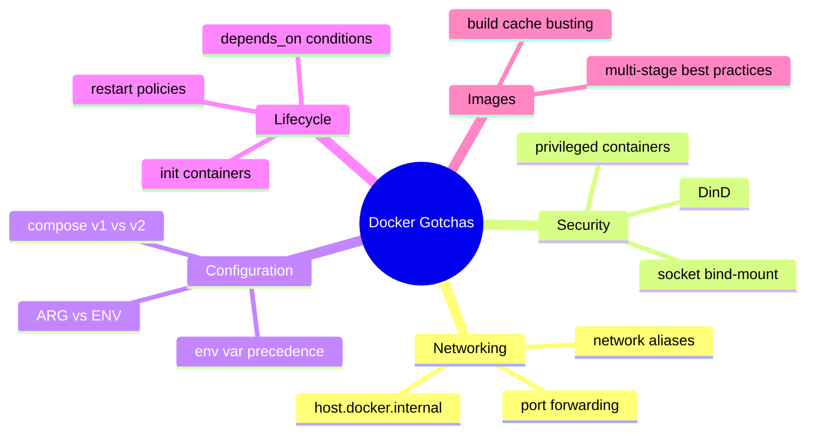
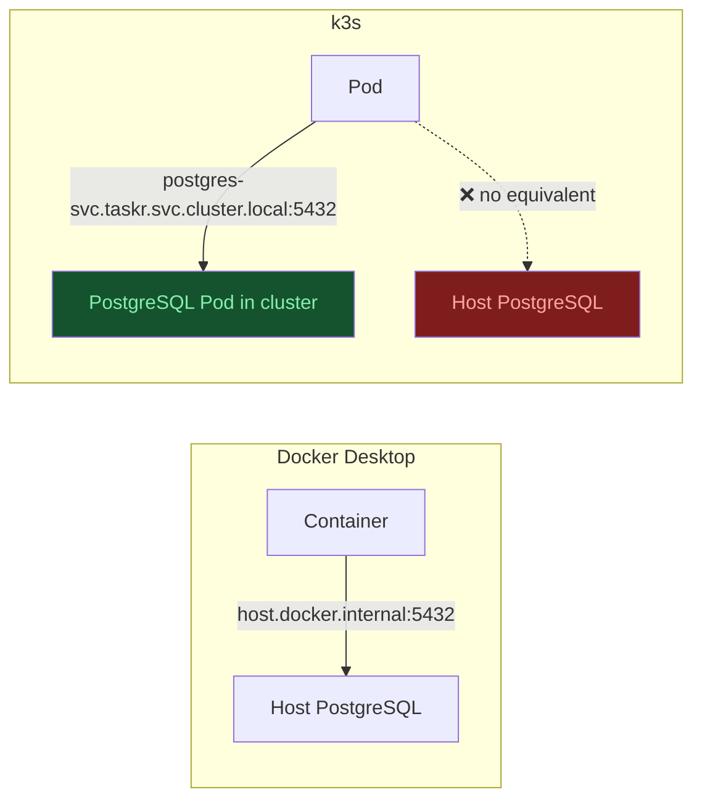
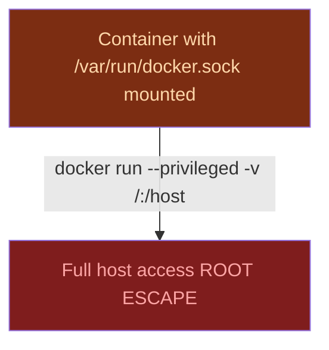
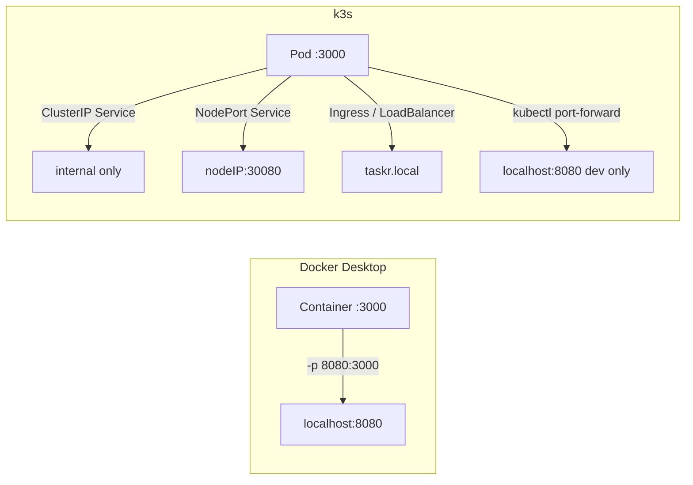
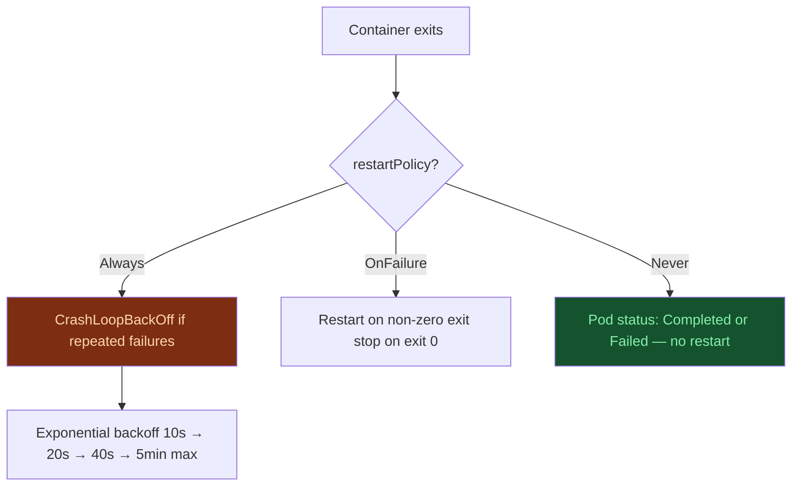
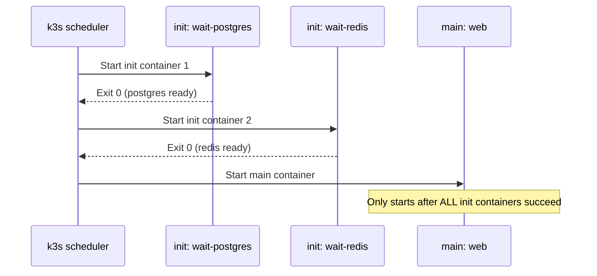
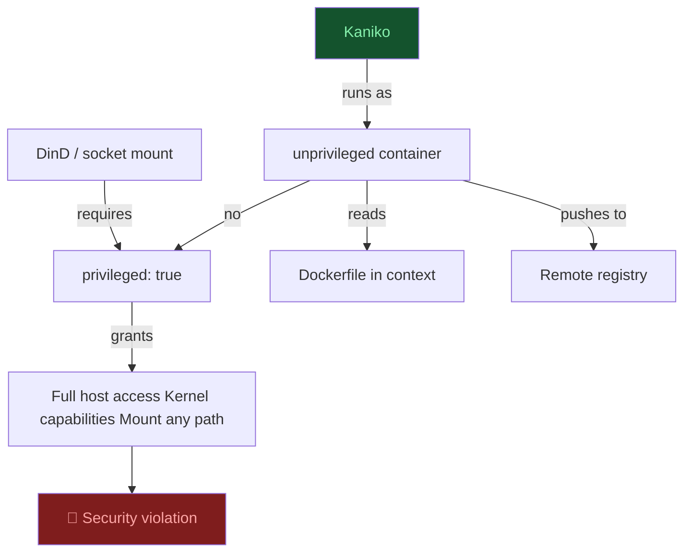

# Docker Gotchas When Moving to k3s
> Module 17 · Lesson 04 | [↑ Course Index](../README.md)

## Table of Contents
- [Overview](#overview)
- [host.docker.internal — The Vanishing Hostname](#hostdockerinternal--the-vanishing-hostname)
- [Docker Socket Bind-Mount Anti-Pattern](#docker-socket-bind-mount-anti-pattern)
- [Docker Desktop Port Forwarding](#docker-desktop-port-forwarding)
- [Compose v1 vs v2 Differences](#compose-v1-vs-v2-differences)
- [restart: Policies → Pod Restart and Job Policies](#restart-policies--pod-restart-and-job-policies)
- [Environment Variable Precedence](#environment-variable-precedence)
- [Build ARG vs ENV](#build-arg-vs-env)
- [depends_on Conditions → Init Containers](#depends_on-conditions--init-containers)
- [Multi-Stage Dockerfile Best Practices for k3s](#multi-stage-dockerfile-best-practices-for-k3s)
- [Docker-in-Docker (DinD) and Kaniko](#docker-in-docker-dind-and-kaniko)
- [Privileged Containers and Linux Capabilities](#privileged-containers-and-linux-capabilities)
- [Network Aliases and Service Discovery](#network-aliases-and-service-discovery)
- [Volume Mount Path Differences](#volume-mount-path-differences)
- [Common Pitfalls](#common-pitfalls)
- [Further Reading](#further-reading)
- [Lab](#lab)

---

## Overview

Developers migrating from Docker to k3s bring ingrained habits from years of `docker run`, `docker-compose up`, and Docker Desktop usage. Many of those habits work perfectly fine in Docker but silently break, cause security issues, or need a completely different solution in Kubernetes. This lesson catalogs the most common Docker-specific gotchas — not bugs, but **design decisions in Docker that don't translate to k3s** — and shows the correct k3s equivalent for each.



[↑ Back to TOC](#table-of-contents) · [↑ Course Index](../README.md)

---

## host.docker.internal — The Vanishing Hostname

In Docker Desktop (Mac and Windows), `host.docker.internal` resolves to the host machine's IP, allowing containers to connect to services running on the host (e.g., a local database). This works because Docker Desktop runs in a VM with a bridge network.

In k3s (and Kubernetes in general), there is **no equivalent of `host.docker.internal`**. Services communicate via Kubernetes DNS, not host networking magic.



### Solutions

**Option A: Move the service into the cluster (recommended)**
Deploy PostgreSQL as a StatefulSet in k3s. All Pods communicate via Kubernetes DNS:

```yaml
# postgres-service.yaml
apiVersion: v1
kind: Service
metadata:
  name: postgres
  namespace: taskr
spec:
  selector:
    app: postgres
  ports:
    - port: 5432
```

```bash
# Applications connect via DNS:
# postgres.taskr.svc.cluster.local:5432
# or simply "postgres" within the same namespace
```

**Option B: External service pointing to host IP**
If you must access a host service, create a headless Service + Endpoints:

```yaml
# external-postgres.yaml
apiVersion: v1
kind: Service
metadata:
  name: host-postgres
  namespace: taskr
spec:
  clusterIP: None   # headless
  ports:
    - port: 5432
---
apiVersion: v1
kind: Endpoints
metadata:
  name: host-postgres
  namespace: taskr
subsets:
  - addresses:
      - ip: 192.168.1.10   # your host IP — not 127.0.0.1
    ports:
      - port: 5432
```

> **Important:** `127.0.0.1` in an Endpoints address refers to the node itself, not the k3s host. Use the actual host LAN IP.

**Option C: HostNetwork (dev only, never production)**
```yaml
spec:
  hostNetwork: true   # Pod shares node's network namespace — security risk
```

[↑ Back to TOC](#table-of-contents) · [↑ Course Index](../README.md)

---

## Docker Socket Bind-Mount Anti-Pattern

A very common Docker pattern mounts the Docker socket into a container to allow it to control Docker:

```yaml
# docker-compose.yml — DANGEROUS PATTERN
services:
  ci-runner:
    image: docker:dind
    volumes:
      - /var/run/docker.sock:/var/run/docker.sock   # ← gives root on host
```

This is a **privilege escalation vulnerability** — any process in the container with access to the socket can run `docker run --privileged -v /:/host` and escape to the host.

In k3s, the equivalent would be mounting the containerd socket or the CRI socket — both equally dangerous. **Do not do this in production.**



### Kubernetes-Native Alternatives

| Use case | Docker pattern | k3s alternative |
|---|---|---|
| Build images in CI | DinD / socket mount | Kaniko, Buildah in Pod, or external CI |
| Run Docker commands in pipelines | `docker` CLI in container | `kubectl` + k3s Jobs / Tekton |
| Collect container logs | Socket mount + Docker API | Kubernetes API + Fluentd / Loki |
| Container metrics | `docker stats` | Metrics Server + Prometheus |

```yaml
# Kaniko — build images in k3s without Docker daemon
apiVersion: batch/v1
kind: Job
metadata:
  name: build-taskr-web
  namespace: taskr
spec:
  template:
    spec:
      restartPolicy: Never
      containers:
        - name: kaniko
          image: gcr.io/kaniko-project/executor:latest
          args:
            - "--context=git://github.com/myorg/taskr"
            - "--destination=ghcr.io/myorg/taskr-web:latest"
            - "--cache=true"
          volumeMounts:
            - name: kaniko-secret
              mountPath: /kaniko/.docker
      volumes:
        - name: kaniko-secret
          secret:
            secretName: ghcr-push-credentials
            items:
              - key: .dockerconfigjson
                path: config.json
```

[↑ Back to TOC](#table-of-contents) · [↑ Course Index](../README.md)

---

## Docker Desktop Port Forwarding

Docker Desktop automatically forwards container ports to `localhost` on your Mac or Windows machine. `docker run -p 8080:3000 myapp` → `http://localhost:8080` just works.

In k3s, you need an explicit Service (and optionally Ingress or port-forward) to access a Pod:



```bash
# Quick dev access — port-forward a single Pod
kubectl port-forward pod/taskr-web-xxx 8080:3000 -n taskr
# or forward via Service
kubectl port-forward svc/taskr-web 8080:3000 -n taskr
```

```yaml
# NodePort Service — accessible on every node's IP
apiVersion: v1
kind: Service
metadata:
  name: taskr-web-nodeport
  namespace: taskr
spec:
  type: NodePort
  selector:
    app: taskr-web
  ports:
    - port: 3000
      targetPort: 3000
      nodePort: 30080   # access via http://NODE_IP:30080
```

```yaml
# Traefik Ingress (k3s default) — access via hostname
apiVersion: networking.k8s.io/v1
kind: Ingress
metadata:
  name: taskr-web
  namespace: taskr
  annotations:
    traefik.ingress.kubernetes.io/router.entrypoints: web
spec:
  rules:
    - host: taskr.local
      http:
        paths:
          - path: /
            pathType: Prefix
            backend:
              service:
                name: taskr-web
                port:
                  number: 3000
```

> **Local dev tip:** Add `127.0.0.1 taskr.local` to `/etc/hosts` and use `kubectl port-forward svc/traefik 80:80 -n kube-system` to route Ingress traffic locally.

[↑ Back to TOC](#table-of-contents) · [↑ Course Index](../README.md)

---

## Compose v1 vs v2 Differences

Docker Compose v1 (`docker-compose`, Python-based) and v2 (`docker compose`, Go-based plugin) have subtle differences that matter when using tools like Kompose to convert to Kubernetes manifests.

| Feature | Compose v1 | Compose v2 | k3s impact |
|---|---|---|---|
| Binary | `docker-compose` | `docker compose` | Kompose targets both; check your CI uses the right one |
| `version:` field | Required (`"3.8"`) | Optional / ignored | `version:` is deprecated in v2; Kompose may warn |
| `deploy:` block | Swarm-only (ignored locally) | Swarm-only | Kompose converts `deploy.replicas` → `replicas` |
| `links:` field | Creates network alias | Deprecated | Use DNS service names in k3s; `links:` has no k8s equivalent |
| `depends_on:` conditions | v2+ only | Fully supported | Translates to init containers in k3s |
| Profiles | v1.28+ only | Supported | Translates to Kustomize overlays |
| BuildKit | Not default | Default | Use `DOCKER_BUILDKIT=1` with v1 |

```yaml
# v1 / v2 compatibility gotcha: links: deprecated
services:
  web:
    links:
      - db:database   # ❌ Compose v2 warns; no equivalent in k3s
    environment:
      DATABASE_HOST: database   # relies on 'links' alias

# k3s equivalent: use Service DNS name
# DATABASE_HOST: postgres.taskr.svc.cluster.local
# or simply: postgres (within the same namespace)
```

[↑ Back to TOC](#table-of-contents) · [↑ Course Index](../README.md)

---

## restart: Policies → Pod Restart and Job Policies

Docker Compose's `restart:` maps to `restartPolicy` in a Pod spec, but the semantics differ.

| Docker `restart:` | k3s Pod `restartPolicy` | Notes |
|---|---|---|
| `no` | `Never` | Pod is not restarted after exit |
| `always` | `Always` | Default for Deployment Pods |
| `on-failure` | `OnFailure` | Restart only on non-zero exit |
| `unless-stopped` | `Always` (approximately) | k3s has no exact equivalent; use `Always` |



```yaml
# Docker Compose
services:
  worker:
    restart: on-failure

# k3s — use a Job for one-shot work, Deployment for long-running
apiVersion: batch/v1
kind: Job
metadata:
  name: taskr-migration
spec:
  template:
    spec:
      restartPolicy: OnFailure   # retry on failure, stop on success
      containers:
        - name: migrate
          image: ghcr.io/myorg/taskr-web:1.2.3
          command: ["node", "migrate.js"]
```

> **CrashLoopBackOff vs Docker restart loops:** In Docker, a container in a restart loop just restarts immediately. In k3s, Kubernetes applies **exponential backoff** — the restart interval grows (10s, 20s, 40s, up to 5 minutes). This prevents runaway restart storms but can make debugging feel slower. Use `kubectl describe pod` to see restart count and last exit reason.

[↑ Back to TOC](#table-of-contents) · [↑ Course Index](../README.md)

---

## Environment Variable Precedence

Docker and Kubernetes both support environment variables from multiple sources, but precedence works differently.

### Docker Compose Precedence (highest to lowest)

```
1. Compose file (environment:) ← wins
2. Shell environment variables
3. .env file
4. Default values in image (ENV in Dockerfile)
```

### Kubernetes Precedence (highest to lowest)

```
1. Container spec env: (literal values) ← wins
2. valueFrom: secretKeyRef / configMapKeyRef
3. envFrom: secretRef / configMapRef (entire object)
4. Image ENV instructions
```

```yaml
# Kubernetes env var precedence example
spec:
  containers:
    - name: web
      image: ghcr.io/myorg/taskr-web:1.2.3
      # envFrom loads all keys from ConfigMap/Secret
      envFrom:
        - configMapRef:
            name: taskr-config      # e.g. sets DATABASE_URL
        - secretRef:
            name: taskr-secrets     # e.g. also sets DATABASE_URL
      # env: overrides individual keys — wins over envFrom
      env:
        - name: DATABASE_URL
          value: "postgresql://override:5432/db"   # ← this wins
```

```yaml
# valueFrom — inject a single key from a Secret
env:
  - name: DB_PASSWORD
    valueFrom:
      secretKeyRef:
        name: taskr-secrets
        key: postgres-password
```

> **Docker .env file equivalent:** There is no `.env` file in Kubernetes. Use a ConfigMap for non-sensitive config and a Secret for sensitive values. Tools like Helm and Kustomize provide templating to manage per-environment values.

[↑ Back to TOC](#table-of-contents) · [↑ Course Index](../README.md)

---

## Build ARG vs ENV

`ARG` and `ENV` are both Dockerfile instructions but behave very differently in production:

| | `ARG` | `ENV` |
|---|---|---|
| Available during build | ✅ Yes | ✅ Yes |
| Available at runtime | ❌ No | ✅ Yes (persists in image) |
| Visible in `docker history` | ✅ Yes — **security risk** | ✅ Yes — **security risk** |
| Override at build time | `--build-arg KEY=val` | Only via `ARG` + `ENV` |
| Override at runtime | N/A | Container env vars |

```dockerfile
# ❌ Common mistake — secret passed as ARG leaks in image history
ARG API_KEY
RUN curl -H "Authorization: $API_KEY" https://api.internal/init

# ✅ Correct — use build-time secrets via BuildKit (not visible in history)
RUN --mount=type=secret,id=api_key \
    API_KEY=$(cat /run/secrets/api_key) \
    curl -H "Authorization: $API_KEY" https://api.internal/init
```

```bash
# Pass the secret at build time (not stored in image)
docker buildx build \
  --secret id=api_key,src=./api_key.txt \
  -t taskr-web:latest .
```

```dockerfile
# ✅ Correct pattern — ARG for build-time config, ENV for runtime config
ARG APP_VERSION=dev
ARG NODE_ENV=production

# Only set ENV for values needed at runtime
ENV NODE_ENV=${NODE_ENV}
# Don't set: ENV APP_VERSION=${APP_VERSION}  (not needed at runtime)
```

> **k3s implication:** Never bake secrets into images via `ARG` or `ENV`. Pass secrets at runtime via Kubernetes Secrets mounted as env vars or files. This keeps secrets out of image layers and `docker history`.

[↑ Back to TOC](#table-of-contents) · [↑ Course Index](../README.md)

---

## depends_on Conditions → Init Containers

Docker Compose v2 added `depends_on` with `condition` support. k3s uses **init containers** to achieve the same effect.

```yaml
# Docker Compose — wait for service health
services:
  web:
    depends_on:
      db:
        condition: service_healthy
      redis:
        condition: service_started
  db:
    healthcheck:
      test: ["CMD", "pg_isready", "-U", "postgres"]
      interval: 5s
      retries: 10
```

```yaml
# k3s equivalent — init containers run before main containers
spec:
  initContainers:
    # Wait for PostgreSQL to be ready
    - name: wait-for-postgres
      image: postgres:16-alpine
      command:
        - sh
        - -c
        - |
          until pg_isready -h postgres -p 5432 -U postgres; do
            echo "Waiting for PostgreSQL..."
            sleep 2
          done
          echo "PostgreSQL is ready"
      env:
        - name: PGPASSWORD
          valueFrom:
            secretKeyRef:
              name: taskr-secrets
              key: postgres-password

    # Wait for Redis to be ready
    - name: wait-for-redis
      image: redis:7-alpine
      command:
        - sh
        - -c
        - |
          until redis-cli -h redis ping | grep -q PONG; do
            echo "Waiting for Redis..."
            sleep 2
          done
          echo "Redis is ready"

  containers:
    - name: web
      image: ghcr.io/myorg/taskr-web:1.2.3
```



> **Key difference:** Docker Compose `depends_on` only checks the service's health at startup. k3s init containers run inside the Pod's network namespace, so they can reach the same Service DNS names as the main container.

[↑ Back to TOC](#table-of-contents) · [↑ Course Index](../README.md)

---

## Multi-Stage Dockerfile Best Practices for k3s

Multi-stage Dockerfiles paired with k3s security contexts unlock a hardened runtime with minimal effort.

```dockerfile
# syntax=docker/dockerfile:1.5
# =====================================================
# Stage 1: Install dependencies (cached separately)
# =====================================================
FROM node:20-alpine AS deps
WORKDIR /app
# Only copy package files — changes here invalidate npm ci cache
COPY package*.json ./
RUN --mount=type=cache,target=/root/.npm \
    npm ci --only=production

# =====================================================
# Stage 2: Build (only needed if there's a compile step)
# =====================================================
FROM node:20-alpine AS builder
WORKDIR /app
COPY package*.json ./
RUN --mount=type=cache,target=/root/.npm \
    npm ci
COPY . .
RUN npm run build

# =====================================================
# Stage 3: Minimal runtime
# =====================================================
FROM node:20-alpine AS runtime
# Create a non-root user
RUN addgroup -g 1001 appgroup && \
    adduser -u 1001 -G appgroup -s /bin/sh -D appuser
WORKDIR /app
# Explicitly set permissions
COPY --from=deps --chown=1001:1001 /app/node_modules ./node_modules
COPY --from=builder --chown=1001:1001 /app/dist ./dist
COPY --from=builder --chown=1001:1001 /app/package.json .
# Drop to non-root user
USER appuser
EXPOSE 3000
CMD ["node", "dist/index.js"]
```

```yaml
# Pair with restrictive k3s security context
spec:
  securityContext:
    runAsNonRoot: true
    runAsUser: 1001
    runAsGroup: 1001
    fsGroup: 1001
    seccompProfile:
      type: RuntimeDefault
  containers:
    - name: web
      image: ghcr.io/myorg/taskr-web:1.2.3
      securityContext:
        allowPrivilegeEscalation: false
        readOnlyRootFilesystem: true
        capabilities:
          drop: ["ALL"]
      volumeMounts:
        # readOnlyRootFilesystem requires explicit writable mounts for temp dirs
        - name: tmp
          mountPath: /tmp
        - name: npm-cache
          mountPath: /app/.npm
  volumes:
    - name: tmp
      emptyDir: {}
    - name: npm-cache
      emptyDir: {}
```

> **Build cache invalidation tip:** The order of `COPY` instructions matters enormously. Copy files that change rarely (package manifests) first, and source code last. This maximises cache hits in CI.

[↑ Back to TOC](#table-of-contents) · [↑ Course Index](../README.md)

---

## Docker-in-Docker (DinD) and Kaniko

**Docker-in-Docker (DinD)** runs a Docker daemon inside a container. It requires `privileged: true` in the Pod spec — which grants near-root access to the host node. Avoid it in production k3s.



```yaml
# ❌ DinD — avoid in production
spec:
  containers:
    - name: build
      image: docker:dind
      securityContext:
        privileged: true   # ← security violation

# ✅ Kaniko — unprivileged image builds in k3s
apiVersion: batch/v1
kind: Job
metadata:
  name: build-taskr
  namespace: taskr
spec:
  template:
    spec:
      restartPolicy: Never
      containers:
        - name: kaniko
          image: gcr.io/kaniko-project/executor:latest
          args:
            - "--context=git://github.com/myorg/taskr#refs/heads/main"
            - "--destination=ghcr.io/myorg/taskr-web:$(BUILD_TAG)"
            - "--cache=true"
            - "--cache-repo=ghcr.io/myorg/taskr-web/cache"
          env:
            - name: BUILD_TAG
              value: "1.2.3"
          volumeMounts:
            - name: docker-config
              mountPath: /kaniko/.docker
      volumes:
        - name: docker-config
          secret:
            secretName: ghcr-push-credentials
            items:
              - key: .dockerconfigjson
                path: config.json
```

[↑ Back to TOC](#table-of-contents) · [↑ Course Index](../README.md)

---

## Privileged Containers and Linux Capabilities

Docker makes it easy to run privileged containers (`docker run --privileged`). In k3s, `privileged: true` is a red flag that should always be questioned.

```yaml
# ❌ Avoid — grants all capabilities + host device access
spec:
  containers:
    - name: app
      securityContext:
        privileged: true
```

Most legitimate use cases need only a small number of Linux capabilities:

| Use case | Required capability | k3s solution |
|---|---|---|
| Bind port < 1024 | `NET_BIND_SERVICE` | Or just use port ≥ 1024 + Service |
| Modify iptables | `NET_ADMIN` | Use a CNI plugin (Flannel manages this) |
| Mount filesystems | `SYS_ADMIN` | Use a CSI driver instead |
| eBPF programs | `BPF`, `SYS_ADMIN` | Dedicated privileged DaemonSet (Cilium pattern) |
| Read /proc | (none) | Set `hostPID: true` cautiously in DaemonSets |

```yaml
# ✅ Grant only what's needed
spec:
  containers:
    - name: app
      securityContext:
        capabilities:
          drop: ["ALL"]
          add: ["NET_BIND_SERVICE"]   # only this specific capability
        allowPrivilegeEscalation: false
        runAsNonRoot: true
```

[↑ Back to TOC](#table-of-contents) · [↑ Course Index](../README.md)

---

## Network Aliases and Service Discovery

Docker Compose creates a shared network where services discover each other by service name (or `aliases:`). In k3s, service discovery is handled by **kube-dns** / CoreDNS using the pattern `<service-name>.<namespace>.svc.cluster.local`.

| Docker Compose | k3s DNS | Notes |
|---|---|---|
| `db` (same compose file) | `postgres.taskr` or `postgres.taskr.svc.cluster.local` | Within namespace: just `postgres` |
| `db:database` (alias) | Create a second Service or use ExternalName | No direct alias equivalent |
| `host.docker.internal` | ExternalName Service or headless Endpoints | See earlier section |
| `network_mode: host` | `hostNetwork: true` | Dev only; never production |

```yaml
# Docker Compose alias → k3s ExternalName Service
# Original: db with alias 'database'
services:
  web:
    environment:
      DATABASE_HOST: database   # uses alias

# k3s: create an alias Service
apiVersion: v1
kind: Service
metadata:
  name: database          # alias name
  namespace: taskr
spec:
  type: ExternalName
  externalName: postgres.taskr.svc.cluster.local  # points to real service
```

[↑ Back to TOC](#table-of-contents) · [↑ Course Index](../README.md)

---

## Volume Mount Path Differences

Docker volumes use paths on the host or named volumes managed by Docker. k3s uses PersistentVolumes backed by the `local-path` StorageClass (or other CSI drivers).

| Docker volume | k3s equivalent | Notes |
|---|---|---|
| `./data:/var/lib/postgresql/data` (bind mount) | `hostPath` volume | Dangerous in multi-node; data is node-local |
| `pgdata:/var/lib/postgresql/data` (named volume) | PersistentVolumeClaim | Recommended — managed by StorageClass |
| `tmpfs:/tmp` | `emptyDir: {medium: Memory}` | In-memory, cleared on Pod restart |
| `/run/secrets/mysecret` (Docker secret) | Secret mounted as file | Nearly identical in k3s |

```yaml
# ❌ Bind mount — data is stuck to one node
spec:
  volumes:
    - name: pgdata
      hostPath:
        path: /home/user/pgdata   # different on every node!

# ✅ PVC — storage class handles placement
apiVersion: v1
kind: PersistentVolumeClaim
metadata:
  name: pgdata
  namespace: taskr
spec:
  storageClassName: local-path
  accessModes: [ReadWriteOnce]
  resources:
    requests:
      storage: 10Gi
```

> **Docker named volume paths:** Docker stores named volumes in `/var/lib/docker/volumes/<name>/_data`. The k3s `local-path` StorageClass stores PV data in `/var/lib/rancher/k3s/storage/<pvc-uid>/`. These are not the same paths — you need to migrate data explicitly (see Module 17 Lesson 05).

[↑ Back to TOC](#table-of-contents) · [↑ Course Index](../README.md)

---

## Common Pitfalls

| Issue | Symptom | Fix |
|---|---|---|
| `host.docker.internal` not resolving | `getaddrinfo ENOTFOUND host.docker.internal` | Deploy service into cluster or create headless Endpoints with host IP |
| Docker socket mount breaks admission | Pod rejected by OPA/Kyverno | Remove socket mount; use Kaniko for builds |
| Docker Desktop port not accessible | `kubectl get svc` shows NodePort but `localhost:PORT` doesn't work | Use `kubectl port-forward` or add Ingress; Desktop's implicit forwarding doesn't exist in k3s |
| `depends_on` ignored in k8s manifests | App starts before DB is ready, crashes | Add init containers that wait for dependencies |
| `:latest` tag + `IfNotPresent` stale image | Old code runs after deploy | Use immutable image tags; see Lesson 03 |
| `restart: unless-stopped` not mapping | Pod restarts indefinitely with crash backoff | Use `restartPolicy: Always` (Deployment) or `OnFailure` (Job); tune with `backoffLimit` |
| ARG secret visible in `docker history` | Secrets leaked in image metadata | Use `RUN --mount=type=secret` (BuildKit) |
| `links:` entries break in k3s | Service DNS not resolving via alias | Use ExternalName Service or just use the actual Service name |
| DinD Job fails | `OCI runtime create failed: permission denied` | Replace with Kaniko or external CI build step |
| Named volume data not migrated | App starts but database is empty | Copy data from Docker volume path to PV path; see Lesson 05 |
| Compose v1 `links:` converted by Kompose | Kompose generates incorrect Service | Remove `links:` before running Kompose; use Service DNS names |
| `readOnlyRootFilesystem: true` breaks app | App crashes writing to `/tmp` or `/app` | Add `emptyDir` volumes for writable paths |

[↑ Back to TOC](#table-of-contents) · [↑ Course Index](../README.md)

---

## Further Reading

- [Kubernetes init containers](https://kubernetes.io/docs/concepts/workloads/pods/init-containers/)
- [Kubernetes Pod security contexts](https://kubernetes.io/docs/tasks/configure-pod-container/security-context/)
- [Linux capabilities man page](https://man7.org/linux/man-pages/man7/capabilities.7.html)
- [Kaniko — build images without Docker daemon](https://github.com/GoogleContainerTools/kaniko)
- [CoreDNS in Kubernetes](https://kubernetes.io/docs/tasks/administer-cluster/coredns/)
- [Docker Compose `depends_on` reference](https://docs.docker.com/compose/compose-file/05-services/#depends_on)
- [Kubernetes `restartPolicy` reference](https://kubernetes.io/docs/concepts/workloads/pods/pod-lifecycle/#restart-policy)
- [BuildKit secrets](https://docs.docker.com/build/building/secrets/)
- [k3s local-path StorageClass](https://github.com/rancher/local-path-provisioner)
- [Module 17 Lesson 02 — Compose translation](./02_compose_to_k3s.md)
- [Module 17 Lesson 05 — Full migration walkthrough](./05_migration_walkthrough.md)

[↑ Back to TOC](#table-of-contents) · [↑ Course Index](../README.md)

---

## Lab

### Exercise 1: Reproduce the host.docker.internal Problem and Fix It

```bash
# Step 1: Start a simple service on the host (simulates a local DB)
python3 -m http.server 9090 &
HOST_PID=$!

# Step 2: Try to reach it from a Pod using host.docker.internal (will fail)
kubectl run net-test --rm -it --restart=Never \
  --image=curlimages/curl:latest \
  -- curl -s http://host.docker.internal:9090 || true
# Expected: curl: Could not resolve host

# Step 3: Get the host's actual LAN IP
HOST_IP=$(ip route get 8.8.8.8 | awk '{print $7; exit}')
echo "Host IP: $HOST_IP"

# Step 4: Create Endpoints pointing to host IP
kubectl create namespace lab-gotchas 2>/dev/null || true

kubectl apply -f - <<EOF
apiVersion: v1
kind: Service
metadata:
  name: host-http
  namespace: lab-gotchas
spec:
  clusterIP: None
  ports:
    - port: 9090
---
apiVersion: v1
kind: Endpoints
metadata:
  name: host-http
  namespace: lab-gotchas
subsets:
  - addresses:
      - ip: $HOST_IP
    ports:
      - port: 9090
EOF

# Step 5: Try again using the Service name
kubectl run net-test --rm -it --restart=Never \
  -n lab-gotchas \
  --image=curlimages/curl:latest \
  -- curl -s http://host-http:9090
# Expected: directory listing from python HTTP server

kill $HOST_PID
```

### Exercise 2: Replace depends_on with Init Containers

```bash
# Deploy PostgreSQL without waiting
kubectl apply -f - -n lab-gotchas <<'EOF'
apiVersion: apps/v1
kind: Deployment
metadata:
  name: postgres
spec:
  replicas: 1
  selector:
    matchLabels:
      app: postgres
  template:
    metadata:
      labels:
        app: postgres
    spec:
      containers:
        - name: postgres
          image: postgres:16-alpine
          env:
            - name: POSTGRES_PASSWORD
              value: "lab123"
          ports:
            - containerPort: 5432
---
apiVersion: v1
kind: Service
metadata:
  name: postgres
spec:
  selector:
    app: postgres
  ports:
    - port: 5432
EOF

# Deploy a web app with init container that waits for postgres
kubectl apply -f - -n lab-gotchas <<'EOF'
apiVersion: apps/v1
kind: Deployment
metadata:
  name: web
spec:
  replicas: 1
  selector:
    matchLabels:
      app: web
  template:
    metadata:
      labels:
        app: web
    spec:
      initContainers:
        - name: wait-for-postgres
          image: postgres:16-alpine
          command:
            - sh
            - -c
            - |
              until pg_isready -h postgres -p 5432 -U postgres; do
                echo "Waiting for postgres..."
                sleep 2
              done
      containers:
        - name: web
          image: nginx:alpine
          ports:
            - containerPort: 80
EOF

# Watch init container complete before main container starts
kubectl get pods -n lab-gotchas -w
# Observe: web pod shows Init:0/1, then PodInitializing, then Running

# Clean up
kubectl delete namespace lab-gotchas
```

### Exercise 3: Spot the Security Issue

```bash
# Review this hypothetical Dockerfile — find the security issues
cat <<'EOF'
FROM node:20
WORKDIR /app

# Security issue 1: what's wrong with this ARG?
ARG DATABASE_PASSWORD
ENV DATABASE_PASSWORD=${DATABASE_PASSWORD}

COPY package*.json ./
RUN npm install

COPY . .

# Security issue 2: what's wrong with the user?
EXPOSE 3000
CMD ["node", "index.js"]
EOF

# Expected findings:
# 1. ARG/ENV DATABASE_PASSWORD — secret baked into image, visible in `docker history`
#    Fix: Remove from Dockerfile; pass via Kubernetes Secret at runtime
#
# 2. No USER instruction — runs as root
#    Fix: Add: RUN adduser -D appuser && chown -R appuser /app
#         Add: USER appuser
```

---

*Licensed under [CC BY-NC-SA 4.0](../LICENSE.md) · © 2026 UncleJS*
