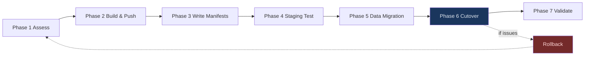
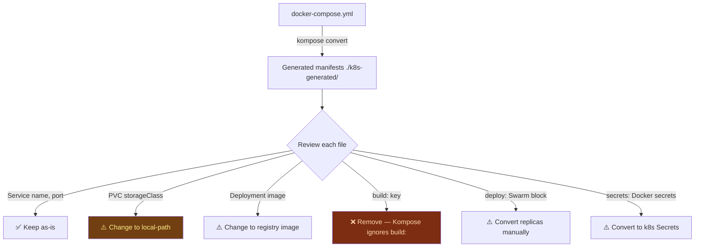
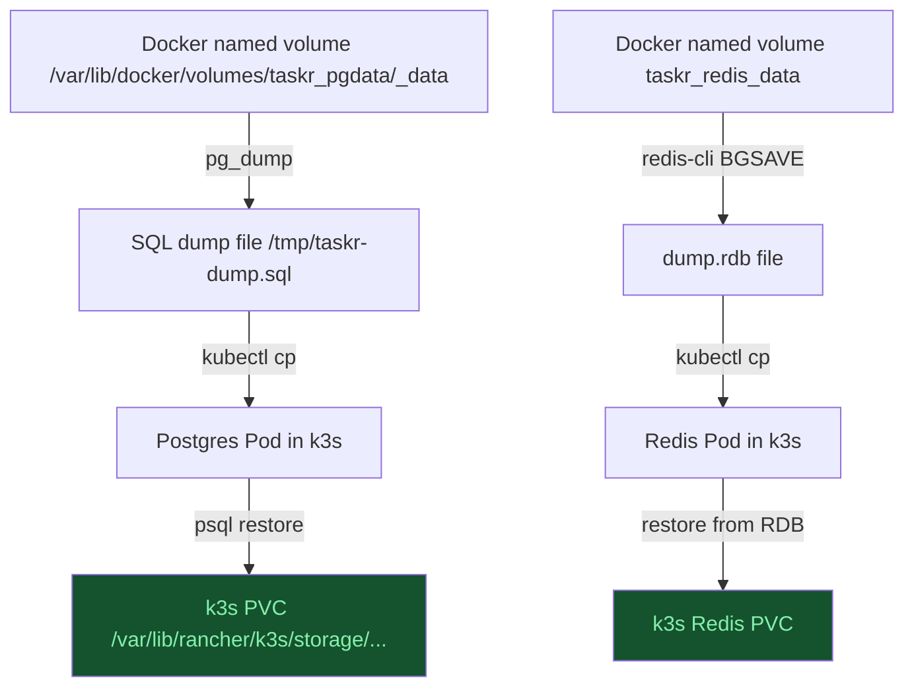
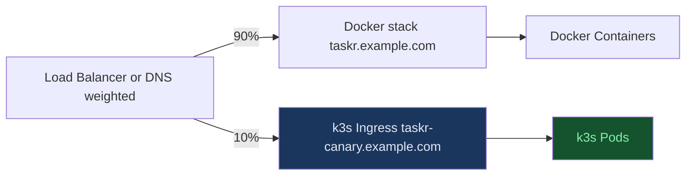
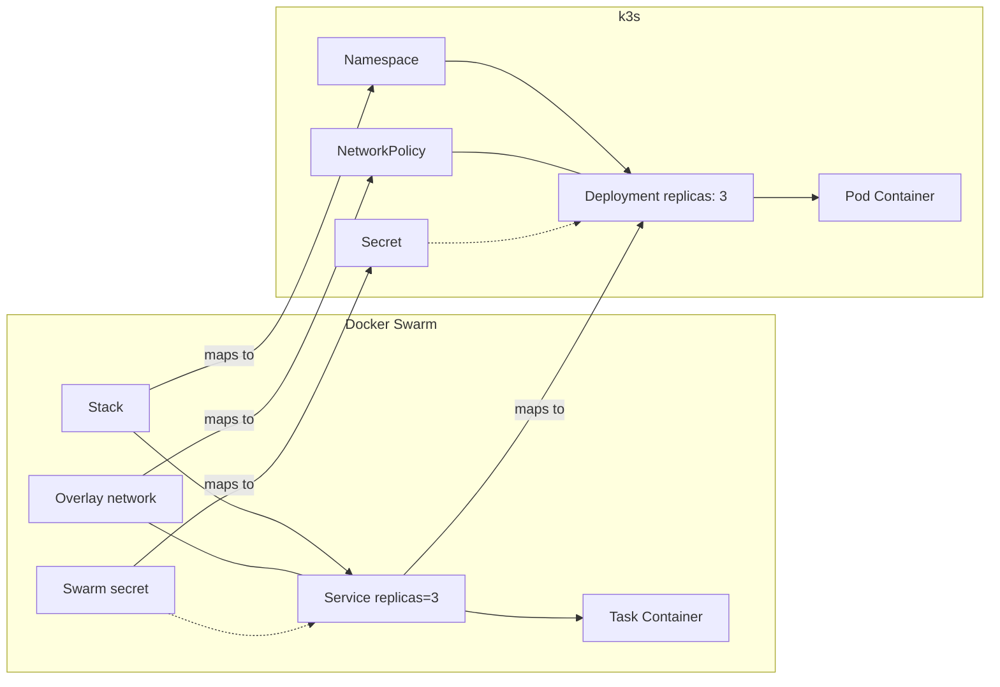
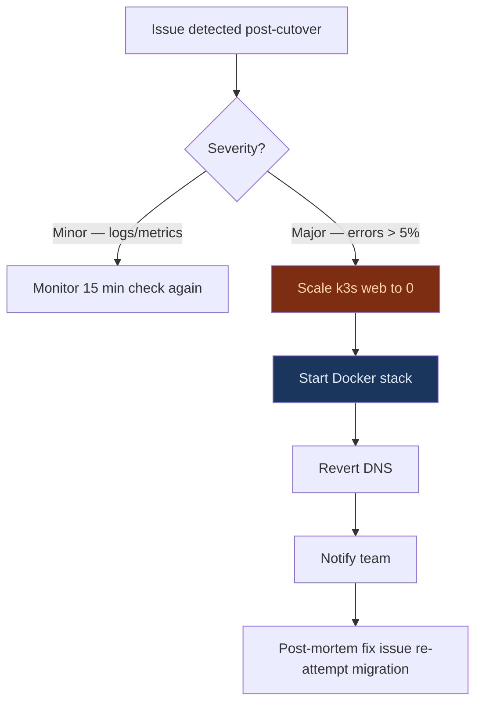
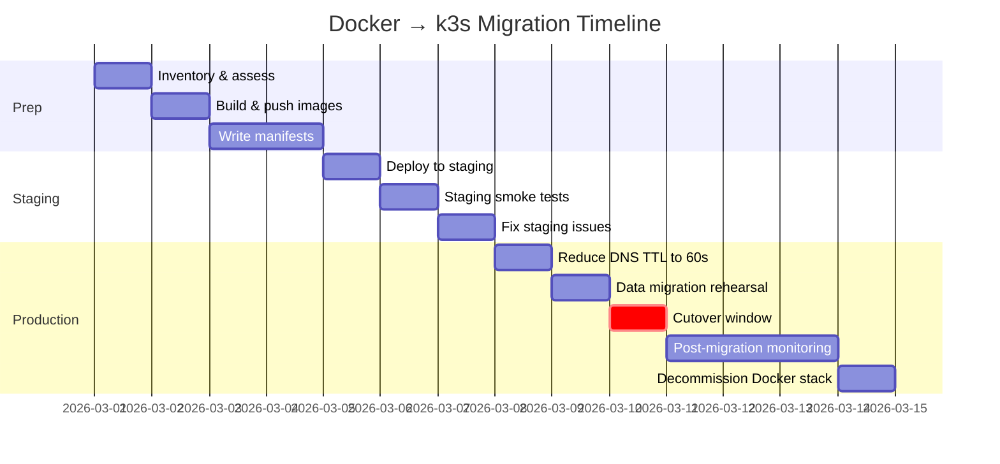

# Full Migration Walkthrough: Docker to k3s
> Module 17 · Lesson 05 | [↑ Course Index](../README.md)


[](../README.md)
[](../LICENSE.md)

## Table of Contents
- [Overview](#overview)
- [The Example Application](#the-example-application)
- [Pre-Migration Checklist](#pre-migration-checklist)
- [Phase 1: Assess Your Existing Docker Setup](#phase-1-assess-your-existing-docker-setup)
  - [Inventory Script](#inventory-script)
  - [Docker Compose → Manifest Conversion with Kompose](#docker-compose--manifest-conversion-with-kompose)
- [Phase 2: Build and Push Images to a Registry](#phase-2-build-and-push-images-to-a-registry)
  - [docker buildx Push Workflow](#docker-buildx-push-workflow)
  - [CI/CD Pipeline Integration](#cicd-pipeline-integration)
- [Phase 3: Write Kubernetes Manifests](#phase-3-write-kubernetes-manifests)
  - [Namespace and RBAC](#namespace-and-rbac)
  - [Secrets with SealedSecrets](#secrets-with-sealedsecrets)
  - [ConfigMaps](#configmaps)
  - [PostgreSQL StatefulSet](#postgresql-statefulset)
  - [Redis Deployment](#redis-deployment)
  - [Web Deployment](#web-deployment)
  - [Ingress](#ingress)
  - [NetworkPolicy](#networkpolicy)
  - [Database Migration Job](#database-migration-job)
- [Phase 4: Test in a Staging Namespace](#phase-4-test-in-a-staging-namespace)
  - [Kustomize Promotion Flow](#kustomize-promotion-flow)
- [Phase 5: Data Migration from Docker Volumes](#phase-5-data-migration-from-docker-volumes)
  - [Migrating Docker Named Volumes](#migrating-docker-named-volumes)
  - [PostgreSQL Data Migration](#postgresql-data-migration)
  - [Redis Data Migration](#redis-data-migration)
- [Phase 6: Cutover](#phase-6-cutover)
  - [Canary Deployment Pattern](#canary-deployment-pattern)
  - [DNS Cutover](#dns-cutover)
- [Phase 7: Post-Migration Validation](#phase-7-post-migration-validation)
  - [Post-Migration Runbook Template](#post-migration-runbook-template)
- [Docker Swarm → k3s Bonus Section](#docker-swarm--k3s-bonus-section)
- [Rollback Plan](#rollback-plan)
- [Migration Timeline Diagram](#migration-timeline-diagram)
- [Common Pitfalls](#common-pitfalls)
- [Further Reading](#further-reading)
- [Lab](#lab)

---

## Overview

This lesson walks through a complete, realistic migration from a Docker-based workload to k3s. We follow a structured seven-phase process that minimises downtime and allows rollback at every step. The Docker-specific sections cover: Docker volume path migration, the `docker buildx push` workflow, Kompose conversion of Docker Compose files, and a bonus section on migrating from Docker Swarm.



[↑ Back to TOC](#table-of-contents) · [↑ Course Index](../README.md)

---

## The Example Application

Throughout this lesson we migrate **"Taskr"** — a task-management web app with:

| Component | Technology | Docker setup |
|---|---|---|
| Web frontend + API | Node.js 20 | Docker Compose service with `build:` |
| Database | PostgreSQL 16 | Docker Compose with named volume `pgdata` |
| Cache / session store | Redis 7 | Docker Compose with named volume `redis_data` |
| Reverse proxy | Nginx | Docker Compose with port 443 bind |
| Data volumes | `taskr_pgdata` / `taskr_redis_data` | Docker named volumes in `/var/lib/docker/volumes/` |

The Compose file used in this walkthrough is `labs/docker-compose-example.yml`. The target k3s manifests are in `labs/docker-compose-to-k3s.yaml`.

[↑ Back to TOC](#table-of-contents) · [↑ Course Index](../README.md)

---

## Pre-Migration Checklist

Run through this checklist **before** starting any migration work:

```
[ ] k3s cluster is running and healthy (kubectl get nodes shows Ready)
[ ] kubectl context is pointing at the correct cluster
[ ] A container registry is accessible (GHCR, Docker Hub, or local Harbor)
[ ] docker buildx is installed and functional (docker buildx version)
[ ] You have a tested backup of all Docker named volumes
[ ] You know the current DNS name / IP used to reach the app
[ ] Docker Compose file is up to date and has been tested recently
[ ] All image builds succeed from a clean checkout (no local state dependencies)
[ ] Secrets and env vars are documented (not just in running containers)
[ ] Database schema migrations are scripted and repeatable
```

```bash
# Quick health checks before starting
kubectl get nodes
kubectl get storageclass    # should show local-path (default)
kubectl get ingressclass    # should show traefik
docker buildx version
docker-compose version || docker compose version
```

[↑ Back to TOC](#table-of-contents) · [↑ Course Index](../README.md)

---

## Phase 1: Assess Your Existing Docker Setup

### Inventory Script

Run this script to capture a complete inventory of your running Docker workload before touching anything:

```bash
#!/usr/bin/env bash
# docker-inventory.sh — capture everything about the running Docker setup
set -euo pipefail

OUTDIR="./docker-inventory-$(date +%Y%m%d-%H%M%S)"
mkdir -p "$OUTDIR"

echo "=== Docker version ===" | tee "$OUTDIR/info.txt"
docker version >> "$OUTDIR/info.txt"

echo "=== Running containers ===" | tee -a "$OUTDIR/info.txt"
docker ps --format '{{.Names}}\t{{.Image}}\t{{.Status}}\t{{.Ports}}' \
  >> "$OUTDIR/info.txt"

echo "=== All containers (including stopped) ===" | tee -a "$OUTDIR/info.txt"
docker ps -a --format '{{.Names}}\t{{.Image}}\t{{.Status}}' \
  >> "$OUTDIR/info.txt"

echo "=== Named volumes ===" | tee -a "$OUTDIR/info.txt"
docker volume ls >> "$OUTDIR/info.txt"

echo "=== Volume sizes ===" | tee -a "$OUTDIR/info.txt"
docker volume ls -q | while read vol; do
  size=$(docker run --rm -v "$vol:/data" alpine du -sh /data 2>/dev/null | cut -f1 || echo "unknown")
  echo "$vol: $size"
done >> "$OUTDIR/info.txt"

echo "=== Networks ===" | tee -a "$OUTDIR/info.txt"
docker network ls >> "$OUTDIR/info.txt"

echo "=== Images ===" | tee -a "$OUTDIR/info.txt"
docker images --format '{{.Repository}}:{{.Tag}}\t{{.Size}}\t{{.CreatedAt}}' \
  >> "$OUTDIR/info.txt"

# Inspect running containers for env vars (redact obvious secrets)
echo "=== Container inspect (env vars) ===" | tee -a "$OUTDIR/info.txt"
docker ps -q | while read cid; do
  name=$(docker inspect --format '{{.Name}}' "$cid")
  echo "--- $name ---"
  docker inspect --format '{{range .Config.Env}}{{println .}}{{end}}' "$cid" \
    | grep -v -i 'password\|secret\|key\|token' || true
done >> "$OUTDIR/info.txt"

echo "Inventory written to $OUTDIR/info.txt"
```

### Docker Compose → Manifest Conversion with Kompose

Kompose converts a Docker Compose file to Kubernetes manifests as a starting point. The output always needs review and cleanup, but it saves significant boilerplate.

```bash
# Install Kompose
curl -L https://github.com/kubernetes/kompose/releases/latest/download/kompose-linux-amd64 \
  -o /usr/local/bin/kompose
chmod +x /usr/local/bin/kompose

# Or on macOS
brew install kompose

# Convert docker-compose.yml to k8s manifests
kompose convert -f docker-compose.yml -o ./k8s-generated/

# Review what was generated
ls ./k8s-generated/
# Expected: *-deployment.yaml, *-service.yaml, *-persistentvolumeclaim.yaml, etc.
```



> **What Kompose handles well:**
> - `services:` → Deployments + ClusterIP Services
> - `ports:` → Service ports
> - `volumes:` (named) → PersistentVolumeClaims
> - `environment:` → env vars in Deployment
> - `command:` / `entrypoint:` → command/args in container spec
>
> **What Kompose does NOT handle:**
> - `build:` — must be pre-built and pushed to a registry
> - `deploy:` (Swarm) — replicas are extracted, everything else is dropped
> - `secrets:` (Docker secrets) — converted to opaque file mounts, not sealed
> - Health checks — converted but may need adjustment
> - `depends_on` conditions — converted to init containers (basic)

[↑ Back to TOC](#table-of-contents) · [↑ Course Index](../README.md)

---

## Phase 2: Build and Push Images to a Registry

### docker buildx Push Workflow

Docker Compose files often use `build:` to build images locally. For k3s, all images must come from a registry.

```bash
# Step 1: Create a multi-arch builder (once per machine)
docker buildx create --name taskr-builder --driver docker-container --bootstrap
docker buildx use taskr-builder

# Step 2: Login to registry
echo $GHCR_TOKEN | docker login ghcr.io -u $GITHUB_USER --password-stdin

# Step 3: Build and push the web image
docker buildx build \
  --platform linux/amd64,linux/arm64 \
  --tag ghcr.io/myorg/taskr-web:1.0.0 \
  --tag ghcr.io/myorg/taskr-web:latest \
  --push \
  ./web/

# Step 4: Verify the push
docker buildx imagetools inspect ghcr.io/myorg/taskr-web:1.0.0
```

```bash
# Helper script: build-and-push.sh
#!/usr/bin/env bash
set -euo pipefail

REGISTRY=${REGISTRY:-ghcr.io/myorg}
TAG=${TAG:-$(git describe --tags --always --dirty)}
PLATFORMS=${PLATFORMS:-linux/amd64,linux/arm64}

services=("web" "worker")   # list your services with Dockerfiles

for svc in "${services[@]}"; do
  echo "Building $svc → $REGISTRY/taskr-$svc:$TAG"
  docker buildx build \
    --platform "$PLATFORMS" \
    --tag "$REGISTRY/taskr-$svc:$TAG" \
    --push \
    "./$svc/"
  echo "✅ $svc pushed as $TAG"
done
```

### CI/CD Pipeline Integration

```yaml
# .github/workflows/build-push.yml — called before deploying to k3s
name: Build and Push

on:
  push:
    tags: ["v*"]
  workflow_dispatch:
    inputs:
      tag:
        description: "Image tag to build"
        required: true

env:
  REGISTRY: ghcr.io
  IMAGE_PREFIX: ghcr.io/${{ github.repository_owner }}/taskr

jobs:
  build:
    runs-on: ubuntu-latest
    permissions:
      contents: read
      packages: write

    steps:
      - uses: actions/checkout@v4

      - name: Set up Docker Buildx
        uses: docker/setup-buildx-action@v3

      - name: Login to GHCR
        uses: docker/login-action@v3
        with:
          registry: ghcr.io
          username: ${{ github.actor }}
          password: ${{ secrets.GITHUB_TOKEN }}

      - name: Build and push web image
        uses: docker/build-push-action@v5
        with:
          context: ./web
          platforms: linux/amd64,linux/arm64
          push: true
          tags: |
            ${{ env.IMAGE_PREFIX }}-web:${{ github.ref_name }}
            ${{ env.IMAGE_PREFIX }}-web:latest
          cache-from: type=gha
          cache-to: type=gha,mode=max

      - name: Scan with Trivy
        uses: aquasecurity/trivy-action@master
        with:
          image-ref: ${{ env.IMAGE_PREFIX }}-web:${{ github.ref_name }}
          severity: CRITICAL
          exit-code: "1"
```

[↑ Back to TOC](#table-of-contents) · [↑ Course Index](../README.md)

---

## Phase 3: Write Kubernetes Manifests

### Namespace and RBAC

```yaml
# k8s/namespace.yaml
apiVersion: v1
kind: Namespace
metadata:
  name: taskr
  labels:
    app.kubernetes.io/managed-by: kubectl
---
# ServiceAccount for the web Pods
apiVersion: v1
kind: ServiceAccount
metadata:
  name: taskr-web
  namespace: taskr
imagePullSecrets:
  - name: ghcr-pull
```

### Secrets with SealedSecrets

Never commit plain Kubernetes Secrets to git. Use SealedSecrets (or SOPS) to encrypt them.

```bash
# Install SealedSecrets controller in k3s
kubectl apply -f https://github.com/bitnami-labs/sealed-secrets/releases/latest/download/controller.yaml

# Install kubeseal CLI
brew install kubeseal   # macOS
# or: https://github.com/bitnami-labs/sealed-secrets/releases

# Create a plain Secret (not committed)
kubectl create secret generic taskr-secrets \
  --from-literal=postgres-password=CHANGE_ME_STRONG_PASSWORD \
  --from-literal=redis-password=CHANGE_ME_REDIS_PASSWORD \
  --from-literal=app-secret-key=CHANGE_ME_APP_KEY_32CHARS \
  --dry-run=client -o yaml > /tmp/taskr-secrets.yaml

# Seal it (safe to commit)
kubeseal --format yaml < /tmp/taskr-secrets.yaml > k8s/sealedsecret-taskr.yaml
rm /tmp/taskr-secrets.yaml
```

```yaml
# k8s/sealedsecret-taskr.yaml (example structure — actual values encrypted)
apiVersion: bitnami.com/v1alpha1
kind: SealedSecret
metadata:
  name: taskr-secrets
  namespace: taskr
spec:
  encryptedData:
    postgres-password: AgA...encrypted...
    redis-password: AgB...encrypted...
    app-secret-key: AgC...encrypted...
  template:
    metadata:
      name: taskr-secrets
      namespace: taskr
    type: Opaque
```

### ConfigMaps

```yaml
# k8s/configmap.yaml
apiVersion: v1
kind: ConfigMap
metadata:
  name: taskr-config
  namespace: taskr
data:
  NODE_ENV: "production"
  PORT: "3000"
  DATABASE_HOST: "postgres"
  DATABASE_PORT: "5432"
  DATABASE_NAME: "taskr"
  DATABASE_USER: "taskr"
  REDIS_HOST: "redis"
  REDIS_PORT: "6379"
  LOG_LEVEL: "info"
```

### PostgreSQL StatefulSet

```yaml
# k8s/postgres.yaml
apiVersion: apps/v1
kind: StatefulSet
metadata:
  name: postgres
  namespace: taskr
spec:
  serviceName: postgres
  replicas: 1
  selector:
    matchLabels:
      app: postgres
  template:
    metadata:
      labels:
        app: postgres
    spec:
      securityContext:
        runAsUser: 999
        runAsGroup: 999
        fsGroup: 999
      containers:
        - name: postgres
          image: postgres:16-alpine
          env:
            - name: POSTGRES_DB
              value: taskr
            - name: POSTGRES_USER
              value: taskr
            - name: POSTGRES_PASSWORD
              valueFrom:
                secretKeyRef:
                  name: taskr-secrets
                  key: postgres-password
            - name: PGDATA
              value: /var/lib/postgresql/data/pgdata
          ports:
            - containerPort: 5432
          livenessProbe:
            exec:
              command: ["pg_isready", "-U", "taskr", "-d", "taskr"]
            initialDelaySeconds: 30
            periodSeconds: 10
          readinessProbe:
            exec:
              command: ["pg_isready", "-U", "taskr", "-d", "taskr"]
            initialDelaySeconds: 5
            periodSeconds: 5
          volumeMounts:
            - name: pgdata
              mountPath: /var/lib/postgresql/data
          resources:
            requests:
              cpu: 100m
              memory: 256Mi
            limits:
              memory: 1Gi
  volumeClaimTemplates:
    - metadata:
        name: pgdata
      spec:
        storageClassName: local-path
        accessModes: [ReadWriteOnce]
        resources:
          requests:
            storage: 20Gi
---
apiVersion: v1
kind: Service
metadata:
  name: postgres
  namespace: taskr
spec:
  selector:
    app: postgres
  clusterIP: None    # headless — stable DNS for StatefulSet
  ports:
    - port: 5432
```

### Redis Deployment

```yaml
# k8s/redis.yaml
apiVersion: apps/v1
kind: Deployment
metadata:
  name: redis
  namespace: taskr
spec:
  replicas: 1
  selector:
    matchLabels:
      app: redis
  template:
    metadata:
      labels:
        app: redis
    spec:
      containers:
        - name: redis
          image: redis:7-alpine
          command:
            - redis-server
            - --requirepass
            - $(REDIS_PASSWORD)
            - --appendonly
            - "yes"
          env:
            - name: REDIS_PASSWORD
              valueFrom:
                secretKeyRef:
                  name: taskr-secrets
                  key: redis-password
          ports:
            - containerPort: 6379
          livenessProbe:
            exec:
              command: ["redis-cli", "ping"]
            initialDelaySeconds: 10
            periodSeconds: 10
          volumeMounts:
            - name: redis-data
              mountPath: /data
          resources:
            requests:
              cpu: 50m
              memory: 64Mi
            limits:
              memory: 512Mi
      volumes:
        - name: redis-data
          persistentVolumeClaim:
            claimName: redis-data
---
apiVersion: v1
kind: PersistentVolumeClaim
metadata:
  name: redis-data
  namespace: taskr
spec:
  storageClassName: local-path
  accessModes: [ReadWriteOnce]
  resources:
    requests:
      storage: 2Gi
---
apiVersion: v1
kind: Service
metadata:
  name: redis
  namespace: taskr
spec:
  selector:
    app: redis
  ports:
    - port: 6379
```

### Web Deployment

```yaml
# k8s/web.yaml
apiVersion: apps/v1
kind: Deployment
metadata:
  name: taskr-web
  namespace: taskr
spec:
  replicas: 2
  selector:
    matchLabels:
      app: taskr-web
  strategy:
    type: RollingUpdate
    rollingUpdate:
      maxSurge: 1
      maxUnavailable: 0
  template:
    metadata:
      labels:
        app: taskr-web
    spec:
      serviceAccountName: taskr-web
      securityContext:
        runAsNonRoot: true
        runAsUser: 1001
        runAsGroup: 1001
      initContainers:
        - name: wait-for-postgres
          image: postgres:16-alpine
          command:
            - sh
            - -c
            - until pg_isready -h postgres -p 5432 -U taskr; do sleep 2; done
        - name: wait-for-redis
          image: redis:7-alpine
          command:
            - sh
            - -c
            - until redis-cli -h redis -a $REDIS_PASSWORD ping | grep -q PONG; do sleep 2; done
          env:
            - name: REDIS_PASSWORD
              valueFrom:
                secretKeyRef:
                  name: taskr-secrets
                  key: redis-password
      containers:
        - name: web
          image: ghcr.io/myorg/taskr-web:1.0.0
          imagePullPolicy: IfNotPresent
          envFrom:
            - configMapRef:
                name: taskr-config
          env:
            - name: DATABASE_PASSWORD
              valueFrom:
                secretKeyRef:
                  name: taskr-secrets
                  key: postgres-password
            - name: REDIS_PASSWORD
              valueFrom:
                secretKeyRef:
                  name: taskr-secrets
                  key: redis-password
            - name: SECRET_KEY
              valueFrom:
                secretKeyRef:
                  name: taskr-secrets
                  key: app-secret-key
          ports:
            - containerPort: 3000
          livenessProbe:
            httpGet:
              path: /health
              port: 3000
            initialDelaySeconds: 15
            periodSeconds: 20
          readinessProbe:
            httpGet:
              path: /ready
              port: 3000
            initialDelaySeconds: 5
            periodSeconds: 5
          securityContext:
            allowPrivilegeEscalation: false
            readOnlyRootFilesystem: true
            capabilities:
              drop: ["ALL"]
          volumeMounts:
            - name: tmp
              mountPath: /tmp
          resources:
            requests:
              cpu: 100m
              memory: 128Mi
            limits:
              memory: 512Mi
      volumes:
        - name: tmp
          emptyDir: {}
---
apiVersion: v1
kind: Service
metadata:
  name: taskr-web
  namespace: taskr
spec:
  selector:
    app: taskr-web
  ports:
    - port: 3000
```

### Ingress

```yaml
# k8s/ingress.yaml
apiVersion: networking.k8s.io/v1
kind: Ingress
metadata:
  name: taskr-web
  namespace: taskr
  annotations:
    traefik.ingress.kubernetes.io/router.entrypoints: websecure
    traefik.ingress.kubernetes.io/router.tls: "true"
    traefik.ingress.kubernetes.io/router.tls.certresolver: letsencrypt
spec:
  ingressClassName: traefik
  rules:
    - host: taskr.example.com
      http:
        paths:
          - path: /
            pathType: Prefix
            backend:
              service:
                name: taskr-web
                port:
                  number: 3000
  tls:
    - hosts:
        - taskr.example.com
```

### NetworkPolicy

```yaml
# k8s/networkpolicy.yaml
# Allow web → postgres (port 5432)
apiVersion: networking.k8s.io/v1
kind: NetworkPolicy
metadata:
  name: allow-web-to-postgres
  namespace: taskr
spec:
  podSelector:
    matchLabels:
      app: postgres
  ingress:
    - from:
        - podSelector:
            matchLabels:
              app: taskr-web
      ports:
        - port: 5432
---
# Allow web → redis (port 6379)
apiVersion: networking.k8s.io/v1
kind: NetworkPolicy
metadata:
  name: allow-web-to-redis
  namespace: taskr
spec:
  podSelector:
    matchLabels:
      app: redis
  ingress:
    - from:
        - podSelector:
            matchLabels:
              app: taskr-web
      ports:
        - port: 6379
---
# Default deny-all in namespace
apiVersion: networking.k8s.io/v1
kind: NetworkPolicy
metadata:
  name: default-deny-all
  namespace: taskr
spec:
  podSelector: {}
  policyTypes:
    - Ingress
    - Egress
  egress:
    # Allow DNS
    - ports:
        - port: 53
          protocol: UDP
        - port: 53
          protocol: TCP
```

### Database Migration Job

```yaml
# k8s/migration-job.yaml
apiVersion: batch/v1
kind: Job
metadata:
  name: taskr-db-migrate-v1-0-0
  namespace: taskr
spec:
  backoffLimit: 3
  template:
    spec:
      restartPolicy: OnFailure
      initContainers:
        - name: wait-for-postgres
          image: postgres:16-alpine
          command:
            - sh
            - -c
            - until pg_isready -h postgres -p 5432 -U taskr; do sleep 2; done
      containers:
        - name: migrate
          image: ghcr.io/myorg/taskr-web:1.0.0
          command: ["node", "scripts/migrate.js"]
          envFrom:
            - configMapRef:
                name: taskr-config
          env:
            - name: DATABASE_PASSWORD
              valueFrom:
                secretKeyRef:
                  name: taskr-secrets
                  key: postgres-password
```

[↑ Back to TOC](#table-of-contents) · [↑ Course Index](../README.md)

---

## Phase 4: Test in a Staging Namespace

### Kustomize Promotion Flow

Use Kustomize overlays to promote the same manifests from staging to production without duplication:

```
k8s/
├── base/
│   ├── kustomization.yaml
│   ├── namespace.yaml
│   ├── configmap.yaml
│   ├── postgres.yaml
│   ├── redis.yaml
│   ├── web.yaml
│   ├── ingress.yaml
│   └── networkpolicy.yaml
└── overlays/
    ├── staging/
    │   ├── kustomization.yaml    # namespace: taskr-staging, replicas: 1
    │   └── patch-web-staging.yaml
    └── production/
        ├── kustomization.yaml    # namespace: taskr, replicas: 2
        └── patch-web-prod.yaml
```

```yaml
# k8s/base/kustomization.yaml
apiVersion: kustomize.config.k8s.io/v1beta1
kind: Kustomization
resources:
  - namespace.yaml
  - configmap.yaml
  - postgres.yaml
  - redis.yaml
  - web.yaml
  - ingress.yaml
  - networkpolicy.yaml
```

```yaml
# k8s/overlays/staging/kustomization.yaml
apiVersion: kustomize.config.k8s.io/v1beta1
kind: Kustomization
namespace: taskr-staging
resources:
  - ../../base
patches:
  - path: patch-web-staging.yaml
images:
  - name: ghcr.io/myorg/taskr-web
    newTag: "1.0.0-rc1"
```

```yaml
# k8s/overlays/staging/patch-web-staging.yaml
apiVersion: apps/v1
kind: Deployment
metadata:
  name: taskr-web
spec:
  replicas: 1   # single replica in staging
```

```bash
# Deploy to staging
kubectl apply -k k8s/overlays/staging/

# Run smoke tests against staging
kubectl port-forward svc/taskr-web 8080:3000 -n taskr-staging &
curl -f http://localhost:8080/health
curl -f http://localhost:8080/ready
kill %1

# If staging passes, promote to production
kubectl apply -k k8s/overlays/production/
```

[↑ Back to TOC](#table-of-contents) · [↑ Course Index](../README.md)

---

## Phase 5: Data Migration from Docker Volumes

This is the most Docker-specific phase. Docker named volumes are stored in `/var/lib/docker/volumes/<name>/_data/`. k3s `local-path` PVs are stored in `/var/lib/rancher/k3s/storage/<pvc-uid>/`.



### Migrating Docker Named Volumes

```bash
# List all Docker volumes and their actual paths
docker volume ls
docker volume inspect taskr_pgdata

# Output shows:
# "Mountpoint": "/var/lib/docker/volumes/taskr_pgdata/_data"
```

### PostgreSQL Data Migration

```bash
# === On the Docker host (before cutover) ===

# Method 1: pg_dump (recommended — clean, version-independent)
# Get the postgres container name/ID
PG_CONTAINER=$(docker ps --filter "name=postgres" --format "{{.Names}}" | head -1)

# Dump the database
docker exec -e PGPASSWORD="$PG_PASSWORD" "$PG_CONTAINER" \
  pg_dump -U taskr -d taskr --no-owner --no-acl -F plain \
  > /tmp/taskr-dump.sql

echo "Dump size: $(du -sh /tmp/taskr-dump.sql)"

# === In k3s (after staging validates) ===

# Wait for postgres StatefulSet to be ready
kubectl wait pod/postgres-0 -n taskr \
  --for=condition=Ready --timeout=120s

# Copy dump into the Pod
kubectl cp /tmp/taskr-dump.sql taskr/postgres-0:/tmp/taskr-dump.sql

# Restore (scale web to 0 first to prevent writes during restore)
kubectl scale deployment taskr-web --replicas=0 -n taskr

kubectl exec -n taskr postgres-0 -- \
  bash -c 'PGPASSWORD=$POSTGRES_PASSWORD psql -U taskr -d taskr < /tmp/taskr-dump.sql'

# Verify row counts match
docker exec -e PGPASSWORD="$PG_PASSWORD" "$PG_CONTAINER" \
  psql -U taskr -d taskr -c "SELECT COUNT(*) FROM tasks;" 2>/dev/null

kubectl exec -n taskr postgres-0 -- \
  bash -c 'PGPASSWORD=$POSTGRES_PASSWORD psql -U taskr -d taskr -c "SELECT COUNT(*) FROM tasks;"'

# Scale web back up
kubectl scale deployment taskr-web --replicas=2 -n taskr
```

### Redis Data Migration

```bash
# === On the Docker host ===

REDIS_CONTAINER=$(docker ps --filter "name=redis" --format "{{.Names}}" | head -1)

# Method 1: RDB snapshot (for cache data — loss of a few seconds is acceptable)
docker exec "$REDIS_CONTAINER" redis-cli -a "$REDIS_PASSWORD" BGSAVE
sleep 3   # wait for background save to complete

# Copy the RDB file out of the container
docker cp "$REDIS_CONTAINER":/data/dump.rdb /tmp/taskr-redis-dump.rdb

# === In k3s ===

REDIS_POD=$(kubectl get pod -n taskr -l app=redis -o name | head -1 | sed 's|pod/||')

# Stop Redis temporarily to restore
kubectl exec -n taskr "$REDIS_POD" -- redis-cli -a "$REDIS_PASSWORD" SHUTDOWN NOSAVE || true
# Pod will restart automatically (restartPolicy: Always)

# Wait for it to come back
kubectl wait pod -n taskr -l app=redis --for=condition=Ready --timeout=60s

# Copy and restore RDB
kubectl cp /tmp/taskr-redis-dump.rdb "taskr/$REDIS_POD":/data/dump.rdb
kubectl exec -n taskr "$REDIS_POD" -- redis-cli -a "$REDIS_PASSWORD" DEBUG RELOAD
```

> **For session data (must not lose):** Use Redis `DUMP` / `RESTORE` per-key for critical keys, or run both Redis instances simultaneously and let sessions expire naturally during the transition window.

[↑ Back to TOC](#table-of-contents) · [↑ Course Index](../README.md)

---

## Phase 6: Cutover

### Canary Deployment Pattern

Before cutting over DNS fully, run a canary: send a small percentage of traffic to k3s while the Docker stack is still live.



```yaml
# Canary: use a separate Ingress host pointing to k3s
apiVersion: networking.k8s.io/v1
kind: Ingress
metadata:
  name: taskr-canary
  namespace: taskr
  annotations:
    traefik.ingress.kubernetes.io/router.entrypoints: web
spec:
  rules:
    - host: taskr-canary.example.com   # internal canary host
      http:
        paths:
          - path: /
            pathType: Prefix
            backend:
              service:
                name: taskr-web
                port:
                  number: 3000
```

### DNS Cutover

```bash
# Step 1: Verify k3s stack is fully healthy
kubectl get pods -n taskr
kubectl rollout status deployment/taskr-web -n taskr
curl -f https://taskr-canary.example.com/health

# Step 2: Reduce Docker stack to read-only (prevent new writes)
# (Stop the Docker web containers but keep DB running for comparison)
docker stop taskr_web_1

# Step 3: Final data sync (catch any writes since the initial dump)
docker exec -e PGPASSWORD="$PG_PASSWORD" "$PG_CONTAINER" \
  pg_dump -U taskr -d taskr --no-owner --no-acl -F plain \
  > /tmp/taskr-final-dump.sql
kubectl cp /tmp/taskr-final-dump.sql taskr/postgres-0:/tmp/taskr-final-dump.sql
kubectl exec -n taskr postgres-0 -- \
  bash -c 'PGPASSWORD=$POSTGRES_PASSWORD psql -U taskr -d taskr \
    --single-transaction < /tmp/taskr-final-dump.sql'

# Step 4: Update DNS to point to k3s node IP
# (Use your DNS provider's CLI or web interface)
# TTL should already have been reduced to 60s in the days before cutover
NODE_IP=$(kubectl get nodes -o jsonpath='{.items[0].status.addresses[?(@.type=="InternalIP")].address}')
echo "Update DNS A record for taskr.example.com → $NODE_IP"

# Step 5: Monitor for 15 minutes
kubectl logs -l app=taskr-web -n taskr --follow &
LOG_PID=$!
sleep 900
kill $LOG_PID

# Step 6 (if all good): Stop Docker stack entirely
docker-compose -f docker-compose.yml down
```

[↑ Back to TOC](#table-of-contents) · [↑ Course Index](../README.md)

---

## Phase 7: Post-Migration Validation

```bash
# Functional checks
curl -f https://taskr.example.com/health
curl -f https://taskr.example.com/ready
curl -f https://taskr.example.com/api/tasks

# Resource checks
kubectl top pods -n taskr
kubectl get pvc -n taskr

# Log checks (look for errors in the first hour)
kubectl logs -l app=taskr-web -n taskr --since=1h | grep -i error || echo "No errors"
kubectl logs postgres-0 -n taskr --since=1h | grep -i error || echo "No errors"

# Database integrity
kubectl exec -n taskr postgres-0 -- \
  bash -c 'PGPASSWORD=$POSTGRES_PASSWORD psql -U taskr -d taskr -c "
    SELECT schemaname, tablename, n_live_tup
    FROM pg_stat_user_tables ORDER BY n_live_tup DESC LIMIT 10;"'
```

### Post-Migration Runbook Template

```markdown
# Taskr Post-Migration Runbook

**Migration date:** _______________
**Migrated by:** _______________
**Docker host:** _______________
**k3s cluster:** _______________

## Pre-cutover snapshot
- Docker host IP: _______________
- Docker Compose file location: _______________
- Docker volume backup location: _______________
- Row count (tasks table before migration): _______________

## Post-cutover checks
- [ ] https://taskr.example.com/health returns 200
- [ ] https://taskr.example.com/ready returns 200
- [ ] Login works
- [ ] Task creation works
- [ ] Task list loads correctly
- [ ] Row count matches pre-migration snapshot

## Monitoring checks (24h after cutover)
- [ ] No OOMKilled Pods (kubectl get pods -n taskr)
- [ ] CPU/memory within requests/limits (kubectl top pods -n taskr)
- [ ] No error rate increase in application logs
- [ ] PVC storage not filling up (kubectl get pvc -n taskr)

## Docker stack status
- [ ] Docker containers stopped (docker ps is empty for taskr)
- [ ] Docker volumes retained for 30 days (backup confirmed)
- [ ] Docker images kept for 14 days then pruned

## Rollback trigger conditions
- Error rate > 5% for more than 5 minutes
- p99 latency > 3x baseline
- Database connection errors
- Data integrity mismatch
```

[↑ Back to TOC](#table-of-contents) · [↑ Course Index](../README.md)

---

## Docker Swarm → k3s Bonus Section

If you are migrating from **Docker Swarm** (not just Compose), the mapping is more direct than Docker standalone because Swarm already thinks in terms of services, replicas, and rolling updates.



| Docker Swarm | k3s / Kubernetes | Notes |
|---|---|---|
| `docker service create` | `kubectl create deployment` | Very close semantics |
| `docker stack deploy` | `kubectl apply -f` | Stack = set of manifests |
| `replicas:` in `deploy:` | `spec.replicas:` | Identical concept |
| `update_config:` in `deploy:` | `strategy.rollingUpdate:` | More options in k8s |
| `resources.limits/reservations` | `resources.limits/requests` | `reservations` → `requests` |
| Swarm overlay network | Flannel (k3s default CNI) + NetworkPolicy | NetworkPolicy is more granular |
| `docker secret` | Kubernetes Secret | Different storage; no direct migration |
| `docker config` | ConfigMap | Structural equivalent |
| Swarm manager nodes | k3s server nodes | k3s is simpler — single binary |
| Swarm worker nodes | k3s agent nodes | Same concept |
| `docker node ls` | `kubectl get nodes` | Direct equivalent |
| `docker service scale` | `kubectl scale deployment` | Direct equivalent |

```bash
# Export a Swarm stack definition
docker stack config -c docker-compose.yml > swarm-stack-resolved.yml

# Convert with Kompose (works on Swarm-style Compose files too)
kompose convert -f swarm-stack-resolved.yml -o ./k8s-from-swarm/

# Key things to manually fix after Kompose:
# 1. deploy.resources.reservations → resources.requests
# 2. deploy.update_config → spec.strategy.rollingUpdate
# 3. Docker secrets → SealedSecrets
# 4. Overlay networks → remove (handled by Flannel CNI)
# 5. placement constraints → nodeSelector or nodeAffinity
```

```yaml
# Docker Swarm deploy block
services:
  web:
    deploy:
      replicas: 3
      update_config:
        parallelism: 1
        delay: 10s
        failure_action: rollback
      resources:
        limits:
          cpus: "0.5"
          memory: 512M
        reservations:
          cpus: "0.1"
          memory: 128M
      placement:
        constraints:
          - node.role == worker

# k3s equivalent
spec:
  replicas: 3
  strategy:
    type: RollingUpdate
    rollingUpdate:
      maxSurge: 1        # parallelism: 1
      maxUnavailable: 0
  template:
    spec:
      nodeSelector:
        node-role.kubernetes.io/worker: "true"   # placement constraint
      containers:
        - name: web
          resources:
            requests:
              cpu: 100m        # reservations.cpus
              memory: 128Mi    # reservations.memory
            limits:
              cpu: 500m        # limits.cpus
              memory: 512Mi    # limits.memory
```

[↑ Back to TOC](#table-of-contents) · [↑ Course Index](../README.md)

---

## Rollback Plan

If any phase fails, here is the rollback procedure:

```bash
# Phase 3-4 rollback (manifests not yet in production)
kubectl delete namespace taskr-staging
# Docker stack is still running — no impact

# Phase 5-6 rollback (data migration in progress)
# 1. Scale k3s web to 0
kubectl scale deployment taskr-web --replicas=0 -n taskr
# 2. Start Docker web containers
docker-compose -f docker-compose.yml up -d web nginx
# 3. Revert DNS to Docker host IP
echo "Revert DNS A record for taskr.example.com → $DOCKER_HOST_IP"

# Phase 7 rollback (post-cutover issues)
# Docker volumes are untouched — restart Docker stack
docker-compose -f docker-compose.yml up -d
# Revert DNS
# Scale k3s to 0 to prevent split-brain
kubectl scale deployment taskr-web --replicas=0 -n taskr
```



[↑ Back to TOC](#table-of-contents) · [↑ Course Index](../README.md)

---

## Migration Timeline Diagram



[↑ Back to TOC](#table-of-contents) · [↑ Course Index](../README.md)

---

## Common Pitfalls

| Issue | Symptom | Fix |
|---|---|---|
| Kompose-generated PVCs lack storageClass | PVC stays `Pending` | Add `storageClassName: local-path` to all PVCs |
| `build:` key in Compose → Kompose error | `build: is not supported` | Pre-build and push all images; remove `build:` before Kompose |
| Docker secret not migrated | App crashes with missing env var | Inventory all `secrets:` in Compose; create k8s Secrets / SealedSecrets |
| Volume data on wrong node | DB starts empty after PVC provision | `local-path` PVs are node-local; schedule DB Pod on the node with the data |
| Row count mismatch after restore | Data loss during cutover window | Do a final incremental dump during the maintenance window |
| Docker Swarm placement constraints | Pod pending — no matching node | Convert `constraints` to `nodeSelector` or `nodeAffinity` |
| Redis RDB restore fails | Redis starts with empty data | Check RDB file version compatibility; Redis 6 RDB ≠ Redis 7 compatible |
| Nginx config not migrated | 404 / 502 in k3s | Translate Nginx config to Traefik annotations or IngressRoute CRDs |
| `links:` not converted by Kompose | Service DNS resolution fails | Remove `links:` from Compose; update env vars to use Service DNS names |
| Docker Hub rate limit during migration | `ImagePullBackOff` at worst time | Pre-pull all images before cutover; use `ctr -n k8s.io images import` |
| CrashLoopBackOff on web Pod | App can't connect to DB | Check init container logs; verify Secret names and keys are correct |
| PVC stuck in `Terminating` | Old namespace not cleaning up | `kubectl patch pvc NAME -p '{"metadata":{"finalizers":null}}'` |

[↑ Back to TOC](#table-of-contents) · [↑ Course Index](../README.md)

---

## Further Reading

- [Kompose user guide](https://kompose.io/user-guide/)
- [SealedSecrets documentation](https://github.com/bitnami-labs/sealed-secrets)
- [Kustomize documentation](https://kustomize.io/)
- [k3s local-path-provisioner](https://github.com/rancher/local-path-provisioner)
- [PostgreSQL pg_dump documentation](https://www.postgresql.org/docs/current/app-pgdump.html)
- [Redis persistence (RDB/AOF)](https://redis.io/docs/management/persistence/)
- [Docker Swarm to Kubernetes migration guide](https://docs.docker.com/engine/swarm/)
- [Kaniko in Kubernetes](https://github.com/GoogleContainerTools/kaniko)
- [Module 16 Lesson 04 — Podman equivalent walkthrough](../16_podman_to_k3s/04_migration_walkthrough.md)
- [Module 17 Lesson 04 — Docker gotchas](./04_docker_gotchas.md)
- [Module 17 lab: docker-compose-example.yml](./labs/docker-compose-example.yml)
- [Module 17 lab: docker-compose-to-k3s.yaml](./labs/docker-compose-to-k3s.yaml)

[↑ Back to TOC](#table-of-contents) · [↑ Course Index](../README.md)

---

## Lab

### Prerequisites

```bash
# Verify your environment
kubectl get nodes
kubectl get storageclass
docker version
docker buildx version
kompose version 2>/dev/null || echo "kompose not installed — install from https://kompose.io"
```

### Exercise 1: Run Kompose on the Lab Compose File

```bash
# Copy the lab Compose file
cp labs/docker-compose-example.yml /tmp/taskr-compose.yml

# Convert to k8s manifests
mkdir -p /tmp/kompose-out
kompose convert -f /tmp/taskr-compose.yml -o /tmp/kompose-out/

# Review the output
ls /tmp/kompose-out/
# Look for:
# - Missing storageClassName
# - 'build:' key warnings
# - Swarm deploy: block handling

# Compare Kompose output with the refined lab manifests
diff <(kubectl kustomize /tmp/kompose-out/ 2>/dev/null || cat /tmp/kompose-out/*.yaml) \
     labs/docker-compose-to-k3s.yaml | head -80 || true
```

### Exercise 2: Full Staging Deploy

```bash
# Create staging namespace
kubectl create namespace taskr-staging

# Apply the lab manifests to staging
# (Uses the refined manifests from labs/docker-compose-to-k3s.yaml)
kubectl apply -f labs/docker-compose-to-k3s.yaml -n taskr-staging

# Watch Pods come up (init containers first)
kubectl get pods -n taskr-staging -w &
WATCH_PID=$!
sleep 60
kill $WATCH_PID

# Check all Pods are Running
kubectl get pods -n taskr-staging

# Port-forward the web service
kubectl port-forward svc/taskr-web 8080:3000 -n taskr-staging &
PF_PID=$!
sleep 3

# Smoke test
curl -sf http://localhost:8080/health && echo "✅ Health check passed" || echo "❌ Failed"

kill $PF_PID

# Clean up
kubectl delete namespace taskr-staging
```

### Exercise 3: Data Migration Drill (PostgreSQL)

```bash
# Start a Docker Postgres locally (simulates the source)
docker run -d \
  --name taskr-pg-source \
  -e POSTGRES_DB=taskr \
  -e POSTGRES_USER=taskr \
  -e POSTGRES_PASSWORD=labpassword \
  -p 5433:5432 \
  postgres:16-alpine

# Wait for it to start
sleep 5

# Insert some test data
docker exec taskr-pg-source \
  psql -U taskr -d taskr -c "
    CREATE TABLE IF NOT EXISTS tasks (
      id serial PRIMARY KEY,
      title text NOT NULL,
      done boolean DEFAULT false
    );
    INSERT INTO tasks (title) VALUES
      ('Migrate to k3s'),
      ('Write runbook'),
      ('Decommission Docker stack');
  "

# Dump
docker exec -e PGPASSWORD=labpassword taskr-pg-source \
  pg_dump -U taskr -d taskr --no-owner --no-acl \
  > /tmp/taskr-lab-dump.sql

echo "Dump created: $(wc -l < /tmp/taskr-lab-dump.sql) lines"

# Deploy k3s postgres (re-use the staging namespace)
kubectl create namespace taskr-lab 2>/dev/null || true
kubectl apply -f - -n taskr-lab <<'EOF'
apiVersion: apps/v1
kind: StatefulSet
metadata:
  name: postgres
spec:
  serviceName: postgres
  replicas: 1
  selector:
    matchLabels:
      app: postgres
  template:
    metadata:
      labels:
        app: postgres
    spec:
      containers:
        - name: postgres
          image: postgres:16-alpine
          env:
            - name: POSTGRES_DB
              value: taskr
            - name: POSTGRES_USER
              value: taskr
            - name: POSTGRES_PASSWORD
              value: labpassword
          ports:
            - containerPort: 5432
  volumeClaimTemplates:
    - metadata:
        name: pgdata
      spec:
        storageClassName: local-path
        accessModes: [ReadWriteOnce]
        resources:
          requests:
            storage: 1Gi
---
apiVersion: v1
kind: Service
metadata:
  name: postgres
spec:
  selector:
    app: postgres
  clusterIP: None
  ports:
    - port: 5432
EOF

# Wait for postgres to be ready
kubectl wait pod/postgres-0 -n taskr-lab --for=condition=Ready --timeout=120s

# Copy dump and restore
kubectl cp /tmp/taskr-lab-dump.sql taskr-lab/postgres-0:/tmp/dump.sql
kubectl exec -n taskr-lab postgres-0 -- \
  bash -c 'PGPASSWORD=labpassword psql -U taskr -d taskr < /tmp/dump.sql'

# Verify row counts match
echo "Docker source row count:"
docker exec taskr-pg-source \
  psql -U taskr -d taskr -c "SELECT COUNT(*) FROM tasks;"

echo "k3s target row count:"
kubectl exec -n taskr-lab postgres-0 -- \
  bash -c 'PGPASSWORD=labpassword psql -U taskr -d taskr -c "SELECT COUNT(*) FROM tasks;"'

# Clean up
docker rm -f taskr-pg-source
kubectl delete namespace taskr-lab
```

[↑ Back to TOC](#table-of-contents) · [↑ Course Index](../README.md)


---

*Licensed under [CC BY-NC-SA 4.0](../LICENSE.md) · © 2026 UncleJS*
