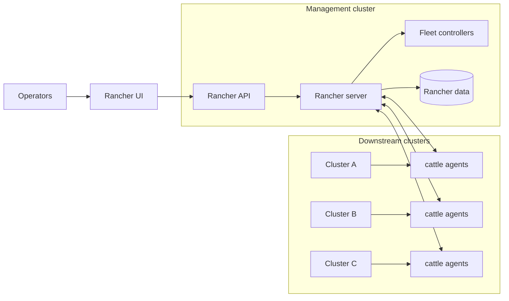

# Rancher Overview (Multi-Cluster Management)
> Module 18 · Lesson 01 | [↑ Course Index](../README.md)

## Table of Contents
- [Overview](#overview)
- [What Rancher Adds on Top of Kubernetes](#what-rancher-adds-on-top-of-kubernetes)
- [High-Level Architecture](#high-level-architecture)
- [Key Concepts](#key-concepts)
- [When to Use Rancher (and When Not To)](#when-to-use-rancher-and-when-not-to)
- [Lab Files](#lab-files)

---

## Overview

**Rancher** (Rancher Manager) is a web UI + API for **managing multiple Kubernetes clusters** at scale. You typically run Rancher on a dedicated “management cluster” and then **import or provision** “downstream” clusters.

In a k3s world, Rancher is the control tower:
- Centralised cluster inventory
- Central RBAC and auth integration
- Policy, app catalogs, and add-on management
- Fleet-based GitOps across many clusters

[↑ Back to TOC](#table-of-contents) · [↑ Course Index](../README.md)

---

## What Rancher Adds on Top of Kubernetes

- **Unified UI and API** for clusters, namespaces, workloads, and users
- **Cluster lifecycle** (import existing clusters; or provision clusters depending on environment)
- **Central authentication** (OIDC, LDAP, SAML, etc.) and role templates
- **GitOps at scale via Fleet** (multi-cluster deployments and drift correction)
- **App management** (charts, catalogs) and curated add-ons

[↑ Back to TOC](#table-of-contents) · [↑ Course Index](../README.md)

---

## High-Level Architecture

Notes:
- Rancher itself runs as Kubernetes workloads (usually in `cattle-system`).
- Each imported downstream cluster runs agents that establish and maintain connectivity to Rancher.
- Fleet is the GitOps engine Rancher uses for multi-cluster continuous delivery.

[↑ Back to TOC](#table-of-contents) · [↑ Course Index](../README.md)

---

## Key Concepts

- **Management cluster**: the cluster running Rancher.
- **Downstream cluster**: a cluster managed by Rancher (imported or provisioned).
- **Projects**: Rancher grouping layer above namespaces (often used for multi-team governance).
- **Role templates**: Rancher RBAC building blocks mapped to Kubernetes RBAC.
- **Fleet GitRepo**: a CRD describing a Git source and how to deploy it to one or more clusters.

[↑ Back to TOC](#table-of-contents) · [↑ Course Index](../README.md)

---

## When to Use Rancher (and When Not To)

Use Rancher when:
- You manage **multiple clusters** (or expect to) and want consistent workflows.
- You need **central identity and RBAC** across clusters.
- You want **one GitOps engine** to deploy to many clusters with visibility.

Skip Rancher (for now) when:
- You have a single small cluster and prefer `kubectl` + one GitOps tool.
- You do not want an additional platform component to maintain.

---

## Lab Files

The `18_rancher/labs/` directory contains all scripts and configuration used across this module:

| File | Purpose |
|---|---|
| [install-rancher.sh](labs/install-rancher.sh) | Automated Rancher install — runs preflight checks, optionally installs cert-manager, deploys Rancher via Helm, waits for rollout, and prints a post-install summary. Supports all three TLS modes and `--dry-run`. See Lesson 02 for full usage. |
| [uninstall-rancher.sh](labs/uninstall-rancher.sh) | Full Rancher teardown — removes the Helm release, `cattle-system` namespace, lingering `cattle-*`/`fleet-*` namespaces, Rancher CRDs, and optionally cert-manager. Includes a post-uninstall audit pass. |
| [rancher-values.yaml](labs/rancher-values.yaml) | Reference Helm values file showing hostname, TLS source, replica count, and the commented-out Let's Encrypt configuration block. The install script passes these values via `--set` flags; this file is useful for understanding the available knobs or for running `helm upgrade` manually. |
| [fleet-gitrepo.yaml](labs/fleet-gitrepo.yaml) | Example Fleet `GitRepo` custom resource that points Fleet at a Git repository and path to deploy to one or more managed clusters. Edit the `repo` and `paths` fields before applying. See Lesson 04 for full usage. |

[↑ Back to TOC](#table-of-contents) · [↑ Course Index](../README.md)

---

*Licensed under [CC BY-NC-SA 4.0](../LICENSE.md) · © 2026 UncleJS*
