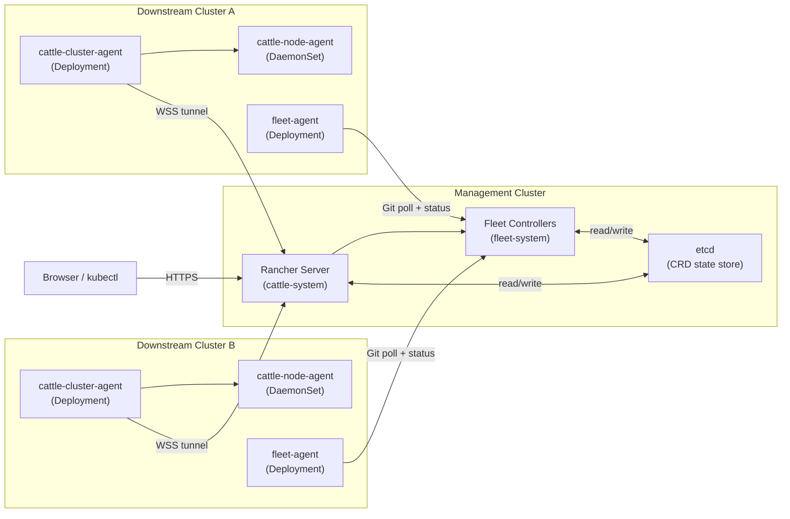
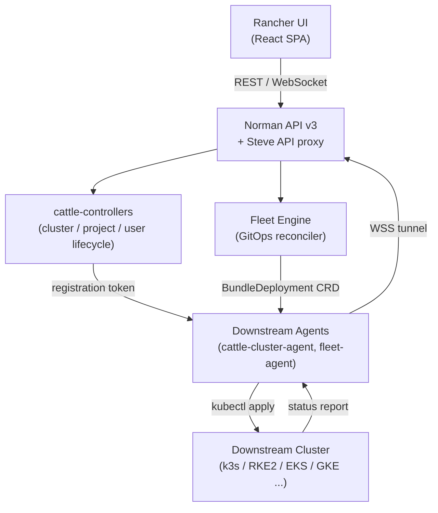
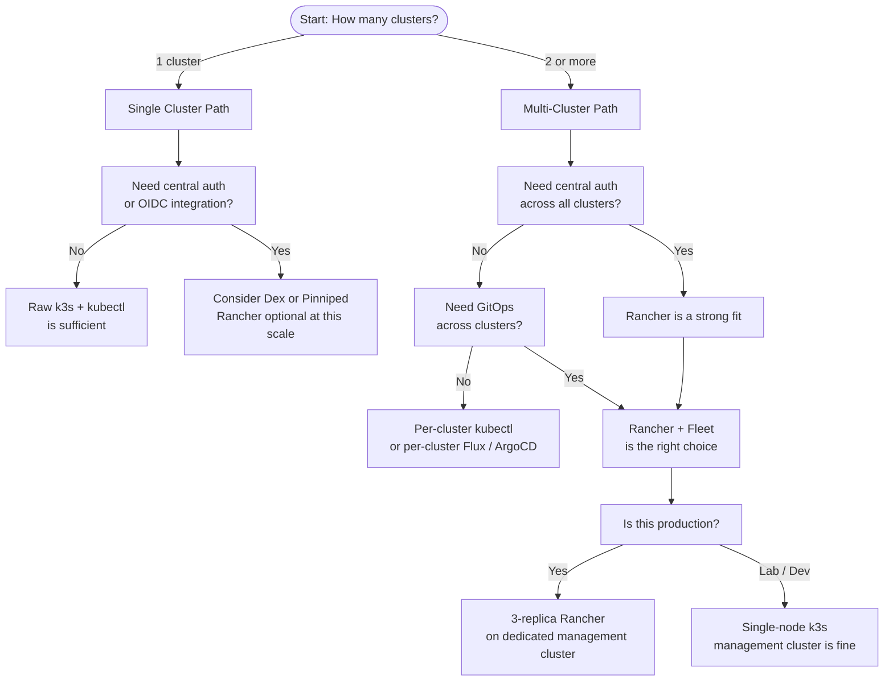

# Rancher Overview (Multi-Cluster Management)
> Module 18 · Lesson 01 | [↑ Course Index](../README.md)

[](../README.md)
[](../LICENSE.md)

## Table of Contents
- [Overview](#overview)
- [What Rancher Manager Is](#what-rancher-manager-is)
- [The Management Cluster Concept](#the-management-cluster-concept)
- [High-Level Architecture](#high-level-architecture)
- [Rancher Component Stack](#rancher-component-stack)
- [When to Use Rancher](#when-to-use-rancher)
- [Downstream Cluster Lifecycle](#downstream-cluster-lifecycle)
- [Key Concepts](#key-concepts)
- [What Rancher Adds on Top of k3s](#what-rancher-adds-on-top-of-k3s)
- [Rancher vs Raw kubectl + GitOps](#rancher-vs-raw-kubectl--gitops)
- [Rancher Component Versions and Compatibility](#rancher-component-versions-and-compatibility)
- [Common Pitfalls](#common-pitfalls)
- [Further Reading](#further-reading)

---

## Overview

**Rancher** (officially "Rancher Manager") is an open-source platform published by SUSE that provides a unified web UI, API, and control plane for managing fleets of Kubernetes clusters. Where raw `kubectl` gives you a command-line window into a *single* cluster, Rancher gives you a governance layer across *dozens or hundreds* of clusters — across data centres, cloud providers, and edge locations — from one pane of glass.

At its core Rancher is a Kubernetes *application* that runs inside a cluster (the "management cluster") and maintains persistent, bi-directional connections to every cluster it manages (the "downstream clusters"). The upstream Rancher server never needs direct network access to downstream cluster nodes; instead, a lightweight agent running inside the downstream cluster initiates an outbound websocket tunnel to Rancher, reversing the connectivity direction and making it firewall-friendly.

In a k3s world, Rancher is the natural "control tower":

- A single k3s management cluster can run Rancher with minimal resource overhead.
- Downstream k3s clusters at the edge or in constrained environments can be imported with nothing more than `kubectl apply` of a registration manifest.
- Fleet, Rancher's built-in GitOps engine, can push application state to all downstream clusters simultaneously, enforcing consistency without per-cluster scripting.

This lesson covers what Rancher is, how it is architected, the conceptual model it uses to organise clusters and tenants, and how to decide whether Rancher is the right tool for your k3s deployment.

[↑ Back to TOC](#table-of-contents) · [↑ Course Index](../README.md)

---

## What Rancher Manager Is

Rancher Manager (version 2.x, commonly called "Rancher v2") is fundamentally a Kubernetes *operator* that extends the Kubernetes API with Custom Resource Definitions (CRDs) representing concepts like `Cluster`, `Project`, `ClusterRoleTemplate`, and `GitRepo`. Each of these CRDs has a controller running inside the Rancher pods that reconciles the desired state stored in the management cluster's etcd against the actual state of the downstream clusters.

### The Rancher API Layer

Rancher exposes two API surfaces:

**Norman API v3** — the original Rancher-specific resource-oriented REST API. It uses Rancher's own resource types (users, clusters, projects, role bindings). External tools such as the Rancher Terraform provider and the `rancher2` CLI use this API.

**Steve API** — a newer, lighter-weight proxy that passes raw Kubernetes API requests through the Rancher proxy to the correct downstream cluster. This is what the Rancher UI uses for cluster-level operations after initial setup.

### What Rancher Is NOT

Before going further it is worth being precise about what Rancher does *not* do:

- **Rancher is not a Kubernetes distribution.** It does not replace k3s, RKE2, or any other distribution. It manages them.
- **Rancher is not an ingress controller or CNI.** It installs and manages cluster components but does not itself route traffic for your applications.
- **Rancher is not mandatory for k3s.** Single-cluster deployments that need no central multi-cluster management do not need Rancher.
- **Rancher is not a replacement for CI/CD.** It provides GitOps (via Fleet) but does not build container images or run test pipelines.

### The Rancher Server Process

The Rancher server runs as a Deployment (typically 1–3 replicas) in the `cattle-system` namespace of the management cluster. Each pod embeds:

- A Go HTTP/HTTPS API server implementing the Norman and Steve APIs
- A proxy that forwards `kubectl` commands to downstream clusters through the websocket tunnel
- Embedded Fleet controllers (in Rancher 2.6+)
- The Rancher UI (a React single-page application served from the same pod)

Because everything is co-located, the operational footprint is low: a single-node k3s instance with 2 vCPUs and 4 GB RAM is sufficient for a lab environment managing up to a dozen downstream clusters.

[↑ Back to TOC](#table-of-contents) · [↑ Course Index](../README.md)

---

## The Management Cluster Concept

In Rancher's model there is always a distinction between the **management cluster** and **downstream clusters**.

### Management Cluster

The management cluster is where Rancher itself runs. It is a full Kubernetes cluster — k3s, RKE2, or any CNCF-conformant distribution. Rancher appears in its own cluster list as the special cluster named **local**. The `local` cluster is always present and represents the cluster Rancher is currently running on.

Best practice is to dedicate the management cluster to Rancher workloads only and not run production application workloads on it. This keeps the blast radius of a Rancher upgrade or failure isolated from your application clusters.

Key characteristics of the management cluster:

- Runs `cattle-system` namespace with Rancher pods
- Runs `fleet-system` namespace with Fleet controllers
- Stores all Rancher CRD state (clusters, projects, users, role bindings) in its etcd
- Is represented as the `local` cluster inside the Rancher UI
- Must be accessible via HTTPS from your browser and from downstream cluster agents

### Downstream Clusters

Downstream clusters are any Kubernetes clusters managed by Rancher. They appear in the Rancher UI's cluster picker and can be managed (workloads, namespaces, RBAC) through the Rancher proxy. Each downstream cluster runs a small set of Rancher agent workloads in `cattle-system`.

[↑ Back to TOC](#table-of-contents) · [↑ Course Index](../README.md)

---

## High-Level Architecture

The following diagram shows how the management cluster, Rancher server, Fleet controllers, and downstream cattle-agents are connected:



Key observations from the architecture:

1. **Agents initiate outbound connections** — downstream clusters connect *out* to Rancher, not the reverse. This is critical for edge and firewall-constrained environments where inbound connections to downstream clusters are blocked.
2. **The websocket tunnel** carries `kubectl exec`, `kubectl logs`, and API proxy traffic bi-directionally once established. A single long-lived WSS connection per cluster handles all Rancher communication.
3. **Fleet agents** are separate from cattle-agents and report GitOps bundle status directly to Fleet controllers; they do not go through the cattle-cluster-agent proxy.
4. **etcd** on the management cluster is the single source of truth for all Rancher state. If the management cluster's etcd is lost without a backup, all Rancher metadata (projects, role bindings, cluster registrations) is lost — though the downstream clusters themselves continue running.

[↑ Back to TOC](#table-of-contents) · [↑ Course Index](../README.md)

---

## Rancher Component Stack



Walking the stack from top to bottom:

**Rancher UI** — A React single-page application served by the Rancher server pods. All operations the UI performs go through the Norman API or the Steve API. The UI has zero direct access to downstream clusters; everything goes through the Rancher API proxy. This means a UI operator's `kubectl` commands are proxied through Rancher and subject to Rancher RBAC, not just the downstream cluster's RBAC.

**Norman API v3 / Steve API** — The Rancher API layer. Norman v3 is the legacy resource-oriented API; Steve is the newer pass-through proxy to Kubernetes APIs. Both are served by the same Rancher server binary. External tools (Terraform provider, `rancher2` CLI, Rancher Ansible modules) also interact with Norman v3. Steve is used by the UI for real-time resource watching via server-sent events.

**cattle-controllers** — A set of Go controllers that watch Rancher CRDs and reconcile state. Examples: the `cluster-controller` watches `Cluster` objects and drives the import/provision lifecycle; the `project-controller` creates backing Kubernetes namespaces and RBAC bindings; the `user-controller` synchronises external identity provider tokens. These controllers run inside the Rancher pod and share the same process.

**Fleet Engine** — Fleet controllers watch `GitRepo`, `Bundle`, and `BundleDeployment` CRDs. They poll Git repositories, create Bundles (packaged manifests), and push BundleDeployments to the appropriate cluster agents. Fleet runs as a separate Deployment in the `fleet-system` namespace but is installed and upgraded as part of the Rancher Helm chart. Fleet is described in depth in Lesson 04.

**Downstream Agents** — Lightweight Deployments and DaemonSets running inside each downstream cluster. The `cattle-cluster-agent` maintains the websocket tunnel and proxies Kubernetes API calls from Rancher. The `fleet-agent` polls Fleet controllers for BundleDeployments and applies them to the cluster using `kubectl apply` semantics.

[↑ Back to TOC](#table-of-contents) · [↑ Course Index](../README.md)

---

## When to Use Rancher

Use the following decision tree to determine whether Rancher is the right fit for your situation:



### Summary Guidance Table

| Scenario | Recommendation |
|----------|---------------|
| 1 cluster, no central auth needed | Raw k3s + `kubectl` |
| 1 cluster, need OIDC / LDAP | Consider Dex or Pinniped directly; Rancher optional |
| 2–5 clusters, need unified view | Rancher provides immediate value |
| 5+ clusters or edge fleet | Rancher + Fleet is the right tool |
| Regulated environment, need audit logs | Rancher audit log + RBAC templates add value |
| Air-gapped environment | Rancher has first-class air-gap support with mirror registry |
| Clusters on multiple cloud providers | Rancher unifies management across providers |

[↑ Back to TOC](#table-of-contents) · [↑ Course Index](../README.md)

---

## Downstream Cluster Lifecycle

Rancher supports two modes for adding clusters to management: **import** and **provision**.

### Import (Bring Your Own Cluster)

Import is the most common mode for k3s clusters. You have an existing, running Kubernetes cluster and you want to bring it under Rancher management without changing how it was installed or configured.

The import process:
1. Create a cluster record in the Rancher UI (Cluster → Import Existing)
2. Rancher generates a registration manifest (a YAML file containing a ServiceAccount, ClusterRole, and the `cattle-cluster-agent` Deployment spec)
3. You run `kubectl apply -f <manifest-url>` on the downstream cluster
4. The cattle-cluster-agent establishes a websocket tunnel back to Rancher
5. Rancher discovers the cluster version, nodes, and namespaces
6. The cluster transitions to `Active` state

Import is **non-destructive**: it does not change the cluster's CNI, CSI, ingress, or any existing workloads. You can remove a cluster from Rancher management at any time by deleting the cattle-cluster-agent and associated resources from `cattle-system`.

### Provision (Rancher-Created Clusters)

Provision mode means Rancher creates the cluster from scratch using one of its node drivers or cluster drivers:

- **RKE2 provisioning** — Rancher SSHes into VMs and bootstraps an RKE2 cluster
- **Cloud provider drivers** — Rancher calls AWS/GCP/Azure APIs to create VMs and install Kubernetes
- **Custom nodes** — You register nodes with a `docker run` command that Rancher generates

Provisioned clusters are fully lifecycle-managed by Rancher (etcd backups, Kubernetes upgrades, node pool scaling). This is more powerful but also means Rancher is a hard dependency; if the management cluster is unavailable, provisioned clusters continue to run but cannot be modified.

### Lifecycle States

| State | Meaning |
|-------|---------|
| `Pending` | Cluster record created, waiting for agent to connect |
| `Provisioning` | (Provision mode only) infrastructure being created |
| `Waiting` | Agent connected, Rancher applying system resources |
| `Active` | Fully managed and ready for use |
| `Unavailable` | Agent disconnected; cluster keeps running but Rancher cannot communicate |
| `Removing` | Cluster being removed from Rancher management |
| `Error` | Terminal failure during provisioning or import |

[↑ Back to TOC](#table-of-contents) · [↑ Course Index](../README.md)

---

## Key Concepts

### Projects

A **Project** is a Rancher construct that groups a set of Kubernetes namespaces within a single cluster. It sits above namespaces in the hierarchy:

```
Cluster → Project → Namespace → Resource
```

Projects exist only in Rancher's CRD layer; Kubernetes itself has no concept of a Project. However, Rancher enforces resource quotas, network policies, and RBAC at the Project level by translating Project-level settings into per-namespace Kubernetes objects automatically via the project-controller.

Use-cases for Projects:
- Multi-tenant isolation: one Project per team, each with its own namespaces
- Resource quota enforcement across a team's namespaces from a single place
- Granting a developer access to "their" namespaces without granting cluster-admin
- Namespace-scoped monitoring dashboards

Default Projects: every cluster managed by Rancher gets a **Default** project and a **System** project. The System project contains the namespaces used by Kubernetes and Rancher infrastructure (e.g., `kube-system`, `cattle-system`, `fleet-system`). Never move these to a user Project — it will cause quota enforcement failures on system pods.

### Role Templates

**Role Templates** are Rancher's mechanism for defining reusable RBAC roles that can be applied across clusters and projects from a central location. Instead of creating ClusterRole objects on each cluster separately, you define a `ClusterRoleTemplate` in Rancher once and bind users or groups to it. Rancher's cattle-controllers then create the corresponding ClusterRole/ClusterRoleBinding objects on every applicable downstream cluster automatically.

Built-in role templates:

| Template | Scope | Permissions |
|----------|-------|-------------|
| `cluster-owner` | Cluster | Full control over the cluster |
| `cluster-member` | Cluster | Read access; deploy in owned namespaces |
| `project-owner` | Project | Full control within a project |
| `project-member` | Project | Deploy access within a project |
| `read-only` | Cluster or Project | View-only |

Custom role templates can be created to match your organisation's RBAC policy exactly — for example, a `ci-deployer` template that can manage Deployments and Services but cannot read Secrets.

### cattle-system Namespace

The `cattle-system` namespace exists on every cluster that Rancher manages. On downstream clusters it contains:

- `cattle-cluster-agent` Deployment — the primary agent maintaining the websocket tunnel and proxying API calls
- `cattle-node-agent` DaemonSet — runs on every node; used for node-level operations (lighter weight in Rancher v2.6+)
- `cattle-credentials-*` Secret — the cluster token used to authenticate the agent to Rancher

Never manually delete resources in `cattle-system` on a downstream cluster while it is under Rancher management. Rancher will immediately attempt to recreate them, which causes reconciliation loops and may leave the cluster in an inconsistent state. Always use the Rancher UI or API to remove a cluster from management before cleaning up these resources.

### Fleet GitRepo

**Fleet** is the GitOps component embedded in Rancher since version 2.6. A `GitRepo` custom resource tells Fleet: "watch this Git repository at this branch and path, and deploy its contents to these clusters." Fleet supports Helm charts, Kustomize overlays, and raw Kubernetes manifests. It is covered in depth in Lesson 04.

### ClusterGroups

A **ClusterGroup** (Fleet concept) is a label-selected set of clusters that can be used as a deployment target in a `GitRepo`. For example, a ClusterGroup named `edge-europe` might select all clusters labelled `region=europe` and `tier=edge`. A GitRepo targeting that ClusterGroup deploys to all matching clusters simultaneously without enumerating them individually.

### App Catalogs and Helm Charts

Rancher's **Apps & Marketplace** feature provides a curated Helm chart repository accessible through the UI. Administrators can add custom chart repositories (Helm repos, OCI registries). Users with appropriate permissions can deploy charts from the UI with a values form — without needing Helm CLI access or a local `kubeconfig`. Rancher tracks which chart version is installed on which cluster and highlights available upgrades.

[↑ Back to TOC](#table-of-contents) · [↑ Course Index](../README.md)

---

## What Rancher Adds on Top of k3s

| Feature | Description | Without Rancher |
|---------|-------------|-----------------|
| **Unified cluster inventory** | All clusters visible in one UI with health, version, and node status | Manual spreadsheet or per-cluster `kubectl` |
| **Central authentication** | OIDC, LDAP, SAML, GitHub — one identity provider for all clusters | Configure each cluster's API server `--oidc-*` flags separately |
| **Role templates** | Define RBAC once, propagate to all clusters automatically | Manual ClusterRole creation on each cluster |
| **Projects** | Namespace grouping with cross-namespace quota and policy | No equivalent native Kubernetes concept |
| **GitOps at scale (Fleet)** | Deploy to 1 or 1000 clusters from a single GitRepo CRD | Separate Flux/Argo instance per cluster |
| **App Marketplace** | Helm charts deployable from UI with input forms | `helm install` per cluster, per operator |
| **Cluster provisioning** | Create RKE2/k3s clusters on VMs/cloud from the UI | Manual bootstrap scripts or Terraform |
| **Drift detection** | Fleet detects and remediates cluster state drift from Git | Flux or Argo per cluster, no cross-cluster view |
| **Audit logging** | Centralised record of who did what, when, on which cluster | API server audit log per cluster requiring log aggregation |
| **kubectl proxy** | Web terminal and API proxy — no local kubeconfig needed | Direct kubeconfig distribution per operator |
| **Monitoring integration** | One-click Prometheus/Grafana stack per cluster via Apps | Manual Helm install per cluster |
| **etcd backups** | Scheduled etcd snapshots for RKE2/k3s clusters via UI | Cluster-specific cron + snapshot scripts |

[↑ Back to TOC](#table-of-contents) · [↑ Course Index](../README.md)

---

## Rancher vs Raw kubectl + GitOps

This is the most important architectural decision for any k3s deployment. Both approaches are valid; the choice depends on team size, cluster count, and operational complexity tolerance.

### Rancher Approach

**Strengths:**
- Single URL, single login for operators managing many clusters
- Role templates eliminate per-cluster RBAC administration
- Fleet handles multi-cluster GitOps without running multiple Argo/Flux instances
- Built-in monitoring, alerting, and logging stacks via Apps
- Rancher Backup Operator for management cluster disaster recovery

**Weaknesses:**
- Adds an operational dependency: if the management cluster has an outage, you lose the UI and API proxy. Downstream clusters keep running but cannot be changed through Rancher.
- Version compatibility constraints: you must pick a Rancher version that supports your k3s version and vice versa.
- Non-trivial to uninstall cleanly (CRDs, finalizers, `cattle-system` on all downstream clusters must be cleaned up).
- Learning curve: Projects, role templates, Fleet namespaces are additional concepts on top of plain Kubernetes.
- Resource overhead: approximately 1–2 GB RAM for Rancher pods plus cert-manager on the management cluster.

### Raw kubectl + GitOps Approach

**Strengths:**
- No additional control plane dependency; each cluster is independently operable
- Any GitOps tool (Flux, Argo CD, Crossplane) can be used per cluster
- Direct kubeconfig access without a proxy layer
- No version compatibility matrix to manage
- Simpler to understand and audit for small teams

**Weaknesses:**
- RBAC must be configured independently per cluster (error-prone at scale with many clusters)
- No unified view: correlating issues across clusters requires external tooling (Grafana, Datadog)
- GitOps requires a separate Flux or Argo instance per cluster (or complex hub-spoke Argo setup)
- Identity provider integration must be configured per cluster API server

### Side-by-Side Comparison

| Criterion | Rancher + Fleet | Raw kubectl + GitOps |
|-----------|----------------|----------------------|
| Cluster count sweet spot | 3+ clusters | 1–2 clusters |
| RBAC management | Centralised role templates | Per-cluster ClusterRole |
| GitOps engine | Fleet (embedded) | Flux or Argo (separate install) |
| Identity provider | One config in Rancher | One config per cluster |
| Operational dependency | Management cluster required | None |
| UI | Rich built-in UI | Kubernetes Dashboard or none |
| Upgrade complexity | Rancher version + k3s matrix | Only k3s |
| Audit trail | Rancher audit log | Per-cluster API server audit |

### Decision Rule

Use Rancher when you have **3 or more clusters** and at least one of: central auth, unified RBAC, or GitOps across clusters. Use raw kubectl + GitOps when you have **1–2 clusters** with a well-understood, stable scope and a team comfortable operating Kubernetes directly.

[↑ Back to TOC](#table-of-contents) · [↑ Course Index](../README.md)

---

## Rancher Component Versions and Compatibility

Rancher, k3s, and the embedded components (Fleet, cert-manager, Longhorn) each have their own release cadences. A Rancher release certifies compatibility with specific Kubernetes minor versions. Using an unsupported combination can result in API incompatibilities, Fleet agent failures from CRD version mismatches, or cert-manager webhook failures.

### How the Matrix Works

The Rancher support matrix is published at `https://www.suse.com/suse-rancher/support-matrix/`.

Key rules:
1. **Rancher certifies Kubernetes minor versions**, not patch versions. Rancher 2.8.x typically supports k8s 1.26, 1.27, 1.28, and 1.29.
2. **k3s version = Kubernetes version**. k3s `v1.29.4+k3s1` runs Kubernetes 1.29.4. When evaluating compatibility, use the numeric minor version (1.29), not the k3s patch string.
3. **Always check before upgrading either component.** Upgrading k3s to a version not yet certified by your Rancher version can cause unexpected controller failures.

### Compatibility Table

| Rancher Version | Certified k8s Versions | Fleet Version | Notes |
|-----------------|------------------------|---------------|-------|
| 2.7.x | 1.23 – 1.26 | 0.6.x | k8s 1.23/1.24 EOL |
| 2.8.x | 1.25 – 1.29 | 0.9.x | Recommended stable channel at time of writing |
| 2.9.x | 1.27 – 1.31 | 0.10.x | Latest release channel |
| 2.10.x | 1.29 – 1.32 | 0.11.x | Check SUSE matrix for updates |

### Upgrade Order

When upgrading both Rancher and k3s, order matters:

```
CORRECT order:
1. Upgrade Rancher to new version first
2. Validate management cluster is healthy (kubectl -n cattle-system get pods)
3. Upgrade k3s on downstream clusters one at a time

INCORRECT (do not do this):
1. Upgrade k3s past the certified range first
2. Then try to upgrade Rancher
```

The reason: Rancher controllers may fail to start if the Kubernetes API has removed APIs they depend on. Upgrading Rancher first ensures the new version supports the new k8s API surface before you upgrade clusters.

### Embedded Component Versions

Each Rancher version ships with pinned versions of embedded components:

| Component | Version pinning | Notes |
|-----------|----------------|-------|
| **Fleet** | Embedded in Rancher; upgrades with Rancher | Cannot be independently upgraded |
| **cert-manager** | Recommended version in Rancher install docs | Typically one minor behind latest cert-manager |
| **Rancher Monitoring** | Chart version pinned to Rancher release | Prometheus Operator + Grafana |
| **Longhorn** | Separate release cadence | Check Apps & Marketplace for supported version |
| **NeuVector** | Separate release cadence | Check Apps & Marketplace |

[↑ Back to TOC](#table-of-contents) · [↑ Course Index](../README.md)

---

## Common Pitfalls

| Pitfall | Root Cause | Fix |
|---------|-----------|-----|
| Management cluster running production workloads | Resource contention between Rancher and apps causes instability | Dedicate the management cluster to Rancher only |
| Upgrading k3s before upgrading Rancher | k8s API removals break Rancher controllers | Always upgrade Rancher first, then k3s |
| Missing `privateCA: true` on Rancher install | Self-signed or enterprise CA certs rejected by downstream agents | Set `privateCA: true` in Rancher Helm values; ensure CA bundle is present |
| Manually deleting `cattle-system` on downstream | Rancher immediately tries to recreate resources, causing loops | Remove cluster from Rancher UI before cleaning up agent resources |
| Using `fleet-default` for local cluster workloads | Bundles intended for remote clusters accidentally apply to local | Use `fleet-local` namespace for local-only GitRepo/Bundle workloads |
| System namespaces in user Projects | Project resource quotas block system pod creation | System namespaces must stay in the System Project |
| Not pinning Rancher Helm chart version | `helm repo update` + `helm upgrade` causes unintended upgrades | Always use `--version` flag in Helm install commands |
| Single Rancher replica in production | Pod restart causes full UI/API downtime | Use `replicas: 3` with a PodDisruptionBudget in production |
| Forgetting the bootstrap password window | Short window between pod start and first login allows any password | Set a strong `bootstrapPassword` and change it immediately |
| Importing a cluster running Argo CD or Flux | GitOps tools conflict when both Rancher Fleet and another tool manage the same resources | Use Fleet or Argo/Flux per cluster — not both for the same resources |

[↑ Back to TOC](#table-of-contents) · [↑ Course Index](../README.md)

---

## Further Reading

- [Rancher Manager Architecture — Official Docs](https://ranchermanager.docs.rancher.com/reference-guides/rancher-manager-architecture)
- [SUSE Rancher Support Matrix](https://www.suse.com/suse-rancher/support-matrix/)
- [Fleet Documentation](https://fleet.rancher.io)
- [Rancher Security Hardening Guides](https://ranchermanager.docs.rancher.com/reference-guides/rancher-security)
- [Rancher Backup Operator](https://ranchermanager.docs.rancher.com/how-to-guides/new-user-guides/backup-restore-and-disaster-recovery)
- Module 18 · Lesson 02 — [Install Rancher on k3s](02_install_rancher_on_k3s.md)
- Module 18 · Lesson 03 — [Import Existing Clusters](03_import_existing_clusters.md)
- Module 18 · Lesson 04 — [Fleet Basics](04_fleet_basics.md)

[↑ Back to TOC](#table-of-contents) · [↑ Course Index](../README.md)

---

*Licensed under [CC BY-NC-SA 4.0](../LICENSE.md) · © 2026 UncleJS*
