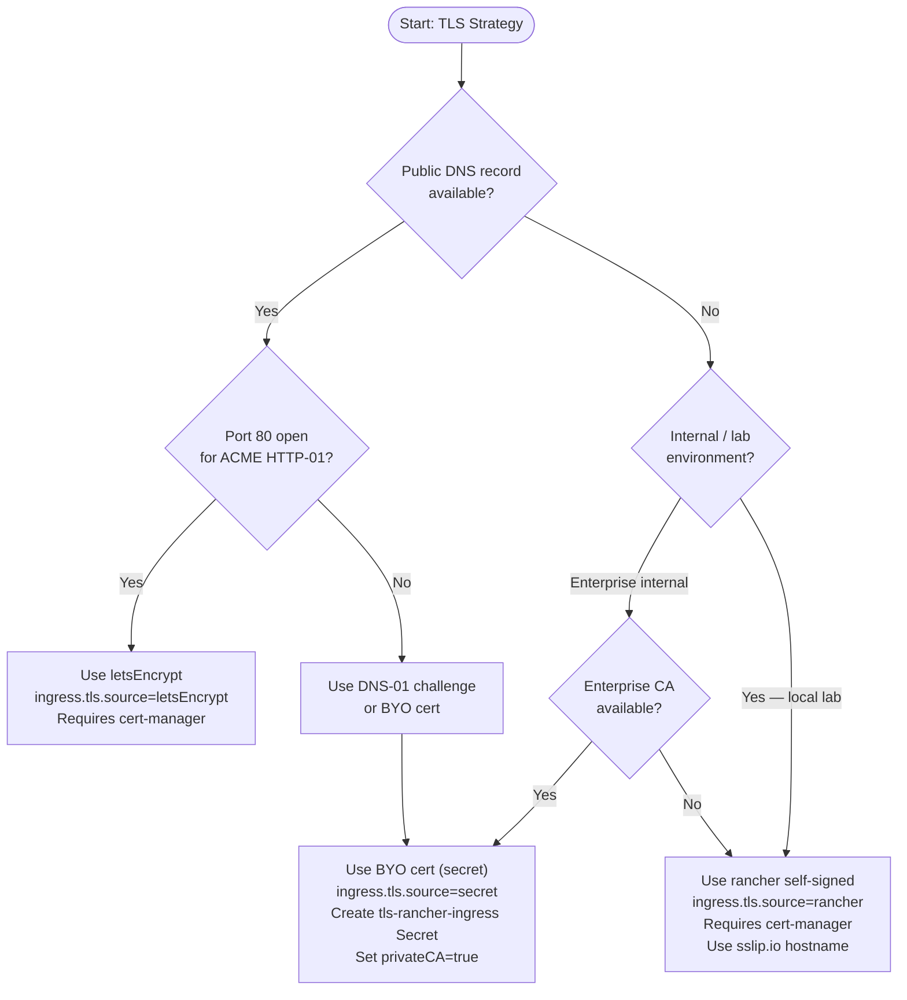
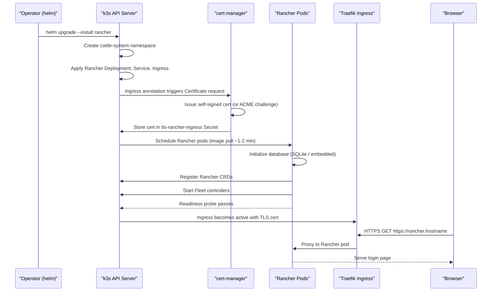
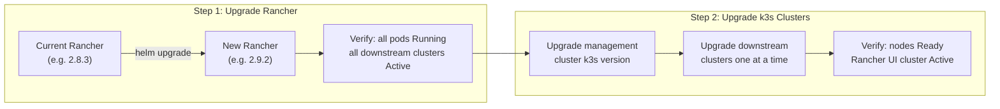

# Install Rancher on k3s (Helm)
> Module 18 · Lesson 02 | [↑ Course Index](../README.md)

[](../README.md)
[](../LICENSE.md)

## Table of Contents
- [Prerequisites](#prerequisites)
- [Choosing Rancher Version for Your k3s Cluster](#choosing-rancher-version-for-your-k3s-cluster)
- [Choose a Hostname and TLS Strategy](#choose-a-hostname-and-tls-strategy)
- [TLS Strategy Decision Tree](#tls-strategy-decision-tree)
- [Install cert-manager](#install-cert-manager)
- [Install Rancher with Helm](#install-rancher-with-helm)
- [Install Flow Sequence](#install-flow-sequence)
- [Upgrade Path](#upgrade-path)
- [Verify the Installation](#verify-the-installation)
- [Post-Install Checklist](#post-install-checklist)
- [Production Considerations](#production-considerations)
- [Lab Scripts](#lab-scripts)
- [Uninstall](#uninstall)
- [Common Issues](#common-issues)

---

## Prerequisites

Before installing Rancher, confirm these components are in place:

- **k3s cluster** — a working single-node or multi-node k3s cluster with `kubectl` access (Module 02)
- **Ingress controller** — k3s includes Traefik by default; confirm it is running: `kubectl get pods -n kube-system -l app.kubernetes.io/name=traefik`
- **Helm** — version 3.x installed on your workstation (Module 08)
- **DNS name** — either a real DNS record pointing to your node's IP, or a wildcard DNS service like `sslip.io` for local labs
- **kubectl context** — your `~/.kube/config` must be pointing at the intended management cluster

Recommended: install Rancher on a **dedicated management cluster** separate from production workloads. This keeps the Rancher blast radius isolated and simplifies version management. A single-node k3s instance with 2 vCPUs and 4 GB RAM is sufficient for a lab management cluster.

### Resource Sizing Quick Reference

| Environment | CPU (vCPU) | RAM | Storage | Replicas |
|-------------|-----------|-----|---------|---------|
| Lab / PoC | 2 | 4 GB | 20 GB SSD | 1 |
| Small production (< 10 clusters) | 4 | 8 GB | 50 GB SSD | 3 |
| Medium production (10–50 clusters) | 8 | 16 GB | 100 GB SSD | 3 |
| Large production (50+ clusters) | 16 | 32 GB | 200 GB SSD | 3 |

[↑ Back to TOC](#table-of-contents) · [↑ Course Index](../README.md)

---

## Choosing Rancher Version for Your k3s Cluster

This step is often skipped and causes pain later. Rancher certifies compatibility with specific Kubernetes minor versions. Before running `helm upgrade --install`, determine which Rancher version is compatible with the k3s version you are running.

### Determine Your k3s Version

```bash
k3s --version
# Example output: k3s version v1.29.4+k3s1 (abc12345)
# Kubernetes minor version: 1.29
```

### Compatibility Table

| Rancher Version | Min k8s | Max k8s | Recommended For |
|-----------------|---------|---------|-----------------|
| 2.7.x | 1.23 | 1.26 | Legacy clusters only; approaching EOL |
| 2.8.x | 1.25 | 1.29 | Stable production deployments |
| 2.9.x | 1.27 | 1.31 | Current release channel |
| 2.10.x | 1.29 | 1.32 | Latest; verify SUSE support matrix |

### Pinning the Version

Always pin the Helm chart version explicitly. Never rely on "latest stable" in production:

```bash
# List available versions
helm search repo rancher-stable/rancher --versions | head -20

# Install a pinned version
helm upgrade --install rancher rancher-stable/rancher \
  --namespace cattle-system \
  --version 2.8.5 \
  ...
```

The SUSE support matrix URL is `https://www.suse.com/suse-rancher/support-matrix/`. Consult it before every Rancher upgrade.

[↑ Back to TOC](#table-of-contents) · [↑ Course Index](../README.md)

---

## Choose a Hostname and TLS Strategy

Rancher **requires HTTPS**. There is no HTTP-only mode. The hostname you choose must:

1. Resolve to your k3s node's IP (or load balancer IP) from your browser
2. Resolve to the same IP from inside downstream cluster nodes (agent egress)
3. Be stable — changing the Rancher hostname after import is complex and error-prone

Three TLS strategies are available via the `ingress.tls.source` Helm value:

| Strategy | `tls.source` value | Requirements | Best For |
|----------|-------------------|--------------|---------|
| Rancher self-signed | `rancher` | cert-manager | Local labs, internal-only |
| Let's Encrypt | `letsEncrypt` | cert-manager + public DNS + port 80 open | Internet-accessible deployments |
| Bring Your Own | `secret` | Pre-created `tls-rancher-ingress` Secret in `cattle-system` | Enterprise CA, wildcard certs |

For local testing without public DNS, use `rancher.<node-ip>.sslip.io`. The `sslip.io` service resolves any hostname of the form `anything.<ip>.sslip.io` back to that IP with zero DNS configuration.

[↑ Back to TOC](#table-of-contents) · [↑ Course Index](../README.md)

---

## TLS Strategy Decision Tree



### Creating a BYO Certificate Secret

If you are using `ingress.tls.source=secret`, create the Secret before running Helm:

```bash
kubectl create namespace cattle-system

kubectl create secret tls tls-rancher-ingress \
  --cert=/path/to/tls.crt \
  --key=/path/to/tls.key \
  -n cattle-system
```

If your certificate was issued by a private CA, also create the CA bundle secret:

```bash
kubectl create secret generic tls-ca \
  --from-file=cacerts.pem=/path/to/ca-chain.pem \
  -n cattle-system
```

And add `--set privateCA=true` to your Helm command.

[↑ Back to TOC](#table-of-contents) · [↑ Course Index](../README.md)

---

## Install cert-manager

cert-manager is required for both `rancher` (self-signed) and `letsEncrypt` TLS modes. It manages the Certificate CRDs that Rancher's ingress relies on. Skip this section only if you are using `ingress.tls.source=secret`.

```bash
# Add the Jetstack Helm repo
helm repo add jetstack https://charts.jetstack.io
helm repo update

# Install cert-manager with CRDs
helm upgrade --install cert-manager jetstack/cert-manager \
  --namespace cert-manager \
  --create-namespace \
  --version v1.14.5 \
  --set installCRDs=true

# Verify cert-manager is running
kubectl get pods -n cert-manager
# Expected: cert-manager, cert-manager-cainjector, cert-manager-webhook all Running
```

Wait for all three cert-manager pods to reach `Running` before proceeding. The webhook pod must be healthy before Rancher install; if the webhook is unavailable, cert-manager CRD admission will fail.

```bash
kubectl rollout status deployment/cert-manager -n cert-manager
kubectl rollout status deployment/cert-manager-cainjector -n cert-manager
kubectl rollout status deployment/cert-manager-webhook -n cert-manager
```

[↑ Back to TOC](#table-of-contents) · [↑ Course Index](../README.md)

---

## Install Rancher with Helm

### 1. Add the Rancher Helm Repo

```bash
helm repo add rancher-stable https://releases.rancher.com/server-charts/stable
helm repo update
```

The `rancher-stable` channel receives thoroughly tested releases. The `rancher-latest` channel has newer releases but with less soak time. Use `rancher-stable` for production and lab work unless you specifically need a feature in latest.

### 2. Create the Rancher Namespace

```bash
kubectl create namespace cattle-system
```

### 3. Install Using Helm

**Option A — Rancher self-signed TLS (lab/internal):**

```bash
helm upgrade --install rancher rancher-stable/rancher \
  --namespace cattle-system \
  --version 2.8.5 \
  --set hostname=rancher.192.168.1.10.sslip.io \
  --set bootstrapPassword=changeme \
  --set replicas=1 \
  --set ingress.tls.source=rancher
```

**Option B — Let's Encrypt (public DNS):**

```bash
helm upgrade --install rancher rancher-stable/rancher \
  --namespace cattle-system \
  --version 2.8.5 \
  --set hostname=rancher.example.com \
  --set bootstrapPassword=changeme \
  --set replicas=3 \
  --set ingress.tls.source=letsEncrypt \
  --set letsEncrypt.email=admin@example.com \
  --set letsEncrypt.environment=production \
  --set letsEncrypt.ingress.class=traefik
```

**Option C — BYO Certificate:**

```bash
helm upgrade --install rancher rancher-stable/rancher \
  --namespace cattle-system \
  --version 2.8.5 \
  --set hostname=rancher.example.com \
  --set bootstrapPassword=changeme \
  --set replicas=3 \
  --set ingress.tls.source=secret \
  --set privateCA=true
```

### Key Helm Values Explained

| Value | Default | Description |
|-------|---------|-------------|
| `hostname` | *(required)* | FQDN for Rancher ingress; must resolve to your ingress IP |
| `bootstrapPassword` | *(required)* | First-login password; Rancher forces a change after use |
| `replicas` | `3` | Number of Rancher server pods; use `1` for labs |
| `ingress.tls.source` | `rancher` | TLS certificate source |
| `privateCA` | `false` | Set `true` if using a private/enterprise CA |
| `auditLog.level` | `0` | Audit log verbosity (0=off, 1-3=increasing detail) |
| `resources.requests.cpu` | `250m` | CPU request per Rancher pod |
| `resources.requests.memory` | `512Mi` | Memory request per Rancher pod |

[↑ Back to TOC](#table-of-contents) · [↑ Course Index](../README.md)

---

## Install Flow Sequence

The following sequence diagram shows what happens between `helm upgrade --install` and a successful first login:



Key timing notes:
- **cert-manager certificate issuance** typically takes 10–30 seconds for self-signed and 60–120 seconds for Let's Encrypt (HTTP-01 challenge)
- **Rancher image pull** can take 2–5 minutes on a slow connection (~1 GB image)
- **CRD registration** happens once on first start; subsequent restarts are faster
- **Total time from `helm install` to first login** is typically 3–8 minutes on a well-resourced lab cluster

[↑ Back to TOC](#table-of-contents) · [↑ Course Index](../README.md)

---

## Upgrade Path

When upgrading Rancher (to access new features or security patches) and k3s together, the upgrade order is critical.



### Rancher Upgrade Steps

```bash
# 1. Update the Helm repo
helm repo update

# 2. Check what version you currently have
helm list -n cattle-system

# 3. Upgrade to new version
helm upgrade rancher rancher-stable/rancher \
  --namespace cattle-system \
  --version 2.9.2 \
  --reuse-values

# 4. Watch rollout
kubectl -n cattle-system rollout status deploy/rancher
```

The `--reuse-values` flag preserves your existing hostname, TLS source, and other values from the previous install. Always verify the result in the Rancher UI after upgrade before touching downstream clusters.

### Supported Upgrade Paths

Rancher supports upgrading **one minor version at a time** for the Rancher version itself. For example:

- 2.7.x → 2.8.x: Supported
- 2.7.x → 2.9.x (skipping 2.8): **Not supported** — upgrade to 2.8.x first

[↑ Back to TOC](#table-of-contents) · [↑ Course Index](../README.md)

---

## Verify the Installation

After Helm returns, verify that all components are healthy:

```bash
# Wait for Rancher deployment to be fully rolled out
kubectl -n cattle-system rollout status deploy/rancher --timeout=600s

# Check all pods in cattle-system
kubectl -n cattle-system get pods
# Expected: rancher-<hash> pods all Running and Ready

# Check the Ingress has an address
kubectl -n cattle-system get ingress
# Expected: rancher ingress shows ADDRESS field populated

# Check the TLS certificate was issued
kubectl -n cattle-system get certificate
# Expected: tls-rancher-ingress Certificate with READY=True

# Check Fleet controllers are running
kubectl -n fleet-system get pods
# Expected: fleet-controller, fleet-webhook pods Running
```

Then browse to `https://<hostname>` and log in as `admin` with your bootstrap password. Rancher will immediately prompt you to change the password.

On first login, Rancher will also ask you to confirm the Server URL. Accept the default (which reflects your hostname) unless you need to change it. **This URL is baked into the registration manifests for downstream clusters** — changing it later requires re-importing all downstream clusters.

[↑ Back to TOC](#table-of-contents) · [↑ Course Index](../README.md)

---

## Post-Install Checklist

Run through these eight steps after every new Rancher installation:

1. **Change the bootstrap password** — Log in at `https://<hostname>` and set a strong admin password. The bootstrap password is visible in Helm values; rotate it immediately.

2. **Confirm server URL** — In Rancher UI → Global Settings → `server-url`. Must match the hostname you configured. Downstream agents use this URL; it must be resolvable from downstream cluster nodes.

3. **Verify TLS certificate** — Check the padlock in your browser. For self-signed certs, accept the warning only if the CA is known. For Let's Encrypt, the cert should be valid with no warnings.

4. **Check Fleet controllers** — `kubectl -n fleet-system get pods`. All Fleet controller pods must be Running before you import clusters.

5. **Set up authentication** — Navigate to Users & Authentication → Auth Provider. Configure LDAP, OIDC, or GitHub SSO if required. Do not rely solely on the local `admin` account in production.

6. **Configure audit logging** — In Rancher UI → Global Settings → `audit-log`. Enable at level 1 or 2 for production. Audit logs are written to the Rancher pod's stdout and should be captured by your log aggregation system.

7. **Review resource limits** — `kubectl -n cattle-system top pods`. For production, add resource limits/requests to the Helm values to prevent Rancher pods from starving other workloads on the management cluster.

8. **Test proxy access to local cluster** — In the Rancher UI, navigate to the `local` cluster → Workloads. If this view is blank or errors, the cattle-system agent inside the management cluster has a problem — investigate before importing downstream clusters.

[↑ Back to TOC](#table-of-contents) · [↑ Course Index](../README.md)

---

## Production Considerations

### Replica Count and HA

Use `replicas: 3` for production deployments. This requires a multi-node management cluster where pods can be spread across nodes. Combine with a PodDisruptionBudget:

```yaml
# Add to your Helm values or apply separately
apiVersion: policy/v1
kind: PodDisruptionBudget
metadata:
  name: rancher-pdb
  namespace: cattle-system
spec:
  minAvailable: 2
  selector:
    matchLabels:
      app: rancher
```

### Persistence

Rancher 2.6+ uses an embedded SQLite database (backed by a PersistentVolumeClaim) for local state. In production on k3s, ensure your storage class provides durable storage (Longhorn, local-path on NVMe, or a cloud PVC). Loss of the PVC without a backup requires a full Rancher reinstall and re-import of all clusters.

### Resource Sizing for Production

| Component | CPU Request | CPU Limit | Memory Request | Memory Limit |
|-----------|-------------|-----------|----------------|--------------|
| `rancher` (each pod) | 250m | 2000m | 512Mi | 4Gi |
| `cert-manager` | 10m | 200m | 64Mi | 256Mi |
| `fleet-controller` | 100m | 1000m | 128Mi | 1Gi |
| `fleet-agent` (downstream) | 50m | 500m | 64Mi | 512Mi |

### Backup

Install the Rancher Backup Operator and configure automated backups to S3 or a local PVC:

```bash
helm upgrade --install rancher-backup rancher-stable/rancher-backup \
  --namespace cattle-resources-system \
  --create-namespace
```

Configure a Backup CRD to snapshot Rancher's state daily. Without backups, a management cluster failure means losing all cluster registrations, Projects, and role assignments.

[↑ Back to TOC](#table-of-contents) · [↑ Course Index](../README.md)

---

## Lab Scripts

Both scripts live in `18_rancher/labs/` and are executable. Every mutating step is wrapped in a `run()` helper, meaning `--dry-run` prints the full command without executing it — making it safe to rehearse on any live cluster.

---

### `install-rancher.sh`

A single script that drives the entire install flow from preflight through to a printed post-install summary, with no manual steps required for a standard lab setup.

#### Preflight Checks

The script runs seven checks before touching anything on the cluster:

| # | Check | Pass | Fail |
|---|-------|------|------|
| 1 | Root / sudo | `✔ Root: OK` | Hard fail |
| 2 | k3s service active | `✔ k3s service: active` | Hard fail |
| 3 | At least one Ready node | `✔ Ready nodes: N` | Hard fail |
| 4 | kubectl binary | `✔ kubectl: vX.Y.Z` | Hard fail |
| 5 | helm binary | `✔ helm: vX.Y.Z` | Hard fail |
| 6 | Traefik pods running | `✔ Traefik: N pods` | Warning only |
| 7 | cattle-system exists | `✔ Namespace: not present` | Warning only |

For `--tls letsencrypt` an eighth check verifies DNS resolution for the hostname.

#### cert-manager Handling

The script detects whether cert-manager is already installed and reacts accordingly — no manual cert-manager install is needed for a clean cluster. If already running, the install step is skipped. If missing, it installs cert-manager with `--set installCRDs=true` and waits for rollout.

#### Flag Reference

| Flag | Default | Description |
|------|---------|-------------|
| `--hostname <host>` | `rancher.<node-ip>.sslip.io` | Hostname for Rancher ingress |
| `--tls <rancher\|letsencrypt\|secret>` | `rancher` | TLS certificate source |
| `--le-email <email>` | *(none)* | Let's Encrypt email; required for `letsencrypt` mode |
| `--bootstrap-password <pw>` | `changeme` | First-login bootstrap password |
| `--replicas <n>` | `1` | Rancher pod replica count |
| `--rancher-version <ver>` | Latest stable | Pin Helm chart version |
| `--cert-manager-version <ver>` | `v1.14.5` | cert-manager chart version |
| `--skip-cert-manager` | off | Skip cert-manager detection and install |
| `--dry-run` | off | Print commands; do not execute |
| `--force` | off | Skip all confirmation prompts |

#### Usage Examples

```bash
# Quickstart — zero config, auto-detect hostname, self-signed cert
sudo ./install-rancher.sh

# Dry-run first to review every command
sudo ./install-rancher.sh --dry-run

# Let's Encrypt with a real public domain
sudo ./install-rancher.sh \
  --tls letsencrypt \
  --hostname rancher.example.com \
  --le-email you@example.com

# Pin version, 3 replicas, strong password, skip confirmation
sudo ./install-rancher.sh \
  --rancher-version 2.8.5 \
  --replicas 3 \
  --bootstrap-password "MyStr0ngPw!" \
  --force
```

[↑ Back to TOC](#table-of-contents) · [↑ Course Index](../README.md)

---

### `uninstall-rancher.sh`

Removes Rancher and all cluster resources created during the install. Every step is idempotent — if a resource is already gone, the step logs a warning and continues.

#### Removal Sequence

1. **Preflight** — verifies root, `kubectl` reachability, and `helm`
2. **Confirmation** — prints what will be deleted; requires `YES`
3. **Helm release** — `helm -n cattle-system uninstall rancher`
4. **cattle-system namespace** — deletes and polls for termination (60 s timeout)
5. **Lingering namespaces** — scans for `cattle-*`, `fleet-*`, `rancher-*`, `local`
6. **Rancher CRDs** — removes all `.cattle.io`, `.fleet.cattle.io`, `.rancher.io` CRDs
7. **cert-manager** — only when `--remove-cert-manager` is passed
8. **Post-uninstall audit** — confirms no Rancher artifacts remain

#### Flag Reference

| Flag | Description |
|------|-------------|
| `--remove-cert-manager` | Also uninstall cert-manager release and CRDs |
| `--dry-run` | Print commands; do not execute |
| `--force` | Skip all confirmation prompts |

```bash
# Standard interactive removal
sudo ./uninstall-rancher.sh

# Full teardown including cert-manager, no prompts
sudo ./uninstall-rancher.sh --remove-cert-manager --force

# Dry-run — inspect everything that would be removed
sudo ./uninstall-rancher.sh --dry-run
```

[↑ Back to TOC](#table-of-contents) · [↑ Course Index](../README.md)

---

## Uninstall

```bash
helm -n cattle-system uninstall rancher
kubectl delete namespace cattle-system
```

If you installed cert-manager only for Rancher and no longer need it, remove it separately:

```bash
helm -n cert-manager uninstall cert-manager
kubectl delete namespace cert-manager
kubectl delete -f https://github.com/cert-manager/cert-manager/releases/download/v1.14.5/cert-manager.crds.yaml
```

> **Tip:** Use the [uninstall-rancher.sh](labs/uninstall-rancher.sh) lab script for a guided teardown that also cleans up lingering namespaces and CRDs.

Stuck namespaces with finalizers are the most common uninstall problem. If a namespace hangs in `Terminating`:

```bash
# Inspect finalizers
kubectl get namespace cattle-system -o yaml | grep finalizer

# Force-patch to remove finalizers (last resort — only if Rancher is fully gone)
kubectl patch namespace cattle-system \
  -p '{"metadata":{"finalizers":[]}}' \
  --type=merge
```

[↑ Back to TOC](#table-of-contents) · [↑ Course Index](../README.md)

---

## Common Issues

| Symptom | Root Cause | Fix |
|---------|-----------|-----|
| **Ingress not reachable — connection refused** | Traefik is not running or has no external IP | `kubectl get pods -n kube-system -l app.kubernetes.io/name=traefik`; check service type and node port binding |
| **Certificate stuck in Pending state** | cert-manager webhook not ready; or ACME HTTP-01 challenge failing because port 80 is blocked | `kubectl describe certificate -n cattle-system`; check cert-manager pod logs; for Let's Encrypt verify port 80 is open and DNS resolves |
| **Rancher pods CrashLoopBackOff on startup** | Image pull failure, insufficient memory, or missing PVC | `kubectl describe pod -n cattle-system <pod>` → check Events; increase memory limit or fix storage class |
| **PodSecurity admission blocking Rancher pods** | Management cluster has a restrictive PodSecurity admission policy | Label `cattle-system` namespace with `pod-security.kubernetes.io/enforce: privileged` |
| **Downstream agents reject Rancher TLS cert — x509 error** | Rancher uses a self-signed or private CA cert not trusted by the agent's OS trust store | Set `privateCA: true` in Helm values; create `tls-ca` Secret with the CA bundle in `cattle-system` |
| **First login fails — incorrect password** | Bootstrap password was not set correctly or a previous install left state | `kubectl -n cattle-system exec -it <rancher-pod> -- reset-password` |
| **`helm upgrade --install` fails with "rendered manifests contain a resource already exists"** | Previous partial install left orphaned resources | `helm -n cattle-system uninstall rancher` then retry; or use `kubectl delete` to remove the conflicting resources |
| **Fleet controllers not starting** | Usually a symptom of Rancher pod not fully ready | Wait for Rancher pod readiness; check `kubectl -n fleet-system logs -l app=fleet-controller` |
| **Ingress reports TLS cert from wrong hostname** | Multiple Ingress objects exist for `cattle-system` from previous attempts | `kubectl -n cattle-system get ingress`; delete stale Ingress resources |
| **Memory OOMKilled after hours of operation** | Default memory limit too low for clusters with many resources | Increase `resources.limits.memory` in Helm values to at least `4Gi` per pod for production |

[↑ Back to TOC](#table-of-contents) · [↑ Course Index](../README.md)

---

*Licensed under [CC BY-NC-SA 4.0](../LICENSE.md) · © 2026 UncleJS*
