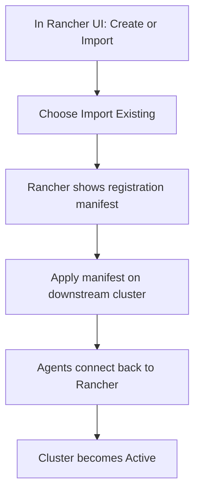

# Import Existing Clusters into Rancher
> Module 18 · Lesson 03 | [↑ Course Index](../README.md)

## Table of Contents
- [Overview](#overview)
- [What “Import” Does](#what-import-does)
- [Import Flow](#import-flow)
- [Verify Agents and Connectivity](#verify-agents-and-connectivity)
- [Troubleshooting](#troubleshooting)

---

## Overview

Rancher can manage clusters in two broad ways:
- **Import**: attach an existing cluster by installing Rancher agents in it.
- **Provision**: create clusters through Rancher (depends on your environment and drivers).

This lesson focuses on **importing** an existing k3s cluster.

[↑ Back to TOC](#table-of-contents) · [↑ Course Index](../README.md)

---

## What “Import” Does

When you import a downstream cluster, Rancher provides a manifest that deploys:
- `cattle-system` namespace
- `cattle-cluster-agent` and supporting components

Those agents maintain a secure connection back to the Rancher server.

[↑ Back to TOC](#table-of-contents) · [↑ Course Index](../README.md)

---

## Import Flow



Typical execution on the downstream cluster looks like:

```bash
# Copy the manifest from Rancher UI and apply it
kubectl apply -f rancher-import.yaml
```

Security note: treat the registration manifest as sensitive while onboarding.

[↑ Back to TOC](#table-of-contents) · [↑ Course Index](../README.md)

---

## Verify Agents and Connectivity

On the downstream cluster:

```bash
kubectl get ns cattle-system
kubectl -n cattle-system get pods
kubectl -n cattle-system logs deploy/cattle-cluster-agent --tail=100
```

In Rancher UI:
- Cluster state transitions: `Pending` → `Provisioning` → `Active`
- If it sticks, check agent logs first.

[↑ Back to TOC](#table-of-contents) · [↑ Course Index](../README.md)

---

## Troubleshooting

- **Agents CrashLoopBackOff**: check events, then logs for TLS/CA errors.
- **Cannot reach Rancher URL**: downstream cluster must reach `https://<rancher-hostname>` (DNS + routing).
- **Private CA issues**: ensure your Rancher install is configured for private CA (`privateCA`) and downstream nodes trust it.
- **NetworkPolicy/egress blocks**: allow egress from `cattle-system` to the Rancher hostname.

---

*Licensed under [CC BY-NC-SA 4.0](../LICENSE.md) · © 2026 UncleJS*
