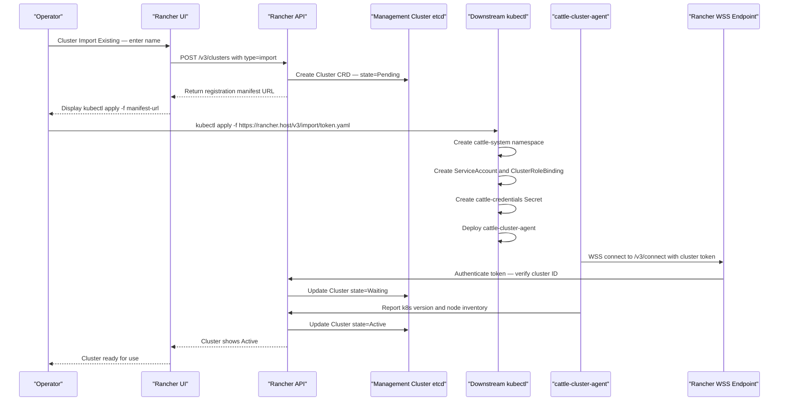
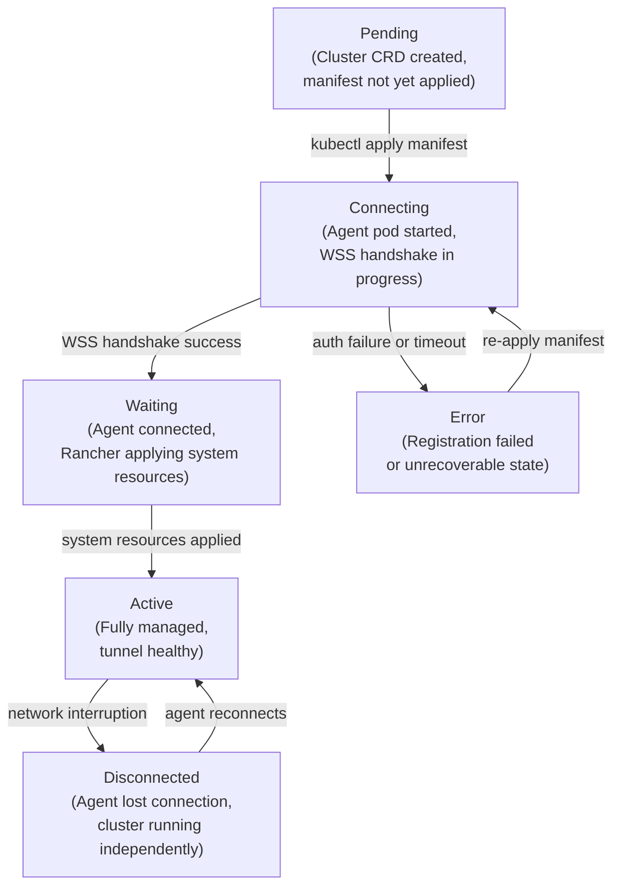
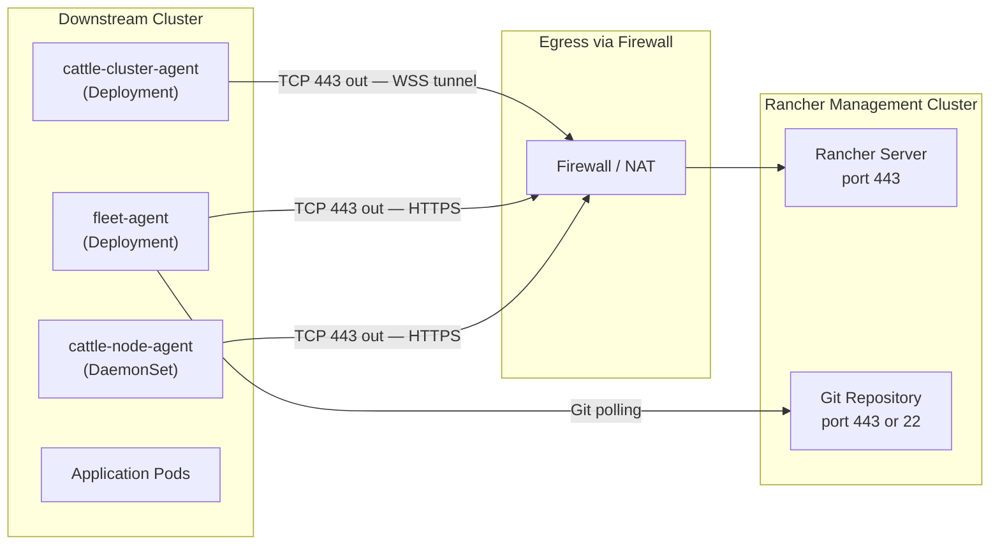

# Import Existing Clusters into Rancher
> Module 18 · Lesson 03 | [↑ Course Index](../README.md)

[](../README.md)
[](../LICENSE.md)

## Table of Contents
- [What Import Means](#what-import-means)
- [Import vs Provision](#import-vs-provision)
- [What the Registration Manifest Deploys](#what-the-registration-manifest-deploys)
- [Full Import Flow](#full-import-flow)
- [Agent Lifecycle](#agent-lifecycle)
- [Network Requirements](#network-requirements)
- [Security Model](#security-model)
- [Managing Multiple Clusters After Import](#managing-multiple-clusters-after-import)
- [Troubleshooting](#troubleshooting)
- [Lab: Step-by-Step Import Walkthrough](#lab-step-by-step-import-walkthrough)

---

## What Import Means

**Importing** a cluster into Rancher means placing an existing, independently-running Kubernetes cluster under Rancher's management umbrella — without changing how the cluster was installed, what CNI it uses, or what workloads are already running on it.

The word "import" can be slightly misleading. Rancher does not copy or replicate the cluster's data. Instead, it:
1. Creates a `Cluster` CRD record on the management cluster representing the downstream cluster
2. Generates a registration manifest (a set of Kubernetes YAML objects)
3. You apply that manifest to the downstream cluster
4. The downstream cluster's newly-created agent pod initiates a persistent outbound websocket connection to the Rancher server
5. Rancher "discovers" the cluster through that tunnel and begins managing it

From this point forward, Rancher can proxy `kubectl` commands, enforce RBAC, deploy workloads via Fleet, and display cluster health — all through the established tunnel. The downstream cluster continues operating independently; it does not need the Rancher management cluster to be available to serve application traffic.

Import is the correct mode for:
- Existing k3s clusters at the edge or in data centres
- Managed cloud clusters (EKS, GKE, AKS) that you want to view in a unified UI
- Clusters whose lifecycle is managed by another tool (Terraform, Cluster API)
- Any cluster where you want the non-destructive "connect without changing" approach

[↑ Back to TOC](#table-of-contents) · [↑ Course Index](../README.md)

---

## Import vs Provision

It is important to understand the distinction before choosing a mode:

| Dimension | Import | Provision |
|-----------|--------|-----------|
| Cluster creation | You created the cluster externally | Rancher creates the cluster |
| Installation method | Any (k3s, RKE2, kubeadm, managed cloud) | RKE2, k3s, or cloud driver |
| Lifecycle ownership | Your tooling (k3s systemd, Terraform, etc.) | Rancher owns the full lifecycle |
| Kubernetes upgrades | You upgrade via your tooling | Rancher UI drives the upgrade |
| Node management | External | Rancher node pools |
| etcd backups | External | Rancher automates them |
| Impact of Rancher downtime | Cluster keeps running; Rancher features unavailable | Cluster keeps running; no changes possible |
| De-registration | Remove agents; cluster continues unchanged | Removing from Rancher is destructive |
| When to use | Any existing cluster you want to govern | New clusters where you want Rancher full lifecycle |

For k3s courses and edge deployments, **import is the primary mode**. You install k3s your way — automated with your configuration — then import it into Rancher for governance and GitOps.

[↑ Back to TOC](#table-of-contents) · [↑ Course Index](../README.md)

---

## What the Registration Manifest Deploys

When Rancher generates the registration manifest, it produces a multi-document YAML file that creates the following resources **on the downstream cluster**:

### Namespace: cattle-system

All Rancher agent resources live here. This namespace is created if it does not already exist. Never add your own workloads to `cattle-system` — it is reserved for Rancher agent components.

### ServiceAccount: cattle

A ServiceAccount in `cattle-system` used by the agents to interact with the downstream cluster's own Kubernetes API — to report resource inventory, enforce RBAC, and apply Fleet deployments.

### ClusterRole and ClusterRoleBinding

A ClusterRole granting the `cattle` ServiceAccount full `cluster-admin` access to the downstream cluster. This is necessary because Rancher agents must be able to enumerate all resources, create namespaces, apply RBAC bindings, and deploy workloads on behalf of Rancher operators.

The broad permission scope is a deliberate design choice: Rancher acts as a transparent proxy for cluster-admin operations initiated by authorised Rancher users. The agent does not initiate actions independently — it only acts on instructions from the Rancher server received through the tunnel.

### cattle-cluster-agent Deployment

The primary agent. A single-replica (by default) Deployment running the `rancher/rancher-agent` container image. This pod:
- Initiates a TLS websocket connection to the Rancher server at `https://<rancher-hostname>/v3/connect`
- Authenticates using a token stored in the `cattle-credentials-<hash>` Secret
- Maintains the tunnel and responds to Rancher API proxy requests
- Reports node and pod inventory to Rancher
- Applies Fleet BundleDeployments to the cluster

### cattle-node-agent DaemonSet

A DaemonSet running one pod per node. In Rancher 2.6+, its responsibilities are lighter weight than in earlier versions. It primarily handles node-level operations that require local node access. In imported clusters, it is present but largely passive.

### cattle-credentials Secret

A Secret containing the cluster registration token that the cattle-cluster-agent uses to authenticate to the Rancher server. This token is cluster-specific and is rotated periodically by Rancher. If this Secret is deleted, the agent loses its ability to authenticate and the cluster transitions to `Disconnected` state.

[↑ Back to TOC](#table-of-contents) · [↑ Course Index](../README.md)

---

## Full Import Flow



### Token Security

The registration URL contains a one-time registration token in the path. This token is used only during the initial registration handshake to establish the persistent cluster credentials. The URL is single-use in a security sense — treat it as sensitive. However, the resources the manifest creates are idempotent: re-applying the same manifest to update agent images is safe.

After the initial handshake, the `cattle-credentials-*` Secret on the downstream cluster contains a long-lived cluster token. Rancher rotates this token periodically. If it is invalidated (by cluster removal or manual deletion), the agent must re-register.

[↑ Back to TOC](#table-of-contents) · [↑ Course Index](../README.md)

---

## Agent Lifecycle



### Understanding Each State

**Pending** — The Cluster CRD exists in the management cluster's etcd, but no agent has connected yet. This is the state immediately after creating the import record in the UI, before you have applied the manifest to the downstream cluster.

**Connecting** — The cattle-cluster-agent pod has started and is attempting the websocket handshake with the Rancher server. The TLS certificate is being validated (CA pinning), and the cluster token is being verified. This state typically lasts 10–30 seconds.

**Waiting** — The websocket connection is established. Rancher is now applying system resources to the downstream cluster: creating the `fleet-agent` Deployment, applying Project defaults, and registering the cluster's node inventory. This state typically lasts 30–90 seconds.

**Active** — The cluster is fully managed. The websocket tunnel is healthy, Fleet is deployed, and the cluster appears in the Rancher UI ready for use. This is the desired steady state.

**Disconnected** — The websocket connection dropped. The downstream cluster continues running all its workloads normally. The agent has a built-in exponential backoff reconnect loop — it will automatically re-establish the tunnel within seconds to a few minutes after the network issue resolves. No operator intervention is needed for transient disconnections.

**Error** — The registration failed in a way that requires operator intervention (expired token, mismatched CA, etc.). Re-apply a fresh registration manifest to recover.

### Agent Reconnection Behaviour

If the websocket drops (network blip, Rancher pod restart, downstream cluster node restart), the cattle-cluster-agent automatically retries with exponential backoff:
- Initial retry: 5 seconds
- After 3 failures: 30 seconds
- After 10 failures: 5 minutes (max backoff)

The cluster transitions `Active → Disconnected` after the first missed heartbeat. It transitions back to `Active` as soon as the tunnel is re-established. No data loss occurs during disconnection.

[↑ Back to TOC](#table-of-contents) · [↑ Course Index](../README.md)

---

## Network Requirements



### Required Egress from Downstream Cluster

| Destination | Port | Protocol | Purpose |
|-------------|------|----------|---------|
| Rancher hostname | 443 | HTTPS / WSS | cattle-cluster-agent tunnel |
| Rancher hostname | 443 | HTTPS | fleet-agent status reporting |
| Git host (GitHub, GitLab, Gitea) | 443 | HTTPS | Fleet GitRepo polling |
| Git host | 22 | SSH | Fleet GitRepo (SSH repos) |
| Container registry | 443 | HTTPS | Agent image pulls |

### No Inbound Ports Required

Rancher agents initiate all connections **outbound**. You do not need to open any inbound ports on downstream cluster nodes or firewall rules allowing Rancher to initiate connections to the downstream cluster. This is a key design advantage for edge deployments behind NAT or strict firewalls.

### DNS Requirements

The Rancher hostname must resolve from **inside** the downstream cluster's pods. Agents look up the hostname using the cluster's DNS resolver (CoreDNS). If the hostname only resolves from the operator's workstation but not from inside cluster pods, agents will fail to connect with a DNS lookup error.

Test DNS from inside the cluster:
```bash
kubectl run dnstest --image=busybox:1.36 --rm -it --restart=Never -- \
  nslookup rancher.example.com
```

If using an `sslip.io` hostname like `rancher.192.168.1.10.sslip.io`, note that `sslip.io` requires external DNS resolution. In an air-gapped environment, add a CoreDNS override in the ConfigMap or use an actual DNS record.

### Proxy Configuration

If downstream cluster pods route egress through an HTTP proxy, configure the agent's environment variables:

```yaml
# In the cattle-cluster-agent Deployment env section:
- name: HTTP_PROXY
  value: "http://proxy.corp.example.com:3128"
- name: HTTPS_PROXY
  value: "http://proxy.corp.example.com:3128"
- name: NO_PROXY
  value: "localhost,127.0.0.0/8,10.0.0.0/8,172.16.0.0/12,192.168.0.0/16,.svc,.cluster.local"
```

### NetworkPolicy Considerations

If the downstream cluster enforces `NetworkPolicy`, ensure the `cattle-system` namespace has egress rules allowing agent pods to reach the Rancher hostname on port 443. A missing egress rule is a silent failure — the agent pod appears `Running` and `Ready` but cannot establish the tunnel, leaving the cluster in `Connecting` state indefinitely.

```yaml
apiVersion: networking.k8s.io/v1
kind: NetworkPolicy
metadata:
  name: allow-rancher-egress
  namespace: cattle-system
spec:
  podSelector: {}
  policyTypes:
    - Egress
  egress:
    - ports:
        - port: 443
          protocol: TCP
        - port: 22
          protocol: TCP
```

[↑ Back to TOC](#table-of-contents) · [↑ Course Index](../README.md)

---

## Security Model

### How Agents Authenticate

Authentication between the cattle-cluster-agent and the Rancher server uses a cluster-specific bearer token:

1. Rancher generates a unique cluster registration token when the import record is created
2. The token is embedded in the registration manifest as a Kubernetes Secret (`cattle-credentials-<clusterID>`)
3. The cattle-cluster-agent mounts this Secret and presents the token in the `Authorization: Bearer` header of the websocket upgrade request
4. Rancher validates the token against its internal token store (backed by the management cluster's etcd)
5. On success, the websocket connection is established

Tokens are cluster-specific. A token for Cluster A cannot be used to connect Cluster B.

### CA Pinning

The agent does not blindly trust the Rancher TLS certificate using the OS trust store. Instead, Rancher embeds a hash of the management cluster's CA certificate in the registration manifest. The agent verifies the Rancher server's TLS certificate against this pinned CA hash during the websocket handshake. This prevents man-in-the-middle attacks even in environments where the agent OS trust store does not include the Rancher CA.

If you change the Rancher TLS certificate after clusters are imported, agents will reject the new certificate (CA hash mismatch) and the cluster will go to `Disconnected`. You must re-import or update the `cattle-credentials` Secret with the new CA hash.

### What Rancher CAN Do After Import

Through the established tunnel, Rancher can (subject to Rancher RBAC):
- Enumerate all resources in all namespaces (using the `cattle` ServiceAccount which has cluster-admin)
- Create, update, and delete namespaces, workloads, and RBAC bindings
- Execute commands in running containers (`kubectl exec`) — proxied through the tunnel
- Stream pod logs
- Deploy Fleet bundles (GitOps deployments)
- Create Projects and enforce Project resource quotas

All actions are gated by Rancher's own RBAC layer. A Rancher user with `project-member` cannot do cluster-admin operations even though the agent itself has cluster-admin on the downstream cluster.

### What Rancher CANNOT Do After Import

- Access the container runtime directly (containerd sockets)
- Modify the k3s installation (config files, restart the k3s service, change kernel settings)
- Access the downstream cluster's etcd directly
- Modify operating system users or SSH keys on nodes
- Perform any actions if the agent's tunnel is disconnected

### kubeconfig After Import

After import, Rancher generates a kubeconfig that routes all traffic through the Rancher proxy. This can be downloaded from the Rancher UI (Cluster → `⋮` → Download KubeConfig).

The Rancher-generated kubeconfig uses a Rancher API token as authentication, subject to Rancher RBAC. It does **not** bypass Rancher. For break-glass scenarios where Rancher is unavailable, use the original kubeconfig on the cluster's control plane node at `/etc/rancher/k3s/k3s.yaml`.

```bash
# Download via Rancher CLI
rancher login https://rancher.example.com --token <api-token>
rancher clusters kubeconfig my-downstream-k3s > my-cluster.yaml
export KUBECONFIG=my-cluster.yaml
kubectl get nodes
```

[↑ Back to TOC](#table-of-contents) · [↑ Course Index](../README.md)

---

## Managing Multiple Clusters After Import

### Navigating Clusters in the UI

After importing multiple clusters, the Rancher UI provides several navigation patterns:

- **Cluster picker** (top-left dropdown) — switch between clusters; each has its own Dashboard, Workloads, Apps, and Storage sections
- **Home screen** — all clusters with health status, Kubernetes version, node count, CPU/memory at a glance
- **Global Apps** — deploy a chart to multiple clusters from a single form
- **Fleet** (Continuous Delivery) — manage GitRepo CRDs across all clusters from one place

### Projects Across Clusters

Projects are per-cluster constructs. A Project in Cluster A is entirely separate from one in Cluster B. For consistent policy across clusters:
1. Define role templates in Rancher (once)
2. Apply them per cluster (Rancher propagates the ClusterRole/Binding objects automatically)
3. Use Fleet to deploy `Namespace` + `ResourceQuota` manifests across clusters with a GitRepo

### kubectl Access Per Cluster

```bash
# List clusters (Rancher CLI)
rancher login https://rancher.example.com --token <api-token>
rancher clusters ls

# Use rancher kubectl for a specific cluster
rancher kubectl --cluster my-downstream-k3s get pods -A

# Or download and use kubeconfig directly
export KUBECONFIG=my-cluster.yaml
kubectl get nodes
kubectl get pods -A
```

All `kubectl` commands through the Rancher proxy are captured in the Rancher audit log with the requesting user's identity.

### Cluster Labels for Fleet Targeting

Add labels to clusters in Rancher UI (Cluster → Edit Config → Labels). Fleet uses these labels in `clusterSelector` and `ClusterGroup` definitions to target deployments. Plan your label schema before importing many clusters:

```
env=production / env=staging / env=dev
region=us-west / region=eu-central / region=ap-south
tier=core / tier=edge / tier=dmz
```

A well-designed label schema lets you deploy to "all production clusters in EU" with a single GitRepo selector, without enumerating cluster names.

[↑ Back to TOC](#table-of-contents) · [↑ Course Index](../README.md)

---

## Troubleshooting

### Agent Pod CrashLoopBackOff

```bash
kubectl -n cattle-system get pods
kubectl -n cattle-system describe pod cattle-cluster-agent-<hash>
kubectl -n cattle-system logs cattle-cluster-agent-<hash> --previous
```

**Common causes and fixes:**

| Cause | Symptoms in logs | Fix |
|-------|-----------------|-----|
| Image pull failure | `ErrImagePull` in Events | Check registry connectivity; configure imagePullSecrets if using private registry |
| OOMKilled | `Reason: OOMKilled` in pod status | Increase memory limit on the Deployment |
| Token expired / invalid | `401 Unauthorized` | Delete `cattle-credentials` Secret and re-apply registration manifest |
| DNS failure at start | `no such host` | Fix CoreDNS; add custom resolver entry if needed |

### TLS and CA Certificate Errors

Symptom: logs show `x509: certificate signed by unknown authority` or `x509: certificate is valid for rancher.com, not your-host.com`.

```bash
kubectl -n cattle-system logs cattle-cluster-agent-<hash> | grep -i "x509\|tls\|cert\|verify"
```

**Fix 1 — CA hash mismatch (Rancher cert changed after import):**
Delete `cattle-system` namespace and re-apply the new registration manifest from the Rancher UI.

**Fix 2 — Private enterprise CA not trusted:**
On the management cluster, reinstall Rancher with `--set privateCA=true` and create the `tls-ca` Secret. Then re-import downstream clusters.

**Fix 3 — SAN mismatch:**
Ensure the Rancher server URL (Global Settings → `server-url`) exactly matches the hostname in the TLS certificate Subject Alternative Names.

### DNS Failures

Symptom: `dial tcp: lookup rancher.example.com: no such host` or connection timeouts with no TLS error.

```bash
# Test DNS resolution from inside the cluster
kubectl run dnstest --image=busybox:1.36 --rm -it --restart=Never -- \
  nslookup rancher.example.com

# Check CoreDNS health
kubectl -n kube-system get pods -l k8s-app=kube-dns
kubectl -n kube-system logs -l k8s-app=kube-dns --tail=30
```

**Fix:** Add the Rancher hostname to CoreDNS ConfigMap if internal DNS cannot resolve it:
```bash
kubectl -n kube-system edit configmap coredns
# Add to the Corefile:
# rancher.example.com {
#   hosts {
#     192.168.1.10 rancher.example.com
#   }
# }
```

### NetworkPolicy Blocking Egress

Symptom: agent pod is `Running` and `Ready` but the cluster stays in `Connecting` indefinitely. No TLS errors in logs — just timeout.

```bash
# Check for NetworkPolicy in cattle-system
kubectl -n cattle-system get networkpolicy

# Test connectivity from inside the agent pod
kubectl -n cattle-system exec -it cattle-cluster-agent-<hash> -- \
  wget -qO- --timeout=5 https://rancher.example.com/healthz
# Should return: ok
```

**Fix:** Apply the egress NetworkPolicy shown in the [Network Requirements](#network-requirements) section.

### Cluster Stuck in Waiting State (> 10 minutes)

```bash
# Step 1: Verify agent pod is Running
kubectl -n cattle-system get pods

# Step 2: Check agent logs for tunnel establishment
kubectl -n cattle-system logs cattle-cluster-agent-<hash> | tail -30

# Step 3: Check Rancher management cluster logs
# (switch KUBECONFIG to management cluster)
kubectl -n cattle-system logs -l app=rancher --tail=100 | grep -i "error\|warn"

# Step 4: Check Fleet controller logs
kubectl -n fleet-system logs -l app=fleet-controller --tail=50
```

### Re-import After Removing from Rancher

If you remove a cluster from Rancher (Cluster → Delete) and want to re-import it:

```bash
# On the downstream cluster — clean up the old agents
kubectl delete namespace cattle-system

# Wait for full termination
kubectl get namespace cattle-system
# Should return "Error from server (NotFound)"

# In Rancher UI — create a new import record and apply the new manifest
kubectl apply -f <new-manifest-url>
```

Do not re-apply the old manifest — the registration token it contains has been revoked.

[↑ Back to TOC](#table-of-contents) · [↑ Course Index](../README.md)

---

## Lab: Step-by-Step Import Walkthrough

This lab imports a downstream k3s cluster into a Rancher management cluster. You need two k3s clusters: one running Rancher (management) and one to import (downstream).

### Prerequisites

```bash
# Verify Rancher is running on management cluster
kubectl -n cattle-system get pods
# All rancher-* pods should be Running and Ready

# Verify downstream k3s cluster is accessible
export KUBECONFIG=/path/to/downstream-kubeconfig.yaml
kubectl get nodes
# All nodes should be Ready
```

### Step 1: Create the Import Record in Rancher

Navigate to: **Rancher UI → Cluster Management → Create → Import Existing**

- Name: `my-downstream-k3s`
- Description: `Lab downstream cluster` (optional)
- Labels: add `env=staging` and `region=local` (used later by Fleet)
- Click **Create**

Rancher creates the `Cluster` CRD and displays the `kubectl apply` command.

### Step 2: Inspect the Manifest (Optional but Recommended)

```bash
# Review what will be created before applying
curl -k https://rancher.example.com/v3/import/<token>.yaml | kubectl apply --dry-run=client -f -
```

The dry-run output should list: namespace, serviceaccount, clusterrolebinding, clusterrole, secret, deployment, daemonset — all in `cattle-system`.

### Step 3: Apply the Manifest to the Downstream Cluster

```bash
export KUBECONFIG=/path/to/downstream-kubeconfig.yaml

kubectl apply -f https://rancher.example.com/v3/import/<token>.yaml
```

Expected output:
```
namespace/cattle-system created
serviceaccount/cattle created
clusterrolebinding.rbac.authorization.k8s.io/cattle-admin-binding created
clusterrole.rbac.authorization.k8s.io/cattle-admin created
secret/cattle-credentials-abc123 created
deployment.apps/cattle-cluster-agent created
daemonset.apps/cattle-node-agent created
```

### Step 4: Watch the Agent Start

```bash
kubectl -n cattle-system get pods -w
# Watch for: cattle-cluster-agent-<hash> 1/1 Running
```

### Step 5: Verify Agent Logs Show Connected

```bash
kubectl -n cattle-system logs -l app=cattle-cluster-agent --tail=30
```

Look for lines containing:
```
connecting to wss://rancher.example.com/v3/connect
connection established
cluster state: active
```

### Step 6: Confirm Active State in Rancher UI

Navigate to **Cluster Management**. The cluster should reach `Active` state within 2–3 minutes of the agent pod becoming `Running`.

### Step 7: Test kubectl Access Through Rancher Proxy

```bash
# Download the Rancher-proxied kubeconfig
# UI: Cluster → ⋮ → Download KubeConfig → save to rancher-downstream.yaml
export KUBECONFIG=rancher-downstream.yaml
kubectl get nodes
kubectl get pods -A
# All output should come from the downstream cluster via the Rancher proxy
```

### Step 8: Verify Fleet Agent Deployed

```bash
export KUBECONFIG=/path/to/downstream-kubeconfig.yaml
kubectl -n cattle-fleet-system get pods
# Should show fleet-agent pod Running
```

Fleet is automatically deployed to imported clusters by Rancher. You can now create GitRepo resources targeting this cluster.

### Using the Automation Script

For repeatable imports across many clusters:

```bash
# Dry-run first
./labs/rancher-import-cluster.sh \
  --rancher-url https://rancher.example.com \
  --api-token token-xxxx:yyyyyyyy \
  --cluster-name my-downstream-k3s \
  --kubeconfig /path/to/downstream-kubeconfig.yaml \
  --dry-run

# Live run
./labs/rancher-import-cluster.sh \
  --rancher-url https://rancher.example.com \
  --api-token token-xxxx:yyyyyyyy \
  --cluster-name my-downstream-k3s \
  --kubeconfig /path/to/downstream-kubeconfig.yaml
```

The script performs preflight checks, calls the Rancher API, applies the manifest, and polls until the cluster reaches `Active` state (5-minute timeout).

[↑ Back to TOC](#table-of-contents) · [↑ Course Index](../README.md)

---

*Licensed under [CC BY-NC-SA 4.0](../LICENSE.md) · © 2026 UncleJS*
