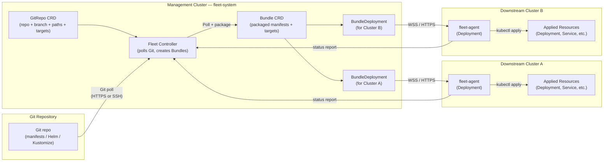
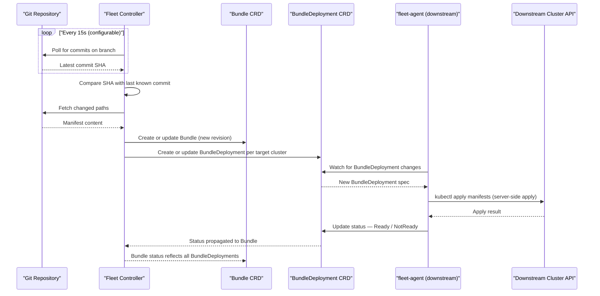
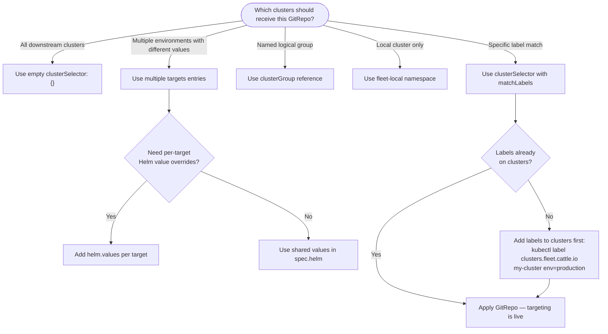

# Fleet Basics (Rancher GitOps)
> Module 18 · Lesson 04 | [↑ Course Index](../README.md)

[](../README.md)
[](../LICENSE.md)

## Table of Contents
- [What Fleet Is](#what-fleet-is)
- [Fleet vs Flux vs ArgoCD](#fleet-vs-flux-vs-argocd)
- [Fleet Architecture](#fleet-architecture)
- [Fleet Reconciliation Loop](#fleet-reconciliation-loop)
- [Core CRDs](#core-crds)
- [Namespaces: fleet-local vs fleet-default](#namespaces-fleet-local-vs-fleet-default)
- [Targeting Clusters](#targeting-clusters)
- [Multi-Cluster Targeting Decision Tree](#multi-cluster-targeting-decision-tree)
- [Fleet with Helm Charts](#fleet-with-helm-charts)
- [Fleet with Kustomize](#fleet-with-kustomize)
- [Observing Fleet Status](#observing-fleet-status)
- [Fleet Limitations](#fleet-limitations)
- [Common Pitfalls](#common-pitfalls)
- [Lab: Deploy a Fleet GitRepo](#lab-deploy-a-fleet-gitrepo)

---

## What Fleet Is

**Fleet** is Rancher's built-in GitOps continuous delivery engine, embedded in Rancher Manager since version 2.6. Its design goal is to scale GitOps deployments across **large numbers of clusters** — from a single cluster to thousands — from one centrally-managed Git repository.

Fleet introduces a simple declarative model: you create a `GitRepo` custom resource on the management cluster that says "watch this Git repo, at this branch and path, and deploy its contents to clusters matching these labels." Fleet handles the rest: polling the repo for changes, packaging the manifests into Bundles, targeting the right clusters, applying the changes, and reporting drift.

Fleet can deploy:
- **Raw Kubernetes manifests** (plain YAML files in a directory)
- **Helm charts** (either in-repo chart directories or from external Helm repos, with per-cluster values overlays)
- **Kustomize bases and overlays** (with per-cluster or per-environment overlay directories)
- **Combinations** of the above (Helm + Kustomize together via Fleet's built-in support)

Fleet is not a separate install — it is a core component of Rancher and is automatically upgraded when you upgrade Rancher. The Fleet controllers run in `fleet-system` on the management cluster, and a `fleet-agent` runs in `cattle-fleet-system` (or `fleet-system` in older versions) on each downstream cluster.

[↑ Back to TOC](#table-of-contents) · [↑ Course Index](../README.md)

---

## Fleet vs Flux vs ArgoCD

If you are already familiar with Flux or Argo CD, here is how Fleet compares:

| Criterion | Fleet | Flux v2 | Argo CD |
|-----------|-------|---------|---------|
| **Native multi-cluster** | Yes — core design | Requires multi-cluster sharding or federation | Hub-spoke with ApplicationSets |
| **Installation** | Embedded in Rancher | Per-cluster install | Per-cluster or hub install |
| **UI** | Rancher UI (built-in) | None (use Weave GitOps or dashboards) | Argo UI (separate) |
| **Helm support** | Yes (built-in) | HelmRelease CRD | Application CRD |
| **Kustomize support** | Yes (built-in) | Kustomization CRD | Native |
| **Multi-cluster targeting** | `clusterSelector` + ClusterGroup | Manual per-cluster Kustomization | ApplicationSet generators |
| **Drift detection** | Yes — reconciles on schedule | Yes | Yes |
| **Secrets management** | External (SOPS, external-secrets) | SOPS, sealed-secrets | Vault plugin, sealed-secrets |
| **RBAC** | Rancher RBAC layer | Kubernetes RBAC | Argo RBAC |
| **Air-gap support** | Yes | Yes | Yes |
| **Dependency ordering** | Limited (Fleet bundles) | Kustomization `dependsOn` | App of Apps pattern |
| **Best for** | Rancher-managed multi-cluster | Per-cluster GitOps, complex dependencies | Single/hub cluster, rich UI |

### Key Takeaway

Fleet's primary advantage is **multi-cluster native targeting with zero per-cluster GitOps setup**. When you import a cluster into Rancher, Fleet is automatically deployed. You do not need to configure GitOps on each cluster separately. A single `GitRepo` on the management cluster can immediately deploy to 50 clusters labelled `env=production` without touching each cluster.

Flux and Argo CD are better choices when you have complex dependency ordering requirements, need SOPS secrets management, or want rich per-cluster GitOps configuration that Fleet's simpler model does not support.

[↑ Back to TOC](#table-of-contents) · [↑ Course Index](../README.md)

---

## Fleet Architecture



Walking the architecture left to right:

1. **Git Repository** — any Git host (GitHub, GitLab, Gitea, Bitbucket, self-hosted). Fleet supports HTTPS with optional credentials and SSH with key authentication.

2. **GitRepo CRD** — your declaration of intent: watch this repo, at this branch, at these paths, and deploy to clusters matching these criteria. Lives in the management cluster's `fleet-local` or `fleet-default` namespace.

3. **Fleet Controller** — polls the Git repo on a configurable interval (default: 15 seconds). When it detects a change, it re-packages the content into a new Bundle revision.

4. **Bundle CRD** — an internal Fleet object representing one version of the packaged deployment content. A Bundle contains the rendered manifests and the targeting configuration (which clusters should receive it). Operators rarely interact with Bundles directly.

5. **BundleDeployment CRD** — one BundleDeployment object per target cluster. Each represents the state of that Bundle on a specific cluster. The fleet-agent on the downstream cluster watches its BundleDeployment objects and applies/reconciles the manifests.

6. **fleet-agent** — runs on each downstream cluster. Watches for BundleDeployment objects created for its cluster ID. Applies the packaged manifests using server-side apply, reports readiness status back to the Fleet controller.

[↑ Back to TOC](#table-of-contents) · [↑ Course Index](../README.md)

---

## Fleet Reconciliation Loop



### Key Reconciliation Behaviours

**Drift correction** — If someone manually modifies a resource that is managed by Fleet (e.g., manually scales a Deployment), Fleet's reconciliation loop detects the drift on the next cycle and reverts the change. This is the "drift correction" behaviour. It can be disabled per-GitRepo if you need managed resources to be editable in-cluster.

**Forced remediation** — Fleet can be configured to force delete and re-create resources that cannot be patched (e.g., immutable fields changed in a Job spec). By default it uses server-side apply and will report a conflict error without force-deleting.

**Poll interval** — The default 15-second poll interval can be increased for repos with high commit frequency or decreased for repos that need faster propagation. Set `spec.pollingInterval` in the GitRepo spec.

[↑ Back to TOC](#table-of-contents) · [↑ Course Index](../README.md)

---

## Core CRDs

### GitRepo

The `GitRepo` CRD is the primary user-facing resource in Fleet. Full field reference:

```yaml
apiVersion: fleet.cattle.io/v1alpha1
kind: GitRepo
metadata:
  name: my-app
  namespace: fleet-default          # fleet-default (multi-cluster) or fleet-local (local only)
spec:
  repo: https://github.com/myorg/myrepo
  branch: main                      # Git branch to watch
  revision: ""                      # Specific commit SHA (overrides branch if set)
  paths:
    - apps/nginx                    # Paths within the repo to deploy (relative to repo root)
    - apps/redis
  pollingInterval: 15s              # How often to poll for Git changes (default: 15s)

  # Authentication (for private repos)
  clientSecretName: git-credentials # Secret with username/password or SSH key

  # Helm options (apply to all paths using Helm)
  helm:
    releaseName: my-release
    values:
      replicaCount: 2

  # Targets — which clusters to deploy to
  targets:
    - name: production
      clusterSelector:
        matchLabels:
          env: production
      helm:
        values:
          replicaCount: 3           # Override values per-target
    - name: staging
      clusterSelector:
        matchLabels:
          env: staging
      helm:
        values:
          replicaCount: 1
```

### Bundle

Bundles are created and managed by Fleet controllers. You rarely create them directly. However, understanding their structure helps with debugging:

```bash
kubectl get bundle -A
# Shows: NAMESPACE  NAME                       READY  DESIRED  MODIFIED  ...
```

A Bundle's `status.conditions` shows the aggregate readiness across all BundleDeployments. A Bundle is `Ready` when all target BundleDeployments are `Ready`.

### BundleDeployment

One BundleDeployment per (Bundle, cluster) pair. Created by Fleet controllers; reconciled by the fleet-agent on the downstream cluster.

```bash
kubectl get bundledeployment -A
# Shows per-cluster deployment status

kubectl describe bundledeployment -n fleet-default my-app-xxxxx
# Shows detailed status, applied resources, and error messages
```

### ClusterGroup

A `ClusterGroup` lets you name a set of clusters and use that name as a target in GitRepo `targets`:

```yaml
apiVersion: fleet.cattle.io/v1alpha1
kind: ClusterGroup
metadata:
  name: edge-europe
  namespace: fleet-default
spec:
  selector:
    matchLabels:
      region: europe
      tier: edge
```

Then in a GitRepo:
```yaml
targets:
  - name: europe-edge
    clusterGroup: edge-europe
```

[↑ Back to TOC](#table-of-contents) · [↑ Course Index](../README.md)

---

## Namespaces: fleet-local vs fleet-default

Fleet uses two main namespaces on the management cluster, and the distinction matters:

| Namespace | Purpose | Clusters Targeted |
|-----------|---------|-------------------|
| `fleet-local` | GitRepos for the **local** (management) cluster only | Only the `local` cluster |
| `fleet-default` | GitRepos for all **downstream** clusters | Any imported/downstream cluster |

**The critical rule:** A GitRepo in `fleet-local` deploys **only to the management cluster**. A GitRepo in `fleet-default` deploys to downstream clusters matching the `targets` configuration.

Common mistake: placing a GitRepo intended for downstream clusters in `fleet-local`. It will deploy to the management cluster only and the downstream clusters will not receive it.

```bash
# List all GitRepos and their namespaces
kubectl get gitrepo -A

# GitRepo in fleet-local → management cluster only
kubectl get gitrepo -n fleet-local

# GitRepo in fleet-default → downstream clusters
kubectl get gitrepo -n fleet-default
```

[↑ Back to TOC](#table-of-contents) · [↑ Course Index](../README.md)

---

## Targeting Clusters

Fleet's targeting system is the most powerful aspect of its multi-cluster design. You can target clusters in four ways:

### 1. clusterSelector (Label Matching)

```yaml
targets:
  - name: prod-clusters
    clusterSelector:
      matchLabels:
        env: production
```

This targets all clusters (registered in `fleet-default`'s namespace) that have the label `env=production`. Labels are set on `Cluster` objects in the management cluster — you set them in the Rancher UI or with `kubectl label`.

### 2. clusterGroup (Named Group)

```yaml
targets:
  - name: europe-edge
    clusterGroup: edge-europe        # References a ClusterGroup object
```

ClusterGroups allow you to name a logical set of clusters and reuse that name in many GitRepos. If you add a cluster to the group (by labelling it), all GitRepos targeting that group automatically start deploying to it.

### 3. clusterGroupSelector (Dynamic Group Matching)

```yaml
targets:
  - name: all-edge-groups
    clusterGroupSelector:
      matchLabels:
        type: edge
```

Targets all ClusterGroups that have the label `type=edge`.

### 4. Default Targets (Empty Selector = All Clusters)

```yaml
targets:
  - name: all
    clusterSelector: {}             # Empty selector matches ALL clusters
```

An empty `clusterSelector` matches every cluster registered in the namespace. Use with care — this deploys to the management cluster's `local` too if you use `fleet-local`.

### Targets Priority

Fleet evaluates targets in order. The **first matching target** wins for a given cluster. This allows you to specify cluster-specific overrides first and a catch-all default last:

```yaml
targets:
  - name: prod-us
    clusterSelector:
      matchLabels:
        env: production
        region: us-west
    helm:
      values:
        replica: 5
  - name: prod-eu
    clusterSelector:
      matchLabels:
        env: production
        region: eu-central
    helm:
      values:
        replica: 3
  - name: staging-default
    clusterSelector:
      matchLabels:
        env: staging
    helm:
      values:
        replica: 1
```

[↑ Back to TOC](#table-of-contents) · [↑ Course Index](../README.md)

---

## Multi-Cluster Targeting Decision Tree



[↑ Back to TOC](#table-of-contents) · [↑ Course Index](../README.md)

---

## Fleet with Helm Charts

Fleet has first-class support for deploying Helm charts via GitRepo. There are two patterns:

### Pattern 1: Chart Directory in the Git Repo

If your repo contains a Helm chart directory (with `Chart.yaml`), Fleet detects it automatically and deploys it as a Helm release:

```
repo/
  apps/
    nginx-chart/
      Chart.yaml
      values.yaml
      templates/
        deployment.yaml
        service.yaml
```

```yaml
spec:
  repo: https://github.com/myorg/myrepo
  paths:
    - apps/nginx-chart
  helm:
    releaseName: nginx
    values:
      image:
        tag: "1.25"
  targets:
    - name: all
      clusterSelector: {}
```

### Pattern 2: External Helm Repo Reference

You can point Fleet at an external Helm chart (without storing the chart in your Git repo) using a `fleet.yaml` file alongside your values:

```
repo/
  apps/
    cert-manager/
      fleet.yaml
      values-production.yaml
      values-staging.yaml
```

```yaml
# fleet.yaml
defaultNamespace: cert-manager
helm:
  repo: https://charts.jetstack.io
  chart: cert-manager
  version: v1.14.5
  releaseName: cert-manager
  values:
    installCRDs: true
```

### Per-Cluster Values Overlays

Use `valuesFiles` or `values` overrides in the `targets` section to apply different values per cluster or per environment:

```yaml
targets:
  - name: production
    clusterSelector:
      matchLabels:
        env: production
    helm:
      valuesFiles:
        - values-production.yaml
      values:
        replicaCount: 3
  - name: staging
    clusterSelector:
      matchLabels:
        env: staging
    helm:
      valuesFiles:
        - values-staging.yaml
      values:
        replicaCount: 1
```

Fleet merges `valuesFiles` (from Git) with `values` (inline in GitRepo spec). Inline `values` take precedence over `valuesFiles`.

[↑ Back to TOC](#table-of-contents) · [↑ Course Index](../README.md)

---

## Fleet with Kustomize

Fleet automatically detects Kustomize when a directory contains a `kustomization.yaml` file. No special configuration in the GitRepo spec is needed.

### Directory Structure

```
repo/
  apps/
    nginx/
      base/
        kustomization.yaml
        deployment.yaml
        service.yaml
      overlays/
        production/
          kustomization.yaml
          patch-replicas.yaml
        staging/
          kustomization.yaml
          patch-replicas.yaml
```

### GitRepo with Kustomize Overlays

```yaml
apiVersion: fleet.cattle.io/v1alpha1
kind: GitRepo
metadata:
  name: nginx-kustomize
  namespace: fleet-default
spec:
  repo: https://github.com/myorg/myrepo
  targets:
    - name: production
      clusterSelector:
        matchLabels:
          env: production
      paths:
        - apps/nginx/overlays/production
    - name: staging
      clusterSelector:
        matchLabels:
          env: staging
      paths:
        - apps/nginx/overlays/staging
```

By specifying different `paths` per target, each cluster group receives the appropriate Kustomize overlay. This gives you full per-environment customisation while keeping a single GitRepo.

### Combining Helm and Kustomize

Fleet supports Kustomize post-rendering of Helm charts. Add a `kustomization.yaml` file alongside your Helm chart directory or `fleet.yaml` to apply Kustomize patches on top of the rendered Helm templates:

```yaml
# In kustomization.yaml next to fleet.yaml:
resources: []
patches:
  - patch: |-
      - op: replace
        path: /spec/replicas
        value: 5
    target:
      kind: Deployment
      name: nginx
```

[↑ Back to TOC](#table-of-contents) · [↑ Course Index](../README.md)

---

## Observing Fleet Status

Fleet provides a hierarchy of status objects to inspect. Work top-down when diagnosing issues:

### Level 1: GitRepo Status

```bash
# All GitRepos across all namespaces
kubectl get gitrepo -A

# Detailed status for a specific GitRepo
kubectl describe gitrepo -n fleet-default my-app

# Useful fields in describe output:
# Status.Conditions:
#   - Type: Ready, Status: True = all bundles deployed successfully
#   - Type: Ready, Status: False = one or more bundles failing (check message)
# Status.Summary:
#   - Ready: N      = number of clusters with this bundle in Ready state
#   - NotReady: N   = number of clusters with errors or drift
#   - WaitApplied: N = waiting for apply to complete
```

### Level 2: Bundle Status

```bash
# All Bundles (auto-named from GitRepo)
kubectl get bundle -A

# Expected STATUS column: Active
# If Status shows "NotReady", drill into the Bundle:
kubectl describe bundle -n fleet-default my-app-xxxxx
```

### Level 3: BundleDeployment Status

```bash
# All BundleDeployments (one per target cluster per Bundle)
kubectl get bundledeployment -A

# For a specific failing cluster's deployment:
kubectl describe bundledeployment -n fleet-default my-app-xxxxx-cluster-abc
# Check Status.Conditions and Status.Message for specific error
```

### Level 4: fleet-agent Logs on Downstream Cluster

If the BundleDeployment shows errors but logs are unclear, check the fleet-agent on the downstream cluster:

```bash
# Switch to downstream kubeconfig
kubectl -n cattle-fleet-system logs -l app=fleet-agent --tail=50
# Look for: apply errors, CRD not found, RBAC forbidden, resource conflicts
```

### Quick Status Dashboard

```bash
# One-liner to see Fleet health at a glance
kubectl get gitrepo,bundle,bundledeployment -A \
  -o custom-columns='KIND:.kind,NS:.metadata.namespace,NAME:.metadata.name,READY:.status.summary.ready,NOT_READY:.status.summary.notReady'
```

[↑ Back to TOC](#table-of-contents) · [↑ Course Index](../README.md)

---

## Fleet Limitations

Fleet is powerful for its intended use case but has real limitations to be aware of:

| Limitation | Details | Workaround |
|------------|---------|------------|
| **No dependency ordering between GitRepos** | GitRepo A cannot declare that it must be applied after GitRepo B | Use a single GitRepo with multiple paths; or use Helm hooks within a chart |
| **Limited secret management** | Fleet has no built-in secret encryption/decryption | Use External Secrets Operator or SOPS (requires extra setup) |
| **No drift reporting per resource** | Status is aggregate (Ready/NotReady); no per-resource diff view | Check individual BundleDeployment or downstream cluster directly |
| **Reconciliation is eventually consistent** | Changes propagate on the next poll cycle, not instantly | Reduce `pollingInterval` for time-sensitive deployments |
| **No multi-cluster rollout strategies** | Fleet deploys to all matching clusters simultaneously (no canary or blue-green across clusters) | Use multiple ClusterGroups and multiple GitRepos with different targets |
| **Limited support for CRD lifecycle** | Fleet does not handle CRD installation ordering well when new CRDs are needed by the same Bundle | Use a separate GitRepo for CRDs with a ClusterGroup or per-cluster targeting |
| **Git auth is per-GitRepo** | Each GitRepo needs its own `clientSecretName`; no shared credential store | Use the same Secret name across GitRepos if they share the same Git host |
| **No preview/dry-run mode** | Cannot preview what will be applied before committing to Git | Use a staging cluster first; or use Helm's `--dry-run` in your CI pipeline |

[↑ Back to TOC](#table-of-contents) · [↑ Course Index](../README.md)

---

## Common Pitfalls

| Pitfall | Root Cause | Fix |
|---------|-----------|-----|
| GitRepo in `fleet-local` not reaching downstream clusters | `fleet-local` namespace targets only the local management cluster | Move GitRepo to `fleet-default` namespace |
| Cluster labels missing — no clusters receive the bundle | clusterSelector has no matching clusters | Add labels to cluster objects: `kubectl label clusters.fleet.cattle.io <name> env=production -n fleet-default` |
| Bundle stuck in `WaitApplied` | fleet-agent on downstream cluster is not running | Check `cattle-fleet-system` namespace on downstream cluster |
| Helm release name collision | Two GitRepos deploy to same namespace with same release name | Set unique `helm.releaseName` per GitRepo or use different target namespaces |
| Private Git repo auth fails | `clientSecretName` missing or has wrong key names | Secret must have `username` and `password` keys (HTTPS) or `ssh-privatekey` (SSH) |
| Resources not updated after Git push | Poll interval has not elapsed yet | Wait for next poll cycle or force re-sync via Rancher UI → GitRepo → Force Update |
| `fleet.yaml` ignored | Placed in wrong directory relative to the `path` | `fleet.yaml` must be in the same directory as the content it configures |
| Kustomize patches not applying | `kustomization.yaml` missing or path in GitRepo spec is wrong | Verify `kustomization.yaml` exists in the target path; check Bundle status for parse errors |

[↑ Back to TOC](#table-of-contents) · [↑ Course Index](../README.md)

---

## Lab: Deploy a Fleet GitRepo

This lab deploys an Nginx application to clusters labelled `env=staging` using Fleet.

### Prerequisites

- Rancher running with at least one downstream cluster imported and in `Active` state
- The downstream cluster has the label `env=staging` (set in Rancher UI → Cluster → Edit Config → Labels)
- `kubectl` pointed at the management cluster

### Step 1: Verify Cluster Labels

```bash
# List clusters in fleet-default and their labels
kubectl get clusters.fleet.cattle.io -n fleet-default --show-labels
# Look for: env=staging
```

If labels are missing, add them:
```bash
kubectl label clusters.fleet.cattle.io <cluster-name> \
  env=staging \
  -n fleet-default
```

### Step 2: Apply the GitRepo

Use the comprehensive example in the labs directory:

```bash
kubectl apply -f 18_rancher/labs/fleet-multi-cluster.yaml
```

Or apply a minimal example directly:

```bash
kubectl apply -f - <<'EOF'
apiVersion: fleet.cattle.io/v1alpha1
kind: GitRepo
metadata:
  name: nginx-staging
  namespace: fleet-default
spec:
  repo: https://github.com/rancher/fleet-examples
  branch: master
  paths:
    - simple
  targets:
    - name: staging
      clusterSelector:
        matchLabels:
          env: staging
EOF
```

### Step 3: Watch Fleet Reconcile

```bash
# Watch GitRepo status
kubectl get gitrepo -n fleet-default -w

# Watch Bundle creation
kubectl get bundle -n fleet-default -w

# Watch BundleDeployment per cluster
kubectl get bundledeployment -n fleet-default -w
```

Expected progression:
```
NAME           REPO                                    COMMIT           BUNDLEDEPLOYMENTS READY
nginx-staging  https://github.com/rancher/fleet-ex... abc123def456789  0/1
nginx-staging  https://github.com/rancher/fleet-ex... abc123def456789  1/1
```

### Step 4: Verify Resources on Downstream Cluster

```bash
# Switch to downstream cluster kubeconfig
export KUBECONFIG=/path/to/downstream-kubeconfig.yaml

# Check deployed resources
kubectl get pods,svc -n default
# Should show nginx deployment running
```

### Step 5: Test Drift Correction

Manually modify the deployed resource to simulate drift:

```bash
# Scale down nginx manually on the downstream cluster
kubectl scale deployment nginx --replicas=0 -n default

# Watch — Fleet should reconcile back to the desired replica count within 15 seconds
kubectl get pods -n default -w
```

### Step 6: Check Status Commands

```bash
# Switch back to management cluster kubeconfig
export KUBECONFIG=/path/to/management-kubeconfig.yaml

# Full Fleet status summary
kubectl get gitrepo -A
kubectl get bundle -A
kubectl get bundledeployment -A

# Detailed GitRepo conditions
kubectl describe gitrepo nginx-staging -n fleet-default | grep -A 20 "Status:"
```

### Step 7: Update Git and Verify Propagation

Make a change to the Git repository (e.g., update the nginx image tag). Within 15 seconds, Fleet detects the new commit and creates a new Bundle revision. BundleDeployments are updated on all target clusters automatically.

```bash
# Watch commit hash update in GitRepo status
kubectl get gitrepo -n fleet-default nginx-staging -w
# The COMMIT column should update to the new SHA after the next poll
```

For the full multi-cluster example including production and staging GitRepos and a ClusterGroup, see `18_rancher/labs/fleet-multi-cluster.yaml`.

[↑ Back to TOC](#table-of-contents) · [↑ Course Index](../README.md)

---

*Licensed under [CC BY-NC-SA 4.0](../LICENSE.md) · © 2026 UncleJS*
