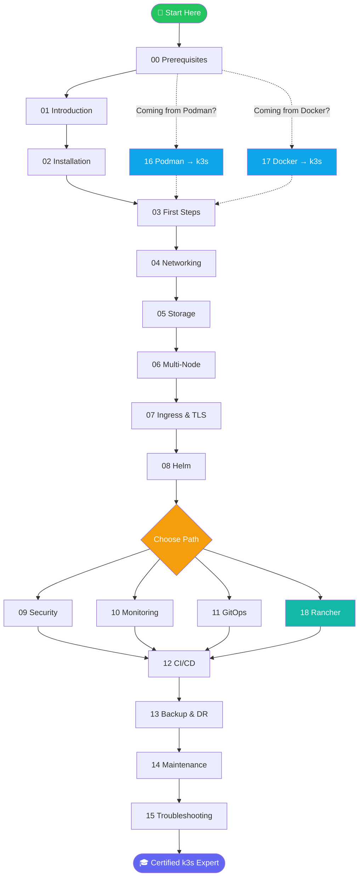

# Mastering k3s — Beginner to Advanced

> A comprehensive, hands-on course covering everything you need to install, operate, secure, monitor, and maintain k3s clusters in production.

---

## Table of Contents

### 📚 Course Modules

| # | Module | Level | Lessons |
|---|--------|-------|---------|
| 00 | [Prerequisites — Linux & Containers Primer](#module-00--prerequisites) | 🟢 Beginner | 1 |
| 01 | [Introduction to k3s](#module-01--introduction-to-k3s) | 🟢 Beginner | 3 |
| 02 | [Installation](#module-02--installation) | 🟢 Beginner | 4 |
| 03 | [First Steps with kubectl](#module-03--first-steps-with-kubectl) | 🟢 Beginner | 3 |
| 04 | [Networking](#module-04--networking) | 🟡 Intermediate | 3 |
| 05 | [Storage](#module-05--storage) | 🟡 Intermediate | 3 |
| 06 | [Multi-Node Clusters](#module-06--multi-node-clusters) | 🟡 Intermediate | 4 |
| 07 | [Ingress & TLS](#module-07--ingress--tls) | 🟡 Intermediate | 3 |
| 08 | [Helm](#module-08--helm) | 🟡 Intermediate | 3 |
| 09 | [Security](#module-09--security) | 🔴 Advanced | 5 |
| 10 | [Monitoring](#module-10--monitoring) | 🔴 Advanced | 3 |
| 11 | [GitOps](#module-11--gitops) | 🔴 Advanced | 4 |
| 12 | [CI/CD Pipelines](#module-12--cicd-pipelines) | 🔴 Advanced | 3 |
| 13 | [Backup & Disaster Recovery](#module-13--backup--disaster-recovery) | 🔴 Advanced | 3 |
| 14 | [Maintenance](#module-14--maintenance) | 🟡 Intermediate | 3 |
| 15 | [Troubleshooting](#module-15--troubleshooting) | 🟡–🔴 All Levels | 5 |
| 16 | [Moving from Podman to k3s](#module-16--moving-from-podman-to-k3s) | 🟢–🟡 Beginner/Intermediate | 4 |
| 17 | [Moving from Docker to k3s](#module-17--moving-from-docker-to-k3s) | 🟢–🟡 Beginner/Intermediate | 5 |
| 18 | [Rancher (Multi-Cluster Management)](#module-18--rancher-multi-cluster-management) | 🔴 Advanced | 4 |

### 📋 Cheatsheets

| Cheatsheet | Description |
|---|---|
| [kubectl](cheatsheets/kubectl-cheatsheet.md) | Essential kubectl commands |
| [k3s server/agent](cheatsheets/k3s-server-cheatsheet.md) | k3s flags, config, service management |
| [Helm](cheatsheets/helm-cheatsheet.md) | Chart install, upgrade, debug |
| [Networking](cheatsheets/networking-cheatsheet.md) | Services, Ingress, NetworkPolicy, DNS |
| [Security](cheatsheets/security-cheatsheet.md) | RBAC, PSS, secrets, auth checks |
| [Storage](cheatsheets/storage-cheatsheet.md) | PV/PVC, StorageClass, Longhorn |
| [Monitoring](cheatsheets/monitoring-cheatsheet.md) | PromQL, kubectl top, Grafana |
| [GitOps](cheatsheets/gitops-cheatsheet.md) | Flux & ArgoCD CLI quick reference |
| [Troubleshooting](cheatsheets/troubleshooting-cheatsheet.md) | Diagnostic sequences, error fixes |
| [Backup & DR](cheatsheets/backup-dr-cheatsheet.md) | etcd snapshots, Velero, restore |

### 📖 Reference

| File | Description |
|---|---|
| [GLOSSARY.md](GLOSSARY.md) | Alphabetical dictionary of 70+ Kubernetes, k3s, and ecosystem terms |

---

## Course Overview

[↑ Back to TOC](#table-of-contents) · [↑ Course Index](README.md)

---

## Module 00 — Prerequisites

> 🟢 Beginner · No prior Kubernetes experience required

| Lesson | File |
|--------|------|
| 01 | [Linux & Containers Primer](00_prerequisites/01_linux_and_containers_primer.md) |

[↑ Back to TOC](#table-of-contents) · [↑ Course Index](README.md)

---

## Module 01 — Introduction to k3s

> 🟢 Beginner · Understand what k3s is and how it works

| Lesson | File |
|--------|------|
| 01 | [What is k3s?](01_introduction/01_what_is_k3s.md) |
| 02 | [k3s vs Kubernetes](01_introduction/02_k3s_vs_k8s.md) |
| 03 | [Architecture Overview](01_introduction/03_architecture_overview.md) |

[↑ Back to TOC](#table-of-contents) · [↑ Course Index](README.md)

---

## Module 02 — Installation

> 🟢 Beginner · Get k3s running on Linux

| Lesson | File |
|--------|------|
| 01 | [Single-Node Quickstart](02_installation/01_single_node_quickstart.md) |
| 02 | [Installation Options & Flags](02_installation/02_installation_options_flags.md) |
| 03 | [Air-Gap Install](02_installation/03_airgap_install.md) |
| 04 | [Uninstall & Cleanup](02_installation/04_uninstall_and_cleanup.md) |
| Labs | [install.sh](02_installation/labs/install.sh) · [verify.sh](02_installation/labs/verify.sh) · [uninstall.sh](02_installation/labs/uninstall.sh) |

[↑ Back to TOC](#table-of-contents) · [↑ Course Index](README.md)

---

## Module 03 — First Steps with kubectl

> 🟢 Beginner · Deploy and manage your first workloads

| Lesson | File |
|--------|------|
| 01 | [kubectl Basics](03_first_steps/01_kubectl_basics.md) |
| 02 | [Namespaces](03_first_steps/02_namespaces.md) |
| 03 | [Pods, Deployments & Services](03_first_steps/03_pods_deployments_services.md) |
| Labs | [first-deployment.yaml](03_first_steps/labs/first-deployment.yaml) · [first-service.yaml](03_first_steps/labs/first-service.yaml) |

[↑ Back to TOC](#table-of-contents) · [↑ Course Index](README.md)

---

## Module 04 — Networking

> 🟡 Intermediate · Understand CNI, service types, and DNS

| Lesson | File |
|--------|------|
| 01 | [Flannel & CNI](04_networking/01_flannel_and_cni.md) |
| 02 | [Service Types](04_networking/02_service_types.md) |
| 03 | [DNS & CoreDNS](04_networking/03_dns_coredns.md) |
| Labs | [clusterip-service.yaml](04_networking/labs/clusterip-service.yaml) · [nodeport-service.yaml](04_networking/labs/nodeport-service.yaml) · [dns-test-pod.yaml](04_networking/labs/dns-test-pod.yaml) |

[↑ Back to TOC](#table-of-contents) · [↑ Course Index](README.md)

---

## Module 05 — Storage

> 🟡 Intermediate · Persistent volumes, local-path, and Longhorn

| Lesson | File |
|--------|------|
| 01 | [Local Path Provisioner](05_storage/01_local_path_provisioner.md) |
| 02 | [Persistent Volumes & PVCs](05_storage/02_persistent_volumes.md) |
| 03 | [Longhorn Setup](05_storage/03_longhorn_setup.md) |
| Labs | [pvc-local-path.yaml](05_storage/labs/pvc-local-path.yaml) · [longhorn-storageclass.yaml](05_storage/labs/longhorn-storageclass.yaml) |

[↑ Back to TOC](#table-of-contents) · [↑ Course Index](README.md)

---

## Module 06 — Multi-Node Clusters

> 🟡 Intermediate · Scale out to agent nodes and HA server clusters

| Lesson | File |
|--------|------|
| 01 | [Adding Agent Nodes](06_multi_node_cluster/01_adding_agent_nodes.md) |
| 02 | [HA with Embedded etcd](06_multi_node_cluster/02_ha_with_embedded_etcd.md) |
| 03 | [External Datastore](06_multi_node_cluster/03_external_datastore.md) |
| 04 | [Node Labels, Taints & Affinity](06_multi_node_cluster/04_node_labels_taints_affinity.md) |
| Labs | [join-agent.sh](06_multi_node_cluster/labs/join-agent.sh) · [affinity-deployment.yaml](06_multi_node_cluster/labs/affinity-deployment.yaml) |

[↑ Back to TOC](#table-of-contents) · [↑ Course Index](README.md)

---

## Module 07 — Ingress & TLS

> 🟡 Intermediate · Expose services with Traefik and secure them with cert-manager

| Lesson | File |
|--------|------|
| 01 | [Traefik Built-in](07_ingress_and_tls/01_traefik_builtin.md) |
| 02 | [Custom Ingress Rules](07_ingress_and_tls/02_custom_ingress_rules.md) |
| 03 | [cert-manager & Let's Encrypt](07_ingress_and_tls/03_cert_manager_lets_encrypt.md) |
| Labs | [ingress-basic.yaml](07_ingress_and_tls/labs/ingress-basic.yaml) · [ingressroute-tls.yaml](07_ingress_and_tls/labs/ingressroute-tls.yaml) · [cert-manager-issuer.yaml](07_ingress_and_tls/labs/cert-manager-issuer.yaml) |

[↑ Back to TOC](#table-of-contents) · [↑ Course Index](README.md)

---

## Module 08 — Helm

> 🟡 Intermediate · Package management for Kubernetes

| Lesson | File |
|--------|------|
| 01 | [Helm Basics](08_helm/01_helm_basics.md) |
| 02 | [Helm with k3s](08_helm/02_helm_with_k3s.md) |
| 03 | [Writing Your Own Charts](08_helm/03_writing_charts.md) |
| Labs | [values-override.yaml](08_helm/labs/values-override.yaml) · [mychart/](08_helm/labs/mychart/) |

[↑ Back to TOC](#table-of-contents) · [↑ Course Index](README.md)

---

## Module 09 — Security

> 🔴 Advanced · Harden your cluster with RBAC, network policies, and secrets management

| Lesson | File |
|--------|------|
| 01 | [RBAC](09_security/01_rbac.md) |
| 02 | [Network Policies](09_security/02_network_policies.md) |
| 03 | [Pod Security Standards](09_security/03_pod_security_standards.md) |
| 04 | [Secrets Management](09_security/04_secrets_management.md) |
| 05 | [Hardening Guide](09_security/05_hardening_guide.md) |
| Labs | [rbac-role.yaml](09_security/labs/rbac-role.yaml) · [network-policy-deny-all.yaml](09_security/labs/network-policy-deny-all.yaml) · [sealed-secret-example.yaml](09_security/labs/sealed-secret-example.yaml) |

[↑ Back to TOC](#table-of-contents) · [↑ Course Index](README.md)

---

## Module 10 — Monitoring

> 🔴 Advanced · Observe your cluster with Prometheus, Grafana, and Alertmanager

| Lesson | File |
|--------|------|
| 01 | [Prometheus Stack](10_monitoring/01_prometheus_stack.md) |
| 02 | [Grafana Dashboards](10_monitoring/02_grafana_dashboards.md) |
| 03 | [Alerting](10_monitoring/03_alerting.md) |
| Labs | [prometheus-values.yaml](10_monitoring/labs/prometheus-values.yaml) · [alertmanager-config.yaml](10_monitoring/labs/alertmanager-config.yaml) |

[↑ Back to TOC](#table-of-contents) · [↑ Course Index](README.md)

---

## Module 11 — GitOps

> 🔴 Advanced · Manage cluster state declaratively with Flux and ArgoCD

| Lesson | File |
|--------|------|
| 01 | [GitOps Concepts](11_gitops/01_gitops_concepts.md) |
| 02 | [Flux Install & Setup](11_gitops/02_flux_install_and_setup.md) |
| 03 | [ArgoCD Install & Setup](11_gitops/03_argocd_install_and_setup.md) |
| 04 | [Managing Apps with GitOps](11_gitops/04_managing_apps_with_gitops.md) |
| Labs | [flux-kustomization.yaml](11_gitops/labs/flux-kustomization.yaml) · [argocd-application.yaml](11_gitops/labs/argocd-application.yaml) |

[↑ Back to TOC](#table-of-contents) · [↑ Course Index](README.md)

---

## Module 12 — CI/CD Pipelines

> 🔴 Advanced · Automate build and deploy pipelines into k3s

| Lesson | File |
|--------|------|
| 01 | [CI/CD Patterns for k3s](12_cicd/01_cicd_patterns_for_k3s.md) |
| 02 | [GitHub Actions Deploy](12_cicd/02_github_actions_deploy.md) |
| 03 | [Gitea + Act Runner (On-Prem)](12_cicd/03_gitea_act_runner_onprem.md) |
| Labs | [github-actions-deploy.yml](12_cicd/labs/github-actions-deploy.yml) · [gitea-workflow.yml](12_cicd/labs/gitea-workflow.yml) |

[↑ Back to TOC](#table-of-contents) · [↑ Course Index](README.md)

---

## Module 13 — Backup & Disaster Recovery

> 🔴 Advanced · Protect your cluster data and recover from failure

| Lesson | File |
|--------|------|
| 01 | [etcd Snapshots](13_backup_and_dr/01_etcd_snapshots.md) |
| 02 | [Velero Backup](13_backup_and_dr/02_velero_backup.md) |
| 03 | [Cluster Restore](13_backup_and_dr/03_cluster_restore.md) |
| Labs | [etcd-snapshot.sh](13_backup_and_dr/labs/etcd-snapshot.sh) · [velero-backup.yaml](13_backup_and_dr/labs/velero-backup.yaml) |

[↑ Back to TOC](#table-of-contents) · [↑ Course Index](README.md)

---

## Module 14 — Maintenance

> 🟡 Intermediate · Keep your cluster healthy, updated, and efficient

| Lesson | File |
|--------|------|
| 01 | [Upgrading k3s](14_maintenance/01_upgrading_k3s.md) |
| 02 | [Node Drain & Cordon](14_maintenance/02_node_drain_cordon.md) |
| 03 | [Resource Management](14_maintenance/03_resource_management.md) |
| Labs | [resource-quota.yaml](14_maintenance/labs/resource-quota.yaml) · [limit-range.yaml](14_maintenance/labs/limit-range.yaml) |

[↑ Back to TOC](#table-of-contents) · [↑ Course Index](README.md)

---

## Module 15 — Troubleshooting

> 🟡–🔴 All Levels · Diagnose and fix common k3s issues

| Lesson | File |
|--------|------|
| 01 | [Logs & Events](15_troubleshooting/01_logs_and_events.md) |
| 02 | [Common Problems](15_troubleshooting/02_common_problems.md) |
| 03 | [Debugging Pods](15_troubleshooting/03_debugging_pods.md) |
| 04 | [Network Debugging](15_troubleshooting/04_network_debugging.md) |
| 05 | [Performance Tuning](15_troubleshooting/05_performance_tuning.md) |
| Labs | [debug-pod.yaml](15_troubleshooting/labs/debug-pod.yaml) · [netshoot-pod.yaml](15_troubleshooting/labs/netshoot-pod.yaml) |

[↑ Back to TOC](#table-of-contents) · [↑ Course Index](README.md)

---

## Module 16 — Moving from Podman to k3s

> 🟢–🟡 Beginner/Intermediate · For developers already using Podman or Podman Compose

| Lesson | File |
|--------|------|
| 01 | [Mental Model Shift: Containers vs Pods](16_podman_to_k3s/01_mental_model_shift.md) |
| 02 | [Translating Podman Compose to Kubernetes Manifests](16_podman_to_k3s/02_compose_to_k3s.md) |
| 03 | [Images and Registries](16_podman_to_k3s/03_images_and_registries.md) |
| 04 | [Full Migration Walkthrough](16_podman_to_k3s/04_migration_walkthrough.md) |
| Labs | [podman-compose-example.yml](16_podman_to_k3s/labs/podman-compose-example.yml) · [compose-to-k3s.yaml](16_podman_to_k3s/labs/compose-to-k3s.yaml) |

[↑ Back to TOC](#table-of-contents) · [↑ Course Index](README.md)

---

## Module 17 — Moving from Docker to k3s

> 🟢–🟡 Beginner/Intermediate · For developers already using Docker or Docker Compose

| Lesson | File |
|--------|------|
| 01 | [Mental Model Shift: Docker Daemon vs Daemonless](17_docker_to_k3s/01_mental_model_shift.md) |
| 02 | [Translating Docker Compose to Kubernetes Manifests](17_docker_to_k3s/02_compose_to_k3s.md) |
| 03 | [Images and Registries](17_docker_to_k3s/03_images_and_registries.md) |
| 04 | [Docker Gotchas When Moving to k3s](17_docker_to_k3s/04_docker_gotchas.md) |
| 05 | [Full Migration Walkthrough](17_docker_to_k3s/05_migration_walkthrough.md) |
| Labs | [docker-compose-example.yml](17_docker_to_k3s/labs/docker-compose-example.yml) · [docker-compose-to-k3s.yaml](17_docker_to_k3s/labs/docker-compose-to-k3s.yaml) |

[↑ Back to TOC](#table-of-contents) · [↑ Course Index](README.md)

---

## Module 18 — Rancher (Multi-Cluster Management)

> 🔴 Advanced · Centralised multi-cluster management and Fleet GitOps

| Lesson | File |
|--------|------|
| 01 | [Rancher Overview](18_rancher/01_rancher_overview.md) |
| 02 | [Install Rancher on k3s (Helm)](18_rancher/02_install_rancher_on_k3s.md) |
| 03 | [Import Existing Clusters](18_rancher/03_import_existing_clusters.md) |
| 04 | [Fleet Basics](18_rancher/04_fleet_basics.md) |
| Labs | [install-rancher.sh](18_rancher/labs/install-rancher.sh) · [uninstall-rancher.sh](18_rancher/labs/uninstall-rancher.sh) · [rancher-values.yaml](18_rancher/labs/rancher-values.yaml) · [fleet-gitrepo.yaml](18_rancher/labs/fleet-gitrepo.yaml) |

[↑ Back to TOC](#table-of-contents) · [↑ Course Index](README.md)

---

## How to Use This Course

1. **Follow the modules in order** if you are new to Kubernetes/k3s
2. **Jump to any module** if you have specific prior knowledge
3. **Run the labs** — every module has a `labs/` folder with working YAML and shell scripts
4. **Use the cheatsheets** as quick reference during and after the course
5. **Consult the [Glossary](GLOSSARY.md)** to look up unfamiliar terms at any point
6. **Re-read the troubleshooting module** whenever you get stuck in production

[↑ Back to TOC](#table-of-contents) · [↑ Course Index](README.md)

## Requirements

| Requirement | Detail |
|---|---|
| OS | Linux (Ubuntu 22.04+ / Debian 12+ / RHEL 9+ / Fedora 38+) |
| RAM | 512 MB minimum, 2 GB recommended for single-node |
| CPU | 1 core minimum, 2+ recommended |
| Disk | 5 GB minimum |
| Network | Internet access for initial install (air-gap install covered in Module 02) |
| Tools | `curl`, `bash`, optional: `git`, `helm`, `flux`, `argocd` CLI |

[↑ Back to TOC](#table-of-contents) · [↑ Course Index](README.md)

---

*Licensed under [CC BY-NC-SA 4.0](LICENSE.md) · © 2026 UncleJS*
